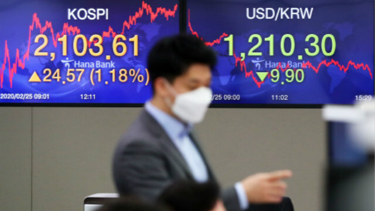

# 韩国GDP跌出全球前十！“金丝雀”为何悲鸣

如果按国内生产总值（GDP）总量来看，素有全球贸易“金丝雀”之称的韩国已不再是全球前十大经济体。

韩国央行（BOK）近日公布的数据显示，2022年韩国的名义GDP约为1.67万亿美元，排在首位的是美国，名义GDP规模约为25.46万亿美元；中国排名第二，为17.88万亿美元；第三位则是日本，约4.23万亿美元。

根据该数据，韩国去年名义GDP跌出了全球前十，排在第十三位，不及意大利（2.01万亿美元），巴西（1.87万亿美元）和澳大利亚（1.70万亿美元）。

对此，韩媒惊呼：韩国已不再是全球前十的经济大国。

“（韩国）排名的下降是由于韩元疲软，且出口表现不佳造成的。这正在抑制经济发展。”延世大学经济学教授Sung Tae-
Yoon说，“现在必须关注半导体以外的行业，以及能够寻找到重振经济长期增长动力的行业。”

**全怪美元走强？**

名义GDP是在特定时期内生产的所有商品和服务的总价值，可以用来衡量一个国家的经济规模。按这一统计口径，韩国曾在2005年首次跻身全球前十，但后续在2019年前曾多次跌出“前十俱乐部”，2020年和2021年回到第十位。

如果以韩元来计算，2022年韩国的名义GDP为2161万亿韩元，同比增长3.9%。然而，由于韩元贬值，以美元计算同比下降了7.9%。韩国央行的一位官员表示：“由于去年美元走强，大多数汇率转换指标（在韩国）都显示出糟糕的表现。”

强美元下，韩国央行在3月发布的初步统计显示，韩元对美元汇率去年年均大跌12.9%。因此，除了名义GDP外，按美元计算，韩国去年人均国民总收入（GNI）降至3.26万美元，同比减少7.7%。

其实，出口导向型经济体韩国也在去年遭遇史无前例的贸易逆差。韩国产业通商资源部今年年初发布的《2022年12月及全年进出口动向》报告显示，2022年韩国贸易逆差为472亿美元，创历史新高。具体统计数据显示，2022年韩国出口额为6839亿美元，同比增长6.1%；进口额为7312亿美元，同比增长18.9%。472亿美元的贸易逆差，是自2008年全球金融危机以来，韩国时隔14年首次出现贸易逆差，且规模为金融危机前1996年（206.2亿美元）的两倍，刷新历史最高纪录。

去年以来，全球需求收缩，再加上存储半导体行业低迷，都严重了拖累韩国出口的表现。自2022年10月起，韩国对外出口已连续9个月同比负增长，7月前10天出口同比继续下滑（-14.8%）。细分韩国的贸易出口结构来看，半导体占比约达两成，自2022年8月起，韩国半导体产业的出口额连续11个月同比下滑，跌幅多次超过40%。

作为韩国最大的出口市场，中韩贸易结构也发生了巨大变化。据韩媒报道，韩国与中国长期以来保持的贸易顺差已经转向。2022年，韩国对华出口额1558.1亿美元，比前一年的1629.1亿美元减少了4.4%。自2022年10月起，韩国对华贸易出现罕见的连续逆差，且规模持续扩大。

首尔科学综合研究生院大学主任教授黄菲告诉第一财经记者：“中韩间交易的商品从钢板、纤维等单纯的轻工业及重化学商品为主，转变为以半导体为首的高附加值中间材料为中心。这意味着，中国制造业的尖端化使两国在中高级技术产业领域的出口竞争加剧。”

在黄菲看来，在韩国昔日具有相对竞争优势的液晶面板、智能手机、电动汽车和新能源电池领域，如今都能找到中国企业。

**贸易结构新变化**

今年以来全球各地走出疫情，韩国经济能否走出阴影？韩国央行给出了并不太乐观的预期，韩国央行表示，预计韩国今年实际经济增速可能徘徊在1.5%左右，“后续经济规模总量重回前十的可能性不大”。

韩国央行5月25日发布的《经济展望更新报告》认为，韩国国内经济增长持续乏力，将2023年韩国经济增长预期从原先的1.6%下调至1.4%，已低于近期国际货币基金组织（IMF）、亚洲开发银行（ADB）及韩国开发研究院（KDI）等机构普遍提出的增速预测值1.5%。

就韩国最倚重的半导体出口而言，今年上半年的情况并未好转。韩国海关最新数据显示，2023年7月前10天，韩国半导体出口额同比下滑36.8%。但值得注意的是，在韩国半导体出口下滑的同时，韩国的汽车出口正迎头赶上。韩方统计数据显示，韩国汽车整车贸易收支从去年四季度开始，以月度和季度为准已经跃居首位，大幅领先于半导体。7月前10天，韩国乘用车出口增速已达25%。

在韩国学者金允林（音译）看来，汽车出口取代半导体成为重回韩国出口首位，仅是时间为题。韩国贸易协会相关人士预测，考虑到半导体出口急剧减少、汽车出口持续坚挺的走势，两个出口品种的位置即将发生变化：汽车有望时隔12年重新回到出口额榜首的位置，取代半导体成为韩国出口的最强支柱。

与此同时，韩国对华贸易“顺转逆”的现象在今年上半年仍在继续。其中，对中国进口依赖度较高的产品如电池、蓄电池的工业原材料和计算机、电器等进口增加，是逆差的主要来源。7月前10天，韩国对华出口依旧呈同比减少态势，减少幅度达20.6%，已连续13个月减少。同时，韩国对美国（-9%）、越南（-32.5%）、日本（-20.8%）等地出口也均减少，对欧盟（22.4%）和印度（11.1%）等地出口有所增加。

不过，金允林告诉第一财经记者，韩国贸易逆差今年以来有逐渐缩小的趋势，后续韩国经济是V型复苏还是L型复苏，有待观望。韩国产业通商资源部相关人士则更为乐观，预计韩国的半导体出口将从下半年开始部分恢复。但金允林认为，随着半导体产业为各种外部因素拖累，尚难预测行业恢复的时间以及对韩国出口的拉动效应。

