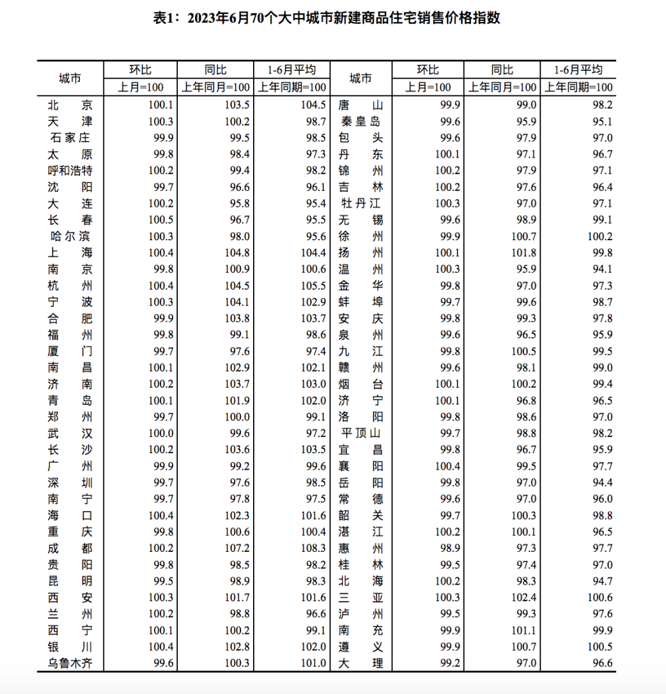
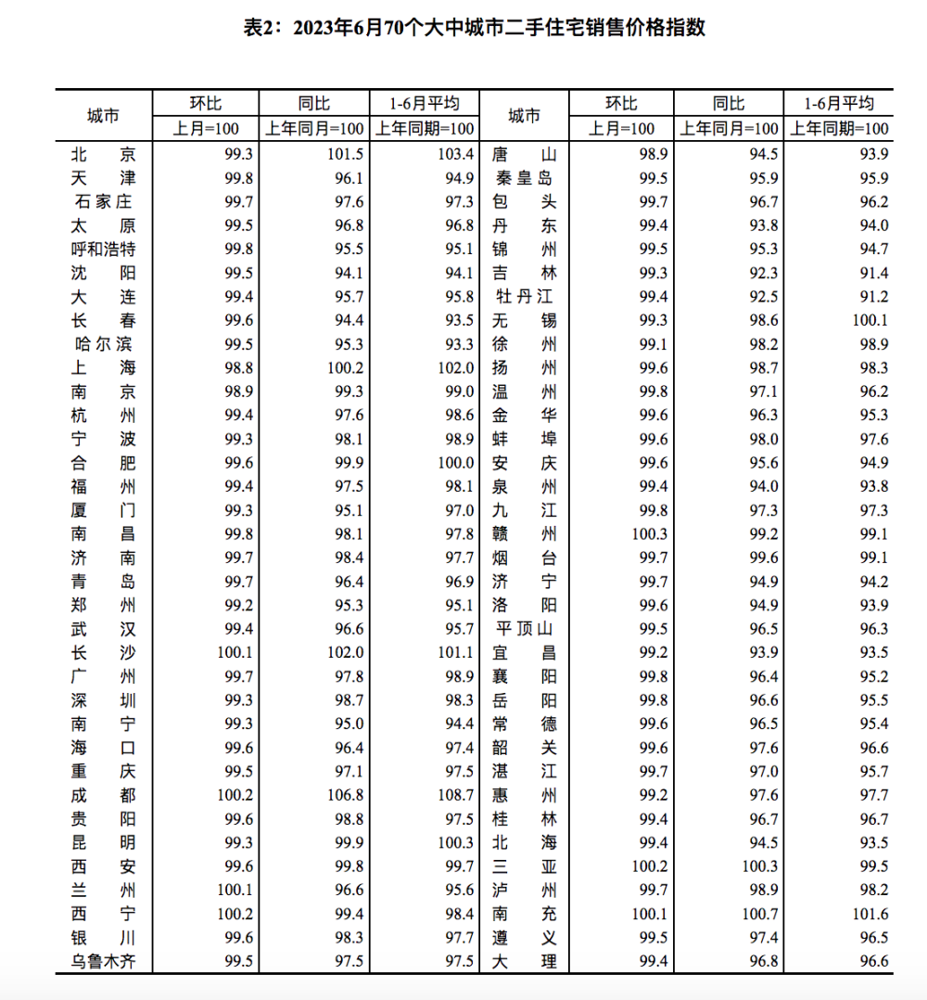

# 6月70大中城市63城二手房价格下跌，一线城市环比降幅最大

7月15日，国家统计局发布2023年6月份70个大中城市商品住宅销售价格变动情况。6月，市场并未迎来回升态势，新房、二手房价格环比上涨城市数量较5月继续减少。

国家统计局城市司首席统计师绳国庆解读指出，2023年6月份，70个大中城市商品住宅销售价格环比上涨城市个数减少，各线城市新建商品住宅销售价格环比持平或略降、二手住宅环比下降；各线城市新建商品住宅销售价格同比有涨有降、二手住宅同比下降。

**各等级城市新房价格止升转降**

国家统计局数据显示，今年6月份，新建商品住宅价格上涨城市数量为31个，较5月减少15城；持平城市1个，较5月增加1个；下跌城市38个，较5月增加14城。

易居研究院根据国家统计局数据简单算术平均计算，6月份全国70个城市新建商品住宅价格指数环比涨幅为-0.1%，同比涨幅为-0.4%。最大的特征在于，房价指数环比涨幅指标在连续4个月上涨的基础上，当前出现了下跌。

从新建商品住宅看，各等级城市新房价格全部止升。国家统计局数据显示，6月份，一线城市新建商品住宅销售价格环比由上月上涨0.1%转为持平，其中北京、上海环比分别上涨0.1%和0.4%，广州、深圳环比分别下降0.1%和0.3%；二线城市新建商品住宅销售价格环比由上月上涨0.2%转为持平；三线城市新建商品住宅销售价格环比由上月持平转为下降0.1%。

具体到各个城市，根据国家统计局数据，2023年6月份新建商品住宅价格环比涨幅前十的城市分别为：长春、上海、杭州、海口、银川、襄阳、天津、哈尔滨、宁波、西安（牡丹江、温州、三亚，新建商品住宅价格环比涨幅与西安相同）。

其中，长春新建商品住宅价格环比上涨0.5％，涨幅居70城之首；上海、杭州、海口、银川、襄阳新建商品住宅环比均上涨0.4%；天津、哈尔滨、宁波、西安、牡丹江、温州、三亚新建商品住宅0.3%。

诸葛数据研究中心高级分析师陈霄指出，长春以0.5%的涨幅领跑70城，上海、杭州、海口、银川、襄阳等紧随其后，环比涨幅为0.4%，可以看出，上榜城市涨幅均较平缓，同时，长三角核心城市上海、杭州仍然韧性较强。

从新房价格环比下跌的城市来看，6月份，有38个城市新建商品住宅销售价格下降，较5月份增加14城。其中，降幅最大的10个城市分别为：惠州、大理、泸州、桂林、昆明、常德、赣州、泉州、无锡、包头（秦皇岛、乌鲁木齐，新建商品住宅价格环比降幅与包头相同）。

**二手房价格上涨城市数量降至7个，一线城市环比跌幅最大**

根据国家统计局披露的数据，6月份，二手住宅销售价格环比上涨的城市为7个，较5月份减少8城。6月份房价上涨的城市分别是：赣州、成都、西宁、三亚、长沙、兰州、南充。

其中，赣州二手住宅价格环比上涨0.3%，居70城之首；成都、西宁、三亚二手住宅价格环比均上涨0.2%；长沙、兰州、南充房价环比上涨0.1%。

综合70城房价数据看，6月份，九成城市二手房价格环比下降。根据国家统计局数据，70个大中城市中，二手房价格下跌的城市有63个，较5月增加8个。

从各线城市表现来看，6月份，各等级城市二手房价格全线下滑，其中，一线城市二手住宅销售价格环比下降0.7%，降幅比上月扩大0.3个百分点；二、三线城市二手住宅销售价格环比均下降0.4%，降幅比上月分别扩大0.1和0.2个百分点。

各线城市中，一线城市二手房价格跌幅最大，北上广深全部下降。根据国家统计局数据，6月份，上海二手房价格环比下降1.2%，跌幅居70城之首；北京和深圳的二手房价格环比均下跌0.7%；广州二手房价格环比下跌0.3%。

综合70城数据来看，70个大中城市中，二手房价格降幅最大的10个城市分别为：上海、唐山、南京、徐州、惠州、宜昌、郑州、无锡、吉林、昆明（北京、宁波、厦门、深圳、南宁，二手住宅价格环比降幅与昆明相同）。

诸葛数据研究中心高级分析师陈霄指出，从涨跌幅情况来看，70城二手住宅价格环比下降0.44%，跌幅扩大0.21个百分点，至此，自5月以来二手房价格连续两月下滑，上涨城市平均涨幅为0.17%，涨幅收窄0.12个百分点。

陈霄认为，二手房市场下行压力加大，一方面业主对后市信心不足，挂牌量大增，供需之间的不平衡加剧，房价上涨动力削弱，另一方面，新房市场分流作用下，二手房低价出售情绪增长。当前来看，二手房下行的压力要大于新房。

贝壳研究院市场分析师刘丽杰指出，当前房地产市场的节奏从一季度的恢复性反弹回到常态，同时买方市场的特征越来越强，房源供应充足，房源去化周期拉长，业主售价预期下调，因此房价短期处于回落阶段。从城市看，经济、人口等基本面较好的城市，市场需求充足，这类城市房价调整幅度会较小。从产品看，一些老房子、小房子，因为不能很好满足居民改善居住条件的需求，去化困难，价格下调幅度较为明显。

刘丽杰认为，目前房地产还面临一些困难和挑战，主要是消费者预期不足陷入观望，经过一段时间的常态化运行之后，市场预期将逐步趋于平稳。其认为，我国住房金融“安全垫”较高，居民房贷债务压力总体稳定，房价不具备大幅下跌的基础。同时，我国仍处于新型城镇化较快的发展阶段，居民改善住房的需求强烈，这类住房需求是市场恢复平稳健康的坚实基础。

58安居客研究院院长张波则提到，二季度整体市场的降温已经确立，弱二线、以及三四线城市，市场供大于求的特点明显，房价下行的压力增强，目前政策层面主要通过大力放松公积金贷款、强化购房补贴、以及降低首付比拉动需求侧的操作为主，但政策在市场上的效应释放并不明显，或并不持续。核心一二线城市依然存在着诸多限制性楼市政策，包括限购和限价，政策工具箱中依然有着诸多可操作品种，但目前放松得偏于谨慎，从而导致市场降温趋势有所扩大，预计未来高能级城市的支持将进一步扩大，如支持置换改善需求、优化远郊限购等。

