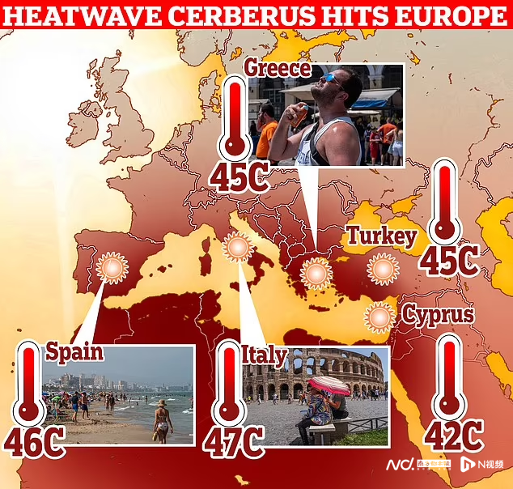
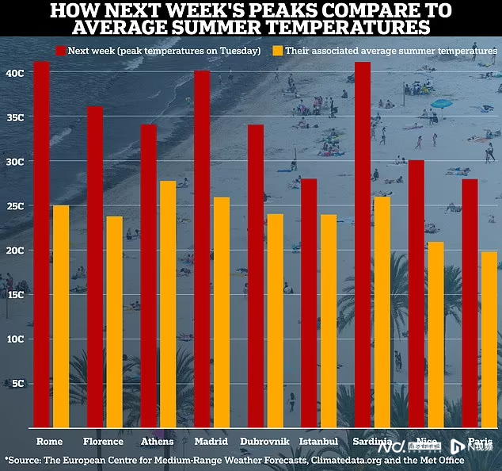
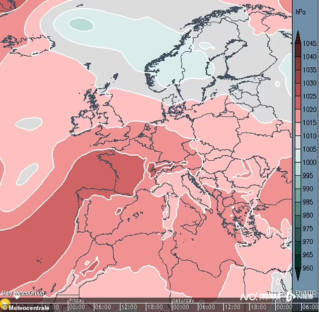
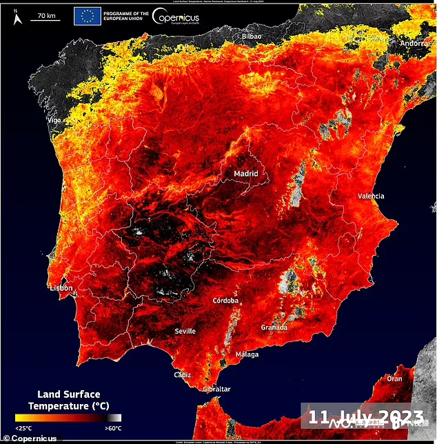
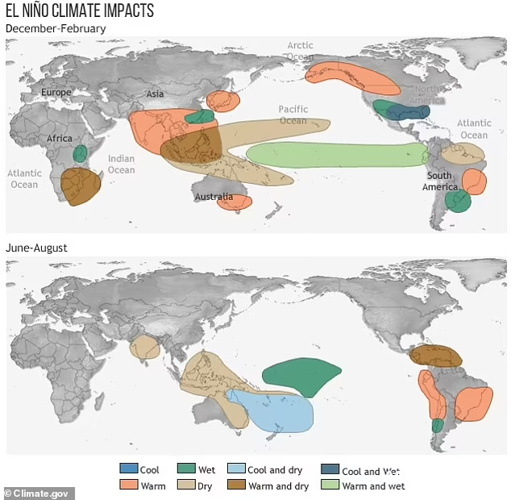

# “地狱犬”致命热浪席卷欧洲，下周将更热

一场被称为“地狱犬”（Cerberus）的致命热浪正在席卷欧洲。专家表示，高温由三大关键因素驱动——厄尔尼诺现象、静止高压系统（也称为“反气旋”）和气候变化。

_热浪目前正席卷欧洲南部和非洲西北部的部分地区。_

据报道，一场被称为“地狱犬”（Cerberus）的致命热浪正在席卷欧洲，热浪目前正席卷欧洲南部和非洲西北部的部分地区。

西班牙、法国、希腊、克罗地亚和土耳其部分地区的气温预计将超过40摄氏度，而意大利的气温可能达到惊人的48.8摄氏度。

_下周气温将高于往年同期平均气温。_

罗马、博洛尼亚和佛罗伦萨等城市因难以忍受的气温而被迫发布红色预警，气温还将进一步升高。

专家表示，高温由三大关键因素驱动——厄尔尼诺现象、静止高压系统（也称为“反气旋”）和气候变化。

_反气旋的高压系统和气候变化很可能是造成此次热浪的主要因素。_

英国苏塞克斯大学气候变化讲师Melissa
Lazenby博士表示，欧洲并不特别直接受到厄尔尼诺现象的影响，因此反气旋的高压系统和气候变化很可能是造成此次热浪的主要因素。

开放大学环境系统讲师Leslie Mabon博士表示，气候变暖趋势背后的关键驱动因素是化石燃料燃烧产生的二氧化碳排放。

欧洲的气候监测服务机构哥白尼（Copernicus）也指出，大量撒哈拉沙尘云正在向欧洲南部移动。

_7月11日，西班牙埃斯特雷马杜拉部分地区的地表温度超过60°C。_

据悉，欧洲去年遭遇了有记录以来最热的夏季，整个欧洲大陆有61000多人死亡，英国有近3500人死亡。

酷热的气温在7月18日至24日之间达到顶峰，但炎热的天气持续了整个8月。

哥白尼表示，上个月是全球有记录以来最热的6月。预计今年的夏季高温将持续两周左右，但这可能并不意味着欧洲天气问题的结束。

厄尔尼诺现象是指热带太平洋中部和东部的海洋表面升温，或海洋表面温度（SST）高于平均水平。

世界气象组织警告说，厄尔尼诺现象有90%的可能性将持续到今年年底。

文/南都记者 陈林

