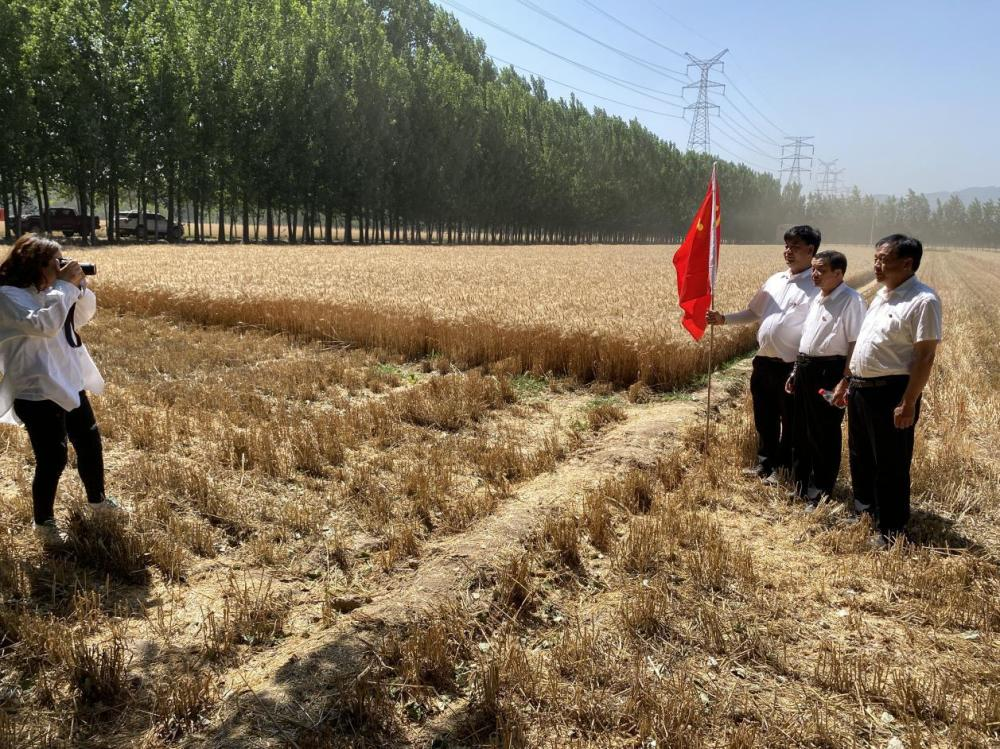
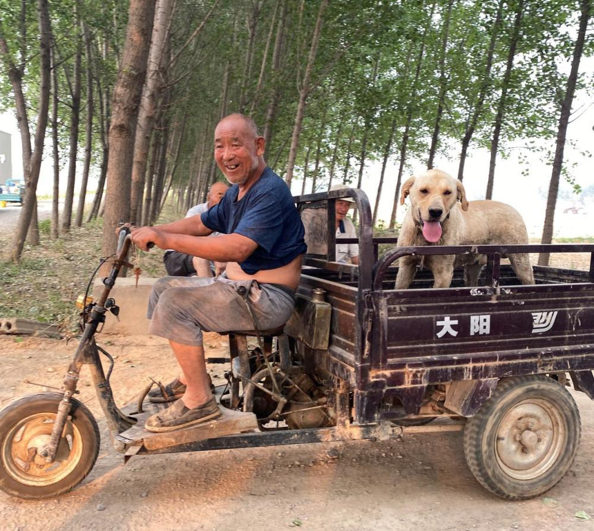
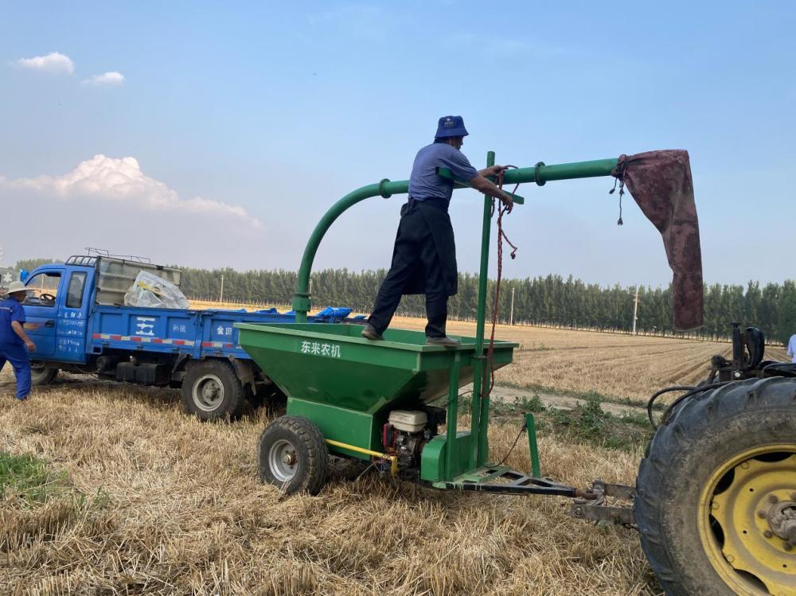

# 一个“地主”承包土地十年：“挣的钱全投进去了”

_2023年6月9日是小麦“开镰”第一天。作为当地有名的农场主，除了媒体记者采访，刘水波（持旗者）还迎来一批参观者，他这天特意换上黑西裤和白衬衣。（南方周末记者
柴会群/图）_

2023年6月10日下午，刘水波看完天气预报，决定连夜抢收小麦。“晚上下雨，下了雨（小麦每斤要）少卖一毛钱。”他对儿子刘紫阳说。

这是刘水波本季割麦子的第二天。对这个承包1400余亩地的“地主”而言，麦收季如同打仗，在这短短十几天里，他既要迅速收完小麦，又得及时种上玉米，并尽快进行灌溉。一招不慎，就可能全盘皆输。

今年还算幸运，除了灌溉迟了几天，其他环节均正常完成。不过，收完小麦后刘水波一算，发现平均亩产只有1070斤，比2022年整整少了一百斤。

这远低于他的预期。实际上，就在收割第一天接受当地媒体采访时，刘水波还说一亩地能收1200斤。

除了产量下降，小麦价格也被“打回原形”。2022年，一向较为稳定的小麦价格飙升，由往年的每斤一块二三涨到一块五六，创下历史新高。然而好景不长，春节过后，小麦价格一路下跌，恢复到原来水平。价格和产量均下降，小麦收入要比上年少50万元。

上世纪五十年代完成土地改革后，作为阶级的“地主”已不复存在。不过，近十年来，随着土地流转的推进，褪去阶级色彩的“地主”，成了村民调侃种粮大户的新称谓。但在连续三年的好光景之后，随着种地成本上升，收入下降，刘水波2023年开始面临其成为“地主”以来的严峻考验。

交地租的“地主”

刘水波事后总结，认为造成小麦减产的主因，是5月份灌浆期的那场雨，由于雨水时间较长，影响了小麦授粉，导致看着长势很好，但打不出产量。

事实上，在全镇298个种粮大户中，亩产过千已经是很不错的收成。刘水波家三公里外的一位初中同学，种的是一款“优质麦”，往年亩产均能过千，2023年受了冻害，平均亩产只有400斤。

刘水波算过，就他的投入情况而言，按当季小麦的地租（按500斤小麦、每斤1.45元计算），亩产1000斤以上才能保本。

48岁的刘水波是山东省邹平市明集镇解家村人，明集镇地处华北平原南部，辖区内土地由黄河下游泥沙冲积而成，大都成方成块，适合机械化种植。

从2014年开始，刘水波以每亩地700元/年的租金，从别人手里转包了本村470亩地，2023年刚好是他包地的第10年。

包地是父亲刘芬方的主意。当年他从广播里听到消息：中央要搞“土地流转”，便认定包地是一条正路。此前，刘水波先后做过小麦秸秆和棉花种子生意，由于收购厂家先后倒闭，正面临新的职业选择。

_刘芬方用三轮车将玩累了的拉布拉多犬“欢欢”拉回家。（南方周末记者
柴会群/图）_

如今，刘水波已经认同父亲当年的理念：“农业这一块还行。这个行业绝对不会淘汰，关键是自己得操作好了，管理很关键。得出产量，没产量门也没有。”

700元一亩的地租，在当时算是比较高的。刘水波那时包的470亩地，最多时分属32户人家，穿插在村里各个地块中，种起来十分麻烦。10年来，刘水波一直坚持轮作小麦和玉米，在包地之初，已基本实现机械化。

2017年秋，在刘水波自行包地3年后，明集镇全面推行土地流转改革：以村民自愿为前提，将全村土地“整建制”流转给少数种粮大户，这些种粮大户后来逐渐发展为中国北方地区第一批农场主。

据时任解家村党支部书记崔丙江介绍，当年推行土地流转时未遇到太多阻力，“开了个村民大会，（我在会上说，）你出去打工一天（挣）一百多，地里才弄多少钱？”

开完会，全村只剩下十来户不同意。“我骑自行车转了一圈，都行了。”崔丙江说。在他看来，反对者并非真想种地，而是想多争取一点地租。

邹平当年推行土地流转的背景是，受益于当地数家大型民营企业，年轻人大都去厂里上班，即便在家的也是做各种生意，愿意种地的越来越少。

全村有五六户村民和一个混凝土厂参与土地竞标，具体做法是：以每亩500斤小麦为底价，参与者以玉米斤数为单位竞拍，出价最高者获得相应地块的耕种权。

第一块地就被混凝土厂出价出到799斤玉米。以当年的粮食价格计算，这意味着每亩地的地租将近1300元。刘水波曾参与了这块地的竞标，他出价到720斤玉米，在他看来这个价格已是极限，再高就亏本。

这次土地流转之后，刘水波在原来470亩地之外，又包下了村里五百多亩地，平均价格在“500斤小麦+700斤玉米”左右，以当时的粮食价格算，合每亩不到1200元，而以现在的算，则每亩超过了1500元。

刘水波妻子赵文春说，当时听到有个政策：政府鼓励“大户”，包地1000亩以上，会有一项额外补贴，但包下来之后，才发现没有这回事。

据参与此次土地流转的明集镇农业办主任牛方鹏介绍，事实上，根据中央对于土地流转“适度规模经营”的要求，当年山东省出台的指导意见中，是以200亩地为上限进行补贴的。“那个阶段，种200亩就不少了。”牛方鹏说。

值得一提的是，在完成土地流转之后，解家村有两个承包户觉得地租太高，反悔了，于是找到村委会提出退地。“当时好麻烦。”崔丙江说，他不得不为这几块地重新找下家，其中刘水波接下了三块，合计400来亩。这样，刘水波包地规模达到1400亩以上，成为当地有名的“地主”。

“长工”与“短工”

成为“地主”后，刘水波建起了农场，用于存放粮食和农用机械。据崔丙江介绍，村里有三个种粮大户被批准建农场，但只有刘水波建了。

刘水波的农场占地7亩多。位于解家村村东，而刘家在村西。每到收割季节时，刘水波夫妇奔波于农场、田地和公路之间，很少时间在家。公路是刘水波的固定晒粮场所。

刘水波有两辆小车，一辆是奥迪，农忙时节，电动三轮车才是他的主要交通工具。农场共有三辆电动三轮车，他与妻子、父亲各骑一辆。农场通往公路和庄稼的路上，随时可以看到这家人骑电动车奔驰的身影。

农场建成后，75岁的父亲刘芬方就常年住在这里照看。这位操劳大半生的老人闲不住，他养了6条狗、5只羊和6只鹅。在农场干完活，就骑电动三轮车往地里转。毕竟年纪大了，在南方周末记者采访期间，他的三轮车两次出现状况，一次因电瓶故障在路上抛锚，一次掉进了沟里。

为避免伤人，狗大都被关在笼子里。事实上，每当收割季节，农场来往人员太多，即使面对生人，它们也都懒得叫。只有那条白色的拉布拉多犬“欢欢”相对自由，刘水波23岁的儿子刘紫阳经常带它下地干活。

由于地太多，每逢小麦或玉米收获季，刘水波需要雇佣约20个左右的“短工”，“短工”多是本村老年人。68岁的芦怀玉是刘水波最早的“短工”之一。他的工资按天算，比如浇地，最初是一天80元，如今涨到130元。2023年麦收，芦怀玉主要负责架肥，每天工资是150元。刘水波负责管饭，晚饭都去饭店，“酒是好酒，任你喝。菜最低一桌三百多。”芦怀玉说。赵文春说，2022年秋收时，光饭钱就花了上万元。

_“地主婆”赵文春（站立者）在给“扫麦工”发日结工资。（南方周末记者
柴会群/图）_

作为当地政府力推的种粮大户典型，刘水波还担任镇新型职业农民协会党支部书记，为此经常外出开会。由于分身乏术，从2022年开始，他以每年6万元的工资，雇自己本家一个侄子在农场全职工作。村里有人称他是刘水波的“管家”，但更多人认为他是刘水波雇的“长工”。

除了工资和管饭，刘水波还要负责安全。2023年麦收期间，一个架肥工从车上掉下来，摔断了胸骨。刘水波负担了全部医药费。类似事情几年前也曾发生一次：一个负责拾玉米的工人被拉玉米的车辆撞了，尽管主要责任在司机，但刘水波还是全部负担了医药费和营养费。2022年，在一个保险公司业务员动员下，刘水波刚给所有工人都上了意外伤害保险，结果2023年就出事了。

尽管被人戏称为“地主”和“地主婆”，但在农忙时，刘水波夫妇干的活一点不比工人少。2023年麦收那几天，刘水波平均每天睡眠不足3小时，喉咙也哑了，吃了好几天药。而赵文春每天4、5点钟就要起床，给工人们安排好当天的活，并负责送早饭和中饭。这些日子，她每天步行超过三万步，在朋友圈一直位居榜首。两人白天干活，晚上则去公路“看场”，以防堆在公路上的小麦被人偷走。小麦堆在公路上有几里地长，夫妇俩一头一尾，各自在车上睡。

“贵人”相助

2014年包地之初，刘水波多年做棉花生意攒下的钱，仅勉强够交地租，购买联合收割机等农用机械的钱则是借来的。

做农药、化肥生意的诚丰农化公司老板韩学俭，被认为是刘水波的“贵人”。按他对南方周末记者的说法，刘水波从一开始包地就向他借钱，最多时曾欠他一百多万元，“当时我这没有钱，我给他问朋友借，我也得给他拿。”韩学俭说。

按韩学俭的说法，他看中的是刘水波两口子的为人：“药、肥料，从来不讨价还价，咱说用啥就用啥，咱说啥价格就啥价格。”

如今，刘水波的农场既是韩学俭的“上游”，也是“下游”——农场使用的全部化肥、农药、种子大都由诚丰公司供货，其中仅一季化肥就近30万元，而刘水波的麦子也被诚丰公司全部回购，用来培育麦种。卖麦种的价格要比卖普通小麦每斤要高一毛钱。

刘水波还为几家种子公司种了上百亩试验田，除了收成归自己，每季每亩还能得到700元报酬。不过，为韩学俭种的几十亩试验田却是免费，“都是铁关系，我说（他）光借我钱，（免费用这块地）算给我利息吧。”韩学俭说。

诚丰公司的总部于2014年迁至明集镇，也恰恰是这一年，明集镇在全市率先“整建制”完成土地流转，倚仗各个种粮大户，诚丰公司迅速发展，如今已经成为邹平最大的化肥和种子供应商之一。每年，该公司都要组织种粮大户去外地开“订货会”，一次就要花十多万元。而作为全市种粮大户典型，刘水波每次都不能缺席。如今，他成了诚丰公司的最大招牌，“都说我这肥料贵，刘水波全部用我的肥。”一见面，韩学俭就对南方周末记者这样说。

“刘水波好（喜欢）投资，用肥料、用（农）药都是用最好的。去年刚买了个了玉米播种机，今年又换了最新式的。”韩学俭的弟弟、诚丰公司二老板韩东生说。

按刘芬方的说法，在包地的头三年，刚好把购买农机的投资挣回来，勉强还完了债。

但新的债务随后又欠下。2017年包地规模扩大之后，刘水波上了烘干机，仅这一项就投资30万元。烘干机主要用于玉米，玉米秋天收获时最怕下雨，一天就可能霉变。刘水波1400余亩地的玉米，一旦发生这种情况，后果不堪设想。

在刘水波看来，烘干机就像个灭火器，“可以不用，但没有不行”。

不过，有些自然灾害防不胜防。包地以来，刘水波出于谨慎，一直不敢种优质麦，尽管后者的产量和价格通常更高。他认为，假如2022年种了优质麦，亩产也像同学那样仅400斤的话，自己这一下就完了。

和当地其他种粮大户一样，刘水波的那位同学购买了保险，用于预防自然灾害等重大风险，然而，损失认定远比合同签署来得困难。保险公司最后只认定50亩地“苗期绝产”，总共赔了两万元。而相较于正常年份，同学2023年的损失超过了12万元。

_刘水波在麦收期间所雇的一个“短工”，就在南方周末记者拍下这张照片两天后，他从拉化肥的车上掉下来摔伤。
（南方周末记者 柴会群/图）_

最挣钱的三年

“刘水波包地发了，一年能挣上百万。”在解家村村民和消息灵通的粮贩子口中，流传着这样的话。

但刘水波本人清楚，包地10年，他手里仍然没钱。

据刘水波介绍，自包地以来，真正能挣钱的年份是2020年、2021年和2022年这三年。

这三年主要得益于粮食价格的上涨。2019年时，玉米价格尚不到1元/斤，结果2020年下半年涨到1.2元，后来又涨到1.4元。到了2021年下半年，一向比较平稳的小麦价格也涨起来，2022年最高时涨到1.6元/斤，创下历史新高。

去年，最离谱的是糯玉米价格。往年价格比普通玉米不过高5分钱，结果2022年一路疯涨，最高时卖到每斤四五元，让种粮大户们惊掉了下巴。

不过，刘水波虽然种了500亩糯玉米，但由于卖得较早，并没有赶上最好的行情，价格仅比普通小麦略高，与此同时，普通玉米因水灾减产，两相抵销，2022年的玉米其实并没有赚钱。今年，刘水波又种了600余亩糯玉米，仅种子钱就花了十几万。是去年价格的3倍。但是，谁也说不好今年的糯玉米会是什么行情。去年，有粮贩子认定小麦价格还会继续，为此大量囤积，结果随着小麦价格急转直下，一个个都傻了眼。明集镇有个粮贩子，去年囤积了上千吨小麦，按小麦当下的价格，赔的钱可以在当地买一套房。

为了降低风险，明集镇的土地流转实行的是“实物计价、货币结算”模式。也就是说，种粮大户根据转包合同里写的小麦或玉米斤数，按价格折算成钱，向村委会交地租，再由村委会分给原承包户。但是，转包合同中并没有写清楚以何时的粮食价格计价。而当粮食价格出现波动时，矛盾就出现了。“大户嫌高，老百姓嫌低。”牛方鹏说。

刘水波算过，在最近这三年，一亩地平均能有六七百元的利润，他1400多亩地，一年能赚个七八十万元。

然而这三年也是刘水波投入最大的三年。其中，2021年建仓库花了60万元，2022年购买新烘干机、播种机和拖拉机，又投入80万元。按刘水波的说法，购买新烘干机，是想在种地之外收点玉米，烘干后卖掉，从中赚点差价。今年，明集镇另一位种粮大户曾联系刘水波试图到外市包地种，但因资金不足放弃。

由于投资太大，作为众人口中的“地主”， 刘水波更像一位“佃农”，除了支付地租，还得偿还累积多年的债务。

_使用大型喷灌时，刘水波发现有的喷头会掉下来，便用老虎钳和铁丝将其固定住。（南方周末记者
柴会群/图）_

迄今为止，刘水波在农场上的固定投资已有三百多万元，这基本上也是他包地十来年的所有利润。

作为1400亩的“大户”，刘水波一季粮食的地租就得上百万元。根据承包合同，刘水波得“先交钱，后种地”——需要在5月1日之前交上本年度种玉米的地租，9月1日之前交上种小麦的地租。最初确实如此，但最近几年刘水波也是和其他种粮大户一样，拖到收完麦子、种上玉米之后再交地租。

麦收之前，刘水波本已准备好本季玉米的地租，然而麦收之后，他发现这笔资金出现缺口——麦收期间的各项开支竟有约十七万之多，且还不包括大部分人工费。为此，刘水波不得不从老韩处临时借了20万元。

在明集镇，种粮大户欠债现象并非孤例。解家村的另一个种粮大户，由于欠别人钱还不上，今年麦收时，债主直接将他的麦子从地里拉走了几车。

面对部分种粮大户出现的“手头紧”问题，明集镇农业办主任牛方鹏说，有几家银行推出了各种形式贷款，比如“农担贷”，种粮大户只要有地有合同就可以贷款，一亩地授信1000元，因为政府有补贴，利息比较低。

“无底洞”

随着粮价上涨，地价也开始窜升。2022年，明集镇有几个村因首轮土地流转到期，土地重新拍卖，结果地租最高达“500斤小麦+1000斤玉米”，折合1900元。这被种粮大户认为是一个远超合理水平的价格。

“挣了两年钱都胀饱（当地方言，意为‘膨胀’）开了。”一位种粮大户这样说。

牛关村的种粮大户孙广飞，在这一年包了本村267亩地，价格是“500斤小麦+888斤玉米”，合1790元。按他的说法，这块地是全村最便宜的。孙广飞本季的小麦亩产只有930斤，他把小麦存起来，想等到价格合适时卖出。他算过，麦子只有卖1.4元/斤，他才能不亏本。为了支付下季玉米的地租，他曾考虑向银行申请贷款。

据孙广飞介绍，由于地租太高，2022年他们村但凡不种糯玉米的种粮大户都亏本。为此，村里将本季小麦的地租每斤降了5分钱。

牛方鹏也认为，由于参与竞标的村民不够理性，导致有的村地价“偏高”，“今年有些（种粮大户）绝对赔。”他说。牛方鹏担心一些种粮大户因此弃种，那样将导致新的矛盾，“他不包了，你能（把土地）收回去吗？”

与此同时，近年来，随着当地几个大企业变得不景气，一些农民失去了工作，有人看到种地有利，想重新种地，但地却收不回来了。

明集镇邢家村的郭念通是比刘水波更早的一个“地主”：2010年，他从一个公司转包了一片700余亩的国有农场，每亩租金500元，为期13年。他手头的钱也不够，靠借钱才启动，一直到了2021年才勉强还完。在郭念通看来，农业投资是个“无底洞”，“（农用机械的）更新换代太快。”他对南方周末记者说，“头几年我也是拼了命地往里投。投来投去，看了看不行。一个是利用率低，再一个是你自己弄不了，得雇人，人家能用心使吗？就容易损坏。”

在郭念通看来，以中国目前的机械化水平，300—500亩是一个家庭农场最合适的经营规模，超过千亩就会有很大风险。

_刘水波的儿子刘紫阳是00后，他干农活时，经常带着那条叫“欢欢”的拉布拉多犬。（南方周末记者
柴会群/图）_

郭念通原本也想上烘干机，但最终放弃。如今，他认为这是一个明智选择。2023年，他的承包期到了，政府重新拍卖那块地，结果别人以126万元的年租金拍下——这个价格是郭念通当年承包价的三倍。郭念通的底线是85万元，以他多年的种植经验，再高就会赔。结果有两个竞标者一直出到126万元以上，其中一个在最后一秒胜出。

那片地原本种树，郭念通投资20余万元才将其整理成耕地。竞标落败之后，他等于为别人做了嫁衣。
“就好像他往这块地里存了13年的钱，下一个承包的人却直接从里面取钱。”熟悉郭念通的一位朋友如此形容。郭念通心有不甘，但没有办法。他担心将来出现这样一种状况：会种地、想种地的人，因为缺乏资金导致没有地种，而不会种地的人靠资金优势拿到了地，却种不好。

这并非仅是隐忧。几年前，一家公司曾在邹平先后“圈”了10万多亩地，试图“以工业化的方式经营农业”，结果后来资金链断裂，所有投入均打了水漂，老板则因非法集资入狱，当地政府也不得不为该公司包的地重新寻找下家。

和刘水波一样，郭念通也建了一个农场，只是投资远比刘水波少。在失去承包权之后，这个农场对他已经没有用处，他惟有低价转让给新的承包者。

刘水波的承包期还有5年。5年之后将会怎么样？他心里也没底。

父亲刘芬方则仍对包地充满信心。他打算5年之后让孙子“接班”，并在下一轮土地流转中争取将全村的地都包下来，这是他年轻时就有的梦想。

南方周末记者 柴会群 南方周末实习生 张紫鹃 张蔚婷

