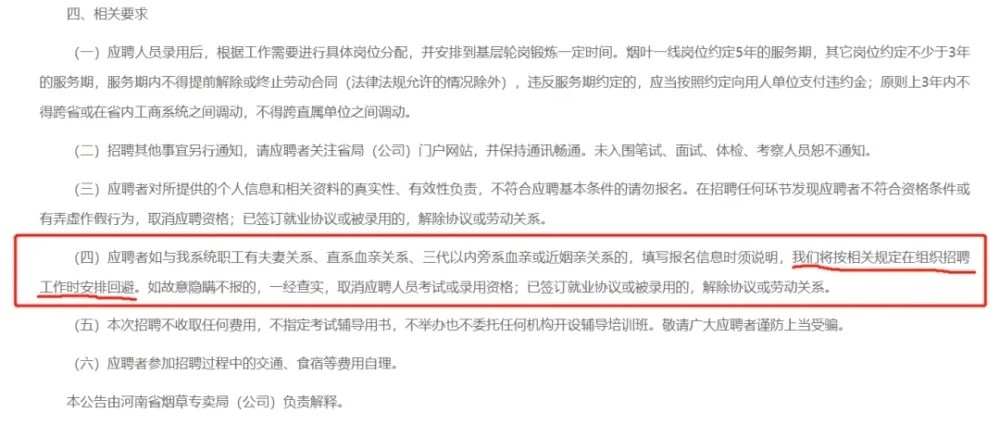

# 三代血亲不得应聘，烟草局的常规操作为何上了热搜

今天，一条“多地烟草局规定三代血亲不得应聘”的消息上了热搜。据报道，近日山东烟草专卖局发布的2023年高校毕业生招聘公告要求，应聘人员不得应聘录用后即构成干部任职回避情形的岗位，也不得应聘与本人有夫妻关系、直系血亲关系、三代以内旁系血亲关系以及近姻亲关系的人员担任领导成员的单位系统的岗位。

有媒体就此梳理发现，全国多个地方的烟草局和烟草公司在招聘中，均提出该要求。其实，翻看近些年各地烟草局的招聘信息可以发现，列明回避制度是一个常规操作。上述规定出自《国家烟草专卖局中国烟草总公司关于印发烟草行业招聘工作管理办法的通知》第十一条，早就存在，且非常明确。

很多网友以为只是今年才有这一规定，甚至认为这些规定是地方烟草局自行规定的，其实是一个误会。

也不只是烟草行业，一般来说，政府部门、国企、事业单位都有类似规定，防止近亲繁殖、裙带关系，在制度层面并不缺乏规制。所以，这些招聘规定，更多地是对既有规则和纪律的强调，也是公职部门招聘应有的基础要求。我们探讨的关键，应该落在执行和监督上。

很多人不知道这是既有规定，其实恰恰反映了一个问题：为什么本该是常识的东西，却未能普及？这或许说明回避制度在一些地方、一些部门，被强调和执行得还不够。

中央纪委国家监委网站曾发文称，“细数近些年中央和各地的巡视反馈通报，‘裙带关系’‘近亲繁殖’屡屡被提及。从领域看，主要集中在金融、电信、电力、烟草等国企”；并公开一个典型案例：工行总行管理的691名干部中，220名干部的配偶、子女共240人在系统内工作。

这篇文章同时提到，近亲繁殖的方式也更加隐蔽。例如，根据亲属条件量身定制招聘要求，进行“个人简历式”招聘；再如，与其他单位进行条件互换、交叉安排。想方设法对回避制度进行规避，对这种小心思，监督部门也要及时察觉，提高监督灵敏度，尤其是要发挥大众监督的社会性力量。

值得一提的是，网络上出现了一些对“三代某某人”不满的声音，对于电三代、油三代、烟草三代、银行三代的吐槽声不绝于耳，这种适得其反的“正向宣传”成为了“低级红”的典型表现。公众激烈情绪的背后是朴素的公平就业的诉求，希望学会真本事，就能够找到好工作；希望好工作不是小圈子里面的内部循环；希望“背景”“资源”不再成为寒门子弟的上升的障碍。

党的二十大报告指出，“消除影响平等就业的不合理限制和就业歧视，使人人都有通过勤奋劳动实现自身发展的机会”。“平等就业”和“反就业歧视”首次出现在党的全国代表大会报告中。

就业是最基本的民生，也是教育公平这个“最大公平”的最终归宿和落脚点。这次公众对于烟草系统实施已久的“三代血亲不得应聘”的老规定，反应如此强烈，指向的是对“近亲繁殖”的担忧，渴望的是唯才是举、凭真本事吃饭的公平竞争环境。

