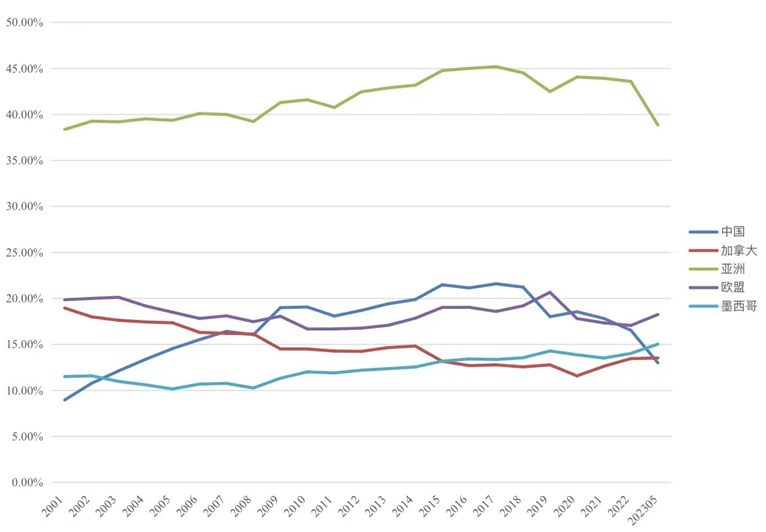

# 中国不再是美国第一大进口国？中美贸易巅峰不在，全球贸易链重组

_图/视觉中国_

**文 |《财经》特约撰稿人 李飞**

**编辑 | 郝洲**

据美国媒体近日报道，中国在美国商品进口中所占比例15年来将首次从第一位跌落，中国在2009年超过加拿大成为美国第一大商品进口国，但如今这一位置被墨西哥和加拿大先后超越。

美国商务部贸易统计数据显示，2023年1月-5月美国从中国进口商品金额为1686亿美元，同比下降24%，占其进口总额13%，比2022年同期低3.5个百分点。与此同时，美国从墨西哥进口额则同比上升5%，由2022年同期的1845亿美元上升为1950亿美元，占比则由14%升为15%。

美方的统计数据与中方有所差别，中国商务部网站显示，2023年前五个月，中美贸易总额为2007亿美元，同比下降15%。如果按照中方统计数据来看，墨西哥并未取代中国成为美国第一大商品进口国。

另据中国海关统计，2023年上半年中国货物贸易进出口总值20.1万亿元，同比增长2.1％，其中，对美国进出口2.25万亿元，下降8.4％。按美元计价，2023年上半年中美贸易额为3272.64亿美元，同比下降14.5%，其中，中国对美出口同比下降17.9%，中国自美国进口同比下降3.7%。

中美两国统计数据的差异由一些技术因素造成，主要有两点原因。首先，美国按照离岸货物的价格计算出口额，按照到岸货物的价格计算进口额。按到岸价格计算和按离岸价格计算，就产生差异，一是运费，比如航空运输、海洋运输运费，二是保险费。另外，还可能有一部分转口贸易的误差，比如，有一批货通过新加坡转口，中国可能将其统计为对新加坡的出口，而贸易商将货物转运到美国时，美国则按原产地规则统计为从中国进口。

**虽然两方数据有所差别，但一定程度上也反映出中美贸易巅峰已经不在，这种趋势转变是由经济周期、贸易规则和地缘政治因素共同驱动。**

中国对美出口额下降与发达国家经济周期是相符合的，数据显示，2023年以来中国对欧洲多国出口均有不同程度下降，中国对美国和欧盟国家出口曲线几乎是同步移动的，这一定程度是因为加息潮对发达国家经济增长带来的负面影响。

2022年以来，面对通胀持续高企，美联储激进加息步伐不停，引发多国央行被迫跟进。全球范围内出现密集加息潮，不少发达经济体存在单次加息50到75个基点的激进操作，借贷成本飙升挤压了消费者和企业支出，欧美国家经济被指正滑向衰退，经济增长降温的压力随即传导给全球贸易，贸易放缓的势头可能会持续一段时间，对新兴市场和发展中经济体造成伤害。

**电子产品消费降温**

这对于亚洲地区格外明显，因为这里是全球制造业中心，也是全球贸易晴雨表，2023年以来，亚洲经济体总体对美出口额和比例均呈现下降趋势，被认为是中国制造业替代选择的东盟国家也是如此。亚洲经济体整体下降幅度甚至比中美贸易数据还要大，从更加陡峭的曲线就可以看出。以主要国家和地区为例，截至2023年5月，中国台湾地区对美出口较2022年同期下降9%，越南出口下降17%，韩国出口下降12%，因此中国占美国进口比例的下滑一定程度上是符合美国自亚洲进口整体下降的大趋势（如下图）。

_美国商品贸易进口来源地占比（数据来源：美国商务部）_

除了加息影响，新冠疫情带来的买买买宿醉也在扭曲贸易数据。几个月来，全球贸易一直萎靡，因为发达国家消费者在疫情期间大肆挥霍之后，不再在电子产品、家居装修和其他消费品上大举支出。相反，他们选择把更多的收入花在外出就餐、旅游和其他服务业领域，一些贸易问题专家将之称为“电子产品周期”（electronic
cycle）。

**中国对美国的出口贸易下降正处于电子产品周期的衰退期间，中国出口的电子设备占美国进口份额三成，美国商务部数据显示，日用品、电器等范围广泛的中国产品的进口量均有所下降，半导体进口额则减半。**
美国消费者自2022年下半年以来对电子消费品的需求量一度走低，美国商家面临大量库存积压问题，很多订单被取消和延缓。

芯片作为电子产品核心零部件，其贸易数据也反映出这一趋势。中国的贸易数据也支持这种一种说法，因为看待中美贸易数据下降，不能仅仅进行两点一线的理解，而是要将全球贸易供应链之间的关联性想成一张网络，从不同的角度为贸易数据提供解释。

芯片是电子产品重要零部件，其需求量反映出电子产品市场行情，上游消费者减少购买电子产品，必然会影响下游芯片订单。中国与芯片出口国贸易数额下降也从侧面证明中国贸易数据低潮一定程度上因为电子产品需求周期性衰退。

2023年以来，中国主要芯片进口国韩国对华贸易数额曾出现短暂逆差，虽然5月数据显示回到微弱顺差，但这是不同以往的趋势，因为韩国对中国长期以来保持贸易顺差。这种逆差是因为中国对韩国货物贸易进口额下滑造成的，中国商务部数据显示，2023年1月-5月，中国从韩国货物贸易进口数据大幅滑坡，分别为-38%，-29%，-28.2%，-27.7%，-26.7%，因为半导体占韩国对华出口总额的40%，因此中韩贸易必然受到半导体进口数量减少影响。

不仅是韩国，中国对亚洲电子产品供应链国家和地区的贸易逆差目前处于非常低的水平，这是中国与他们过去20年来最低的贸易逆差之一，这些国家和地区包括亚洲新经济体和日本。

**贸易链重组**

**与此形成对比的是，中国与其他大多数新兴国家都有盈余红线，越来越多的中国出口产品流向中东和拉丁美洲等地区，这反映出中国投资对自然资源青睐而加强彼此之间的经济联系。**
对俄罗斯的出口激增也反映出中俄之间密切关系，以及西方对俄罗斯进口实施制裁的影响。中国在向新兴市场出口廉价电动汽车和智能手机方面也取得成功，挤掉昂贵的西方替代品。2023年一季度，中国超过日本，成为全球最大汽车出口国。

随着中国深入美国以外的市场，中国继续主导全球贸易。世界贸易组织数据显示，2022年中国在全球商品出口中所占份额为14.4%，高于疫情前一年的13%和2012年的11%。2022年，美国占全球商品出口总额8.3%，德国占6.6%。

值得注意的是中国与美国试图打造的新贸易秩序制造业中心——墨西哥的贸易额在2023年一直保持增长趋势，虽然同比增长幅度比2022年低，这种增长可能一定程度上解释了中美贸易额统计数据的差距。

过去几年来，因为成本上升和关税带来的影响，很多中国企业赴墨西哥建厂，虽然逐步加大本地化采购比例，但是很多关键零部件仍然要从中国进口，中国对墨西哥主要出口液晶显示板、电话机、机动车零部件等。这些从中国进口零部件在墨西哥加工成成品并被出口到美国，实现了一定程度上的间接出口，这可能造成一些中国产品未被计算在对美出口商品之列。同理，这个解释也适用于中国对一些东盟国家出口的增长。

虽然间接出口可以让中国出口数据东方不亮西方亮，但美国方面已经开始实施越来越多的限制措施，试图堵上这个漏洞，因为在美国看来，中国一直以来都在利用原产地规则漏洞规避关税，特朗普政府重新谈判《北美自由贸易协定》的一个原因是该协定原产地规则过于宽松，允许越来越多的汽车零部件来自北美以外，尤其是中国。

拜登政府没有重回跨太平洋伙伴关系协定（TPP）也是出于这种考量，在美国看来，TPP原产地规则太宽松，即使中国不是成员，含有大量中国成分的产品也可以免税进入美国。因此美国认为，即便亚洲盟友与美国达成任何多变贸易协议都是巩固他们已经与中国紧密结合的现有供应链，其结果将是增加而不是减少对中国的依赖，这是美国政策制定者所不希望看到的。

产业政策坚定支持者、美国贸易代表戴琦在最近的讲话中表达了这种想法，她指出，任何以成本和效率优先的贸易规则最终受益者都是中国，因此新的贸易体系要建立在安全等其他考量之上，将对中国供应链的依赖逐渐剥离。

这种剥离会推动全球供应链重组，经济学家们正在努力研究主要经济体摆脱全球化将如何影响经济增长、投资和贸易。美国、欧洲和日本都推出了针对半导体制造和新能源经济投资的重大补贴计划，部分目的是减少对中国主导的供应链的依赖。

一些经济学家认为，未来几年全球贸易的增长速度将低于全球经济的增长速度，从而扭转多年来全球经济一体化的趋势，全球贸易前景将受到打击。国际货币基金组织在最近的一份报告中预计富裕国家的全球投资将越来越多流向其他发达经济体，这将损害需要外国投资来刺激经济发展的发展中国家。

**在这个过程中，虽然有观点认为一些制造业迁出中国会让一些发展中经济体收益，但经济学家普遍担心此类壁垒对自由贸易的总体影响将是有害的。**
牛津经济研究院驻新加坡高级经济学家亚历克斯·霍姆斯（Alex Holmes）就认为，这种贸易格局转变对全球GDP的总体影响是负面的。

