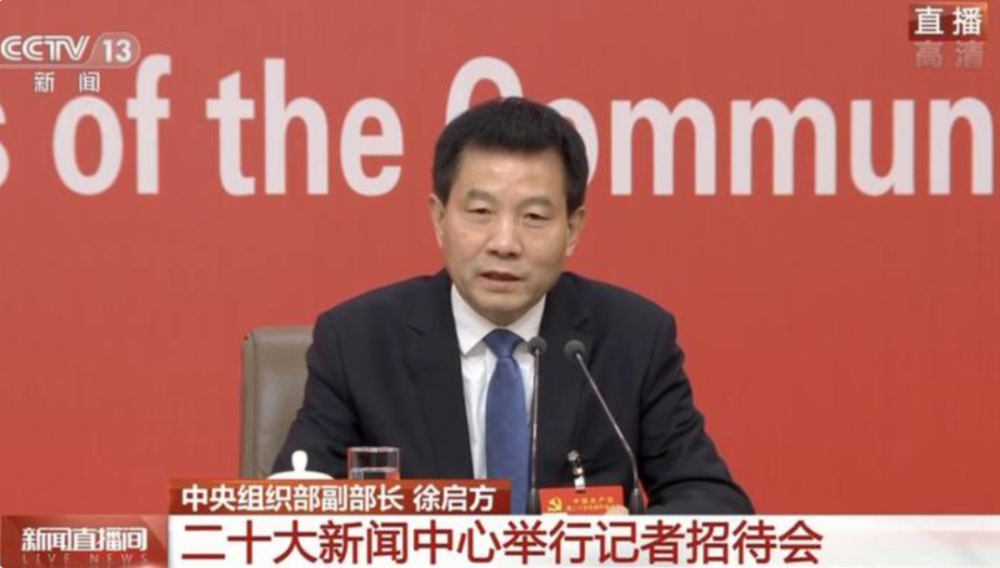
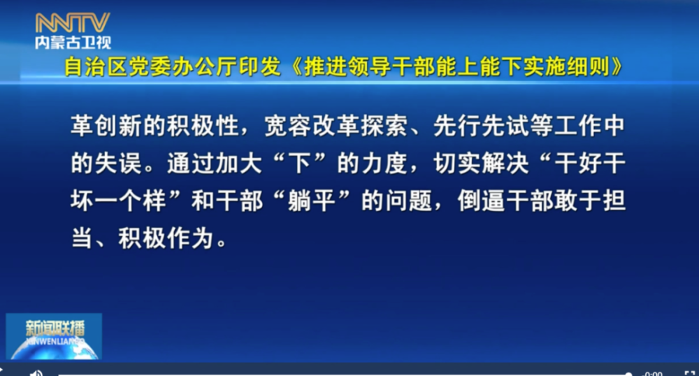

# 事关中央规定！多地出台《实施细则》，解决干部“能下”的问题

**撰文 | 高语阳**

7月13日，《西藏日报》发文《西藏细化领导干部能上能下标准 下无怨气上有底气》。

此前，《人民日报》7月5日发文称，西藏根据中央有关规定，紧密结合实际，研究制定了《西藏自治区推进领导干部能上能下实施细则》。

2022年9月，中共中央办公厅印发《推进领导干部能上能下规定》指出，推进领导干部能上能下，重点是解决能下问题。

《规定》明确了15种不适宜担任现职的情形。

此后，多个省份党委研究制定《实施细则》，结合本地实际，细化干部不适宜担任现职的情形，加大“下”的力度，倒逼干部敢于担当、积极作为。

**中办发文**

2022年9月，中共中央办公厅印发《推进领导干部能上能下规定》并发出通知，要求各地区各部门认真遵照执行。

新华社发文指出，《规定》对于推动形成能者上、优者奖、庸者下、劣者汰的用人导向和从政环境，建设忠诚干净担当的高素质执政骨干队伍，具有重要意义。

**《规定》明确指出，推进领导干部能上能下，重点是解决能下问题。本规定主要规范对不适宜担任现职干部的领导职务所作的组织调整。**

不适宜担任现职，主要指干部的德、能、勤、绩、廉与所任职务要求不符，不宜在现岗位继续任职。

**《规定》列出15种情形，并指出干部具有这些情形之一，被认定为不适宜担任现职，应当及时予以调整。**

例如，独断专行或者软弱涣散、自行其是，或者任人唯亲、拉帮结派，破坏所在地方、单位政治生态的；精神状态差，对职责范围内的事项敷衍塞责，对群众急难愁盼问题不上心、不尽力，工作推拖绕躲、贻误事业发展的；领导能力不足，所负责的工作较长时间处于落后状态或者出现较大失误的；违规决策或者决策论证不充分、不慎重；形式主义、官僚主义问题突出，造成不良影响的；品行不端，行为失范，违背社会公德、职业道德、家庭美德，造成不良影响的等。

中共中央办公厅还发出通知， **要求各级党委（党组）及其组织（人事）部门要做到真管真严、敢管敢严、长管长严，推进干部能上能下常态化。**

要加强督促检查，对贯彻落实《规定》不力的，严肃追究责任。执行《规定》中的重要情况和建议，要及时报告党中央。

去年10月17日，二十大新闻中心第二场记者招待会上，中央组织部副部长徐启方在回答北京青年报记者提问时，解读了中办印发的《推进领导干部能上能下规定》。

**徐启方指出，《规定》进一步优化了对不适宜担任现职干部的有关核实认定和调整程序、完善了有关调整安排方式。**

重点措施包括，坚持在重大任务、重大斗争一线考察识别干部，在实战考验中辨别高下、区分优劣；把年度考核作为推进领导干部能上能下的重要依据，深入了解干部的政治表现、能力水平、工作实绩、作风状态、群众口碑等。

**细化提出26种情形**

中办发文以后，地方陆续出台细则，根据本地实际，细化不适宜担任现职的情形。

最近，西藏自治区研究制定了《西藏自治区推进领导干部能上能下实施细则》。《人民日报》发文中写道，这是“根据中央有关规定，紧密结合实际”。

西藏出台的《实施细则》中，细化提出26种不适宜担任现职的情形。

《西藏日报》发文解读称，比如，聚焦中央第七次西藏工作座谈会和自治区第十次党代会确立的目标任务，
**增加在抓好“四件大事”、推进“四个创建”上有明显差距的情形** ；立足西藏工作着眼点和着力点，
**增加中华民族共同体意识不牢固、违反反分裂斗争纪律和党的民族宗教政策的情形** ；紧扣改进作风狠抓落实工作，
**增加不愿争先进位、服务群众意识和本领不强、精神状态萎靡、改作风抓落实不力等情形** 。

另外，西藏在操作程序上也进行了细化。

比如，将“核实认定”程序细化为谈话了解、实地印证、综合分析研判三个环节；在“提出建议”和“组织决定”前听取所在单位党委（党组）和分管领导意见等。

《西藏日报》发文写道， **《实施细则》既让干部下得服气、下有台阶，又让干部解开思想疙瘩，打消顾虑、放下包袱、轻装上阵，推动形成能上能下的良性循环。**

**多省份出台《实施细则》**

除了西藏，多个省份先后结合本地实际出台《推进领导干部能上能下实施细则》。

6月6日，人民网消息，江苏出台《推进领导干部能上能下实施细则》。

**江苏发布的《实施细则》明确23种不适宜担任现职的情形。**

**在中央规定的15种情形中，突出了对能力不足、状态不佳、业绩平庸等不适宜担任现职干部的组织调整。**

在针对共性情形的基础上，江苏的《实施细则》还针对国有企业领导人员，明确深化国有企业改革不力、违规决策企业重大事项、重大经营投资调研论证不充分、对企业发生重大国有资产损失制止不力4种不适宜担任现职情形。

针对高校等事业单位领导人员，明确贯彻党的教育方针不到位、落实意识形态责任制不力、存在师德失范行为、办学治校能力不足4种不适宜担任现职情形。

在程序上，江苏以中央规定的5步程序为基础，进一步细化为调整动议、分析研判、调查核实、作出认定、提出建议、组织决定、谈话宣布、按照有关规定履行任免程序8个下的步骤。

5月22日，海南省委办公厅印发《海南省推进领导干部能上能下实施细则》，从建设自由贸易港忠诚干净担当高素质专业化干部队伍的实际出发，进一步细化完善具体情形、调整程序、调整方式等。

海南的《实施细则》从政治表现、能力担当、工作作风、其他情形等4个方面，增补、修改了不适宜担任现职的22种具体情形。

海南省委组织部相关负责人表示，
**《实施细则》着力解决不担当、不作为、乱作为等问题，对于建设德才兼备、忠诚干净担当、能够扛起海南自由贸易港建设重任的高素质专业化干部队伍具有重要意义。**

此外，3月下旬，内蒙古自治区党委办公厅印发《推进领导干部能上能下实施细则》，细化和明确了不担当不作为乱作为等20种具体情形。

《实施细则》指出， **通过加大“下”的力度，切实解决“干好干坏一个样”和干部“躺平”的问题，倒逼干部敢于担当、积极作为。**

**资料 ｜ 西藏日报 中国政府网 人民网等**

**【版权声明】本文著作权归政知新媒体独家所有，未经授权，不得转载。**

