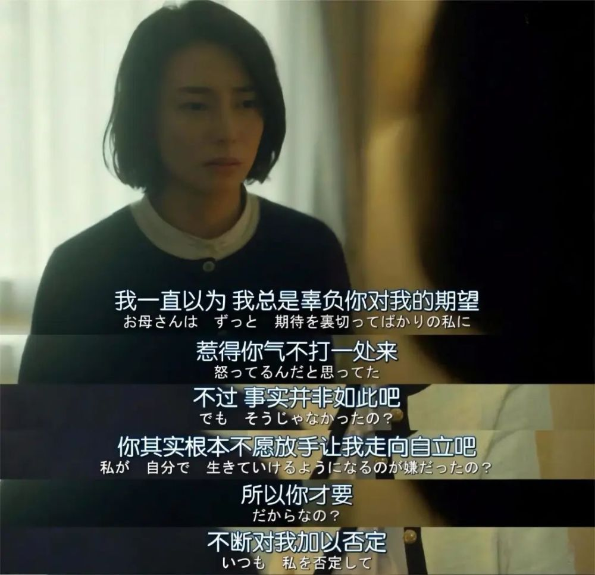
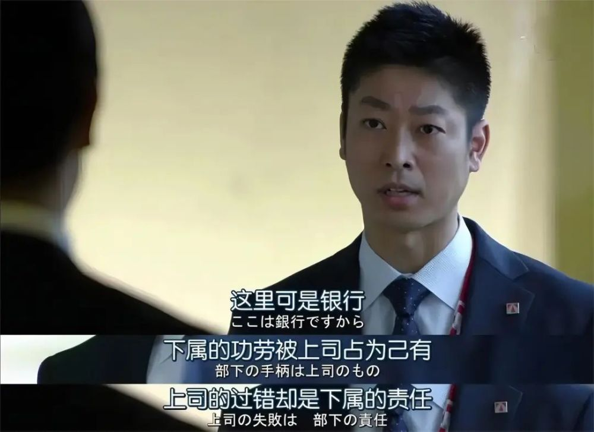
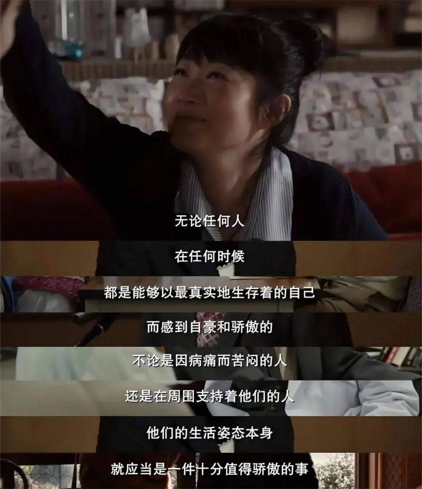

# 互联网大厂的“好学生”得了抑郁症：考核总拿5星，活得像个机器人

_《人间网事》是腾讯科技联合优质创作者推出的策划栏目，真实记录互联网的面孔与脉动，本期聚焦互联网大厂里的抑郁病人。_

作者|陈默 编辑|江岳 首席人物观（ID：sxrenwuguan）

**01崩溃**

工作了几年之后，一天，大厂网络新闻编辑沈毅感觉自己“病了”。

那是一个周末，公司大楼灯火通明，他坐在工位上值夜班。突然之间，一种冰冷的感觉像蛇一样爬上来——
**胸闷，无法呼吸，感觉痛苦。这种痛苦不但是身体上的，也是心理上的。** 他起身去洗手间给家人打电话，打着打着就嚎啕大哭。

他去看中医，医生开了一堆药，其中有治疗抑郁的中成药。从医院出来后，他逃离现实的愿望空前强烈，于是给领导请假，想着：如果领导不批假，他马上辞职。

领导批了假。他马上买了一张火车票，去南方旅行。回来之后，他感觉好些了。

但过了一段时间，那种抑郁的感觉又回来了， **就像一个无限循环，反反复复出现，** 困扰他很多年。

从2019年到2021年，大厂HR雨璇出现了两次心理崩溃。

一次是2019年。当时她接受了一个挑战性很大的项目；头一年，她刚做了母亲。双重压力之下，她出现了崩溃。她去北医六院就诊，结果显示，她患上了双相情感障碍。

_图：《实习医生格蕾》剧照_

她提出辞职，被领导挽留、建议转岗。在新部门调整了一阵子，她感觉自己好一些了。

2021年的那次崩溃来得更为剧烈。当时，雨璇所在部门的一个项目黄了，她的家人则生病住院。
**在外人看来，她有一份很好的工作，有房有车，但是她感觉，自己当时被事业和家庭放在火上烤。**

那段时间，雨璇出现了重度失眠和死亡焦虑。在北医六院，她被确诊为重度抑郁。

为了自救，雨璇去做心理咨询。在首次咨询的50分钟里，她哭了整整45分钟。压抑多年的情绪一旦爆发，整个咨询室都被淹没了，“压都压不住”。

“我很不喜欢我现在的样子，也很不甘心，我想活成我喜欢的样子，你能帮帮我吗？”她对咨询师哭道。

心理咨询师李丹旻服务的对象包括不少大厂人。她发现，
**当一个人在大厂卷得很欢时，这个人是不需要心理咨询的，只有身体出问题的时候，他可能才会想到去做心理咨询。**
因为心理问题会“躯体化”，这是心理问题的躯体化表现，即，一个人承受的心理压力和情绪，最后通过身体的疾病表现出来。

_图：《虽然是精神病但没关系》剧照_

李丹旻有一位朋友在大厂工作，在工作时，他非常忘我，每件事一定要做到最好。另一方面，他对自己的身体感觉非常迟钝，对一些腰酸背痛之类的小问题毫不在意，一旦开启工作模式，就会全情投入。

直到有一天，他被查出患有严重的免疫系统疾病。

**心理问题还会代际遗传，每一个来寻求心理咨询帮助的小孩后面，都是一个有问题的家庭。**
李丹旻在给一个有抑郁问题的孩子做心理咨询时发现，症结不在孩子身上，而在孩子的妈妈身上——这个妈妈在大厂拼命工作，经常整个人都处于躁狂状态，完全无法安静下来。“她好像进入那个机器里面，有点出不来了。”

妈妈的焦虑感，全部都倾泻到了孩子身上。

“当父母一直活在自己的焦虑里时，他们是没有办法看见孩子的。孩子的感受被父母的情绪覆盖掉了。”李丹旻说，当孩子持续不被父母看到、无法发展出健康的自我，到青春期就容易出现无法上学、自残乃至自杀等行为。

**02无意义感与生存焦虑**

在大厂，人的无意义感和虚无感会提前降临。它源于机械重复、过于细化的流水线作业，也源于高效、高度协同必然导致的去个人化。在某种程度上，人被工具化和异化了。

**“为了效率，大厂领导往往说一不二，下属的空间很小。如果你有自我意识，觉得被控制很痛苦，何去何从？”** 李丹旻问。

一个大厂员工说，每天上班，都感觉自己“像是一个机器人”。

在大厂做实习编辑的第一天，沈毅就感到了不适。那天他腰酸背痛，工作也没什么技术含量。一个念头划过他的脑海——“这就是我以后的人生吗？”

_图：《疑犯追踪》剧照_

他觉得网络新闻编辑跟富士康工人没什么本质区别：都是三班倒，都是不停简单重复，都要拼体力。富士康的生产线叫“拉”，每条“拉”的负责人叫“拉长”，沈毅经常和同事开玩笑，叫自己领导是“拉长”——大家都觉得，自己就像是在流水线上拧螺丝。网络编辑的小夜班是下午3点到晚上12点，大夜班是晚上12点到早晨7-8点，值完一个通宵夜班，就像中了毒，“连呼吸都难受”。刚缓过来，下一个夜班又来了。

工作能体现出智力含量的部分，就是改标题——用20或24个字，把一篇文章的主要看点囊括进去。但这样的部分，很少。

压力则比富士康更大。网络媒体极其看重时效，各大商业网站会比拼谁的突发新闻PUSH发得更快。一条新闻比竞品早发1秒，就可以放进周报作为重要业绩汇报。在此情况下，网络编辑的精神高度紧张，不敢错过任何重大突发。在抢时效抢到极致的情况下，有时会出现让人啼笑皆非的情况——几个网站前后脚推送的都是假新闻。因为没有时间去核实。

亦诚曾在某大厂游戏部门任职。
**部门下面有很多工作室，因为曾经出现的赛马机制，不同游戏工作室和项目之间就会出现“反复造轮子”的情况。大量基础而无意义工作因此产生。**
“你会特别无奈地想，我的天，我在公司待了这么多年，现在还要做这个。但是在这个制度下，你没有选择。”

_图：《生活大爆炸》剧照_

生存焦虑也困扰着大厂和大厂人。

在外部资本市场，评价大厂表现的依据，是利润率、营收、增长率等数据。在大厂内部，评价员工表现的依据，是KPI、已沦为KPI变种的OKR、季度考核和年终考核等。

**“当所有人都被无形的结果和功绩指挥着的时候，每个人的内心都是有生存恐惧的。”** 雨璇说。

作为网络新闻编辑，沈毅清楚地知道，自己KPI考核的最关键数据就是流量。“为了KPI，有的编辑会把一坨坨吸引流量的狗屎推到页面上。但是你心里知道，这个东西没有任何价值。”

沈毅相信新闻专业主义，觉得新闻应该惩恶扬善、反映社会现实，但他发现，能反映社会现实的严肃稿子往往流量都不高，甚至很低，而那些打“黄赌毒”擦边球的稿子，流量则很高。他的领导对外宣称说要做严肃新闻，但当沈毅推了一条流量很差的严肃新闻时，领导就会质疑：“为什么要推这条？”“流量不行，赶紧撤了”。

因为流量是互联网大厂的命脉。流量就意味着广告，意味着钱。

大厂很多部门下设的工作室会被要求独立核算成本。项目负责人需要清楚地知道自己的项目和手下的员工每天要花掉多少钱，项目成本与研发成本要以怎样合格的利润率才能赚回来，从而保证工作室的营收与年终奖。“当大家都开始拼利润率和成本核算的时候，就卷起来了。”亦诚说。

让大厂人焦虑的末尾淘汰率、35岁红线，也都是冷冰冰的数字。“你会感觉工作得越久，自己就越没有价值。”曾在大厂任管理者的王彦说。

_图：《上班一条虫》剧照_

**大厂生存焦虑的直观体现之一，就是公司要求某个部门或工作室自证价值。**
“当一个中层带着团队说我们要自证价值的时候，有80%的几率是悲剧的开始。”雨璇说。在要让公司看到自己更有价值、自己部门值得活下去的时候，管理者和员工很难做出理智的决策。

她觉得，如果不折腾，大厂的有些业务“可能死得还慢点”。

“在大厂的上升期，大家也会有拼搏的感受，但是每天大部分时间还是充斥着无聊、空洞和无意义：开各种各样的会，跟各种团队PK，为了一点资源你争我抢。还有同事擅长向上管理，天天琢磨老板，老板喜欢啥他就汇报啥，粉饰业绩，捏造自己都不相信的成果。在行业发展放缓之后，更是如此。”王彦选择了辞职。

**还有更多人没有离开的勇气，但又倍感痛苦，于是就会有一种分裂的感觉。**

**03好学生**

好学生，是大厂的抑郁高发人群。

“大厂的好学生密度很高，这是从源头筛选的结果——大厂招收大量的应届毕业生，他们中的很多都是教育体系中的佼佼者。”已投身心理咨询行业的前大厂员工萧念一观察发现。

勤奋、温顺、忘我奉献、追求完美，让好学生成为大厂的理想员工。

**但另一方面，好学生会高度在意外界评价、过度反思，永远都觉得自己不够好。遇到问题，他们的第一反应就是抨击自己。**
不久前，歌手李玟因抑郁症去世。她的姐姐李思林告诉媒体，在妹妹病情恶化时能感受到妹妹的无力，“妹妹会嫌弃地说，‘都是我不好’。”

_图：《丈夫得了抑郁症》剧照_

“好学生不能接受自己的‘无价值’，而他们价值感的来源，在学校时是成绩，在职场时是业绩。一个每天摸鱼混日子还能拿高薪的大厂员工是不会抑郁的。”李丹旻说。

雨璇曾是这样的好学生。她毕业于国内顶尖高校，有硕士学历，工作后业绩出众。“在职场上，我一直想做一个女战士，做一个神奇女侠，很想去证明自己。”

所有心理问题都是“里应外合”的结果。在两次大崩溃后，雨璇发现了自己的问题根源所在。其中既有大厂的外因，也有自己的内因——“你很认真地想去证明自己的价值，对工作、对出成绩这件事非常在意。你很想要那个很厉害的自己，很排斥自己不够好的地方。”

**心理学上有一个名词，叫做“假自体”，也就是说，一个人为了迎合外界眼光、顺从外部环境，打造出了一个虚假的“壳”，但这并不是真实的自我。**
很多好学生就顶着这样的假自体生活，他们的自我价值、生存的意义全部建立在外部认可之上。于是，读书的时候，他们通过努力获得高分，让家长和老师认可。进入大厂后，他们通过努力取得成就，让公司和领导认可。

换言之， **我工作，故我在；我优秀，故我在。**

由此带来的问题是，他们无法接受自己不完美的、脆弱的一面，将这部分压抑在潜意识中。压抑得太久，就容易被反噬。

雨璇发现，在自己此前任职的大厂，不少老员工都是好学生，都有一些抑郁。后来她反思，“为什么我们会对工作对自我价值的关系这件事这么看重？为什么我们像依赖生命的养分一样依赖外界评价？其实是因为我们内在的自我没有长得特别稳固。”

但在想明白之前，大厂生活就像爬满了虱子的华丽袍子。

有一次，雨璇被老板的一句指责深深刺痛：“你的标准就这么低吗？”

她特别难受。“这种话我是听不得的。如果别人在这方面质疑我，我就非常想反抗。”
毕竟，长期以来，她关于“我很好”的自我认知，是建立在“我很负责、我很上进、我对我自己要求非常高”的基础上。领导的那句话，相当于否定了这一切。

_图：《坡道上的家》剧照_

从大厂离职前，亦诚一直是四星五星员工。直到一次，她参与运营的一个游戏项目因为某些原因被叫停，工作室面临人事大调整，亦诚体验到了巨大的失控感。为了缓解焦虑，她找到一位心理咨询师做精神分析。

这位心理咨询师是拉康派的。包括拉康派在内的很多精神分析流派都认为，包括孩子在内的每个人都是一个独立的主体，所以精神分析师会经常问来访者：“‘别人觉得你好，诶，你觉得自己好吗？’（‘别人觉得你不好，你觉得呢？’）‘别人想让你做这件事，诶，你想做这件事吗？’”

被咨询师这样问到时，亦诚被深深地触动了。“竟然有人问我是怎么想的。我从来不知道我是怎么想的，以前没人问过我。”

她后来就发现， **很多大厂好学生都陷落在二元关系的思维中，只能通过外界评价来感知自己的存在。**
“你说我好，我就是好的，你说我不好，我就是不好的，我就很难受。”而更健康的状态应该是三元关系，即使你说我不好，我也知道，这只是你对我的评价，并不是真实的我。但很多好学生一直生活在评价与被评价的环境中，人格结构上没有独立评判意识。

在大厂，还有很多好学生的痛苦来源，是强烈的道德洁癖与公平意识。

一位前大厂员工在发现直属领导贪污、向其上级领导举报未果后，整整痛哭了一个晚上，“完全是生理性反应，浑身发抖，停不下来”。她一直坚信的那个世界崩塌了。

另一位大厂员工干了本部门最多的活儿，年底考评时却被领导穿小鞋，拿了低分。他也久久无法释怀。
**“好学生的心态是要公平，在行业蓬勃发展的时候，你越努力越被认可，越得到正向反馈。但是当环境变化，大家要靠彼此竞争、打压来获取资源时，这套价值观就会变成弱点。**
你不认同领导，领导就要拿低评价低绩效赶你走，否则人人效仿你这种情况，人心散了，团队也散了。”亦诚说。

一个大背景是，互联网行业在2018、2019年之后发展放缓，可做事的空间变少，这必然影响到个人工作和升职加薪的空间。在过去三十年里，中国社会的基调就是高大猛好，要创造，要发展，要向上，人们相信的是明天会更好，一分耕耘一分收获，好学生的人格也是在这样的环境中形成的。但当在职场“大杀四方”的愿望遇到收缩的环境，好学生就很容易产生自尊体系的崩塌。

**04PUA**

互联网大厂，曾经是最适合好学生的职场之一。

雨璇在2016年进入大厂工作，当时她对公司的认知是充满生命力，对有才华的人很包容。她也充满使命感和干劲，想真正为社会创造价值。但这种感觉，随着大厂规模的扩大，逐渐稀释掉了。
**更多素质参差不齐的新员工加入，大公司病、官僚化现象逐一显露。**

“有各种小丑轮番上台的感觉。”HR的工作让雨璇发现，一些员工会表演障眼法，擅长夸夸其谈，让大家觉得他有精确的判断，可以跟着做事，但随后就会发现，这些人就像华而不实的小丑。

这些“小丑”往往有过度自恋倾向，甚至有一部分人就是被称为“天生的PUA大师”的自恋型人格障碍（Narcissistic personality
disorder,NPD）。根据统计，后者在美国总人口中的占比达到6.2%。在美国，与NPD有关的知识已经比较普及，但在中国职场，了解NPD相关知识和其危害性的人寥寥无几。

李丹旻和心理咨询行业的不少同行都发现了一个现象—— **在卷文化下，擅长向上管理、向下霸凌的自恋者更容易上位，成为领导。**

_图：《半泽直树》剧照_

在心理学中， **自恋型人格障碍患者分高功能自恋者（有能力）和低功能自恋者（无能），“逼疯”好学生的，大都是浮夸且无能的低功能自恋型领导。**
网络上曾传出一个聊天截图：有大厂领导要下属叫自己“爸爸”，而下属一一照做，直到事件曝光。

一位曾是部门骨干的大厂员工在愤而离职多年后自学了心理学，这才发现自己当时遇到的就是低功能自恋型领导。

刚从其他部门空降过来时，这个基干体贴入微，到处问手下：“我可以为你做什么吗？”几个月后，可能是觉得位子稳了，他突然就像变了一个人，开始对手下各种贬低打压，甚至人格羞辱。问题是，他并不精于业务，只擅长向上管理，开会时的名言是：“要干领导看得见的活儿。”“哪怕是一坨屎，也可以包装成一朵花。”

实在不堪忍受，上述大厂员工和另一个骨干同事选择了离职。因为投诉太多，后来这个小领导被调离。

另一位大厂员工也遇到过类似的领导。

这个领导不但争功诿过，还习惯性撒谎——他要求下属言听计从，但一旦出了问题，他就会矢口否认自己说过的话。对下属颐指气使、贬低打压，更是常态。就任三个月后，他手下十二三人的团队，有一半人离职。

大厂禁止越级告状的制度，会让自恋者的精神虐待现象更难被察觉。

小红书博主“灰灰是蓝猫”是一位在英国执业的律师和心理治疗师，对自恋型人格障碍有深入研究。她表示，自恋者会利用他人的特质和行为方式来操纵和控制其他人。而好学生之所以容易被自恋者拿捏，主要是因为好学生有同理心、同情心、顺从、忠厚、老实，此外缺少城府和心机，对丛林法则认识不足。

举例来说， **自恋领导在工作中是甩锅大师，不会承担任何责任，核心信念是“我不可能有错，有错都是别人的错”，且以贬低打压他人为乐。**
而好学生一遇到问题就会下意识地反求诸已，认为一定是自己做得还不够好，对完全不合理的苛责往往“照单全收”。自恋领导拼命指责，好学生拼命反省，这样一来，他们就共同构建了职场的施虐-
受虐关系。

_图：《黑暗荣耀》剧照_

但这种关系不可能持久。“灰灰是蓝猫”指出，长期而言，自恋型领导可能给好学生带来许多负面影响，让他们产生心理压力、情绪困扰、工作满意度下降，甚至可能导致身心健康问题，比如抑郁症、焦虑症和失眠等。

“自恋型人格障碍是严重的精神疾病，对他人的虐待和伤害很严重，有人因此终身抑郁，出现创伤后应激障碍或者精神不稳定。”她建议，如果情况持续恶化且无法忍受，比如发现自己的领导是极端的自恋者，好学生应该为了身心健康考虑转岗或离职。

大厂需要更加普及与自恋型人格障碍相关的心理学知识，做好管理者筛选，因为自恋型领导往往不利于团队合作、个人发展和公司目标。“灰灰是蓝猫”观察发现，“大部分自恋型领导是低功能的，他们的实际能力并不如他们自己夸耀和以为的那样好”。

“最重要的是，好学生应该保持对自己的尊重和关注，不让自恋型领导的行为影响到自己的价值观和自我价值。如果情况变得过于困难或不可忍受，寻求职业咨询、心理治疗和法律援助等专业支持也是一种选择。”“灰灰是蓝猫”说。

因为心理学知识的匮乏，一部分寻求心理咨询的大厂人，并不知道自己身上发生了什么。李丹旻提到，一位大厂人说自己跟领导关系不好，在交谈过程中，咨询师发现其领导有严重的问题，但这位来访者的反应是：“领导不都是这样的吗？”因为不但他的领导是这样，公司其他部门的领导也这样。于是，他断定自己与领导关系不好，是因为自己做得不够好。

“这是典型的斯德哥尔摩综合征。你要去迎合这样的领导，除非把自己变成病人。”李丹旻说，
**自我归因，在某种程度上是这个员工的自我保护机制——“不将这种情况合理化，他是待不下去的。”**

不过，近年来，一个名词开始被部分大厂人作为“武器”，那就是“PUA”。

雨璇在做HR时发现，职场的领导和HR都非常排斥PUA这个词，甚至会声讨PUA被员工用滥了，“觉得谁都可以拿PUA来给领导贴标签”。但学习心理学后，她发现，命名其实是一种赋权。当大家不知道如何形容糟糕的被压迫感时，就想到了PUA这个词。

从个体角度来说，当一个人的遭遇可以被命名时，他就可以与因之而来的痛苦保持一定距离，而不是陷在"我不知道为什么，但是我在这个老板下面干活好痛苦"的状态里。

**05终止创伤的代际遗传**

**提供心理咨询服务，是很多互联网大厂的标配——这是给员工的福利，从侧面也说明了需求足够旺盛。**

但很多时候，大厂的心理咨询服务，更像流水线。

因为工作压力和被领导视为非嫡系排挤，沈毅在公司预约过多次心理咨询服务，但因为排班时间不固定，他很难预约到固定的心理咨询师。而只有来访者与心理咨询师建立稳固的关系，才能进入下一步。

一次，因为工作细节，沈毅在微信群和同事争执了几句。有同事马上将截图发给领导，领导大张旗鼓，在大群里斥责平时兢兢业业的沈毅“破坏团结，给公司业务造成了损害”。

他极度委屈，在内网预约了一位心理咨询师，对其诉说苦闷，对方只是告诉他，保留好证据，不要那么唯唯诺诺，“你是有还击能力的，你是有选择的”——就像所有不痛不痒的安慰一样。

“这些话任何人都可以说，不需要学心理学。”他感觉意冷心灰，最终选择了辞职。

_图：《无法成为野兽的我们》剧照_

直到一段时间之后，他的抑郁才慢慢好起来。

当然，板子不能都打在大厂和互联网行业身上， **很多心理问题要回溯到原生家庭和教育、社会等方面。**

“我们的上一代、上上一代都有很深的社会、历史、文化的创伤，这些原生家庭的创伤会代代遗传。岁月静好的时候，这些创伤是隐藏起来的，或者不明显。但是当环境一旦变化，人受到挤压，它们就很容易被激发。”李丹旻说。

在一些中国家庭，父母的角色是缺失的。大厂提供诸多保障，更像是象征意义上的父母。“心理上缺失父母的人，就会贪恋这样的环境。实际上，他们是在补足自己早年匮乏的东西——从这个意义上来说，大厂对于他们也是救赎。”李丹旻表示。

而在传统的中国家庭中，家长经常说的一句话就是“我是为你好”。孩子很少被看作一个有独立意识的主体，他们的自我往往是不被看见的。儒家文化和集体主义也强调人际关系的和谐，把人放在群体中。

很多中国孩子承载了家长过多的期待，他们从小接受的爱就是有条件的——“只有我这样做，妈妈才会爱我。”一位大厂好学生被妈妈不断数落着长大，妈妈的理由是“我希望你完美”。她的缺点，是不被妈妈接受的。但“追求完美”是一场让人精疲力尽的夸父逐日游戏。这个好学生后来成为了工作狂，一闲下来就有罪恶感。

**因为没有接受过无条件的爱，好学生小时候迎合父母，长大后迎合领导，即使离开了家，他们内化了的严苛父母还会继续批判自己，对内攻击。**

而在中国的传统价值观中，努力工作是很高的美德。“我们身边的好几代人都把工作看得特别重要。”雨璇说。她的奶奶八十多岁了，每次雨璇回老家看她，老人总是叮嘱：“你要好好工作。”

那么，当我不努力工作的时候，我还能是谁？

_图：《伊藤君A到E》剧照_

李丹旻发现，那个孩子抑郁、自己心力交瘁的妈妈之所以无法离开大厂，就跟原生家庭有关系——她出生在一个极度重男轻女的家庭，一切自我价值都来自学习。

在这种模式驱动之下，她从一个不被看见的小女孩变成了家族的骄傲、职场的精英。她无法离开大厂，因为那意味着安全感的消失。她不敢去想，如果自己不努力学习，不努力做一个好员工，她还能是谁。
**她的存在价值是被外界建构的。** “去掉壳子后，她就是空的。”

当然，还是有一部分“大厂病人”，选择了离开。

李丹旻那位患上严重免疫系统疾病的朋友接受了长期治疗，捡回一条命。他从大厂离职，开始更加关注自己的身心。

有一部分离职的大厂人进入了心理咨询领域，希望更深入地探索自己内心，找寻真实的自我。比如王彦就在放弃大厂的管理岗后，考上了北师大的心理学研究生。她想做一些跟之前不一样的事情。

落差可想而知。一个直观体现，就是收入从高薪锐减为零。

“我有些孩子气。可以说我辞职是因为不成熟，但是我的心灵又会因此早一点自由。”她想找到生命的意义。

她感谢大厂带来的财富积累，让她在进入一条全新的赛道时没有后顾之忧。不同于互联网行业，心理学行业是一条长期赛道，没有年龄焦虑，她想用后半生来做这件事情。

亦诚也选择了从大厂主动辞职。她目前是一位心理咨询师，并在打造一个心理咨询师创作实习项目。她发现，在大厂工作时，自己的钱都用来消费，缓解工作带来的痛苦了。“离开那个环境后，你不需要花那么多钱，可以过一种由你自己选择的、很简单很满足的生活。”

不过，改变并不是一朝一夕的事情，尤其是在心理层面。

在进入心理咨询行业的同时，雨璇也在看心理咨询师。最近，她的心理咨询师告诉她，自己有一个感觉——
**“无论是你之前的大厂工作，还是现在的心理咨询工作，都比你自己的位置更高，感觉你是服务于这两个职业的。”**

当听到这句话时，雨璇哭了。她发现，自己还是有一些自己没有看见的阴影。

心理咨询师告诉她，你的自我是你真正的将领，是要带领着你去打仗的。无论选择什么职业，你的感受是最重要的，是高于任何一个职业本身的。

但另一方面，雨璇觉得自己还是有了巨大的进步。随着自我觉察的不断加深，她开始更加接纳以前自己认为自己“不好”的一面，活得没有那么累了。

_图：《丈夫得了抑郁症》剧照_

小时候，她的妈妈很少表扬她，所以有了女儿之后，雨璇曾经经常表扬自己的女儿。直到有一天，她突然发觉，表扬也是一种评价，她还是在重复母亲“有条件的爱”的教育模式。在这样的环境下长大，孩子会形成这样一种心态——“只有被表扬，我才是有价值的。”

现在，她试着尽量给女儿无条件的接纳与爱。

她也试着给自己的内在小孩无条件的接纳与爱，与自己拧巴的那部分握手言和。

“最好的状态是，意识到‘我的存在本身就是有价值的，哪怕什么都不做，只是呼吸，我都是价值的’。”

我的内在感受比外表更重要。我的价值，不需要由外界来定义。

这种状态，就叫做自由。

在心理咨询师们看来，虽然心理创伤就像一个命运的魔咒，会在无意识间代代传递，但是一旦人们有了自我觉察，这个代际传递就会被打破，命运的魔咒也会随之被打破。

**“我们这一代，就是在打破这个代际传承的过程中。”** 王彦说。

（应受访者要求，沈毅、雨璇、王彦为化名）

