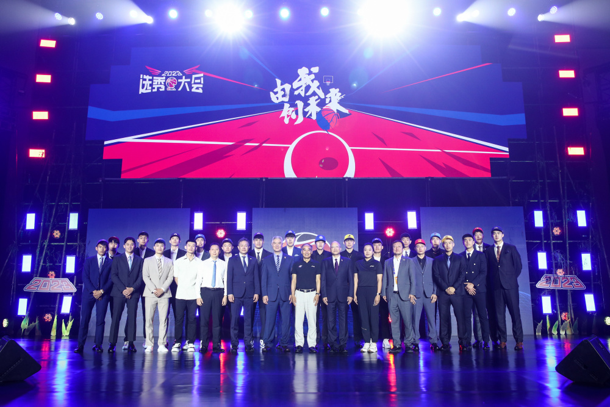
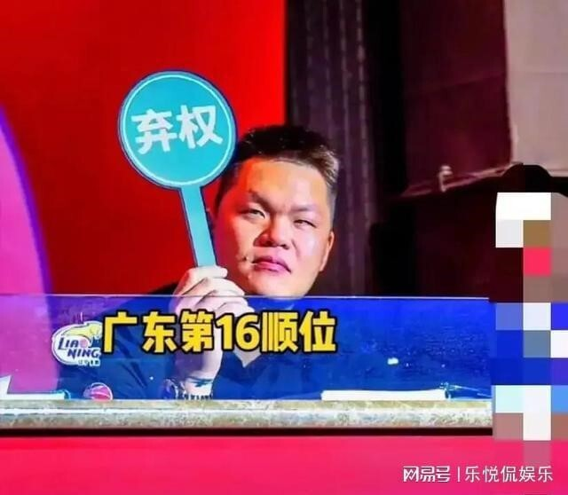
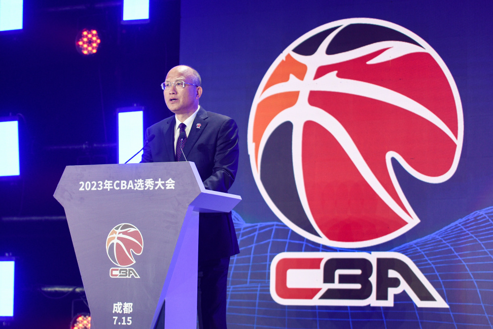
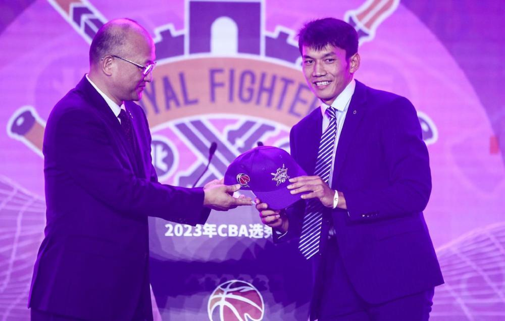

# 体谈 | CBA选秀仍然鸡肋，但已不算特别鸡肋

**撰文丨霍森**

2023届CBA选秀大会15日在成都落下帷幕。

比起往年而言，这一届选秀大会的故事要精彩了许多，比如陈国豪和邹阳早已闹得沸沸扬扬的状元之争在选秀前一天突然结束了，宁波因为交易了状元签被吐槽，而福建手持5号签忽然收获了稳稳的幸福……

虽然这些精彩的场外故事，依然改变不了CBA选秀大会处于鸡肋般尴尬位置的事实，但某种程度来说，CBA选秀既然已经有了“秀”的雏形，那么这条商业化的路子就算是没有走得太偏。

**01 CBA选秀有多鸡肋**

从2015年开始，CBA选秀大会至今已经成功举办了9届，目前业已成为每年多支球队补充即战力的一个途径。不过和各队传统的青训系统相比，CBA选秀所提供的人才，不管是数量还是质量，差距都显得有一点大。

数量上来说，CBA选秀里能提供的好苗子实在太少。

过去曾经有人这么形容CBA的选秀——豪华的饭店，顶级的后厨，精美的餐桌，但是客人一进来，却发现没有菜、或者只有那么一两道菜可以点。

这个形容不可谓不贴切。

过去几届选秀大会里，往往只有状元签最受关注，能被CBA俱乐部看中的球员少之又少，过去8年选秀，总共449人参选，却只有119人被选中，选秀大会更像是弃权大会，异常尴尬，朱芳雨因多次代表广东弃权，甚至被专门做成了调侃用的表情包。

质量上来说，就更加难堪了。

再来数一数历届的CBA选秀状元，其中比较杰出的郭凯、陈盈骏、姜宇星和王岚嵚，基本坐稳了中游队伍的主力位置，诸如王少杰、区俊炫和王翊雄，目前暂时只能作为轮换和替补，而选秀元年的状元方君磊甚至只打了一场球就黯然退役了。

这还是状元的待遇。截至上赛季，选秀出身的119名选手里，还在注册名单的有68人，而这68人中，有50个是近两年还在合同期，但是早已不上场，甚至没有跟队。

也就是说，过去8年的选秀，总共只为CBA提供了20余位适格球员，而通过选秀成为球队主力轮换的是屈指可数，这属实是有点不太对得起姚主席大力投入的资源。

**02 为何选秀大会不被重视**

众所周知，选秀大会事实上是姚明主席所主导的CBA商业化改革的重要措施之一，对接的是美国模式的校园篮球。

但中国篮球从解放后以来，一直秉承的是体校青训培养的路子。90年代的职业化改革之后，如今CBA各大俱乐部使用的，依然是类似过去体校一样的职业梯队体系，并且直接与省市青年队对接。

这样一来，出色的篮球人才，早早就会被地方体校所挖掘，进入俱乐部青训系统的视野。

比如和姜宇星同一年进入CBA的徐杰，从小就进入广东的职业梯队，在亚青赛上早早成名，然后入选广东男篮一线队，接下来又代表国家队出征亚洲杯。

大家所熟识的胡明轩、赵睿、周琦，走的都是这个路子。

中国的篮球人才总数就这么多，青训体系先挑完了，校园体系再去挑，选材上天然就处于劣势。

更何况，CBA选秀制度规定，其他球员年满18岁即可参选，但CUBA球员需要年满21岁才能报名。

参加CUBA的大学往往是双一流优质学校，选择加入就意味着要为大学打CUBA并在学校上课，不可能同时再为俱乐部效力。像清华北大两大豪门，更是要求运动员们在校打满5个赛季后才能转投选秀大会。

这就代表校园体系里有天赋的球员在被俱乐部早早签下和高学历之间，往往要做出残酷的二选一。

当年清华附中的齐麟就是这样，为了加入新疆队，不得不放弃了清华大学。

反观在俱乐部效力的年轻球员，可以将学籍挂在体育类院校，而这类院校往往与俱乐部关系较好，不用球员在学校上课，学校的实力也打不上CUBA。

简单来说，目前中国篮球环境里，存在两套青训体系，并且以俱乐部的青训体系为主，以校园篮球为辅。

CBA选秀对接的是校园篮球体系，自然处境相对尴尬。

今年选秀，首钢为代表的青训优秀球队全程陪跑，张云松甚至都没有到场。

这不难理解。

换成你是俱乐部，一边是自家从小养大的18岁球员，另一边是大学篮球里培养出来的21岁球员，哪边更有竞争力，不问而知。

**03 选秀大会短期内难以甩脱鸡肋的帽子**

在理解了CBA选秀背后的逻辑之后，就有了一个新的问题，那就是——为什么姚明主席要力推CBA选秀呢？直接把这些资源投入到原有的俱乐部青训去不好吗？

答案只有三个字，那就是——商业化。

姚明在成为篮协主席之后，所有的改革都是围绕着这一核心在打转，对姚明主席的工作，我们在这里不做置评，但很明显，他的改革目的，是希望将CBA打造成一个类似于NBA那样的商业巨头。

想要实现商业化，对明星选手的包装就必不可少，而选秀所制造的噱头，已经被NBA证明了是行之有效的模式。

但美国篮球的这套选秀模式，植根于其深厚的校园篮球基础。

一般的美国小学篮球队，每年大概能组织50-60场比赛；而到了初中，每年可以打的比赛更是上升到80场左右。

有了这些深厚的积淀，才有了植根于其上的NCAA，以及NBA。

反观中国的篮球青少年培养，青训体系的U系列和体委教委主导的初高中篮球联赛，根本完全是两条路。

CBA选秀大会想要结出硕果，就必须建立在校园篮球体系成熟和壮大的基础前提下，而当前中国的校园篮球又正处于起步建设阶段……

所以，想要期待CBA的选秀大会在短期内摆脱“鸡肋”的定位，是完全不现实的。

**04 越来越好的选秀大会**

虽然CBA选秀大会看上去是有那么一些鸡肋，但如前文所言，目前其至少还有着两个不可替代的作用。

第一，是为CBA人才选拔拾遗补缺。

出于各种各样的原因，传统的俱乐部青训体系，不可能一网罗尽所有的篮球人才，总会有一些沧海遗珠，CBA选秀能给予他们一个追逐梦想的新通道。

前8年的CBA选秀，最终被各俱乐部选中的人数依次是1、8、11、14、16、19、30和16人。

本届大会共有71名球员参选，最终有23名球员被14家俱乐部选中，选中人数为CBA选秀大会历史第二高，仅次于2021年的30人。

与此同时，今年的首轮只有五个弃权，为历史新低。

而往年一直弃权都弃出表情包来的朱芳雨，今年却破天荒地寻求交易宁波队的状元签，失败之后还晒出了与宁波主帅阿的江的合影，声称“我太难了”。

更别提炒作许久的状元之争，以及邹阳失意落到第五却被福建捡漏。

由此可见，如果把当前的CBA选秀定位为“对CBA轮换球员的有益补充”，那么这个成果也算是差强人意。

第二，探索CBA商业化的道路。

市场化和商业化改革是一个庞大的命题，而且每个国家的国情不同，很难完全照搬外国的经验和政策，但既然有NBA珠玉在前，CBA的改革自然也可以摸着石头过河，少走一些弯路。

至少，球星的商业化包装，不管是对球员个人，还是对联赛文化的建立，都是有着巨大助力的。

比如今年的状元之争，并导致邹阳跌落5号位，又被福建稳稳捡漏。这种一波三折的剧情，噱头拉满，不仅能给当事球员提供更多的流量和关注度，日后也是CBA可以翻出来反复讲述的“历史”故事。

还有草根球员矣进宏，以178的身高和30岁的高龄，成功被北控摘牌，不可否认其中带有不少炒作的成分，但这种励志的故事，正是“where amazing
happens”的NBA最喜欢和最擅长的，是积累和积淀联赛文化的最好养分。

只有通过选秀这个“秀场”，CBA才能将自己更好的一面展现给普罗大众，吸引到更多的球迷观众。

从这个角度来看，选秀大会对各个俱乐部来说，或许有些鸡肋；但对整个CBA联赛的发展来说，无疑是必要而且成功的。

