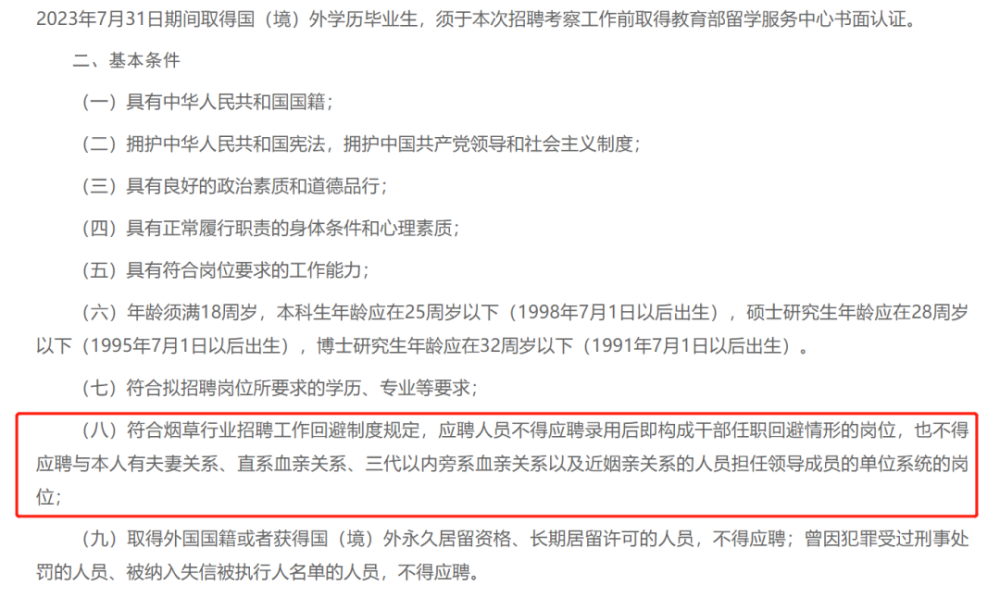

# 多地烟草局要求“直系三代不得应聘” 专家：预防“近亲繁殖”，保证就业公平性

7月15日，#多地烟草局要求直系三代不得应聘#话题冲上热搜，截至发稿时，微博阅读量已达到4.8亿。

这一热点，源于近日山东省烟草专卖局（公司）发布的2023年高校毕业生招聘公告。根据该公告，应聘人员不得应聘录用后即构成干部任职回避情形的岗位，也不得应聘与本人有夫妻关系、直系血亲关系、三代以内旁系血亲关系以及近姻亲关系的人员担任领导成员的单位系统的岗位。

红星新闻记者梳理发现，关于“直系三代不得应聘”的相关规定并非今年才有，早在2020年，国家烟草局就发布了相关通知，此外，多地烟草局在招聘过程中都曾明确提出该要求。

_▲资料图_

7月15日，国家行政学院教授竹立家对红星新闻记者表示，过去在一些个别行业或者领域，“子承父业”的现象比较严重，严重影响了就业公平性，“直系三代不得应聘”的规定能够杜绝这种现象，是值得肯定和表扬的。

北京航空航天大学法学院、中国人民大学律师学院兼职教授，北京市才良律师事务所主任王才亮表示，这一规定一定程度上解决了“近亲繁殖”的问题，在此基础还要严格坚持公开、公平、公正原则，让招聘工作处在社会的监督之下，实现就业公平。

**“直系三代不得应聘”规定早已有之**

近日，山东省烟草专卖局（公司）发布2023年高校毕业生招聘公告，公开招聘2023年高校毕业生49名。

该公告第二条第八款规定，符合烟草行业招聘工作回避制度规定，应聘人员不得应聘录用后即构成干部任职回避情形的岗位，也不得应聘与本人有夫妻关系、直系血亲关系、三代以内旁系血亲关系以及近姻亲关系的人员担任领导成员的单位系统的岗位。

_▲山东省烟草专卖局（公司）2023年高校毕业生招聘公告（部分截图）_

这则“直系三代不得应聘”的公告一经发出，迅速引发关注和讨论。红星新闻记者梳理发现，除山东省烟草局外，多地烟草局今年发布的照片公告中均有此要求。

比如青海省烟草专卖局（公司）于7月13日发布的2023年高校毕业生招聘公告，同样明确提出：应聘人员不得报考与本人有夫妻关系、直系血亲关系、三代以内旁系血亲关系以及近姻亲关系的人员所属市州局（公司）相关岗位。应聘人员的直系亲属、三代以内旁系血亲以及近姻亲有在青海烟草系统工作的，报名时须如实说明。故意隐瞒不报的，一经查实，直接取消考试或录用资格；已经录用的，依法解除劳动关系。

此外，西藏自治区烟草专卖局（公司）、江西中烟工业有限责任公司、青海省烟草专卖局（公司）、深圳市烟草专卖局（公司）、山西省烟草专卖局（公司）、安徽中烟工业有限责任公司、云南省烟草专卖局（公司）等在招聘中都曾提出该要求。

_▲云南省烟草专卖局（公司）2023年高校毕业生招聘公告（部分截图）_

值得注意的是，“直系三代不得应聘”的规定并非今年首次提出，早在2020年发布的《国家烟草专卖局中国烟草总公司关于印发烟草行业招聘工作管理办法的通知》（国烟人【2020】131号）第十一条就公布了这条回避规定。

此外，除了烟草系统，政府部门、国企、事业单位都有类似规定。比如中共中央组织部、人力资源社会保障部2019年印发的《事业单位人事管理回避规定》，就建立了统一的事业单位人事管理回避制度。该《规定》第六条规定，事业单位工作人员凡有下列亲属关系的，不得在同一事业单位聘用至具有直接上下级领导关系的管理岗位，不得在其中一方担任领导人员的事业单位聘用至从事组织（人事）、纪检监察、审计、财务工作的岗位，也不得聘用至双方直接隶属于同一领导人员的从事组织（人事）、纪检监察、审计、财务工作的内设机构正职岗位，其中亲属关系包括夫妻、直系血亲、三代以内旁系血亲、近姻亲和其他亲属关系。

近几年的多次“国考”招考公告中对“亲属回避”也有明确的规定：“报考者不得报考录用后即构成公务员法第七十四条所列情形的职位，也不得报考与本人有夫妻关系、直系血亲关系、三代以内旁系血亲关系以及近姻亲关系的人员担任领导成员的用人单位的职位。”

**专家：杜绝“近亲繁殖”，保证就业公平**

竹立家教授对红星新闻记者表示，过去在一些行业或领域中，“子承父业”或者“近亲繁殖”确实比较严重，影响了就业的公平公正，甚至对整个社会运转的公平公正都造成了一定挑战，引发了不小的争议和质疑，这也是近年来政府部门、国企、事业单位纷纷出台类似“回避规定”的原因。

红星新闻记者梳理发现，早在2020年11月28日，中央纪委国家监委网站刊登文章《斩断裙带利益链》，文章称，细数近些年中央和各地的巡视反馈通报，“裙带关系”“近亲繁殖”屡屡被提及。从领域看，主要集中在金融、电信、电力、烟草等国企。2015年，中央巡视组在对央企进行专项巡视时指出，中石油、中海油、中国太平保险、中国人寿等9家单位存在“近亲繁殖”情况；2016年，中央巡视组对中国工商银行巡视时发现，该行“总行管理的691名干部中，220名干部的配偶、子女共240人在系统内工作”。

这篇文章同时提到，“近亲繁殖”的方式也更加隐蔽。例如，根据亲属条件量身定制招聘要求，进行“个人简历式”招聘；再如，与其他单位进行条件互换、交叉安排。

竹立家教授表示，杜绝“近亲繁殖”和其他许多腐败乱象一样，不但要出台相关规定，还要从思想站位着手，多开展警示教育，保持警钟长鸣，同时还要加大查处力度、健全监督机制，使手握权力者时刻紧绷保证公平就业这根弦。只有这样，才能真正保证就业的公平性，维护社会的公平正义。

王才亮律师同样表示，应该肯定烟草系统“禁招直系三代”的做法利大于弊。如果职工间存在盘根错节的亲属关系，企业管理的科学化就很难推进，人才的培养很难做到公平。

“烟草系统提出的禁招三代的规定，一定程度上解决了‘近亲繁殖’的问题。同时也应该看到，要保证规定严格执行，还需在招聘中坚持公开、公平、公正的原则，禁止暗箱操作，从而做到择优录取，为企业的发展做好人才储备。只有坚持公开、公平、公正原则，让招聘工作处在社会的监督之下，才能解决问题，实现就业公平。”王才亮律师说。

红星新闻实习记者 祁彪 记者 张炎良

编辑 张寻 责编 李彬彬

