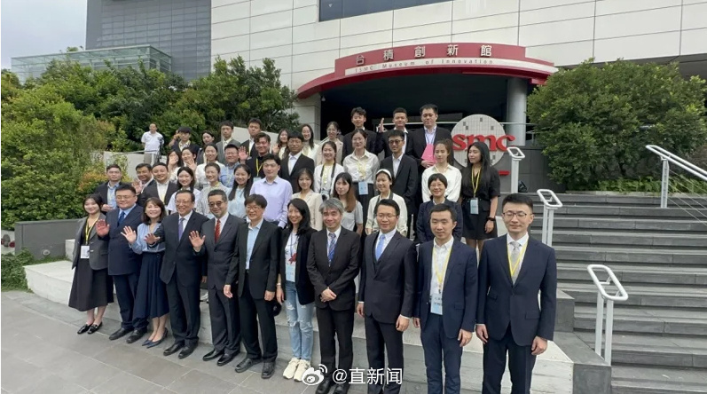
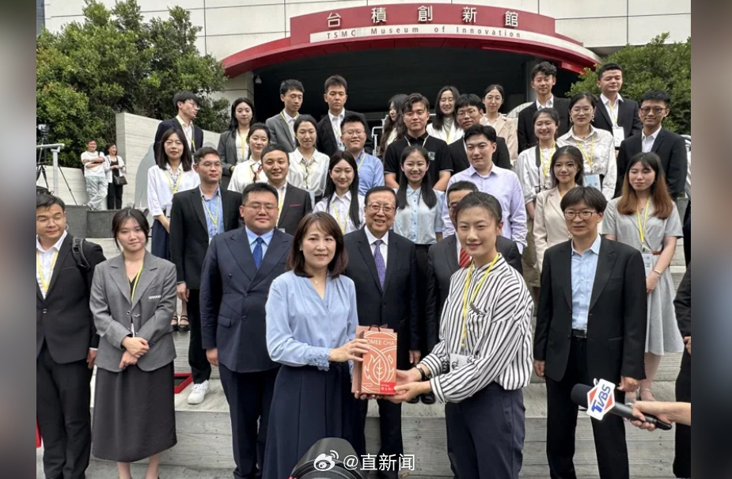
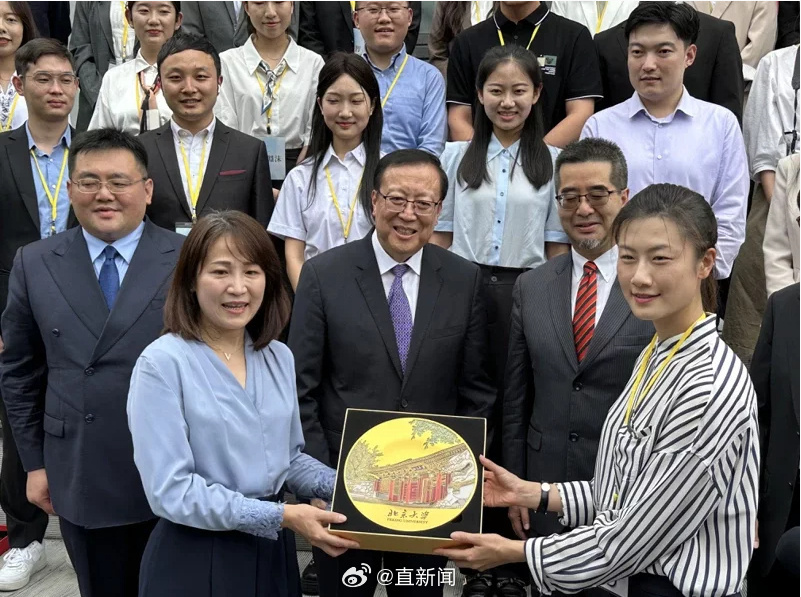

# 大陆师生访台团首站到访台积电，团长、乒乓球世界冠军丁宁接受赠礼

据台媒报道，应马英九基金会的邀请，由北京大学、清华大学、复旦大学、武汉大学及湖南大学5校共37人组成的大陆高校师生代表团（15日）中午抵达台湾桃园机场后，分乘2辆游览车直奔新竹，在下午2点21分抵达新竹科学园区的台积创新馆，新竹县派出教育局长杨郡慈接待，欢迎大陆师生来台交流、认识新竹。

新竹县政府为展现地主之谊，特地为全部的师生准备新竹在地名产“东方美人茶”。大陆师生团也派出该团学生团长、乒乓球世界冠军丁宁接受赠礼，同时大陆师生团也准备了印有“北京大学”字样的盘子回赠新竹县政府，希望两岸有更多交流。

