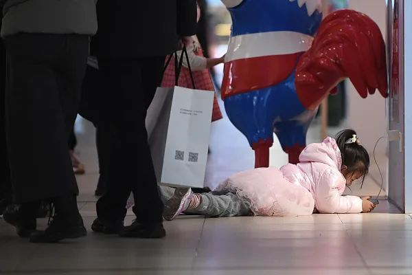
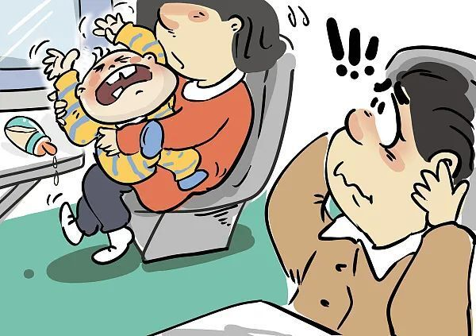

# 媒体：很多人的所谓“厌童症”，厌的并非无辜的孩子

摘要

中青评论

很多人的所谓“厌童症”，厌的并非无辜的孩子，而是没有充分实现儿童友好的社会环境。

关于“熊孩子”的话题，隔三差五就会成为热点。一般来说，人们评价“熊孩子”，评价的其实是对子女行为负有管理之责的家长。“熊孩子”问题的根源在于“熊家长”，也成为舆论场上的公约数。

_图片来源：视觉中国_

不过，当声讨“熊孩子”成为一种固化的舆论范式，越来越多的人开始担忧，网民对“熊孩子”的厌恶背后，是否存在仇视儿童、恐童厌童的倾向。不久前，作家苏小懒在微博记录了若干起家长带孩子乘火车受到苛待的情况，因为有乘客质疑孩子太吵，孩子被乘务员“邀请”到餐车车厢，甚至车厢连接处。

很快，苏小懒的微博成了家长们的“诉苦大会”。不少家长反映，仅仅因为孩子有点哭闹，他们就会遭到乘务员的“关照”。即便没有遭到实质性的区别对待，他们也承受着不容忽视的心理压力，面对周遭的沉默或凝视，仿佛带孩子出行就是给他人带来不便的“原罪”。

婴幼儿哭闹是很难避免的，在不少情况下，婴幼儿发出吵闹声并不是因为家长教育不当或养育不周，而是天性使然。要求婴幼儿在公共场合不闹也不哭，相当于要求孩子克制本能。在认识到这一点的基础上，将孩子吵闹引发的不适感完全归结于家长失责，或许对生儿养女的家长不够公平。

“厌童症”是怎样产生的？评论者沈彬的文章提供了一个解释视角：“在‘秩序’‘公德’的外衣之下，包裹着对儿童的戾气、对生育的厌恶，却被当成了爽文来吸引流量。”在作者看来，“熊孩子新闻”已经成为“新黄色新闻”里的流量担当，通过扩大舆论场的撕裂和冲突，制造了一种“仇童的狂欢”。

不可否认，身处流量至上的舆论空间，一些网民形成或巩固了极化的思维方式。在网络上，盛行“拉踩”“引战”，这一方面容易导致具体事件中的网络暴力，另一方面也造成不少人的思维愈发刻板、固执。受这种思维左右产生的认知就是：孩子一闹，就是家长的错；家长一辩解，就是不负责任。

不过，仅仅因为某些自媒体的渲染和炒作，就能让公众观感里的孩子从“小天使”变成了“小恶魔”了吗？答案必然不是单个维度的，“厌童症”的背后，其实也埋藏着某种带有共性的社会情绪。

科普作者河森堡认为：“生养孩子是一个超长线的投资，需要付出无数的时间和心力，一个只在乎当下的人，自己不会做生养孩子的选择，也一样难以容忍别人的孩子给自己带来的麻烦。”

_图片来源：视觉中国_

抚养孩子、教育孩子，毫无疑问需要付出大量成本。这个成本，既包括家庭成本，也包括创造友好生育养育环境的社会成本。当然，绝大多数社会成本，已经通过公民纳税、政府提供公共服务等方式支出了，但是，这并不意味着一个不生孩子、不养孩子的社会成员，就能不承担任何支持下一代成长的成本。

比如，在公共交通工具上，为孕妇和孩子让座是乘客的义务；在学校、幼儿园附近，经营主体依法不得从事特定经营项目；载有未成年学生的校车在公共道路上短暂停车时，后方车辆应该耐心等待……对婴幼儿在公共空间的吵闹给予适度的容忍，也是上述社会成本的一种体现。

此外，这种容忍并非无条件的，也不是毫无底线的。像图书馆、剧院、音乐厅等公共文化场所，很多都设置有未成年的专门开放区域，或者谢绝容易吵嚷的未成年人进入，这就是当忍耐儿童天性的成本明显超出公共利益所能承受的范围时，社会规则所做出的必要限制——如果无法防止孩子突然哭闹打断一场音乐会演出，最好的办法就是限制孩子进入。

其实，所谓“厌童症”的矛盾，更多发生在“不得不”的情况下。在社会流动迁徙常态化的今天，父母带孩子乘坐高铁、飞机当然是天经地义的，而高铁一直以来提倡的安静氛围，似乎又与孩子的特性不相兼容，这种矛盾才在特定的时间、空间会激化和放大。

就像《新周刊》一篇题为《“厌童症”这顶帽子，年轻人不认》的文章所说：“一味搬来传统观念指责年轻人自私，将年轻人不婚不育的苦衷与‘厌孩’挂钩，只会增加敌意与愤怒，掩盖问题的本质——在经过短短几十年的高速发展之后，城市似乎难以兼顾不同人群的需求，因而出现了空间的相互挤占。”

这篇文章给出的解决方案并不新鲜，却直击根本：“建立儿童友好、母婴友好的社会空间，它并不单纯依靠其他社会成员的自我道德约束，而更需要一个包容、便利的育儿环境。”

一个对孩子更友好的社会，需要每个社会成员的支持与容忍，也有赖于切切实实的投入。具体到“熊孩子”乘坐高铁的问题，此次关于设立“儿童车厢”“母婴车厢”的提议又起。这些建议并非不切实际的想象，而是瑞士、芬兰等发达国家的现实经验。这些“儿童车厢”不仅提供了专门服务带孩子家庭的乘坐空间，更设置有儿童游乐室、婴儿尿布台等人性化设施。

比“禁止孩童入内”更文明的，是探索“鼓励孩童释放天性”的空间，从而让不同需求的社会群体能融洽相处。就这个角度而言，很多人的所谓“厌童症”，厌的并非无辜的孩子，而是没有充分实现儿童友好的社会环境。

撰文/王钟的

编辑/杨鑫宇

**中国青年报·中国青年网出品**

