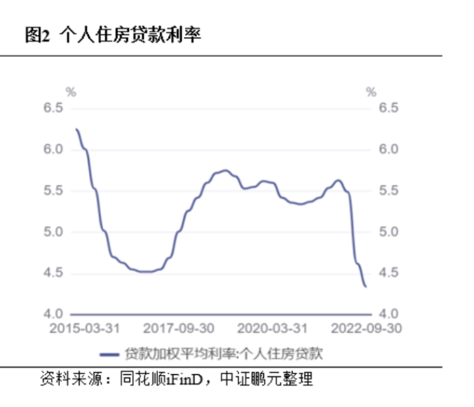

# 存量房贷利率会否下调？多家银行称“未接到相关政策”

存量房贷利率能否调降一直备受购房者的关注。当前存量房贷与新增房贷利率存在较大利差，叠加理财收益、存款利率下行和楼市持续调整等因素，住房贷款提前还贷成“热潮”，存量房贷利率调降的呼声高涨。

在7月14日举办的国新办新闻发布会上，央行货币政策司司长邹澜表示，支持和鼓励商业银行与借款人自主协商变更合同约定，或者是新发放贷款置换原来的存量贷款。

**央行表态后，第一财经记者联系中国银行、建设银行、招商银行、杭州银行、宁波银行等多家银行客户和信贷经理，他们中的多数回应称，关于存量房贷降息，“没有接到相关政策，仍按照原有签订合同的利率来执行还贷政策”。**

居民“提前还贷潮”从去年以来就备受关注。对此，邹澜在日前的发布会上表示，“个人住房贷款发放和同期商品房销售规模直接相关，还款则是来自于借款人的收入或者其他资产的配置调整。”

他表示，“这种现象对住房需求并不构成影响，它是一个居民资产配置的调整。”他解释道，尽管贷款市场报价利率下行了0.45个百分点，但因为合同约定的加点幅度在合同期限内是固定不变的，前些年发放的存量房贷利率仍然处在相对较高的水平上，这与提前还款大幅增加有比较大的关系。

邹澜还介绍，今年上半年，个人住房贷款累计发放3.5万亿元，较去年同期多发放超过5100亿元，对住房销售支持力度明显加大。上半年新发放个人住房贷款加权平均利率为4.18%，比上年同期低107个基点，亦是有统计以来最低水平。

而在近年房贷利率调降前，过往发放的存量房贷利率处于较高水平。按照中证鹏元根据同花顺iFinD数据整理，2018~2021年，全国个人住房贷款加权平均利率均高于5.4%，最高达到5.7%，与当前的新增房贷利率水平存在着较大利差。

**对央行的发声，业内人士认为银行可以尝试。**
“个人住房贷款是银行优质的、存量规模巨大的资产，近来的‘集中提前还贷潮’会对银行的资产产生巨大影响，但如果能商议降低存量利率以减少住房贷款提前还贷，建议银行要抱着开放的态度。”一名公募基金宏观经济研究员对记者说。

具体的举措上，招联首席研究员董希淼建议，存量房贷利率调整可有两种做法，一是直接降，即变更合同条款；二是间接降，即贷款以新换旧。“降存量房贷利率对银行特别是大行而言，是当下痛苦但长远有利的选择，可在降低存量房贷利率的同时，约定一定期限内借款人不得提前还款。”

业内也有观点鼓励跨行“转按揭”。但董希淼认为，贷款置换原则上应限于本行，不应鼓励跨行置换。

部分观点则表示，这会加大银行的经营困难。招商证券银行业首席分析师廖志明认为，存量房贷利率下调将会明显加大银行业绩压力，特别是个人住房贷款占比高的银行。

**某国有大行的信贷经理对记者表示：“存量贷款下调和提前还贷都会对银行的经营造成巨大压力，但不调整恐怕也比较难，估计会讨论此事，但后续还得看具体的政策是否能出台。”**

存量房贷利率能否调降是银行与住户提前还款间的博弈，业内人士提醒，贷款人不要因为央行表态就理所当然地认为存量房贷利率一定会降，还要看银行的具体举措，其本质是市场行为，一切都要合法合规。

