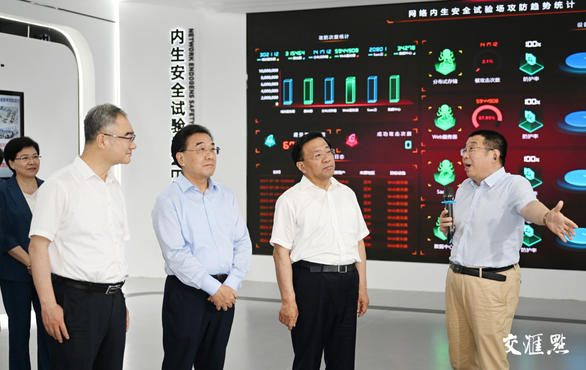

# 安徽党政代表团遍访沪苏浙问道取经，省委书记号召：心动更要行动

长三角三省一市互动频频，这一次主动走出去学习考察、与邻居们深度交流的是安徽。

据江苏广电融媒体新闻中心7月14日晚间消息，7月13日，安徽省委书记、省人大常委会主任韩俊，省委副书记、省长王清宪率安徽省党政代表团来江苏考察，共商两省深化合作大计，共同推动长三角一体化发展走深走实。江苏省委书记、省人大常委会主任信长星，省委副书记、省长许昆林陪同考察。

就在7月11日，韩俊、王清宪率安徽省党政代表团在上海考察，7月12日，代表团又来到浙江考察。

**主动靠上去、全力融进去**

公开新闻报道显示，抵沪后，安徽省党政代表团首站便来到中共一大纪念馆瞻仰，之后又在徐汇滨江听取这一区域总体规划建设情况介绍。

在中国商飞上海飞机制造有限公司，安徽省党政代表团察看ARJ21生产线、C919总装车间，了解中国商飞总体布局、发展建设及型号研制等情况。安徽省党政代表团还前往上海自贸试验区临港新片区、特斯拉上海超级工厂考察，围绕改革开放、创新发展和优化营商环境的经验做法、探索实践深入交流讨论。

中安在线刊发的“宛新平”署名文章还透露，这次上海之行，安徽进一步表达了加强科技创新合作的意愿。“安徽作为科技强省、制造强省，愿意为大飞机制造作出更大贡献”“希望上海与安徽共同加快整车、零部件、后市场三位一体全面发展”……创新共建、协调共进，在思路和理念的牵引下，沪皖伸出更紧密的合作之手。可以预料，一个在科创、产业、资源禀赋上相互补充的沪皖合作新模式正呼之欲出。

在浙江期间，安徽省党政代表团考察的重点包括美丽乡村建设和社区建设经验。

《安徽日报》报道称，“千万工程”引领浙江乡村蝶变。7月12日上午，韩俊、王清宪等一行来到嘉兴市嘉善县姚庄镇横港村，察看村容村貌，与村民亲切交谈，听取美丽乡村建设、强村富民等情况介绍。韩俊、王清宪等还实地考察杭州市钱塘区白杨街道邻里社区文化家园，对社区细致入微做好“一老一小”等服务表示称赞，要求安徽省要学习浙江社区建设经验，帮助新市民加快融入社区、融入社会。

在吉利控股集团考察时，韩俊指出，吉利汽车产品矩阵强大，与安徽合作空间巨大，要共同加快整车、零部件、后市场三位一体全面发展，合力开辟重卡汽车新能源转型新赛道，拓展新能源汽车大市场，携手做强做大汽车民族品牌。

而在安徽的“长三角邻居”中，江苏算是最“近”的，两省接壤区域较多，省际毗邻地区来往十分密切。

_安徽省党政代表团来江苏考察。_

据江苏广电融媒体新闻中心最新消息，在江苏期间，安徽省党政代表团在苏州考察了苏州生物医药产业园、瀚川智能科技股份有限公司，在南京考察了网络通信与安全紫金山实验室、南瑞继保电气有限公司。

报道称，江苏深入学习贯彻习近平总书记重要讲话精神，更大力度推进科技创新，加快产业强链补链延链，打造全国重要的产业科技创新高地，构建以先进制造业为骨干的现代化产业体系，取得的新进展新成效、展现的新活力新气象给安徽省党政代表团一行留下深刻印象。

需要指出的是，今年全国两会结束后的一段时间以来，长三角地区三省一市党政“一把手”频繁“串门”，跨省探讨区域协同发展。

其中在3月16日至18日，上海市委书记陈吉宁、市长龚正率领上海市党政代表团先后赴江苏省、安徽省、浙江省学习考察；3月20日至23日，江苏省委书记信长星、省长许昆林率领江苏省党政代表团先后赴上海市、浙江省、安徽省学习考察；4月12日至13日，浙江省委书记易炼红、省长王浩率领浙江省党政代表团先后赴江苏、上海学习考察。

中安在线7月13日刊发的“宛新平”署名文章指出，当前的安徽，正处于厚积薄发、动能强劲、大有可为的上升期、关键期，只有主动靠上去、全力融进去，才能在长三角区域航船破浪前行中注入更大的“成员力量”。

该文称，合作的路径千条万条，长三角一体化发展中的兄弟省份，如同一艘航船上的不同舱位，“一体化”是共同的时代命题，唯有同舟共济。对此，如何在推动长三角一体化发展中迈出更坚实的合作步伐，点燃更大的创新引擎，让我国这一经济发展活跃之地、开放高地、创新宝地在新征程上发挥更大作用，迫切需要长三角区域“三省一市”同题共答。

**发展有差距，但站位和眼界不能有落差**

为期三天的学习考察结束后，安徽省党政代表团赴沪苏浙学习考察总结交流会于7月14日上午在合肥召开。

省委书记韩俊指出，三天的学习考察主题突出、题材丰富，是一次砥砺初心之行，进一步增强了“无论走的多远都不能忘记来时的路”的使命感；是一次对标学习之行，进一步增强了学习践行习近平新时代中国特色社会主义思想的思想自觉、理论自觉、行动自觉；是一次奋进追赶之行，进一步增强了“不进则退、慢进也是退”的紧迫感。在党的诞生地，我们接受了党性教育，重温了建党历史。在问道取经中，我们见证了沪苏浙高质量跨越发展、最前沿科技创新、现代化产业体系、高品质人民生活等方面的生动实践。在与企业家座谈互动中，我们面对面听取了意见建议，现场办公解决了许多问题，收获颇丰、不虚此行。

韩俊强调，要透过现象抓本质，学思践悟沪苏浙长期走在前列的精神密码。

**一要学习沪苏浙登高望远、引领时代的大思路。**
沪苏浙坚持跳出一域谋全局，以前瞻性的思维谋篇布局，在服务全国中发展自身，启示我们虽然与沪苏浙发展水平有差距，但站位和眼界不能有落差，必须把安徽发展放在党中央对安徽的战略定位上、放在全球经济发展大背景下、放在全国发展大格局中、放在国家对长三角发展的总体部署中思考谋划。

**二要学习沪苏浙争先进位、励精图治的大气魄。**
沪苏浙作为改革开放的先发地区，不仅没有懈怠满足，反而越走越快，在较高经济基数上仍然保持稳健增长，启示我们奇迹都是拼出来干出来的，必须破除“小进即满、小富即安”的小农意识，以更高标准干在实处，努力争取走在前列。

**三要学习沪苏浙敢为人先、勇于创新的大手笔。**
沪苏浙在解放思想中统一思想，在直面问题中解决问题，干成了一些我们过去不敢想或者认为干不成的事情，启示我们必须破除“墨守成规、按部就班、路径依赖”的守旧观念，善于识势、顺势、借势，做好“吃改革饭、走开放路、打创新牌”大文章。

**四要学习沪苏浙海纳百川、开放包容的大作为。**
沪苏浙坚持向海图强、链通全球，大胆走出去，积极引进来，启示我们开放是高质量发展的必由之路，既要充分发挥“沿江达海”的独特优势，做好“向海而兴、借船出海”开放文章，也要拥有像大海一样的包容心态，为各类市场主体茁壮成长保驾护航。

**五要学习沪苏浙坚持人民至上、推动共同富裕的大担当。**
沪苏浙深入践行以人民为中心的发展思想，坚持把为民造福作为最大政绩，启示我们发展的出发点和落脚点要放在让老百姓生活得更好上，想群众之所想，急群众之所急，用党员干部的“辛苦指数”换来经济发展的“上升指数”和群众的“幸福指数”。

韩俊强调，心动更要行动，要切实把这次学习成果转化为打造具有重要影响力的“三地一区”和建设农业强省、文化强省、教育强省的强大动力。要在推动长三角一体化发展上求突破，携手打造新能源汽车和智能网联汽车世界级产业集群，加快壮大先进光伏和新型储能产业，积极发展现代服务业新模式新业态，探索长三角区域候鸟式、疗养式、田园式养老模式，聚力打造长三角最大的后花园、最优的旅游目的地。要在深化科技和产业创新上求突破，以高水平创新型省份建设为旗帜性抓手，服务国家战略科技力量，推动制造业高端化、智能化、绿色化转型，促进“产业+科技+人才+金融”四位一体发展，高质量办好高层次人才安徽行活动，加快建设以实体经济为支撑的现代化产业体系等。

