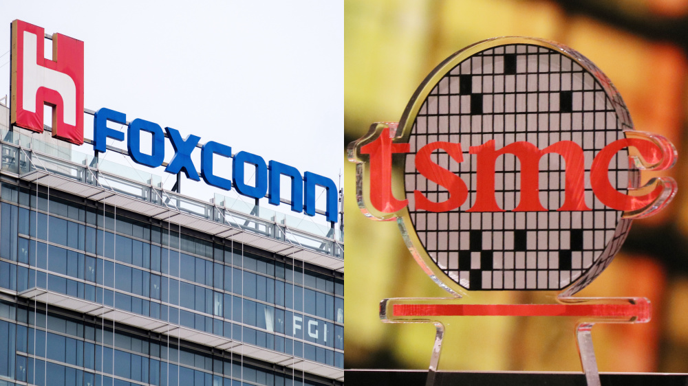

# 富士康对印度还没死心，想拉上台积电和日本企业，继续在印度造芯

腾讯科技讯
7月15日，据印度媒体报道称，在退出与韦丹塔（Vedanta）的合资公司后，富士康据称正在与台积电和日本TMH集团讨论合作协议，以获取在印度建立半导体制造设施所需的技术。

消息称，富士康很可能很快就会敲定合作细节，以在印度制造先进和传统的芯片。

台积电是世界上最大的芯片代工厂之一，而TMH则提供半导体相关解决方案和制造设备的运营和维护。

据报道，台积电生产的芯片占全球芯片生产的50%以上，2022年的收入同比增长33.5%至758.8亿美元。该公司去年还出货了1530万个12英寸等效晶圆，而2021年为1420万个。其芯片被几乎所有顶级半导体公司使用，如AMD、苹果、ARM、博通、Marvell、联发科和英伟达等。

早些时候，富士康取消了与韦丹塔的芯片制造合资企业，并表示打算单独申请政府半导体生产计划的激励措施。韦丹塔-
富士康联合体是在2021年12月宣布的100亿美元计划下寻求政府激励措施的五个申请者之一，以促进印度国内半导体制造。

印度政府向在印度国内设立芯片制造工厂的公司提供50%补贴。此外，为了吸引这类项目，印度各州还准备提供15%-25%的进一步补贴，这意味着总项目成本可能被覆盖高达75%。

