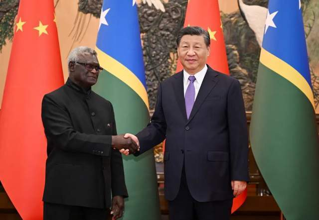

# 建交四年，这个太平洋岛国与中国的合作“后来居上”

“同中国建交，是所罗门群岛独立45年来最重要的决定之一。”在开启访华行程前，所罗门群岛总理索加瓦雷表示。

应国务院总理李强邀请，索加瓦雷于7月9日至15日对中国进行正式访问，走访北京、江苏、广东多地。这也是索加瓦雷时隔四年再度访华。

7月10日下午，国家主席习近平在人民大会堂会见索加瓦雷。会见后，双方发表《中华人民共和国和所罗门群岛关于建立新时代相互尊重、共同发展的全面战略伙伴关系的联合声明》。

_7月10日下午，国家主席习近平在北京人民大会堂会见来华进行正式访问的所罗门群岛总理索加瓦雷。图/新华_

“索加瓦雷此次访华起到巩固和提升中所关系的作用。”广东国际战略研究院副院长、太平洋岛国战略研究中心主任周方银告诉《中国新闻周刊》。他还表示，明年所罗门群岛将面临国内大选，索加瓦雷政府通过此行加强同中国的务实合作，对于推动所罗门的经济社会发展、稳定国内局势而言也十分重要。

**后来居上的两国友好合作**

2019年4月，所罗门群岛举行大选，索加瓦雷领导的政党联盟赢得议会多数席位，第四次当选总理并组阁执政。5个月后，所罗门群岛宣布与台湾当局“断交”，并与中国正式建立外交关系。中所建交半个多月后，索加瓦雷总理就对中国进行了首次正式访问。

时隔四年，索加瓦雷再度访华前，所罗门群岛政府网站发布消息表示，希望随着所罗门群岛驻华大使馆开馆，两国合作将进一步紧密深化。中国外交部发言人汪文斌也在介绍索加瓦雷访华行程时称，中国同所罗门群岛建交以来，两国关系快速发展，取得丰硕成果，惠及两国人民，也促进了地区和平稳定发展。此访是索加瓦雷总理时隔4年再次访华，必将为中所关系发展注入新动力。

习近平在会见索加瓦雷时指出，中国和所罗门群岛是彼此值得信赖的好朋友、可以依靠的好兄弟。建交以来，两国友好合作后来居上，走在了中国同太平洋岛国关系前列，成为不同大小国家和发展中国家团结合作、携手发展的典范。

习近平强调，中方高度赞赏所方坚定奉行一个中国原则，支持所方维护主权、安全、发展利益，支持所方自主选择的发展道路。他还指出，中国的太平洋岛国政策秉持“四个充分尊重”：一是充分尊重岛国主权和独立，坚持大小国家一律平等；二是充分尊重岛国意愿，坚持共商、共建、共享、共赢；三是充分尊重岛国民族文化传统，坚持和而不同、美美与共；四是充分尊重岛国联合自强，支持岛国落实《蓝色太平洋2050战略》，为建设一个和平、和谐、安全、包容、繁荣的蓝色太平洋作出贡献。

索加瓦雷表示，同中国建交是所方作出的正确选择。建交以来，两国关系取得累累硕果。中国已经成为所罗门群岛最大基础设施合作伙伴和可信赖的发展伙伴。

索加瓦雷此访期间，双方签署了涉及发展合作、贸易、基础设施建设、民航、教育、警务、海关、气象等领域的合作文件。

在中国社会科学院亚太与全球战略研究院助理研究员秦升看来，本次中所两国领导人的会面，既是两国建交后的一次“阶段性总结”，也将通过进一步的合作为双边关系发展绘制新的蓝图。

**合作提质升级的积极信号**

所罗门群岛位于太平洋西南部，是一个拥有约72万人口的热带岛国，陆地面积2.84万平方公里。由于基础设施落后、交通不便等问题，该国经济发展缓慢。

不过，所罗门群岛也在不断探索新的发展路径，由过去的单一经济逐步转变为由包括农、渔、矿、林、旅游业等在内的多样化经济。2003年至2008年，所罗门群岛年均GDP增长率近6%，一度成为太平洋岛国地区经济增长最快的国家之一。但受后来的全球经济危机以及近几年的新冠疫情的影响，所罗门仍面临着诸多经济发展的困境。

秦升对《中国新闻周刊》表示，包括所罗门群岛在内的很多太平洋岛国，近些年已经把发展列为首要任务。就所罗门群岛来说，该国在渔业、林业等经济资源上有很大优势，与中国发展经贸合作也能够在一定程度上形成互补。

在双边贸易上，2022年，中所双边贸易额约5亿美元，同比增长3%，其中中方出口额为2亿美元，同比增长20.1%，在其他领域合作上，2019年10月，所罗门群岛成为中国公民组团出境旅游目的地。2020年新冠疫情发生后，中国向所罗门群岛提供多批抗疫物资、疫苗等援助。2022年3月，中所签署警务合作谅解备忘录。同月，首批援所罗门群岛中国医疗队抵所。2022年4月，中所签署政府间安全合作框架协议。

7月11日，所罗门群岛驻华使馆正式开馆，在揭牌仪式上，索加瓦雷表示，建交近4年来，所中关系日臻成熟，合作广度和深度不断拓展。所罗门群岛积极参与共建“一带一路”，中国已成为所罗门群岛最大的贸易伙伴，为所罗门群岛抗击疫情提供了无私帮助。所罗门群岛将毫不动摇地发展对华关系，坚定奉行一个中国原则，认为台湾是中国领土不可分割的一部分。

在秦升看来，在基础设施和贸易之外，中方还将与所方在教育、旅游等人员交流上以及应对气候变化、防灾减灾、脱贫等领域展开更广泛的合作。而中国与所罗门群岛双边合作的提质升级，树立了与太平洋岛国合作典范，对其他太平洋地区非建交国家也释放了一种积极信号，即合作能够让国家和民众获得切实利益，同时也能够提升它们的国际声誉。

**中国与太平洋岛国合作不断增强**

索加瓦雷此次访华的两天前，是所罗门群岛脱离英国独立45周年纪念日。索加瓦雷在纪念日演讲中强调了基础设施建设的重要意义，表示会将国家发展放在首位。他还特别强调，所罗门群岛会在大国竞争中“保持中立”。

索加瓦雷不只一次在公开场合做出类似表态。去年9月，他曾在纽约联合国大会发表演讲时说，所罗门群岛一直推行与所有人交好且不树敌的外交政策，不会在威逼之下“选边站”。他回忆称，自2019年以来，所罗门群岛遭受了“一连串无端且错误的批评、虚假信息攻击和恐吓”。他对此强调，与中国建交的决定“是通过政府民主程序达成的”。

周方银分析称，太平洋岛国位于太平洋的腹心位置，紧靠西太平洋第二岛链进入太平洋的出入口，不仅是国际贸易的重要通道，也是太平洋上的战略要地，地缘位置十分重要。控制这一地区，对于美国维持其海洋霸权具有不可替代的重要性。因此，对于中所关系的提升，美国和澳大利亚持高度关注、十分警惕的态度。

自20世纪70年代以来，中国已同10个太平洋岛国建立或恢复了外交关系。中国同太平洋岛国交流合作不断拓宽，涵盖了贸易投资、海洋环境、防灾减灾、减贫扶贫、医疗卫生、教育、旅游、文化、体育、地方等20多个领域。

据中方统计，1992年至2021年的30年间，中国同建交太平洋岛国贸易总额从1.53亿美元增至53亿美元，年均增长13%。截至2021年底，中国对建交太平洋岛国直接投资达27.2亿美元。

2014年、2018年，国家主席习近平两次访问南太并同建交岛国领导人举行会晤，开启了中国同太平洋岛国关系发展的历史新篇章。2022年5月下旬至6月上旬，时任中国国务委员兼外长王毅应邀访问南太并主持召开第二次中国—太平洋岛国外长会。在这次对太平岛国的密集访问中，王毅不仅阐述中所安全合作三项原则，更强调太平洋岛国都是主权独立国家，不是谁家的“后院”。

秦升对《中国新闻周刊》表示，这次习近平主席所强调的“四个充分尊重”，明确表达了中国与包括所罗门群岛在内的太平洋岛国关系发展的基本原则。

而在谈到未来中国与太平洋岛国的合作前景时，周方银认为，双方在基础设施、南南合作、应对气候变化、海洋合作、人文交流上都有很大潜力。此外，中国与太平洋岛国还会加强在国际事务中的沟通协作，提升双边关系的层次，在一些重要的国际问题上联合发出发展中国家的声音。在这个过程中，本次与所罗门群岛深化合作是中国与太平洋岛国合作不断增强的写照和体现。

记者：郑立颖

