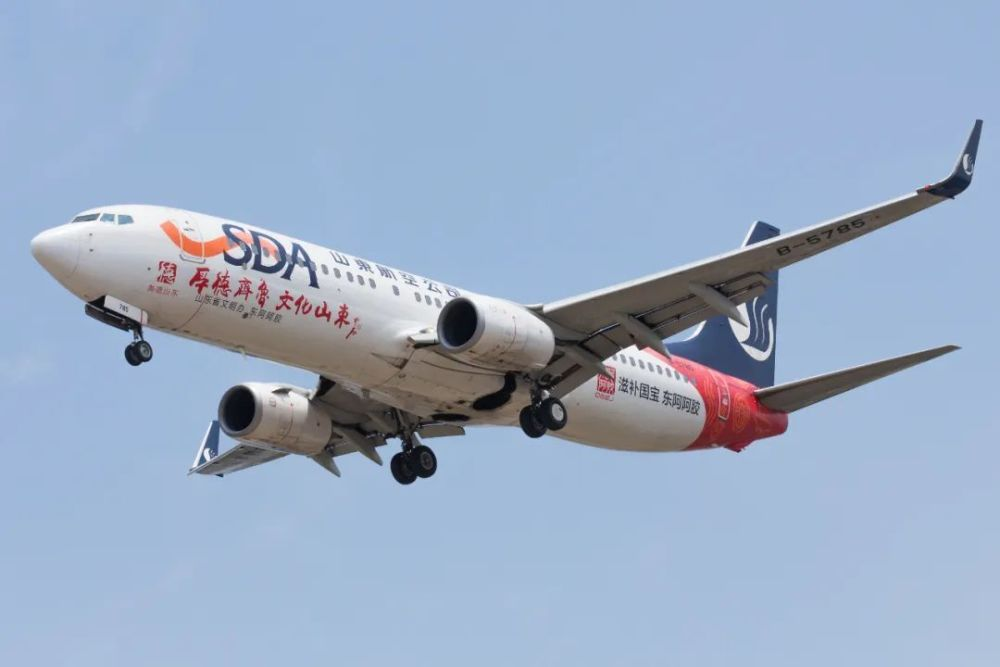
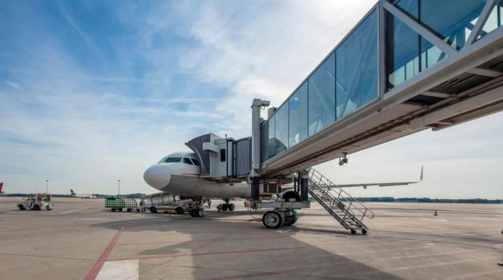

# 最“硬核”的山航，怎么就退市了？

号称国内最“硬核”航空公司的山东航空股份有限公司（以下简称山东航空），退市了。

2023年7月7日，山东航空结束了在B股的最后一个交易日，随后在7月10日被正式摘牌。

近年来，山东航空因飞行员敢于挑战恶劣天气等特点而闻名，其“战斗机”式驾驶风格得到不少旅客的认可和喜爱。

_喷有彩绘的山东航空飞机。图/图虫_

山东航空还曾为此发布声明，称部分网友、自媒体发布传播以“闪电航空”“硬核山航”“中国俄航”为标签的有关内容，有的属于偏爱，有的只是“调侃”，部分偏离客观情况，恐致公众对航空安全和航班运行的严肃性、严谨性产生认知偏差。

2019年，山东航空进入亚太地区大型航空公司到港准点率前十名，并在国内排名第一；2023年2月，其继续以准点率96.27%，位列全国第一。

顶峰时期，山东航空与深圳航空、厦门航空、四川航空一起，被称为“四大地方航空公司”。在退市之前，由于经营状况，山东航空已被中国国航收购，成为其子公司。

**缘何走向退市？**

与过去几年因“硬核”、不晚点而声名鹊起形成鲜明对比的是，山东航空近年来的经营情况，一直不尽如人意。

山东航空成立于1994年，2000年在深交所B股正式上市交易。

山东航空退市的直接原因是2022年度审计期末净资产为-78.07亿元，为负值，触及深交所《股票上市规则（2023年修订）》第9.3.11条规定的股票终止上市情形，被迫退市。

截至2022年底，山东航空拥有波音 737 系列飞机 132
架。目前，山东航空以济南为总部基地，在青岛、烟台、厦门、重庆、北京、乌鲁木齐、贵阳等地设有分公司和飞行基地，经营航线超200条。

众所周知，疫情对民航业造成了巨大的冲击。今年5月，国家民航局发布的《2022
年民航行业发展统计公报》称，2022年，全行业完成旅客运输量25171.32万人次，比上年下降42.9%。国内航线完成旅客运输量24985.25万人次，比上年下降43.1%，

山东航空自然无法幸免。最近三年，山东航空持续亏损，2020年亏损23.82亿元；2021年亏损18.14亿元；2022年，营收77.19亿元，亏损则达到了
69.07亿元，甚至接近营收额。这三年，山东航空合计亏损111.03亿元。

截至2022年底，山东航空净资产为-78.07亿元，资产负债率为124.93%。最新数据则显示，2023年一季度，山东航空总资产307.7亿元，总负债390.67亿元。

除了整体形势的影响，山东航空自身经营情况同样不容乐观。在疫情暴发前的2019年上半年，山东航空已经出现亏损。

资深民航分析师、中国民航高质量发展研究中心专家綦琦对中国新闻周刊表示，除了疫情冲击和油价暴涨这些行业共性原因，航线原因同样不可忽视。

“由于山东地理位置特点，京沪高铁开通后，将北京到济南、青岛等城市间的通达时间控制在1.5小时和3小时左右，高铁极强的替代性展露无遗。”綦琦表示。

有交通行业专家指出，高铁网络直接冲击民航800公里以下的市场，对800～1000公里的市场，也会产生一定替代。

山东航空对济南和青岛，有一定依赖性。据统计，山东航空最繁忙的20条航线，是其“利润奶牛”，绝大部分由山东省内出发，其中10条由济南出发、7条由青岛出发。其中最繁忙的一条，是由青岛飞往上海的航线。

_济南遥墙国际机场登机廊桥。图/图虫_

雪上加霜的是，2021年8月，青岛流亭国际机场正式关闭，转场后，青岛胶东国际机场投运。胶东国际机场则距离青岛市区距离达60公里。

与此形成鲜明对比的是，青岛辖区内，拥有青岛站、青岛北站、青岛西站等10多座高铁站，其中车次较多的青岛站，位于主城核心区，高铁出行的便捷性被进一步放大。

此外，国际航线的缺乏也对其经营产生较大影响。资深航空分析师林智杰认为，疫情期间，国际客货运航线是航空公司的“救命稻草”，山东航空只保留了一条国际客运航线，扭亏难度相对其他公司更大
。

**民航业整合加速**

在不少业内人士看来，相比国内的“三大航”（中国国航、南方航空、东方航空），地方航司的抗风险能力较差，疫情和油价的上涨对其影响也更为深远。因此，民航业的整合也在加速。

林智杰认为，相对于“三大航”，中型地方航空在疫情期间确实感受到更大的压力。“和‘三大航’相比，资本实力有不小的差距。”林智杰对中国新闻周刊表示。

根据中国债券信息网相关信息，过去23年时间里，山东航空仅发行过4笔债券，合计募资约25亿元。这甚至比不上“三大航”在A股一笔定增的融资金额。比如2021年，南航前五个月就累计发债28期，发行总额为345亿。

相比“三大航”上市的A股，此前山东航空所在的B股，融资能力有一定局限。甚至有业内人士分析，鉴于B股的融资能力，从B股退市对山东航空而言，未必是坏事。

一般而言，地方政府会对当地航空公司进行航线补贴。根据山东航空2022年财报，在与收益相关的政府补贴中，2022年，山东航空收到航线补贴加上其他补贴共计1.4亿元。这与亏损相比，显得“杯水车薪
”。

事实上，疫情前后，受制于自身能力，不少地方航司受到了较大冲击，“卖身自救”的不在少数。

早在2019年，许多地方中小航司就开始酝酿重组。青岛航空、奥凯航空、红土航空等公司都发生了股东变更，且变更对象多以国资为主。北京、广西，以及新疆乌鲁木齐等地方也分别计划对首都航空、北部湾航空和乌鲁木齐航空进行重组，通过股权转让、增资扩股等形式，实现地方对航空公司的控股。

2020年，疫情暴发后，民航业遭受前所未有的冲击，中小航司的重组不断加速。

今年3月，中国国航发布报告称直接持有山东航空
22.8％的股份，并已通过山航集团间接持有山东航空42％的股份。这意味中国国航持有山东航空超过66%的股份，取得了山东航空的控制权。

在今年5月25日的中国国航业绩说明会上，中国国航董事长马崇贤表示，收购山东航空主要是为了纾困，解决其负债率过高的问题。

自此，中国国航的机队规模也增至896架，超越南方航空，成为亚洲机队规模最大的航空公司。

而山东航空的经营，也将面临全新的局面。今年暑期，山东航空新开了43条热门航线，面向内蒙古、东北、西北等方向。

在不少业内人士看来，退市后的山东航空，未来更多作为中国国航子公司而存在，当然“经营风格也更偏向于国航”。

作者：赵越

