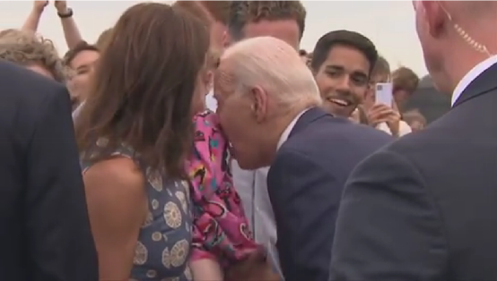
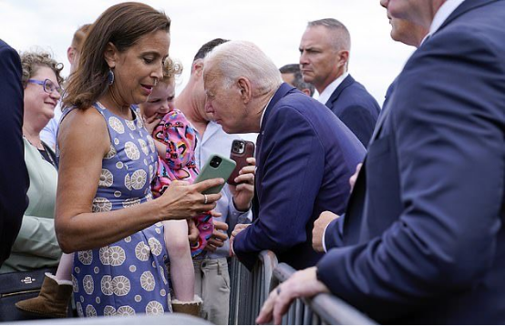
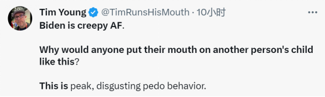

# 美媒曝现场：拜登和小女孩互动张嘴作出轻咬状，“小女孩显得很害怕”

【环球网报道】拜登芬兰之行，又因一个举动引发争议。据美国福克斯新闻网14日报道，美国总统拜登于当地时间13日离开芬兰首都赫尔辛基时与一个小女孩互动，似乎要轻咬女孩身体并轻吻她，然而后者似乎很抗拒，她扭动身体以躲避拜登的亲吻。

福克斯新闻网称，拜登当天在登上赫尔辛基万塔国际机场的“空军一号”前，向使馆工作人员及其家属致意。现场视频显示，拜登与一个被大人抱在怀里的小女孩互动，他咂巴着嘴靠近女孩肩膀，作出轻咬状。

_拜登与一个小女孩互动时张嘴作出轻咬状
图自福克斯新闻网视频截图_

“小女孩显得很害怕”，福克斯新闻网描述称，后来当拜登试图在她头上轻吻时，女孩直接转过头去，抱着孩子的大人发出笑声。

_拜登与小女孩互动现场画面
图自福克斯新闻网报道配图_

报道称，这段视频很快在社交媒体上流传开，但网友反应不同，其中不少人抨击拜登的奇怪行为。

_“这一定是拜登哄孩子最诡异的时刻了。”_

_美国喜剧演员蒂姆·杨表示，“拜登真令人感到毛骨悚然。为什么会有人对别人的孩子动嘴？这是最令人厌恶的恋童癖行为。”_

_报道说，共和党人格雷格·普莱斯还开玩笑讽刺说，“乔·拜登的痴呆症已经严重到他现在把婴儿和冰淇淋甜筒搞混了”。_

_美国前总统特朗普的儿子小唐纳德·特朗普也在推特上回应这段视频称，“拜登应该待在养老院，而不是领导自由世界。”_

福克斯新闻网称，此次访问期间，拜登多次出现失态，包括混淆俄罗斯和乌克兰及其领导人。拜登12日在立陶宛维尔纽斯举行的北约峰会上发表演讲时口误称，“俄罗斯应该停止攻击俄罗斯”。

