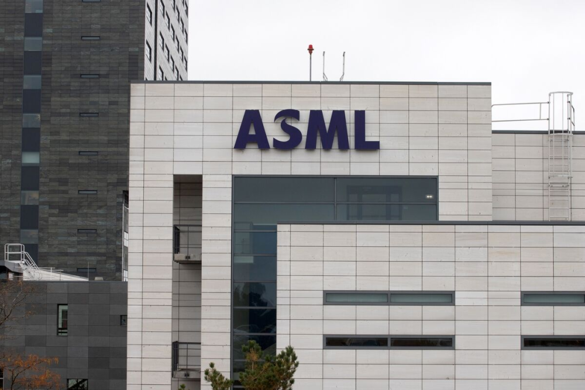

# 美荷拟进一步限制对华合作？美媒爆料：阿斯麦与中方合作面临更严限制

【环球网报道】彭博社14日援引知情人士爆料，随着美中冲突进一步加剧，荷兰光刻机巨头阿斯麦公司（ASML）与中国客户的合作面临更为严格的限制。中方此前已明确表示，美荷相关做法是对出口管制措施的滥用，是对自由贸易和国际经贸规则的严重背离，中方对此坚决反对。

_荷兰光刻机巨头阿斯麦公司（ASML）总部
彭博社报道配图_

报道称，据消息人士透露，荷兰的出口管制规定将禁止阿斯麦在未经政府批准的情况下，为受限设备提供维护、修理服务以及供应备件。要求匿名的知情人士还说，除荷兰政府出台的上述管制措施外，预计美国政府还将禁止阿斯麦在未经华盛顿批准的情况下，向约6家中国工厂出售上一代DUV（深紫外线）设备。

不仅如此，消息人士还透露，拜登政府将援引“外国直接产品规则”对阿斯麦施加新的限制，该“规则”允许美国政府限制外国设备供应商的销售，即使他们的产品中含有少量的美国零部件。其中一位消息人士称，美国还可能禁止阿斯麦为未获许可的六家中国工厂安装的受管制设备提供维护修理服务以及供应备件。

报道提及，消息人士声称，虽然荷兰政府早前曾抵制美国对阿斯麦实施域外控制，但美荷两国政府已就所谓额外出口管制对国家安全的必要性达成共识。消息人士还称，荷兰政府出台的上述新规不会受到荷兰联合政府近期变动的影响。

报道提到，荷兰政府、美国商务部及阿斯麦方面对此均拒绝置评。

今年6月30日，荷兰政府宣布限制某些先进半导体制造设备出口新规。对此，中国驻荷兰大使馆发言人表示，这是对出口管制措施的滥用，是对自由贸易和国际经贸规则的严重背离，中方对此坚决反对。发言人表示，全球半导体产业已形成你中有我、我中有你的产业格局，中国是世界最大的半导体市场，也是全球半导体供应链的重要组成部分。荷兰以所谓“国家安全”为由人为设限毫无道理，完全站不住脚。在科技领域人为制造壁垒，在法律上、道义上没有依据。这种行为不仅损害中国企业的正当合法权益，也会让荷兰企业蒙受损失，损害全球产业链供应链的稳定，还将破坏荷兰支持自由贸易的良好信誉。

信息消费联盟理事长项立刚6月30日在接受《环球时报》记者采访时表示，这些年，中国每年都会进口光刻机，9月1日之前，也仍然有可能继续签订相关合同。在此背景下，荷兰的新措施肯定将对中国的芯片产业发展造成影响，但不至于很严重。首先，中国生产的大量芯片属于成熟制程，不一定需要特别先进的光刻机；其次，即使需要生产先进制程芯片，中国也还有一些先进型号DUV可以使用；最后，最近几年，中国企业在光刻机领域下了大功夫，相信会很快会投入生产。

