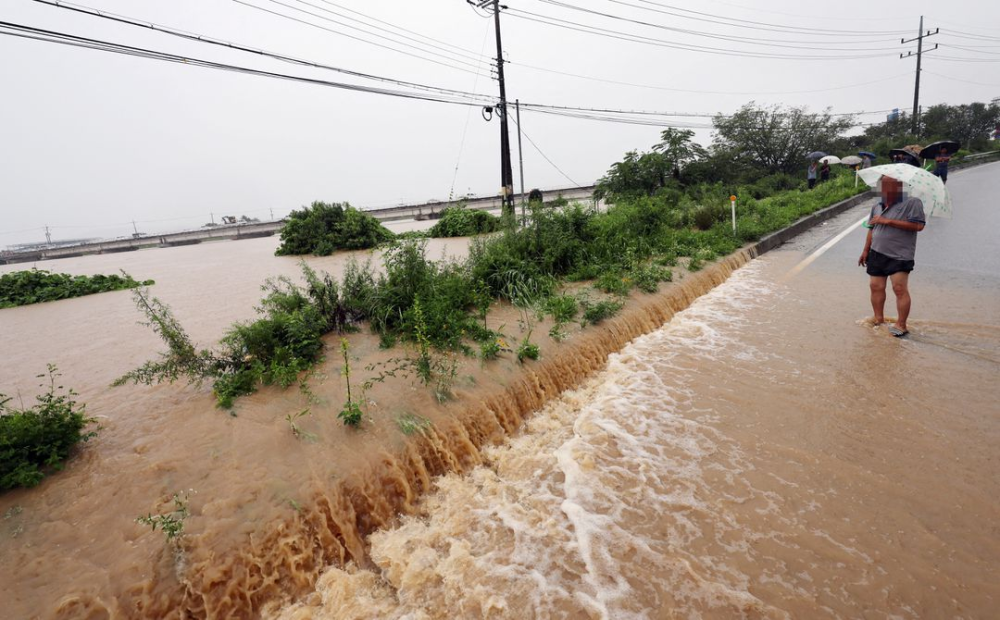
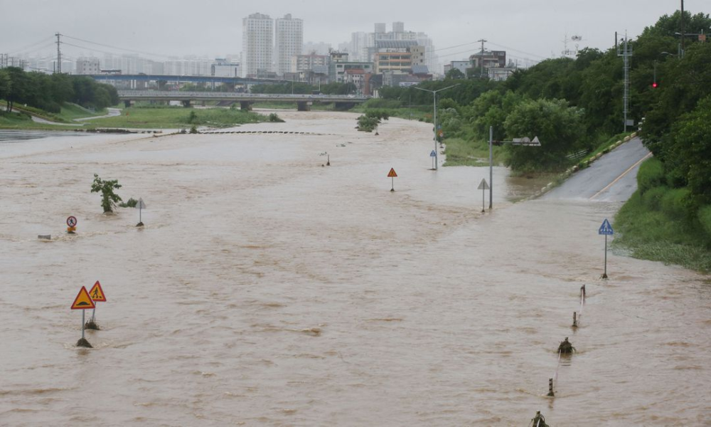
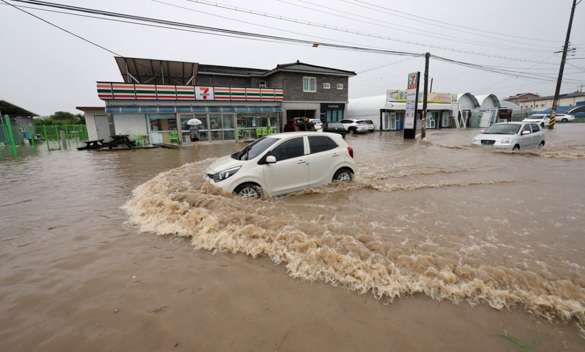
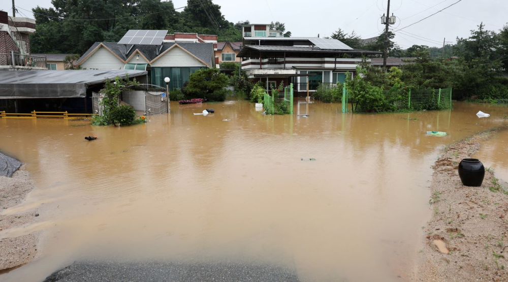

# 韩国暴雨灾情已致24死，韩媒：尹锡悦在乌克兰指示韩总理全力救灾

【环球网报道】韩国总统尹锡悦当地时间15日突访乌克兰。据韩联社报道，正在乌克兰访问的韩国总统尹锡悦15日指示韩国国务总理韩悳洙动员军方、警方等一切可用力量，全力开展防汛抢险救灾工作。

_韩国暴雨，河水泛滥淹没了道路。
路透社报道配图_

_韩国暴雨，河水泛滥淹没了道路。
路透社报道配图_

_韩国暴雨，河水泛滥淹没了道路。
路透社报道配图_

_韩国暴雨，河水泛滥淹没了道路。 路透社报道配图_

报道称，据韩国总统室公报首秘金恩慧当天发布的新闻资料，尹锡悦在乌克兰听取了韩国暴雨灾情和抢险救灾工作的相关报告，并指示韩悳洙全力防汛救灾。

据韩国消防部门通报，截至当地时间15日16时30分，韩国全国因暴雨死亡的人数暂时统计为24人，此外还有10人失踪。

