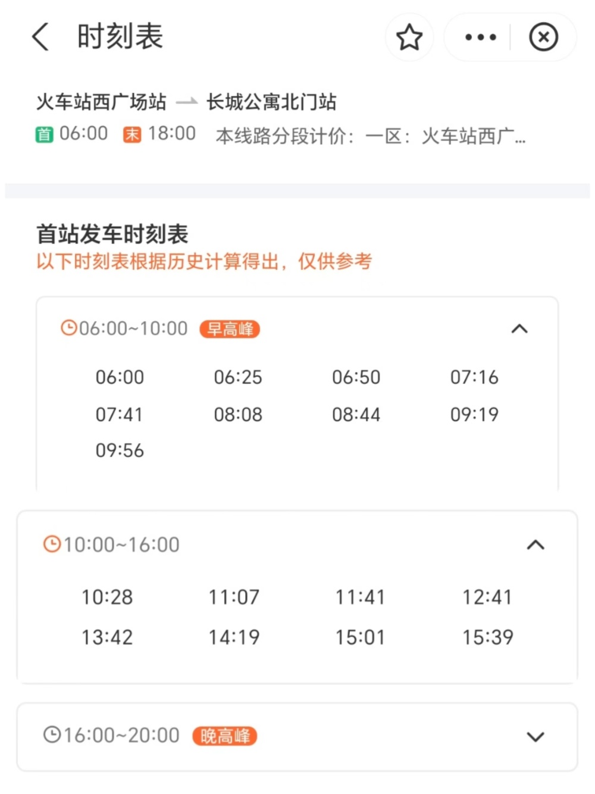
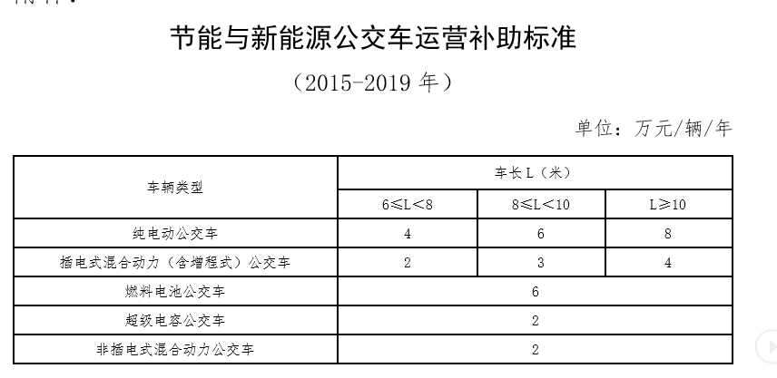
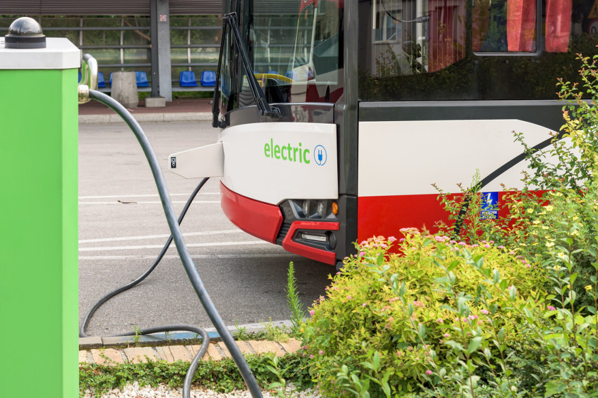
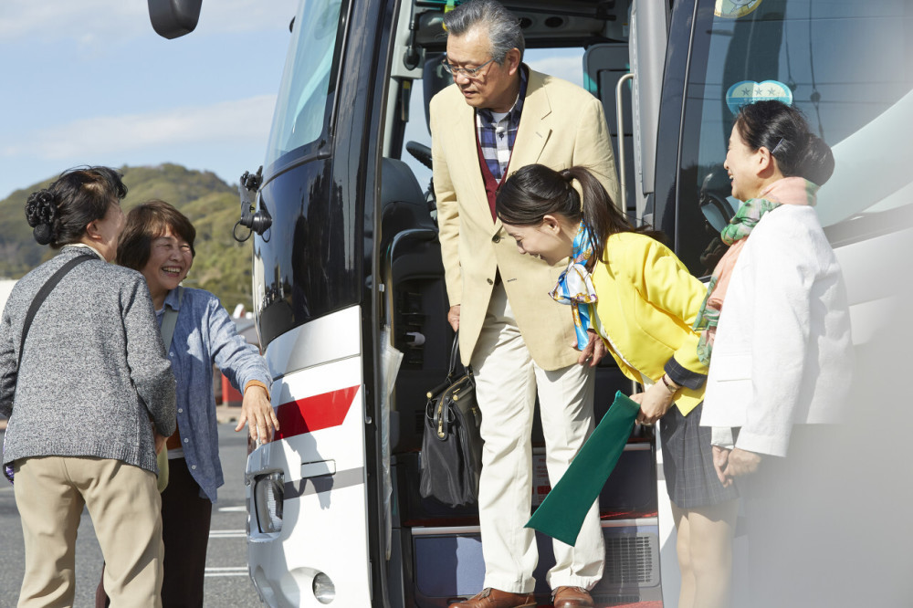
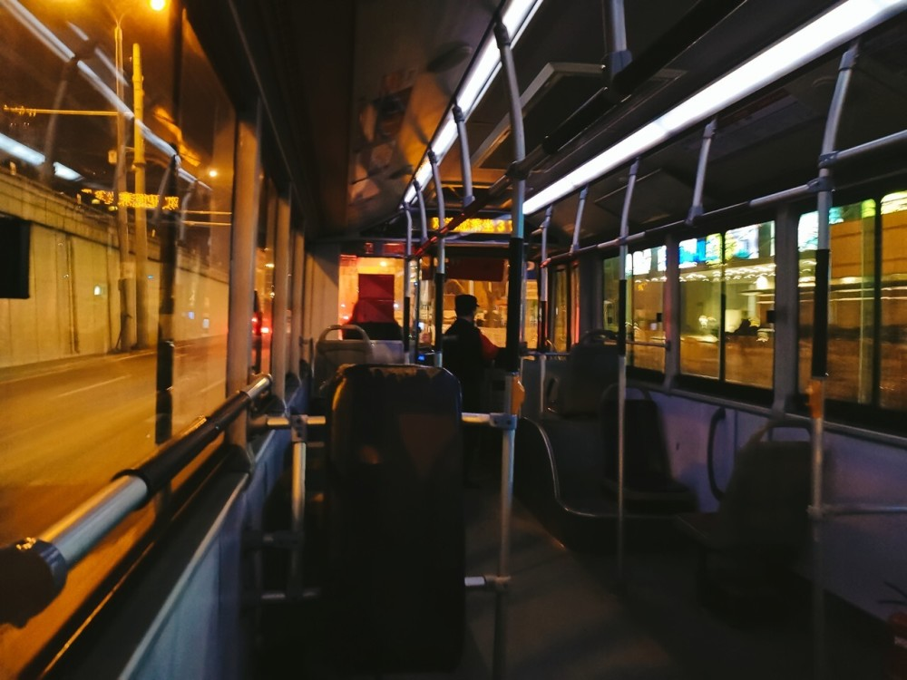

# 一座近千万人口城市的“公交保卫战”

本文来源：时代周报 作者：丁远泓

在一些城市里，公交变得越来越难等。

这些城市不止包括运力不足、线路较少的“18线”城市，也包括一些常住人口近千万的城市，比如——保定。

这座常住人口914.4万人（注：按2022年保定市统计局数据）的城市，近日因为公交车停运的信息引发广泛关注。

保定市公共交通有限公司（下称“保定公交公司”）回应显示，公交公司经营资金异常紧张，同时首批购置的纯电动公交车动力电池已超出质保期限，已不具备安全运营条件，被迫全部退出营运，公交运力安排受到了严重影响。

运力安排所影响的不止是令客流量较少的线路停运，也导致了主要线路的发车时间发生变化。

“现在公交太难等了。”在保定居住的市民陈尘（化名）告诉时代周报记者，2019年那会，一些主要线路6~8分钟左右就能有一班，但现在上下班的高峰时间也要等15分钟，如果堵车的话就更没准了。

时代周报记者通过查询“掌上公交”软件后发现，以68路公交车为例，其起点为火车站西广场站，终点为长城公寓北门站，早晚高峰期间的发车间隔在25分钟左右，非早晚高峰时间，一班车最多需要等上一个小时。

_68路发车时刻表
图源：“掌上公交”软件截屏_

保定公交公司此前回复显示，根据现有运力情况，以向客流集中线路倾斜、向上下班高峰时段倾斜为原则，重新统筹调整线路车辆配置。暂无力恢复包括18路在内的临时停运线路运营。

一边是首批购置的纯电动车必须退出运营，一边是资金紧张无力恢复营运，保定公交接下来有何解决办法？其他千万级别人口城市的公交运营情况，是否能给保定提供“破局”的办法？

**更换新能源公交与补助有关**

保定公交运力减少的直接原因之一，是大批次公交车退出营运。

2022年8月，曾有市民在咨询保定市公交现状时，保定公交公司回复称，首批购置的591台纯电动公交车动力电池已超出质保期限，被迫退出营运，公交运力安排受到了严重影响。

_保定网友的咨询与回复
图源：网站截屏_

时代周报记者查询后发现，
2015年，保定公交与黄海客车签下591辆纯电动公交订单，包括391辆10米车型DD6109EV1，和200辆8.5米车型DD6851EV1。这与保定公交公司的回复数量相符。

根据《中国客车信息网》于2015年发布的信息显示，此次购置的591辆纯电动公交占到保定公交数量的一半以上。

保定从2015年开始力推新能源公交车，与补助政策变化有关。

2015年发布的《完善城市公交车成品油价格补助政策加快新能源汽车推广应用的通知》显示，河北等大气污染治理重点区域和重点省市，2015—2019年新增及更换的公交车中新能源公交车比重应分别达到40％、50％、60％、70％和80％。

而2015—2019年期间，中央财政对达到新能源公交车推广目标的省份，对纳入工业和信息化部“新能源汽车推广应用工程推荐车型目录”、年运营里程不低于3万公里（含3万公里）的新能源公交车以及非插电式混合动力公交车，按照其实际推广数量给予运营补助。

_运营补助标准
图源：官网截屏_

与此同时，2015—2019年现行城市公交车成品油价格补助中的涨价补助，以2013年实际执行数作为基数逐步递减。

其中，2015年减少15%，2016年减少30%，2017年减少40%，2018年减少50%，2019年减少60%。涨价补助数额与新能源公交车推广数量挂钩。

简而言之，符合条件的新能源公交车补贴可以达到2—8万元/辆/年，而对于公交车成品油价补助中的涨价补助则是逐年递减。

河北大学经济学院副教授刘永亮在接受时代周报记者采访时表示，保定会引入大批量的新能源公交车，是因为公交车运行属于非盈利活动，需要依靠政府补助。从国家层面出台这些政策，推行新能源公交车与追求生态文明现代化是一致的。

河北省的目标是，每年递增10%的新能源公交比重。保定市也在2015年出台《关于加快新能源汽车推广应用的实施意见》，确定年内实现超过2200辆的节能与新能源汽车示范运行规模，其中市县两级公交车达到1000辆。

到了2017年，保定市老市区内959辆公交车已全部升级为新能源车辆。

“公交越来越少”

随着时间推移，保定的新能源公交车陆续进入淘汰、更换阶段。

若是使用成品油，公交车的运营时间至少超过10年——按照《机动车强制报废标准规定》规定，“公交客运汽车使用13年报废”。

保定的首批纯电动公交车，实际运营时间只有约7年：从2015年购入，至2022年退出营运。

相较于重新购入一批新的纯电动公交车，更换旧车的电池是性价比较高的办法，但成本不算低。

保定公交未有透露更换电池的成本。但湖南郴州市曾在2022年10月公布纯电动公交车辆采购及旧车电池更换项目招标公告，旧车更换电池的招标控制价为每辆18万元。

_郴州市招标内容
图源：官网截屏_

若以这个价格参考计算，想要更换这591辆汽车的电池，大概需要1.06亿元。

这对于目前资金紧张的保定公交公司来说，显然是一个“重担”。

2022年11月，保定公交曾发文称，受疫情反复影响，市公交公司经营举步维艰。为了缓解企业经营压力，公司于11月15日起对7路、26路、36路、38路、53路、105路、108路、207路等8条线路采取临时停运措施。

新华社近期报道提及，保定市公交公司一位工作人员表示：“公交车从原来的1300多辆减到333辆，有800多辆车的电池的确是不好了，一年半以前就这样了。”

因为资金紧张，运力减少至约1/4后，2022年陆续恢复运行的线路也需要酌情考虑。

时代周报记者向保定公交公司的工作人员咨询时，接线工作人员表示，2022年公交线路陆续恢复，但恢复的同时也需要尽可能优化线路，调整需求少的线路，尽可能满足需求客流更多的线路与上下班高峰期的需求。

运力减退后，公交无法带来足够的便利，乘坐公交的乘客减少，公交公司的营业收入也会随之减少。

如此循环，停运的公交线路恢复无望，已有的公交线路也逐步减少。

2023年5月，保定市人民政府在回复网友的留言时提及，自2022年5月2日起，公交公司重新调整公交运力安排，运营公交线路由原来的72条缩减为46条。

从小居住在保定市莲池区的黎年（化名）对时代周报记者表示，2022年重新通车后，有些之前会路过家门口的线路看不见了，依旧通行的公交车数量也变少。“如果不小心错过车次，就需要等至少十几分钟，没事的时候还好，如果有急事就只能换其他方式出行了。”

年轻人还能通过软件确保自己出行不用花费太多的时间去等车，但多数中老年人都不太会使用这些软件，有些线路经常一等就要等20分钟以上。

“很多人直接选择买电动车，但电动车需要上牌照和戴头盔，开汽车上下班又避免不了堵车的情况，出行成本更贵，而且对于需要出行的老年人来说，公交依旧是最好的选项。”陈尘说道。

**政府补助下滑**

公交作为便利民生的公用事业，政府补助一般是公司收入的主要来源之一。

2015年—2019年，保定公交收到的运营补助不算低。

河北省公布的《2019年度节能与新能源公交车运营补助资金分配表》显示，共发放的10.7亿元补助资金中，保定市以纯电动公交车得到了1.35亿元。

_正在充电的巴士 图源：图虫创意_

但2019年财政部等四部委联合下发的《关于支持新能源公交车推广应用的通知》中明确表明，在普遍取消地方购置补贴的情况下，地方可继续对购置新能源公交车给予补贴支持。从2020年开始，采取“以奖代补”方式重点支持新能源公交车运营。

2022年，财政部对关于延续新能源公交车运营补助政策的建议答复（下称“《答复》”）为，城市公交属于地方财政事权，宜由地方承担支出责任。

不过，保定市本身的财务压力不小。

根据保定市的2022年财政收支情况，全市2022年总收入为930亿元，总支出也为930亿元，全市债务余额为1376.03亿元。

在今年的预决算报告，保定明确指出，“长期积累的结构性矛盾和深层次问题依然突出，县级财源匮乏，收入结构不优，刚性支出压力巨大、债务风险进一步加剧，再加上中央留抵退税补助等一次性转移支付没有了，基层财力状况将会更加困难，同时民生政策提标扩面以及支持协同发展、绿色转型、产业升级、创新驱动、乡村振兴等必保事项明显增多，保民生、稳运行、促发展增支压力很大，财政收支矛盾空前尖锐。”

刘永亮指出，政府财政困难，代表能分给公共产品的资金不多，这也是保定公交公司资金紧张的原因之一。

保定公交公司曾在2022年7月15日公布一份财务状况表，填表日期为2022年7月12日的利润表显示，本年累计金额中，保定市政府补助为700万元，营业收入为2981.4万元，营业成本为1.09亿元，利润总额为-6694.53万元。

_图源：保定公交公司官网_

据央广网报道，保定市公交公司一位工作人员称：“因为公交公司本身也不属于盈利单位，我们的确是想靠市里给的财政补贴，但是补贴迟迟没有到位。原来每年的钱相对来说还是比较充裕的，那会运作得比较良好。”

_乘客正在上下巴士
图源：图虫创意_

**政府需要支持公用事业**

近年来，公交公司“停运”的现象并不少见。

今年年初，商丘公交发布通告拟暂停市区公交线路，这家保障超700万常住人口出行的公交公司表示，受疫情冲击、国家新能源补贴政策调整、财政补贴不到位等多种因素叠加影响，公司经营异常困难。引起舆论关注后，该公司随后发布通告称：公司将克服困难，确保公交不停运。

不止是保定、商丘这些常住人口超500万的城市。

今年，黑龙江省漠河市公交公司发通告暂停运营，发布不到半天，宣布通告取消，公交将继续运营；辽宁葫芦岛市建昌县市民反映，当地公交车从2022年年底开始，停运近两个月，后政府部门与公交公司沟通，停运问题得到初步解决；2022年8月，湖南耒阳8家公交企业联合声明，因为经营困难导致发不出司机工资，计划停运耒阳公交，后经政府部门协调，避免了停运发生……

目前来看，公共交通运营亏损是普遍现象，需要依赖于政府的财政补贴。

刘永亮指出，无论是保定市公交还是其他资金紧张的城市公交集团，想要走出“困局”，可以考虑从两点出发，一是去其他运营情况较好的城市公交进行调研，通过借鉴别人的经验解决自己的问题，确保公交公司目前的线路、人员布局等处于合理状态；二是如果公交公司自身的经营体系没有问题，政府必须投入资金保证公用事业的正常运行。

_公交车内景
图源：图虫创意_

《答复》也指出，关于城市公交出现经营亏损等困难的情况，各地应根据当地实际，调整优化公交运行线路，提高公交车满载率，提升公交企业的经营效益；同时考虑社会承受能力、公交企业运营成本和地方财政状况等因素，合理确定公交车票价体系，保障城市公交合理收益。

除了依靠政府补贴，公交公司自身也可以通过参考运行较好的城市公交，增加盈利。

以常住人口同样是“千万”级别的杭州为例，负责公交运营的杭州市公共交通集团有限公司在2022年12月底，拥有总资产178.84亿元，并已成为一家以客运服务为主，兼营汽车出租、汽车修理、旅游客运、燃料销售、广告制作发布、房产开发经营、公共自行车建设服务等为一体的综合型企业。

保定的“公交保卫战”还未落定且尚未有更新的表态，不过，保定市交通运输局运输处对时代周报记者表示，如果有官方回应应该很快就能发布。

“以前，我会看到很多郊区的老人上午坐公交来市里买东西，坐公交又便宜又方便，沿途还能看风景。其实大家还是很希望保定公交可以尽快恢复。” 黎年说道。

