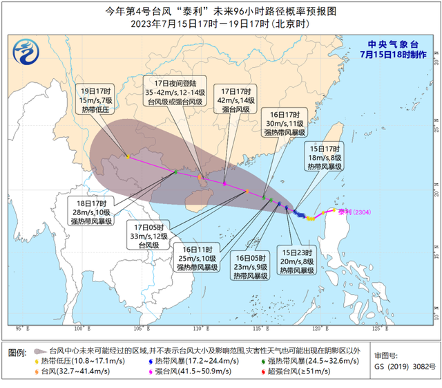

# 台风“泰利”为何姗姗来迟？华南高温何时能缓解？一文解读

中央气象台7月15日10时发布台风蓝色预警，中国气象局11时启动台风四级应急响应。南海热带低压已于15日上午加强为今年第4号台风“泰利”，根据中央气象台最新预报，台风“泰利”未来还将迅速增强，预计将于17日夜间在海南岛东部到广东西部一带沿海登陆，或将成为今年首个登陆我国的台风。

“迟到”许久的台风“泰利”，会是在偷偷蓄力准备“放大招”吗？近几年是否真的有“初台”偏晚的倾向？台风对我国整体影响有何变化趋势？围绕“初台”及相关问题，中国气象局台风与海洋气象预报中心高级工程师聂高臻对此进行详细解读。

**台风“泰利”来晚了多久？**

根据中央气象台预报，今年第4号台风“泰利”预计于7月17日夜间在海南岛东部到广东西部一带沿海登陆，这个登陆时间，与1991年至2020年平均“初台”登陆日期6月27日相比，偏晚20多天。

在明确台风迟到的事实上，再来看一下台风“泰利”的偏晚程度：把1991年至2020年以来首个登陆我国台风日期排个座次，分成四个时间段，台风“泰利”处于最后的25%里。这也可以看作，在75%的年份中，“初台”时间都比今年早。台风“泰利”偏晚是有一定显著性的。

**近几年台风是否倾向于越来越晚登陆？**

简单从过去三年及今年“初台”预计登陆的时间来看，2023年第4号台风“泰利”预计登陆日期是7月17日夜间，2022年台风“暹芭”登陆日期是7月2日，2021年台风“小熊”登陆日期是6月12日，2020年台风“鹦鹉”登陆日期是6月14日。直观感受是，与1991年至2020年平均“初台”登陆日期6月27日相比，2023年、2022年确实偏晚，但2021年、2020年则明显偏早。

实际上，如果把上述连续两年的“迟到”记录，放到更长的时间序列中，更是无法得出明显的简单规律。现在下某个结论，还为时尚早。

**从台风季对我国整体影响来看，近几年有无明显变化？**

分析近几年登陆或影响我国台风的破坏力，会发现这样一个事实，如果当年有一个强度特别强的台风，那么它产生的影响很可能会占到当年台风季整体影响的一半以上。

一般来说，特别强的台风会带来很强的降水，伴随而来就可能引发地质灾害。或者风特别大，给沿途城市带来的损失也会很大。

从这一角度来看，公众觉得近几年台风季整体影响似乎在发生变化，可能部分源于当年没有强度特别强的台风出现。另一方面，及时准确的预报、积极有利的防灾应对，加上台风带来的大风和强降水没有出现在易致灾区域都是重要的原因。

但台风带来的影响是一把双刃剑，许多强度并不很强的台风，也在默默做着一些“好事”，比如“洒水车”“空调”的亲切称呼，就是对它们缓解旱情、消暑降温功能的期待和点赞。

**今年台风生成和登陆情况如何？**

在台风“泰利”生成前，西太平洋共生成3个台风，而多年平均数量是5.2个，加上第4号台风，生成数量整体偏少1个。如果台风“泰利”最终登陆我国，截至其预计登陆日期，登陆我国的台风多年平均数量是1.5个，今年偏少0.5个。

整体来看，“进度条”偏慢，但不是很显著。

**台风“泰利”生成的成因是什么？**

首先，时间足够长，从今年第3号台风生成到现在，西北太平洋已有一个多月的台风“空窗期”，从气候角度来看，能量已经积攒到位。

其次，副热带高压北抬，给台风活动留出发展空间。上周，副热带高压还非常强大，并且覆盖了台风生成的中低纬度洋面，在强大的副热带高压压制之下，西北太平洋台风活动一直受到压制。但这两天形势发生了变化，随着副热带高压北抬，为台风带来了生长空间。只要抑制台风发展的外部条件消除，热带扰动就可能发展为热带低压。

**台风“泰利”是否能为华南高温带来缓解？**

根据中央气象台预报，台风“泰利”将以每小时10至15公里的速度向西偏北方向移动，于17日夜间在海南岛东部到广东西部一带沿海登陆，预计登陆时强度为台风级或强台风级（35~42米/秒，12~14级）。

预计16日至19日，受台风及外围环流影响，广东南部、海南岛、广西南部等地累计降雨量在100毫米以上，局地可达250至450毫米。最强降雨时段在17日至18日。降雨期间伴有雷电、短时强降雨和局地雷暴大风等强对流天气。从16日开始，南方的高温在台风的影响下将明显减弱。

虽然，台风“泰利”能带来清凉，但由于其登陆时强度强，致灾风险较高，建议广东、海南、广西提前做好各项台风防御准备工作，加强防范大风灾害和城乡积涝、山洪、地质灾害，做好早稻的抢收抢晒。正值暑假旅游高峰期，建议华南沿海地区涉岛、涉海等旅游项目做好安全管理。南海相关海域航行船舶注意提前避开台风影响区域，海上作业人员及时撤离。

**台风“泰利”是否会近岸快速增强？**

今年第4号台风“泰利”进入南海之后，内外部几个条件，都有助于其强度的发展。

一是温暖的海温。相比西太平洋，南海海水较浅，海温相对较高，约在30至31℃左右，有利于台风“泰利”增强。二是风切变不是特别大，比较适宜。三是随着台风向陆地靠近，高空辐散条件也会变好。四是台风“泰利”属于小型台风，与大型台风相比，小个头的强度反而更容易快速增强。目前，从台风的形态来看，台风中心呈扁长的条状，周围对流比较松散。

未来，如果台风中心能够收缩变圆，对流更加密实对称，台风强度也会大大加强。

来源：央视新闻、中国气象局

