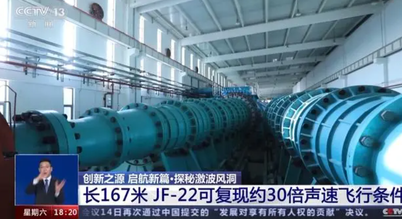
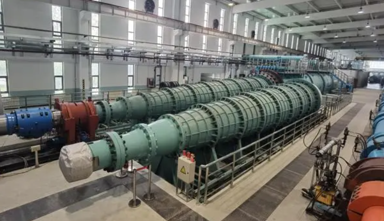
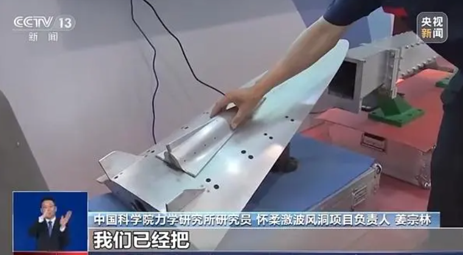
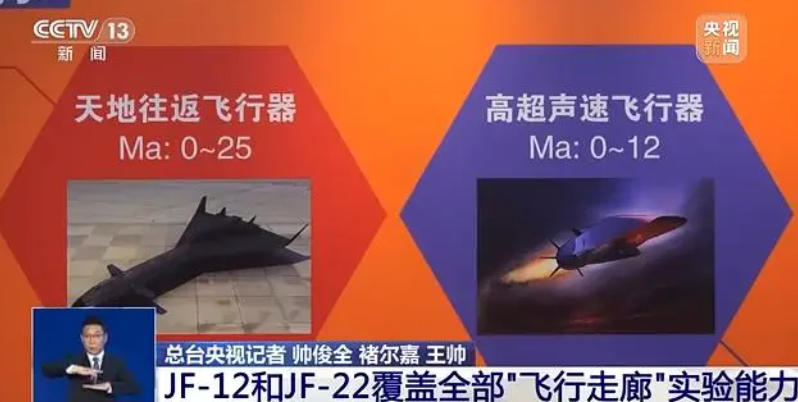
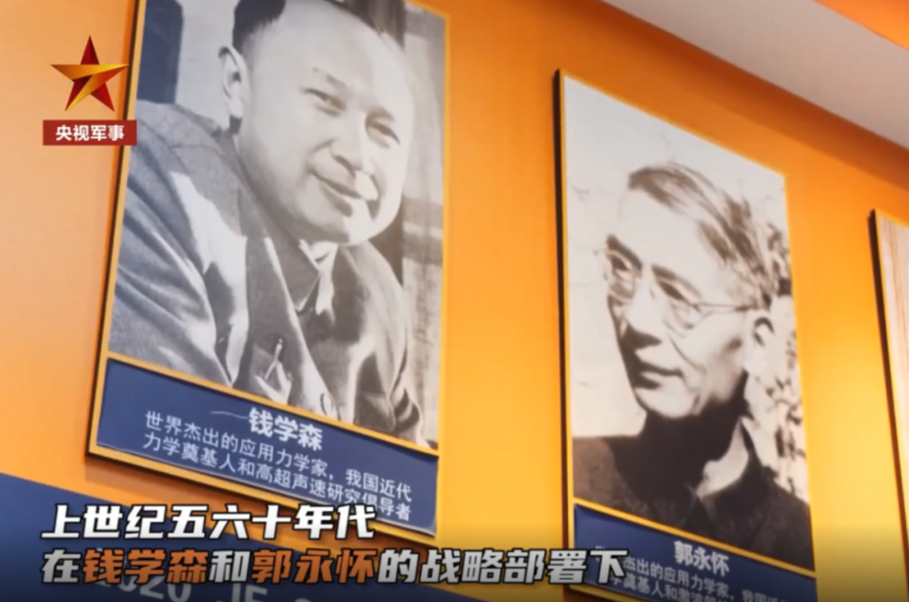
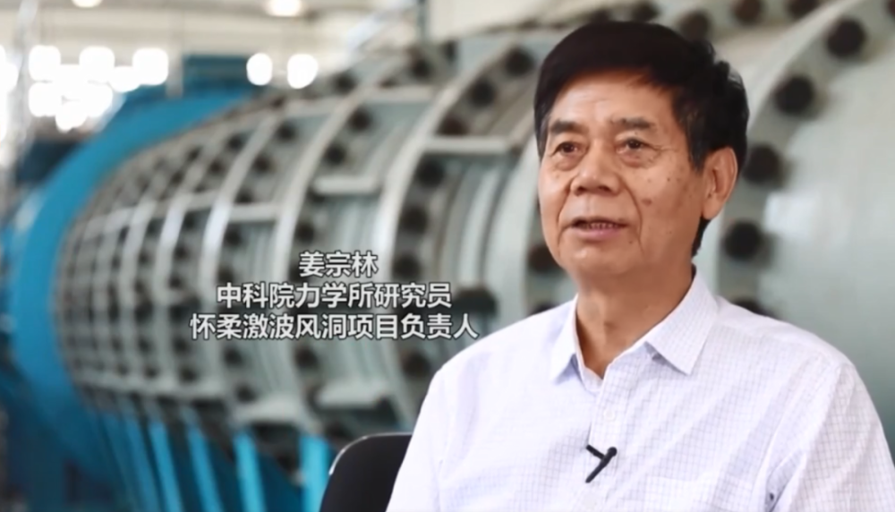

# 官宣！钱学森、郭永怀几十年前的“战略部署”成果落地：国际最先进

**撰文 | 李岩**

昨晚（15日），央视播发视频披露“国之重器——JF-22超高速风洞通过验收”。

政知君注意到，针对目前这款 **“世界上最为先进”** 的超高速风洞，央视此次的解读内容看点颇多。

**“30倍声速”**

何为风洞，又缘何意义重大？

军事评论员宋忠平向政知君介绍，各类飞行器在研发过程中，需要进行大量模拟飞行实验，风洞应运而生。利用风洞产生的高速气流，可以模拟飞行器的飞行环境，这样可以在先期研究飞行器在高速运动过程中的受力情况，避免反复进行工程试验，省时省力。“常有人这样比喻，先进的飞机等飞行器都是在先进的风洞里‘吹’出来的。”

央视披露， **JF-22超高速风洞可以复现相当于约30倍声速的飞行条件。**
风洞吹出来的流场大，持续时间长，比同类风洞先进水平要有成倍地提高，实验的精度也更高。

宋忠平解释称，普通的飞行器和普通的风洞并不鲜见，其技术也相对比较成熟。但新一代的高速飞行器速度上升至数倍、数十倍声速，其具备的空气力学特性发生很大改变，是此前技术探索未曾触及的前沿领域。也正因此，超高速风洞的研发成功，给我国在这一前沿领域的技术探索、验证提供了平台和可能。

**“天地往返飞行”**

据央视介绍，JF-22超高速风洞的研发目标是针对 **天地往返飞行技术领域**
的国家重大需求和高温气体动力学学科的前沿探索，解决超高速飞行技术的试验研究问题。

此外，科研团队还将利用这一激波风洞实验平台，展开滑翔式飞行器、天地往返飞行器、多级入轨飞行器等研究，支撑和服务国家高超声速科技领域重大需求和关键技术攻关。

央视还披露，中国科学院力学研究所有关团队最近正利用该风洞研究两级或者多级入轨的飞行器，“我们正在准备这样一个相应的分离方案的实验，主要就是来探索下面级跟上面级产生一个分离的过程。”

对此，宋忠平解释，天地往返飞行的意思就是从地面至太空的往返飞行。以空天飞机来举例，其可以利用载具从地面起飞，高空中再以接力推进方式进入太空预定轨道。载具和空天飞机完成任务后，还能降落回收。

他提到，这个过程中的技术难点很多，例如载具和空天飞机在超高速时的分离，接力推进时的动力衔接、受力情况等等。研究清楚这个过程，超高速风洞是必不可少的试验环境。“天地往返飞行不但给航空航天提供了更多的应用场景，同时可以大幅降低发射的成本。”

**“爆轰发动机”**

央视提到，利用超高速风洞，中国科学院力学研究所有关团队提出一种新型发动机试验。政知君注意到，这种被叫做 **驻定斜爆轰发动机** 出现在了央视画面中。

据介绍，新型发动机比传统发动机热效率要高50%。“这样一个发动机做完后，对我国下一步航空航天技术发展是一个非常大的推动。”相关研究人员表示。

宋忠平介绍称，传统发动机的工作原理是依靠氧化剂、燃烧剂在燃烧室燃烧产生推力，而爆轰发动机是让不同燃料混合产生爆炸来作为推力。“这样的推进技术成熟后，将极大拓展超高速飞行器的种类和用途，助力我国航空航天技术的变革。”

**覆盖全部“飞行走廊”**

央视总结称，此次完成验收、正式运行的JF-22超高速风洞是目前国际上最先进的超高速风洞。

JF-12复现风洞和JF-22超高速风洞可分别实现每秒1.5-3km和每秒3-10km的实验条件，两者共同构成覆盖马赫数5-25、飞行高度25-90km的气动实验平台，使我国成为高超声速领域唯一具备覆盖全部“飞行走廊”实验能力的国家。

宋忠平解读称，所谓“飞行走廊”是指飞行器进入高超声速领域后，有可能会进入的不同速度、高度、温度、压力的飞行环境。依靠JF-12、JF-22风洞，我国具备了“不断档”式模拟高超声速飞行环境的试验条件，这给我国研发不同种类、用途的高超声速飞行器提供了坚实的基础。

他还强调，将JF-22称为“国之重器”，是因为它不但对提升我国航空航天技术大有助力，同时也可以应用在国防安全领域。

**“另辟蹊径”**

政知君注意到，2021年8月，央视军事频道也曾介绍过当时在建的JF-22风洞。

据介绍，上世纪五六十年代， **在钱学森、郭永怀的战略部署下**
，中科院力学所组建起我国首个高超声速激波风洞科研攻关团队，团队放弃当时国际通行技术，通过几十年的技术攻关，另辟蹊径实现 **爆轰驱动理论创新** 。

上世纪九十年代末，姜宗林（激波风洞项目负责人）带领团队开启大型爆轰驱动激波风洞攻关。

2012年，JF-12风洞研制成功。如今，JF-22风洞通过验收并开始运行。

**资料｜央视新闻频道、军事频道**

**【版权声明】本文著作权归政知新媒体独家所有，未经授权，不得转载。**

