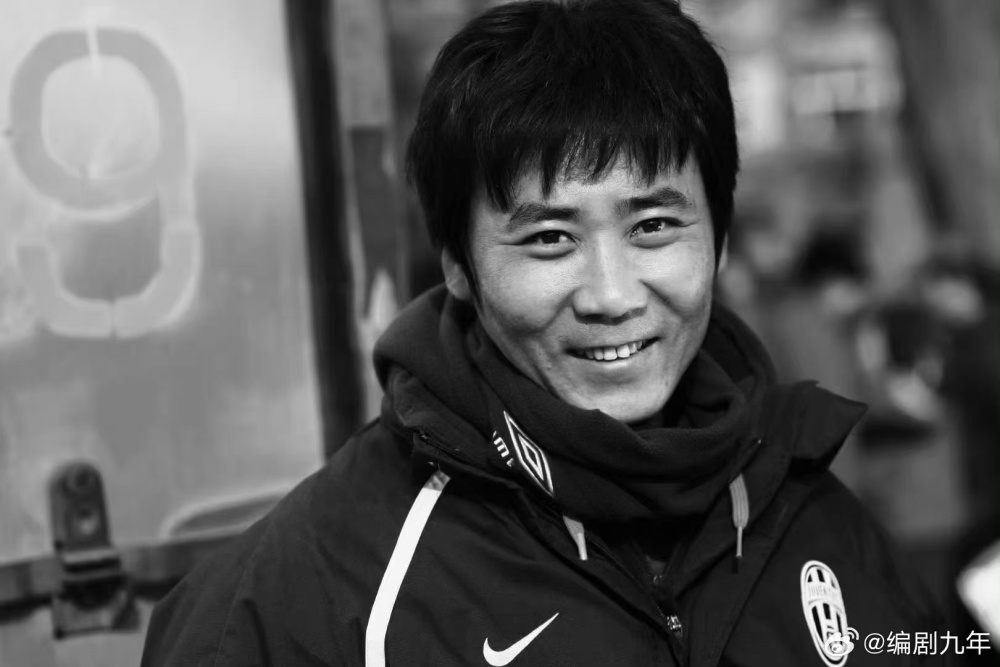
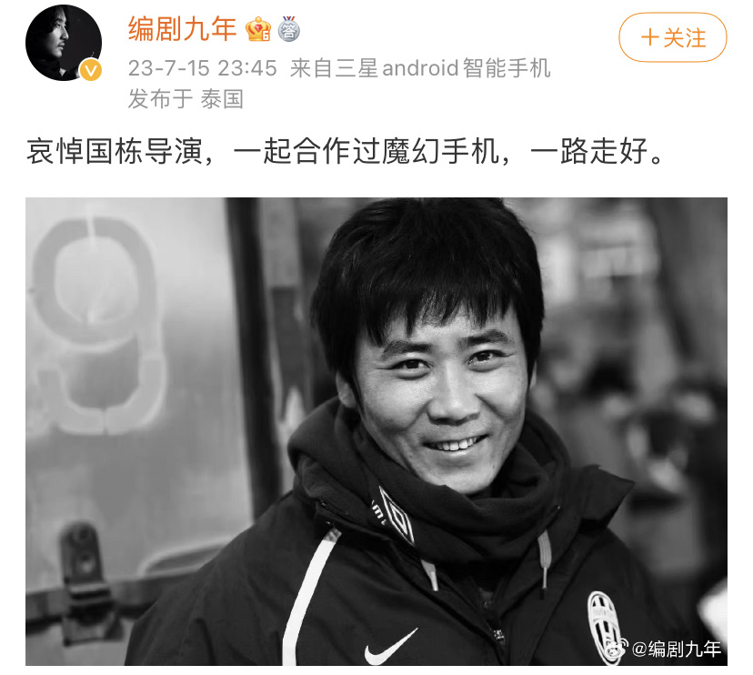
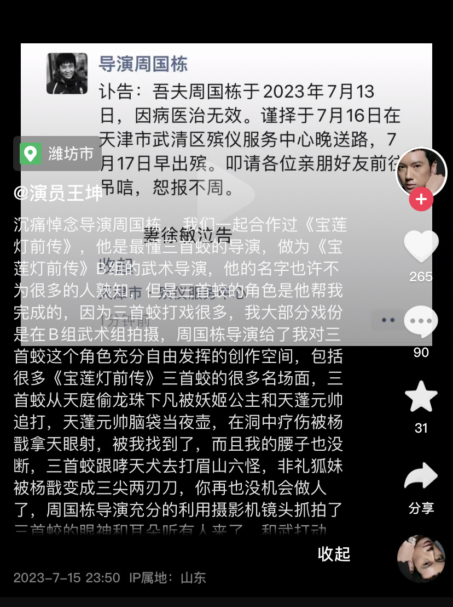

# 导演周国栋因病去世，曾执导《魔幻手机》、《宝莲灯前传》等剧

7月15日晚，《魔幻手机》编剧九年发文悼念周国栋导演：“哀悼国栋导演，一起合作过《魔幻手机》，一路走好。 ”

他还在评论区感叹：“还有《宝莲灯前传》，很年轻，很可惜，周导走好。”

周国栋的妻子也在朋友圈发布了讣告：吾夫周国栋于2023年7月13日，因病医治无效。据媒体报道，周国栋终年50岁。

和周国栋导演合作过《魔幻手机》的演员李滨发文悼念：“泣别好哥哥，知道这个消息一时不能接受，那么优秀的人，哎，我真的不能接受！”据悉，李滨在该剧中饰演男主陆小千。

演员王坤也在社交平台发文悼念周国栋导演，他表示在《宝莲灯前传》中三首蛟这个角色能塑造这么好，离不开导演的帮助。

此外，周国栋还执导了《夏家三千金》等多部电视剧。

得知周国栋导演去世的消息后，网友在评论区悼念：“一路走好”“还没等到《魔幻手机3》，您就走了”。

编辑 苏静

