# 收到陌生快递，免费送刮刮乐和手机支架？北京警方：警惕新型诈骗

还记得今年3月，橙柿互动曾报道过 **多位网友收到陌生快递** ，盒子平平无奇，有的里面是一个杯子，有的是毛巾，有的是餐具，有的是美甲工具，
**但这些商品有一个共同点是——都带一个二维码。**

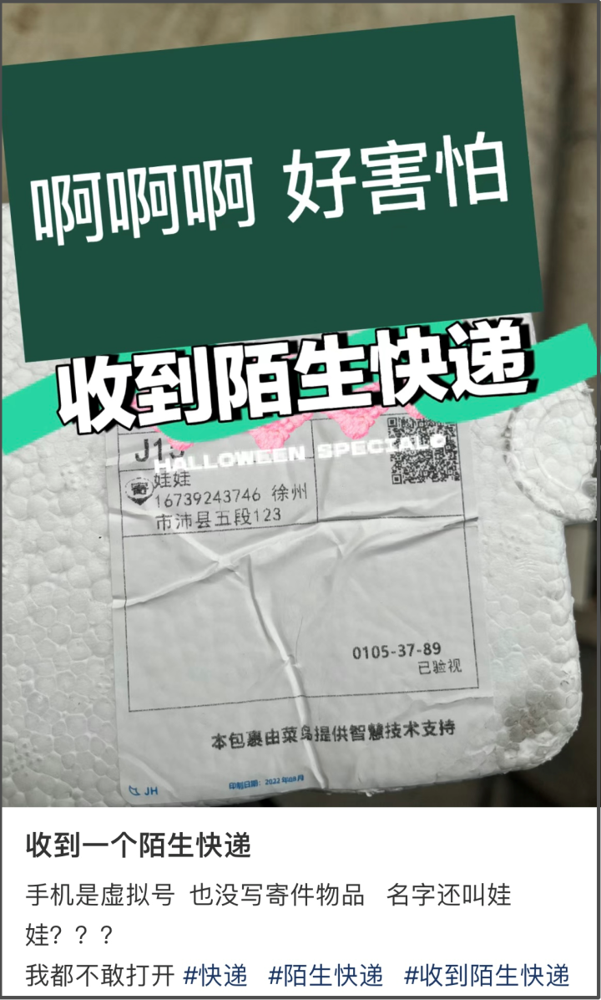

有橙友发帖，称自己莫名其妙收到一个快递， **是一个调料罐，上面也印着二维码。**

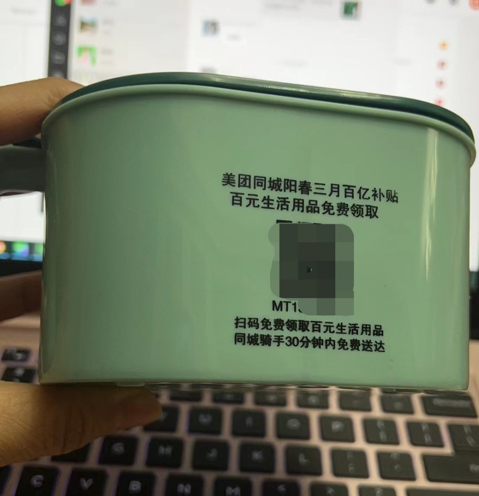

当时，警方提醒：这是一个非常有迷惑性的新型诈骗，扔掉这些东西前，记得把二维码涂抹掉！

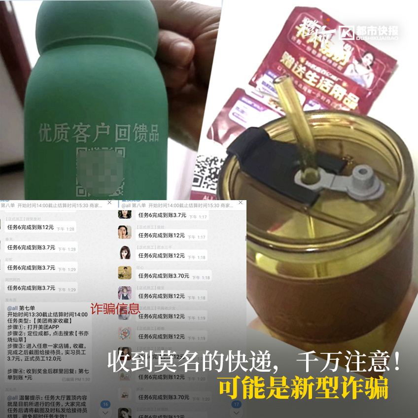

近日， **“平安北京”提醒：警惕免费手机支架的新型骗局！**

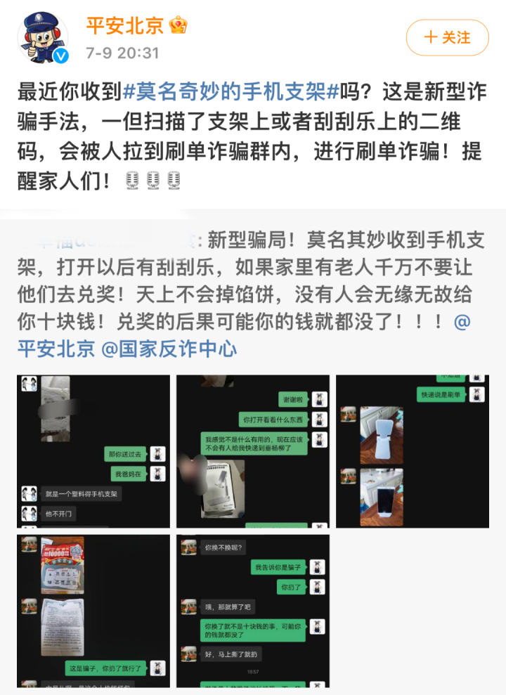

最近，又有网友称收到了莫名其妙的快递， **里面竟然是一张刮刮乐和一个手机支架，刮刮乐上有兑奖二维码。**

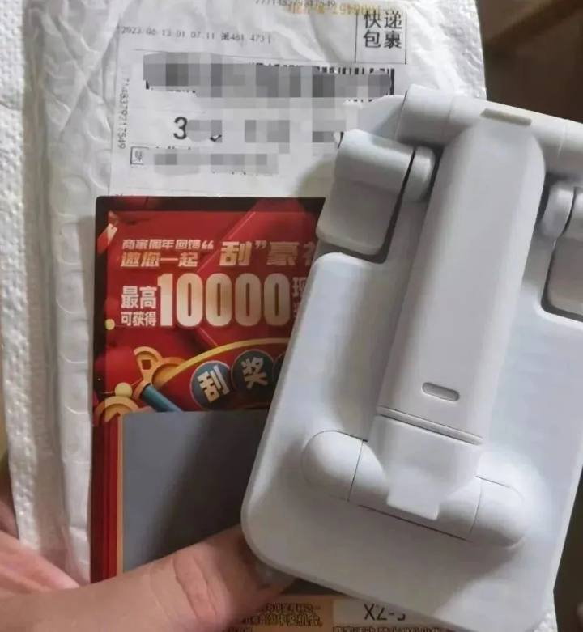

刮开一看，竟然“中奖”了！

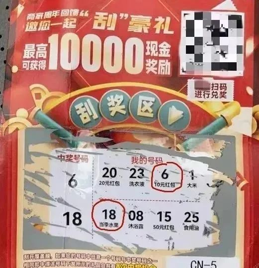

这位网友收到了一个莫名其妙的快递，帮忙拆快递的网友老爸发出了灵魂拷问：“不是你买的，怎么寄咱们家来了？”

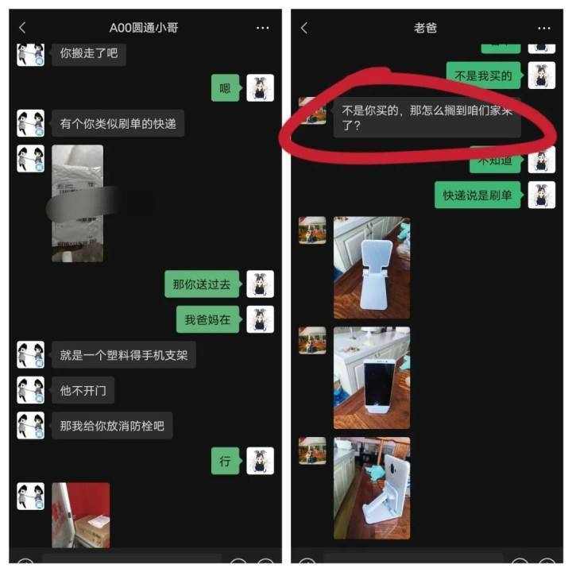

该网友一顿强输出： **“骗子！骗子！骗子！”**

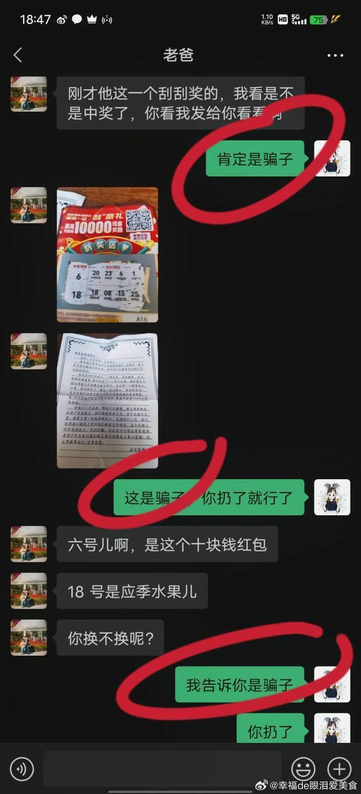

老爸很“听话”，遂即表示马上扔掉。

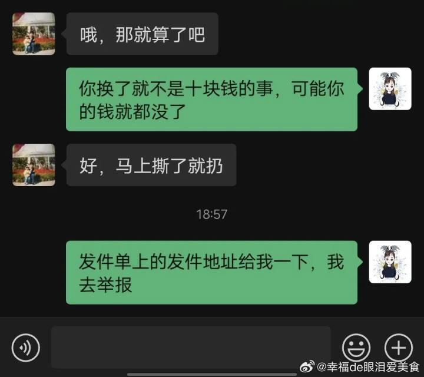

这位网友的防骗意识确实是很强，反手一个举报更是一级棒。

“平安北京”发出提醒后， **评论区又出现了好几位收到同款手机支架的网友。**

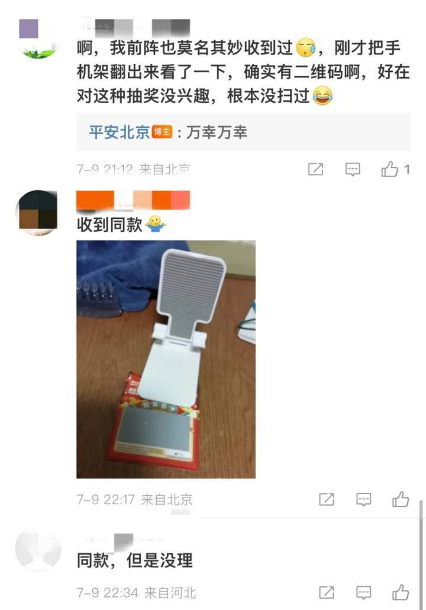

7月13日， **上海闵行公安分局发布紧急预警，有人“刮刮乐”中奖后，扫码兑换了10元红包，被诱导下载了“金盈APP”做任务，最终被骗5万余元。**

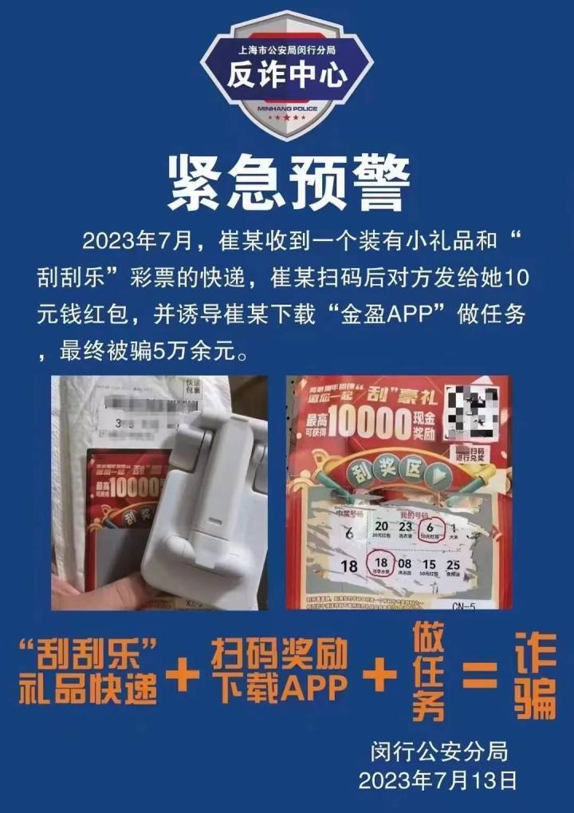

**骗局解析**

大家有没有总结出，这类骗局的相似之处呢？

诈骗分子通过非法渠道获取我们的身份信息，如姓名、手机号、收货地址等，并为其邮寄水杯和二维码。

一个杯子还不够，骗子还会冒充电商平台客服再送你一袋米、一箱水果或洗衣液等用品，让将信将疑的你对他们深信不疑。

**在领取到免费礼品后，你可能会认为这是商家平台客服送来的福利，没有多想就扫描对方提供的二维码，加入骗子所开设的聊天群。**

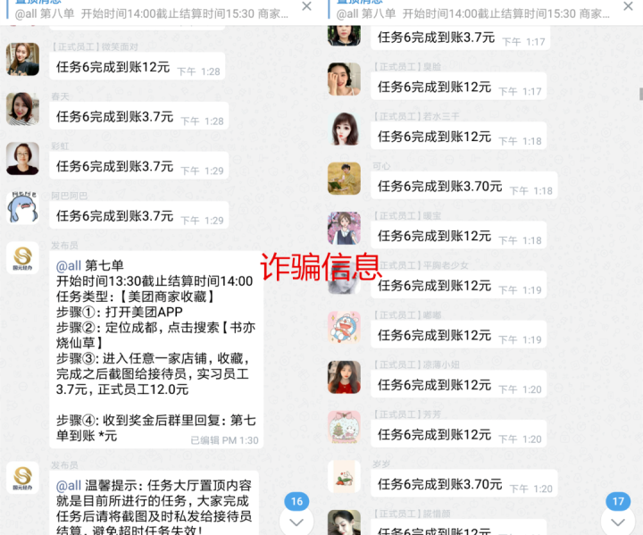

诈骗分子会在群内发放刷单任务，完成即可领取红包，给人带来一些甜头。等你彻底放下防备心后，便引诱你下载软件、充值垫付，完成佣金更高的兼职任务。

**当你不断加大投入后，会发现自己的本金和佣金都无法提出。此时，诈骗分子便会以“系统卡顿”“任务超时”“操作失误”等理由，要求你继续充值垫付。**

事实上， **这都是骗子的话术剧本，你根本没有办法提取出自己的本金和佣金。**

**如果收到这样的快递，千万不要扫上面的二维码！**

1.刷单返利类诈骗，是一种电信网络诈骗。刷单返利类诈骗由于返利周期短、引流成功率高，已逐步演变为当前变种最多、变化最快的诈骗类型，并与其他电信网络诈骗手法相互“融合”，成为电信网络诈骗主要引流方式。

2.先充值转账做任务后返利的就是诈骗，坚决做到陌生人好友不添加、陌生链接不点击、分享的手机软件不下载。

3.若遇到诈骗或无法分辨信息真伪，应立即拨打110报警求助。

4.下载国家反诈中心App，防范电信网络诈骗。

赶紧转发给“相亲相爱一家人”群吧！

