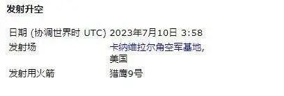
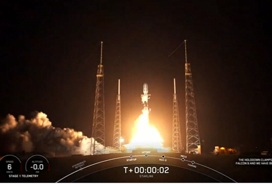
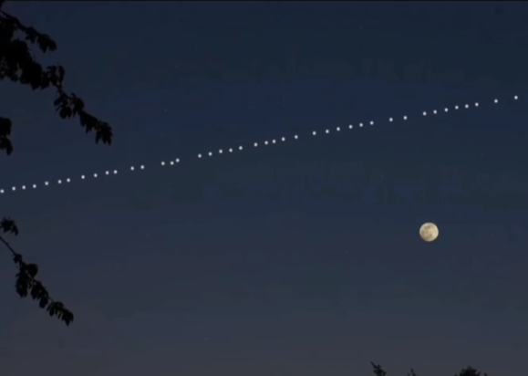

# 杭州上空飞过22颗连成一线的“不明飞行物”？专家确认其与马斯克有关

**7月14日20：40，杭州市淳安县王阜乡郑中村。**

当地人士称：夜空发现不明飞行物，22颗连成一线，从深山一侧天边飞来，缓慢飞入夜空正中央后从前往后逐一消失。

消息传开后，迅速引发公众关注和热议！

**有网友称：这是马斯克星链。**

也有网友质疑称，“是无人机群，在空中可以组成图形，文字等，还可以变化各种颜色，别大惊小怪的，在深圳这种无人机表演太正常不过了。”

“别再说星链了，你是带着哈勃吗，根本看不到呢，距离地球好几万米。除非一颗卫星有一栋八层楼那么高，你才有可能看见。”

**对于无人机的说法，发视频的淳安网友称，“应该不是（无人机），这边深山老林。”**

也有网友科普，“星链就是低轨，视频中的情况是发射上去的星链卫星没有散开的状态，就是一条线。”

**到底是无人机还是星链？橙柿互动请教了天文部门的专家。** 权威人士称，这次网友观测到的现象，天文部门也检测到了，应该属于星链。

这次星链是七月十日发射升空的，随着时间的推移，星链就会整个散开。在散开之前，就是大家目睹到的一条线状态，大概方向就是从西北向东南方向飞。

**据报道：北京时间7月10日11时58分，美国SpaceX公司在卡角使用16手猎鹰9火箭（B1058.16），发射22颗V2
mini星链卫星，打破火箭复用次数纪录。一级助推器成功降落在海上回收船。**

至此，星链卫星发射总数增加到4768颗，其中约4435颗仍在绕地球轨道运行。

**橙柿互动注意到：事实上，这次星链飞过头顶，不少地方的人士都观测到了。**

浙江温州网友称，“我在温州苍南也看到了。”

黄岩江口镇唐家岙的网友称，“晚上有多少人看到了这个星链过境，以前都是用照片的形式拍到看到的，而且是属于比较远的，这次近地轨道直接用手机拍摄到了。果然抬头总能够看到一些意想不到的事物！”

杭州的网友称，“当晚20：30有看到，坐标千岛湖。”

杭州市区的网友称，“以为萧山的ufo呢。站在顶楼看的，感觉离得很近，挺震撼的！”

**那么，什么是星链？**

在距离地球500多千米的地方，有一张巨大的网。2019年5月23日，美国太空探索技术公司利用猎鹰9号运载火箭成功将“星链”首批60颗卫星送入轨道。

它由4000多颗卫星组成，这些卫星相互之间可以通信，也可以与地面通信，于是形成了一个巨大的网络系统，叫做“星链”。美国太空探索技术公司计划在2019年至2024年间在太空搭建由约1.2万颗卫星组成的“星链”网络提供互联网服务，其中1584颗将部署在地球上空550千米处的近地轨道，并从2020年开始工作。

据有关文件显示，该公司还准备再增加3万颗，使卫星总量达到约4.2万颗。 **橙柿互动注意到，这几天，长征二号丙运载火箭发射成功的消息，也引发公众关注！**

北京时间2023年7月9日19时00分，我国在酒泉卫星发射中心使用长征二号丙运载火箭， **成功将卫星互联网技术试验卫星发射升空，**
卫星顺利进入预定轨道，发射任务获得圆满成功。

此次任务是长征系列运载火箭的第478次飞行。信通院立项报告显示：卫星国际移动通信（IMT）未来技术趋势，正式获得通过，这是国际电信联盟无线电局立项的首个6G卫星研究项目，星地融合技术标准化工作取得重大进展。

卫星互联网已经发展出两个星链计划，一个是中国星网，另一个是G60。前者是统筹规划，后者是地方落地的产业集群。专家点评称，卫星互联网已经被列入新基建措施重点支持的项目，从人工智能视角来看，卫星互联网是算力技术设施的核心环节之一。

G60星链落户上海松江，远期规划发射1000颗卫星，单星发射成本预期将下降35%，这意味着卫星产业实现商业化。

**卫星星座的大批量发射，一般都在实验星完成发射后的1-2年内进行，我国低轨卫星星座产业有望迎来爆发增长，卫星互联网全产业链的市场空间或达千亿。**

中国版星链计划已申请1.3万颗卫星，中国开启卫星布局，概念股包括创意信息、中国卫星、盟升电子，华力创通等。

**7月12日，航天科工集团宣布，我国超低轨通遥一体星座计划2023年发射首星，预计2030年扩至300颗卫星，具备15分钟应急响应能力。**

据央视新闻报道，中国航天科工宣布正式启动超低轨通遥一体星座建设，同时具备通信、遥感功能，2030年将完成300颗卫星布局。

中国航天科工空间工程总体部超低轨通遥一体星座总设计师张楠介绍说，“在星座上面，我们同时在布局里面的智能算法，包括星上的AI处理，以及星间和星地直连的通信载荷，能够为用户提供分钟级的即时的遥感信息响应。”

此外，超低轨通遥一体卫星星座主要有以下几方面特点：一是看得更清，空间分辨率将达到0.5米；

二是看得更快，空间信息15分钟内直达用户；

三是看得更懂，通过星上智能处理、星端直连、星间通信等，省去了地面集中处理数据环节，实现空间信息直达用户终端，孵化卫星直接服务于大众的新型产业生态。

同时，超低轨通遥一体卫星星座单颗卫星的成本将更低，实现同等分辨率下光学载荷重量、成本降低50%。

**据解放军报,** 《2022年度十大国际军事新闻》第九条：美国太空军事化步伐不断加速

**事件回放：2022年11月22日，美太空军宣布设立首个战区军种分部——太空军印太司令部。**
12月2日，美国太空探索技术公司正式发布专门为政府、国防和情报部门服务的“星盾”卫星项目。

新闻点评称：美国设立战区太空司令部，意味着其太空兵力将全面融入战区联合作战行动序列。俄乌冲突已经证明，所谓的“星链”系统根本不是单纯的“民用”项目。

脱胎于“星链”的“星盾”项目，更加彰显了美国图谋太空霸权的野心，将使太空军事化程度进一步加剧，值得国际社会高度警惕。

橙柿互动·都市快报 记者 程潇龙

