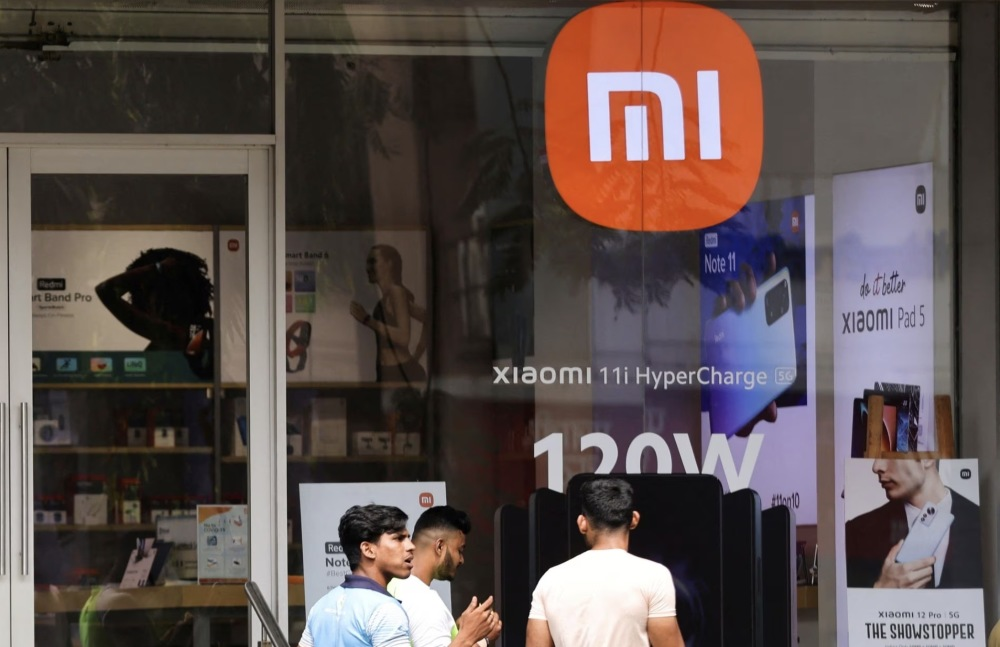

# 虽然被印度扣押48亿元，但小米称仍将增加门店数量，招聘更多店员

腾讯科技讯
7月16日，外媒报道称，在经过多年押注电商渠道后，小米印度总裁表示，将专注于提高其在印度零售店的销售业绩，因为该公司试图在落后于韩国三星之后重振智能手机销售业绩。

近年来，通过亚马逊和沃尔玛旗下的Flipkart在印度的电子商务销售额飙升，帮助小米和其他公司扩大了在全球增长最快的市场之一的业务，该市场拥有6亿智能手机用户。

但是，虽然印度44%的智能手机销售现在是在线的，但实体店销售仍然是更大的市场，小米预计它将进一步增长。

小米印度负责人Muralikrishnan
B.在上周的一次采访中表示：“我们在线下市场的市场地位远低于线上。线下市场的对手完全不一样，而且他们做得相当好，并且拥有更大的市场份额。”

香港Counterpoint
Research的数据显示，今年小米印度部门销售额的仅有34%来自零售店，其余销售额来自长期以来一直是其主要销售来源的网站渠道。相比之下，三星57%的销售额来自实体店。

小米计划增开线下店铺，目前有18000家，并与手机供应商合作，提供其他产品，例如小米电视或安全摄像头，Muralikrishnan表示，在这些领域，竞争不那么激烈。

他说，小米发现一些合作伙伴店铺在门外放置其鲜艳的橙色品牌标识，但在店内更突出地展示竞争对手的品牌，这是一个市场营销问题，该公司将解决这个问题。

小米的线下推广是在数月前失去领导地位给三星之后进行的，三星拥有更大的时尚高端手机组合。这家韩国巨头在印度拥有20%的市场份额，而小米历史上专注于平价手机，市场份额为16%。

Counterpoint分析师Tarun
Pathak表示：“线下市场仍然是一个关键平台，因为印度正在接受高端化趋势。消费者愿意花更多的钱，希望拥有高端产品的外观和手感。”

小米计划雇用更多的店铺推广员，即在店内吸引、推销和销售手机给潜在买家的销售人员。Muralikrishnan表示，该公司计划将推广员数量从2023年初的水平增加到明年年底的12000人。

小米在印度面临的另一个重大挑战是，自去年以来印度政府冻结了其6.73亿美元的银行资产。并指控小米以特许使用费的名义向外国实体进行了非法汇款。但该说法遭到小米否认。

Muralikrishnan表示：“我们将继续保持信心……最终我们的立场将被听取和证实。”

审校：小北

