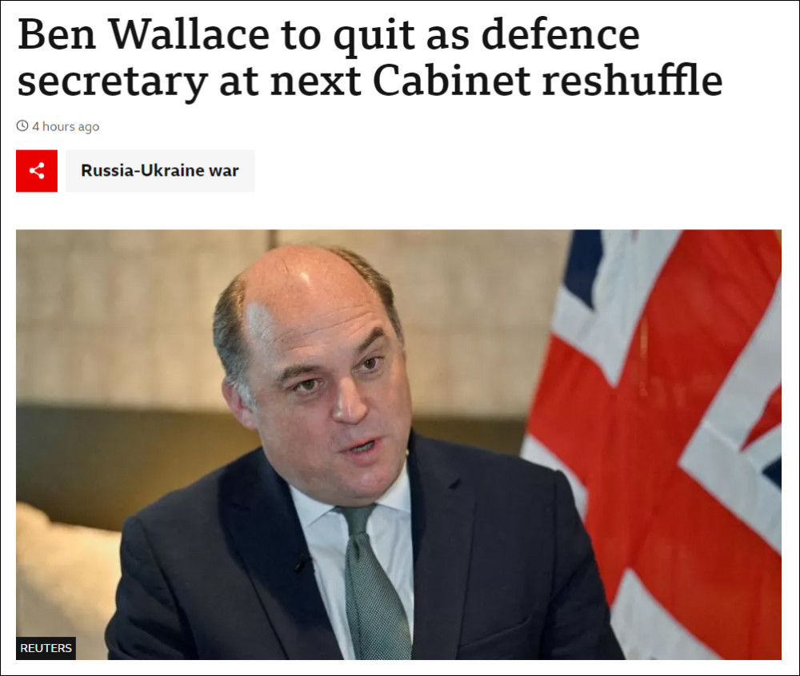

# 退出北约秘书长竞选后，英国防大臣计划今秋卸任并退出政坛

（观察者网讯）据英国广播公司（BBC）7月15日报道，英国国防大臣本·华莱士（Ben
Wallace）日前宣布，他打算在今年秋季辞职并退出政坛。华莱士曾计划竞选北约秘书长一职，但由于北约国家一致同意将现任秘书长斯托尔滕贝格的任期延长一年，华莱士不得不在上个月退出竞争。

_BBC报道截图_

“1999年，我进入苏格兰议会从政，到现在已经24年了。最近七年多来，我的床边一直放着三部手机。”华莱士说，“我很自豪能与这么多了不起的人一同工作，并为保护国家作出贡献。但代价是要把这些事务置于家庭之上，这让我非常难过。”

华莱士表示，他计划在下一次内阁改组时辞去国防大臣职务。BBC援引消息人士的话称，华莱士已在6月16日将这一决定告知英国首相苏纳克，预计苏纳克将在今年9月改组内阁。

华莱士还宣布将退出英国政坛，不再参与议会选举。报道称，由于下届英国议会选举将重新划分选区，华莱士所在的怀尔和北普雷斯顿选区将被取消，他必须在其他选区获得候选人席位才可能继续担任议员。但华莱士已明确表示，他不会寻求新的选区。

这一决定意味着华莱士将会离开“政治前线”。此前，他还计划竞争北约秘书长职位，但由于北约国家主张将现任秘书长斯托尔滕贝格的任期延长一年，华莱士不得不在上个月宣布退出竞选。

斯托尔滕贝格的任期原本将在今年9月底结束，但在下一任北约秘书长的人选问题上，北约内部存在很大的分歧，可能的候选人均无法得到成员国一致同意。因此，美国等北约国家主张延长斯托尔滕贝格的任期。7月4日，北约正式发表声明，宣布将斯托尔滕贝格的任期再延长一年。

_资料图：英国国防大臣本·华莱士
图自视觉中国_

资料显示，本·华莱士曾在英国陆军苏格兰卫队服役，1999年当选苏格兰议会议员后正式进入政坛。他在2005年首次当选英国下议院议员，2014年成为保守党党鞭，后历任北爱尔兰国务大臣、内政部负责安全事务的国务大臣。2019年，华莱士被时任英国首相约翰逊任命为国防大臣。

BBC称，华莱士在英国保守党内部颇受欢迎，一度成为保守党党魁的潜在人选，他的离开将给苏纳克政府留下“巨大的空缺”。在俄乌冲突持续的关键时刻，苏纳克需要寻找一位“有经验和勇气”领导英国国防事务的后继者。

英国天空新闻台指出，英国外交部负责印度洋-太平洋事务的国务大臣安妮-玛丽·特里维廉（Anne-Marie
Trevelyan）、内政部负责安全事务的国务大臣汤姆·图根哈特（Tom Tugendhat）和内阁办公室大臣杰里米·奎因（Jeremy
Quinn）都是潜在的国防大臣候选人。

一名消息人士告诉天空新闻台，现在还不能确定谁将接替华莱士，“但杰里米·奎因的可能性比较大”。

**本文系观察者网独家稿件，未经授权，不得转载。**

