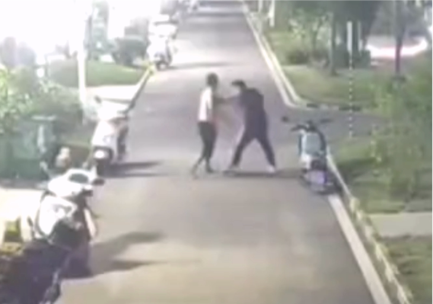
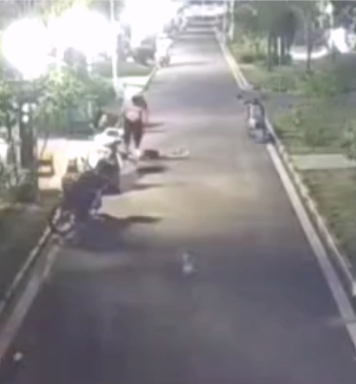
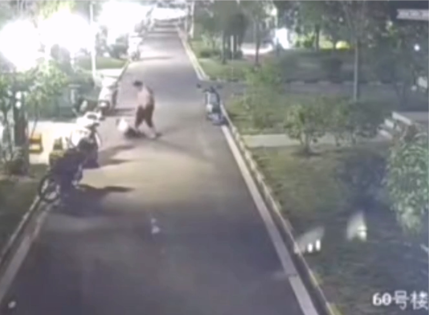
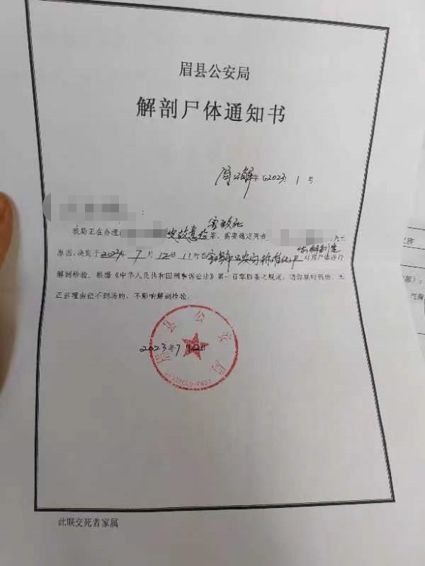
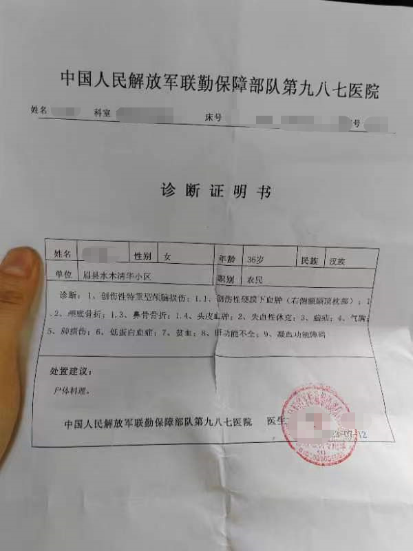

# 陕西宝鸡一男子因复婚未果将前妻殴打致死？警方：嫌疑人已被抓

7月11日深夜，陕西宝鸡眉县一小区内，网传一男子离婚后要求复婚未果，打死前妻。

一段网传监控视频显示，一赤膊男子将一白衣女子拖拽至路上，旁有一黑衣男子疑似在劝阻，被该赤膊男子打走。该赤膊男子反复殴打白衣女子，在女子躺在地上无动静后仍多次掌掴、踢打。

7月16日上午，该小区附近一位商家告诉潇湘晨报记者，自己有听闻此事，“听说是他前夫喝酒了，来找前妻复婚。前妻带着现任男朋友，当场就打起来了。”并称该女子已经去世。

自称是该女子朋友的李先生也告诉记者，女子为打人男子前妻，两人已经离婚几年，生有两子，由女方抚养。事发当晚，女子和现男友在一起，其前夫突然到来，发生冲突，“（男子）之前也来闹过。两人就是因为他有家暴才离的婚。”

李先生称，女子被送上救护车后，疑似中途抢救无效去世，并给记者发来诊断证明及解剖尸体通知书。

该诊断证明书显示，单位为眉县水木清华小区，女子36岁，诊断包括创伤性特重型颅脑损伤等。眉县公安局出具的解剖尸体通知书显示该女子为被故意伤害致死。

以上说法暂未得到官方证实。潇湘晨报记者随后就此事致电城关派出所，工作人员称自己不了解情况，“我们单位应该有在介入，应该会出通报的。”

眉县政府工作人员向记者表示，去了解情况后将回电。随后记者接到眉县公安局工作人员回电，称此案正在办理中，详情不便透露，“嫌疑人第一时间就被抓起来了”。

潇湘晨报记者吴陈幸子 王谰 实习生张瑞之

