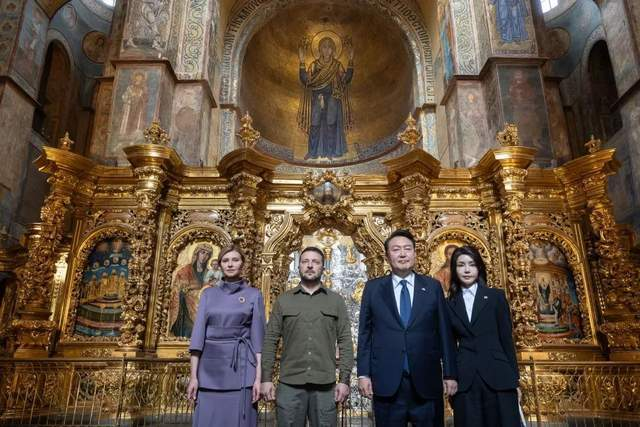
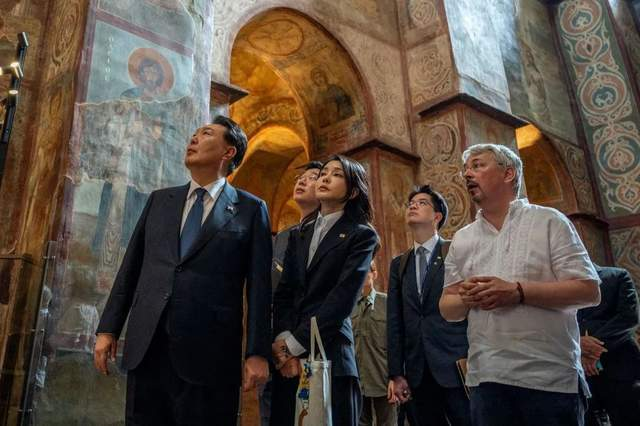

# 韩国总统尹锡悦突访乌克兰，夫人抢风头

从布查弹痕累累的教堂，到基辅北部郊区被导弹炸毁的居民楼，再到富丽堂皇的乌克兰总统府和圣索菲亚大教堂，韩国总统尹锡悦7月15日的“乌克兰一日游”被安排得满满当当。自去年2月24日俄军开始“特别军事行动”以来，这是韩国领导人第一次访问乌克兰，比日本首相岸田文雄晚了四个月。

为朝鲜局势和韩国水灾忙得焦头烂额的尹锡悦，在乌克兰并未留下多少引人注目的言论。他宣称乌克兰局势让人回想起70多年前的韩国，夸耀了韩国“治愈朝鲜战争伤痕并实现国家富强的历史”，为韩国政府及产业界参与乌克兰重建“打广告”。从立陶宛、波兰一路走来，这一直是尹锡悦关注的话题。而他不怎么提起的，则是乌克兰总统泽连斯基更关注的“军事援助”。

在韩乌两位总统之外，两位“第一夫人”的活动则更吸引媒体关注。泽连斯基夫妇专门陪同尹锡悦夫妇参观了圣索菲亚大教堂，官方新闻稿称来宾们特别了解了大教堂内独特的壁画艺术。很难说这一安排是否和韩国“第一夫人”金建希是绘画专业出身、热爱艺术有关。

_7月15日，韩国总统尹锡悦（中）和夫人金建希（中右）访问了乌克兰伊尔平市。图/视觉中国_

**一次“按部就班”的访问**

和日本首相岸田文雄在访问印度期间突然飞往乌克兰-波兰边境不同，尹锡悦在本次欧洲之行中访问乌克兰，早在外界预料之中。

今年2月，乌克兰总统泽连斯基透露，为推动韩国对乌军事援助，乌方正研讨邀请韩国领导人访乌的方案。5月21日，泽连斯基和尹锡悦在G7日本广岛峰会期间会晤，系韩乌领导人自俄乌冲突爆发以来的“首会”。自那之后，国际媒体就传出韩乌双方正在协调，准备借尹锡悦7月出席北约维尔纽斯峰会之机“突访乌克兰”，韩国总统室则多次否认该消息。

7月6日，韩国总统室发布尹锡悦将在北约峰会期间访问乌克兰邻国波兰的行程。虽然官方仍强调“未计划或促成访乌行程以及韩乌首脑会谈”，但外界对此已有充分预期。峰会期间，尹锡悦和泽连斯基同在立陶宛却无实质接触，更坐实了他们将于稍后在基辅深谈。

终于，在当地时间7月15日，结束波兰之旅的尹锡悦进入乌克兰境内，开始了韩国领导人自去年2月24日以来的首次乌克兰之行。

乌克兰总统办公室发布的信息显示，泽连斯基及夫人泽连斯卡娅在总统府外迎接尹锡悦及夫人金建希的车队。隆重的欢迎仪式上，两国总统及夫人分别握手致意。和来访乌克兰的其他国家领导人一样，尹锡悦在签到簿上留言。随后，泽连斯基和尹锡悦进行了长达1小时的一对一会晤，然后双方高级官员加入，又举行了45分钟的大范围会谈。会晤结束后，两国总统共同举行了记者招待会。

_7月15日，韩国总统尹锡悦访问乌克兰。乌克兰总统泽连斯基夫妇在总统府欢迎尹锡悦夫妇。图/乌克兰总统办公室_

和岸田文雄的访乌行程一样，会见泽连斯基前，尹锡悦夫妇先到访了基辅北部小镇布查和伊尔平，“亲眼目睹俄罗斯占领的后果”。在被乌军发现俄军“大规模屠杀平民证据”的布查，尹锡悦夫妇参观了展示“俄军罪行”的展览馆，并在室外为亡灵默哀。此后，他们到基辅的乌克兰阵亡卫士纪念墙前献花。

除了外国领导人访乌的“保留节目”，尹锡悦此行也有一些独特安排，包括访问圣索菲亚大教堂。此外，在尹锡悦和泽连斯基会晤时，金建希和泽连斯基的夫人泽连斯卡娅也举行了会谈。金建希从乌克兰的自然风光谈到绘画，表白道：“包括我在内的许多韩国人都想帮助乌克兰。”她提及几天前在立陶宛时应泽连斯卡娅之邀参观了乌克兰中心，“中心里展示的乌克兰难民儿童的画作让我非常感动”，并认为可以在韩国展出这些画，以让“更多的人像我一样，被乌克兰难民的画所感动，自愿为乌克兰捐款”。泽连斯卡娅说，这是一个好主意，建议两国政府加以研究。

_7月15日，韩国总统尹锡悦访问乌克兰。乌克兰总统泽连斯基夫妇陪同尹锡悦夫妇参观基辅圣索菲亚大教堂。图/乌克兰总统办公室_

在基辅期间，金建希还和泽连斯卡娅一起参观了基辅儿童权利保护中心，见到了“被强制遣返到俄罗斯后又顺利回家”的乌克兰儿童。金建希收下了孩子们送给她的贴纸，并抱起一名小女孩合影。

相比金建希，尹锡悦在乌克兰期间的言行没有什么新鲜之处。他小幅上调了对乌援助，将今年的援助额从韩国政府在2月提出的1.3亿美元上升到1.5亿美元，低于岸田文雄访乌时追加的3000万美元承诺。此外，尹锡悦表态年内将增加对乌克兰的非致命性武器援助。在他出发前往立陶宛之际，今年的第一批该类援助刚刚由韩国运抵乌克兰，主要包括防弹衣、头盔和地雷探测器。

自去年2月以来，乌克兰一直寻求韩国政府松口援助“致命性武器”，但此番尹锡悦并未发布任何突破此前政策的言论。和此前韩方的论调一致，尹锡悦将“支持乌克兰”的重点放在“重建”而非“击败俄罗斯”上。他承诺将发挥引领作用，让更多发展中国家参加泽连斯基提议的“和平峰会”，并和世界银行合作，给予乌克兰新的财政支持。

双方取得的最实际成果，则是决定新设“尹锡悦-泽连斯基奖学金”，以帮助在韩国境内的乌克兰学生安心学业，并帮助更多乌克兰人到韩国留学。

面对并不丰硕的会晤成果，刚刚经历了北约峰会“失望之旅”的泽连斯基显得很平静。通过记者会及社交媒体平台，他对尹锡悦的到访表示感谢。值得注意的是，韩国当前正遭遇严重水灾，尹锡悦在访问基辅期间亦就救灾问题对国内做出指示，而泽连斯基在会见记者时，也代表所有乌克兰人对韩国受灾表示慰问。

此前，由于本届北约峰会未能就乌克兰加入北约问题给出时间表和具体框架，泽连斯基曾用“荒谬”的表述抨击，强调“我们尊重我们的盟友，但乌克兰也值得尊重”。这些言论在西方国家间引起强烈反应，英国国防部长华莱士和美国总统国家安全事务助理沙利文先后表示，乌克兰应该表达“感激之情”。随后，泽连斯基迅速调整了表态，称北约峰会给予乌克兰“前所未有的支持”。

**曾坚持不提供“致命性武器”**

在美国的盟友中，尹锡悦到访乌克兰的时间特别晚。今年3月，日本首相岸田文雄突访基辅，成为俄乌冲突爆发后最晚踏上乌克兰领土的G7领导人。就连去年秋天刚刚上台、被外界认为“对乌克兰问题不甚积极”的意大利总理梅洛尼，也在今年2月完成了乌克兰之旅。

除了到访时间晚，在援助乌克兰问题上，韩国政府的态度也和欧美主要国家不同。去年2月24日俄军发起“特别军事行动”后，文在寅政府第一时间发声谴责并表示将跟进参与对俄国际制裁。2月28日，韩国政府即宣布第一批对乌1000万美元人道援助。然而，文在寅政府并未回应乌驻韩大使提出的在军事领域援助乌克兰的请求。韩国和乌克兰外长迟至3月2日才第一次通话，次日文在寅和泽连斯基通话，这两次通话也未促使韩方增加对乌援助。

当时的分析多认为，这和文在寅政府将俄罗斯视为东北亚重要的和平、合作伙伴有关。正如俄罗斯驻韩大使库利克所言，韩国和俄罗斯之间的经济、能源合作，与朝核问题、半岛和平安全息息相关。就在文在寅和泽连斯基通话的去年3月3日，韩国政府统一部还专门出面“安抚”俄方，表示今后仍需和俄罗斯在半岛问题上加强合作。

随着尹锡悦政府上台，韩国政府在俄乌之间保持“相对中立”的地区环境已发生根本变化。一方面，由于尹锡悦政府跟进西方对乌金融制裁和出口管制，俄罗斯3月7日将韩国列入不友好国家名单。另一方面，自5月尹锡悦政府上台后，由于韩美对朝奉行“最大施压”政策，朝鲜进入史上最密集的洲际弹道导弹试验周期，朝鲜半岛局势已难回头，尹锡悦政府全盘否定前政府对朝接触政策的做法，亦展现出“不愿回头”的立场。在此背景下，俄罗斯对东北亚和平安全的作用，对韩国新政府来说已不那么重要。

更重要的是，尹锡悦政府上台后，将韩美军事同盟视为维系韩国和平安全的关键法宝，在重大国际事务上更加靠拢华盛顿。尹锡悦在胜选总统后第一时间和拜登通话，就乌克兰问题明确了和西方一致的立场。

但出乎外界预料的是，在对乌克兰军事援助这一具体问题上，尹锡悦政府基本延续了前政府的做法。去年3月29日，尹锡悦在胜选后和泽连斯基首次通话，并未就升级军援表态，仅说“希望战后早日会晤”。此后，泽连斯基首次受邀在韩国国会发表演讲，明确表示韩国拥有可拦截俄罗斯舰艇及导弹的各种军事装备，“若韩国能够帮助乌方对抗俄罗斯，将非常感激”。尹锡悦方面立刻回应称，文在寅政府拒绝向乌提供武器援助，新政府也仅考虑扩大人道援助范围。

直到去年11月之前，虽然韩乌政府、政党高层实现多次互访，乌方、美方也一再对韩方提出军援诉求，尹锡悦政府对朝援助的上限，始终只是文在寅政府定下的“非武器军需品”，如防弹头盔、防弹背心、帐篷、毛毯、军粮等，仅将单批援助额度从前政府的约10亿韩元（约合人民币500万元）提升到约15亿韩元（约合人民币800万元）。

尹锡悦为何无意在军援问题上改弦更张、靠拢美方？分析认为，朝鲜半岛局势达到2018年以来最紧张状况，让韩国社会无心关注遥远的乌克兰战场。韩国盖洛普去年6月发布的专项民调显示，72%的公众认为“只提供非军事援助”是韩国的最佳选择，还有6%的人认为“不应提供任何援助”，支持军援者占比仅15%。

另一个细节也能展现韩国朝野对俄乌冲突的真实态度。去年3月底，在泽连斯基已经在美国、日本国会发表视频演讲后，韩国国会才开始考虑邀请泽连斯基也在韩国进行视频演讲。演讲最终在次月举行，但300多名各党派议员中，只有50多人出席活动，也没有为泽连斯基起立鼓掌。一些支持乌克兰的韩国人抨击称，这是“前所未见的侮辱”。

今年5月，在泽连斯卡娅、泽连斯基先后提出诉求并给出具体清单的背景下，尹锡悦政府终于松口同意扩大“非致命性军事设备”的援助。7月10日，首批相关物资运抵乌克兰，外界推测这些援助未来可能包括扫雷工程车、救护车等。不过，到这时，韩国军援乌克兰已经有了另一种“间接方式”。

**“间接军事支持”增多**

随着乌克兰军队成功的“秋季大反攻”，以及备受韩方关注、指责的“朝鲜对俄军援”问题发生，韩国朝野的立场发生了微妙的变化。去年11月开始，多家美国主流媒体先后披露，韩美之间达成了美国购买韩国炮弹然后交付乌克兰的计划，首批交易涉及10万发乌军急需的155毫米炮弹，占到同期美方对乌援助该型炮弹总额的十分之一。

事发后，韩国国防部强调，这些炮弹是在“最终用户是美军”的前提下交易的，韩国政府不向乌克兰援助杀伤性武器的立场没有变化。但国防部也坦言，这笔交易是为了“补充美军的库存”。乌克兰副防长哈夫里洛夫则表示，乌方“不知道武器来自哪里，但这些机构与韩国政府无关，所以不违反韩国的规定”。

首次尝试“成功”后，韩美双方又于今年4月就韩国向美“出借”155毫米炮弹达成新协议，这次协议涉及的供货量高达30万到50万枚。韩联社称，尹锡悦政府选择以出借而非出口的方式向美方提供炮弹，也是“避免让外界产生韩方通过美方向乌克兰提供杀伤性武器的误解”。

与波兰加强军事合作，是韩国间接支持乌克兰的又一途径。韩国和波兰的军火交易到 2022
年已达137亿美元，包括从战机到单兵武器在内的各种设备，而波兰是欧洲最重要的对乌军事援助国。值得注意的是，就在尹锡悦本月访问波兰期间，韩国飞机制造商KAI开始向波兰军方交付韩制FA-50GF轻型攻击机，距离双方签署合同仅过去10个月，创下公司最快交付纪录。

在7月13日和尹锡悦会晤时，波兰总统杜达进一步表示，波兰不仅希望从韩国进口更多武器，还希望能在地生产包括装甲车在内的韩制武器。杜达和尹锡悦一致认为，韩波是“乌克兰战后重建的最佳搭档”。

过去两个月否认尹锡悦可能访乌时，韩国总统室高级官员曾表示，只有当韩方对乌援助“出现实质性变化”时，尹锡悦才可能访问乌克兰。随着“间接军事支持”增多，尹锡悦也曾在今年4月访美前夕对路透社记者称“如果发生严重违反战争法罪行，韩国可能无法坚持只提供人道和财政援助立场”。与日本不同，韩国法律并不禁止对正在战争中的外国提供武器，但该言论并未得到朝野支持，总统室官员随即出面“澄清”，军援也没有进入尹锡悦和拜登会晤的议程。

作者：曹然

