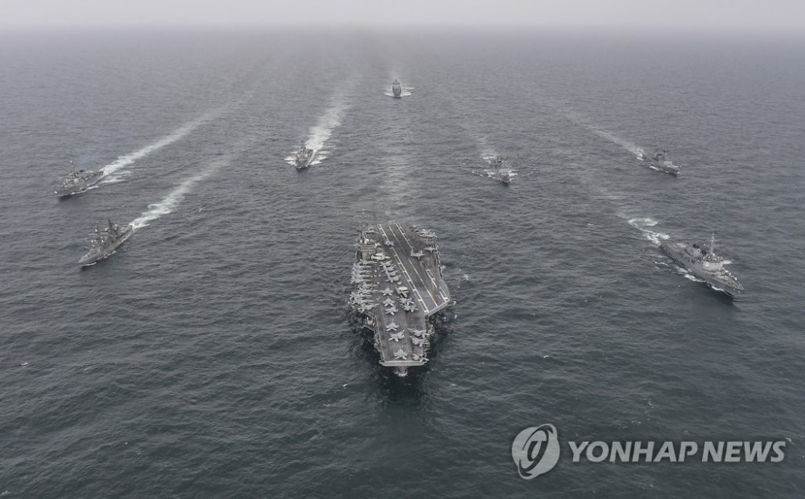

# 韩美日时隔三个月再进行反导联演：模拟朝鲜发起弹道导弹“挑衅”

（观察者网讯）韩联社7月16日报道，韩美日三国16日在朝鲜半岛东部海域公海举行导弹防御演习，应对所谓“朝核和洲际弹道导弹（ICBM）挑衅”。

报道称，这是韩国尹锡悦政府成立以来举行的第四次韩美日海上导弹防御演习。据韩国海军透露，本次有韩国“粟谷李珥”号、美国“约翰·芬”号、日本“玛雅”号等三国的宙斯盾驱逐舰参演。此次演习模拟朝鲜发起弹道导弹“挑衅”的状况，旨在让三国舰艇进一步熟练掌握拦截过程。

朝鲜继5月31日发射军事侦察卫星之后，本月12日又发射了固体燃料洲际弹道导弹“火星-18”，力度不断升级。韩媒报道称，鉴于此，韩美日三国当天时隔3个月再次举行导弹防御演习。

_资料图片：4月4日，在济州南部公海，韩美日举行反潜和搜救联合演习。
图源：韩联社_

此前，朝中社在报道7月12日“火星炮-18”试射时指出，这是捍卫朝鲜“国家安全与地区和平，免受核战争浩劫，坚决遏制敌对势力万分危险的军事蠢动，加强正当防卫权的重要一环”。

朝中社称，近期，“敌视朝鲜的美国及其仆从势力的军事挑衅行为变本加厉，朝鲜半岛和地区的军事安保形势濒临超越冷战时代的核危机局面。在这种严峻时期，此次试射在朝鲜党中央军事委员会的战略判断和重大决策下进行。”

