# 高盛两万字报告：大模型不是实现生成式人工智能的唯一答案

腾讯科技讯
自OpenAI开发的生成式人工智能工具ChatGPT于去年11月发布以来，投资者对生成式人工智能技术的兴趣激增。这种技术的颠覆性潜力，以及围绕它的炒作和市场定价是否太过分，是人们关注的焦点。

投行高盛采访了硅谷投资公司Conviction的创始人莎拉·郭（Sarah Guo）、纽约大学的加里·马库斯（Gary
Marcus）以及高盛的首席软件和互联网分析师卡什·雷根（Kash Rangan）和分析师埃里克·谢里丹（Eric
Sheridan），探讨该技术在现阶段能做什么和不能做什么。

高盛的经济学家随后评估了人工智能对生产力和经济增长的潜在巨大影响。高盛的股票策略师估计，生成式人工智能技术可能推动美国股市在中长期内的显著上涨，不过他们也警告称，过去的生产率繁荣导致股票出现泡沫，并最终被刺破。

高盛还讨论了人工智能领域目前最引人注目的投资机会，以及投资者最应关注的近期风险。

“我们进入我认为的‘软件3.0’ 时代……企业不再需要收集这么多训练数据，这使得该技术一下子更有用、更方便、更便宜。”——莎拉·郭

“人工智能系统的智能被过度夸大……那些认为通用人工智能（AGI）即将到来的人几乎肯定是错的。——加里·马库斯

“人工智能目前可能还没有进入炒作周期……该技术的周期并没有由崭露头角的初创公司引领，这使其更不可能喷涌或需要很长时间才能启动。”——卡什·雷根

“在过去几个月里，绝大多数因人工智能主题而表现优异的公司，在整个市场中仍以相对合理的市盈率进行交易。”——埃里克·谢里丹

**目录**

一、宏观新闻和观点

二、生成式人工智能：是炒作还是真正的变革？

三、采访人工智能风投——莎拉·郭

四、采访人工智能专家学者——马库斯

五、详解人工智能

六、人工智能发展史

七、分析师——关于人工智能的讨论

八、人工智能对经济的潜在巨大影响

九、美国股市：衡量人工智能上行空间

十、过去生产力繁荣时期的市场

**一、宏观新闻和观点**

我们将简要介绍全球市场最重要的经济体。

**美国**

高盛最新的专有数据/观点的重大变化

\--鉴于我们对经济增长的预测高于共识以及美联储官员发出的信号，我们最近将美联储终端利率预期上调至5.25-5.5%（加息25个基点，最有可能在7月份）。

\--鉴于债务限额的尾部风险已经过去，而且我们更加确信银行收紧贷款只会适度拖累国内生产总值，因此我们最近将12个月的衰退概率下调至25%。

\--我们最近将2023年12月的核心PCE通胀预期从3.7%下调至3.5%。

我们关注的数据点/趋势

\--美国劳动力市场；我们估计劳动力市场的趋紧到2024年初才会缓解到大流行前的水平。

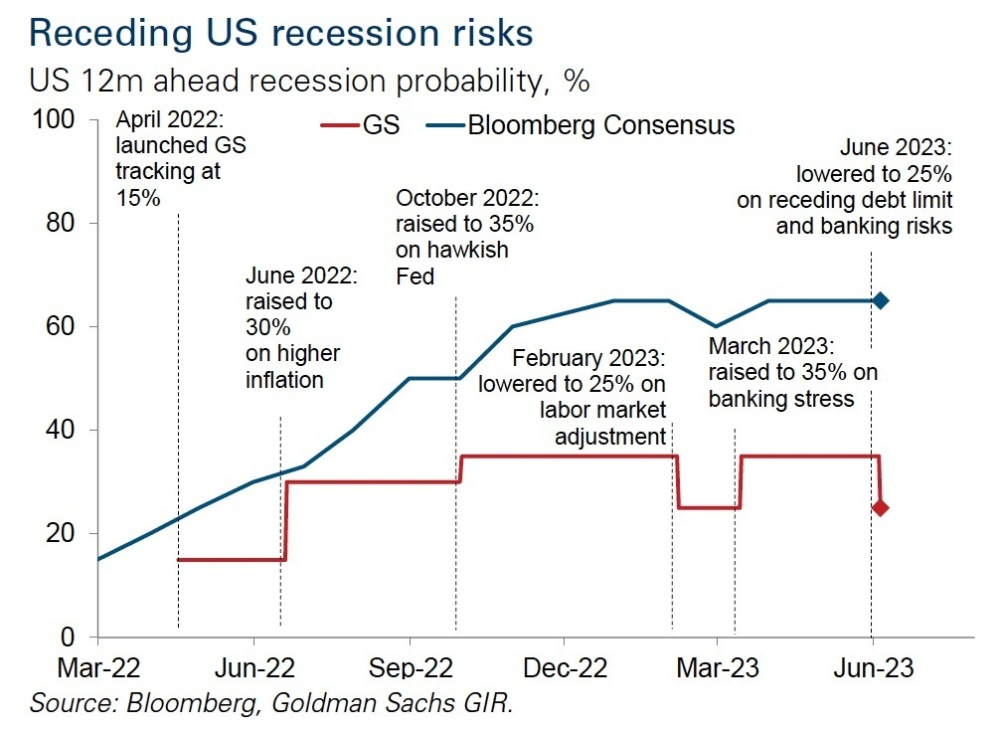

**日本**

高盛最新的专有数据/观点的重大变化

\--我们最近将2023财年新的核心CPI通胀预期从3.6%上调至3.8%，这反映出我们最新的外汇假设。

我们关注的数据点/趋势

\--日本央行政策；我们继续预计收益率曲线控制（YCC）将在7月份进行调整，最有可能的结果是将目标期限从10年缩短至5年。

\--日本工资增长；更高的工资增长可以产生更可持续和更强劲的工资-价格动态，但在我们看来，工资-价格螺旋分化是不太可能的。

\--日本消费者信心大幅上升。

**欧洲**

高盛最新的专有数据/观点的重大变化

\--我们最近将欧洲央行的最终利率预期上调至4%（9月加息25个基点），原因是欧洲央行更新了通胀预测，且在6月会议上未提及“暂停”。

\--我们最近上调了对英国央行8月份的预测，目前预计英国央行将在6月份加息50个基点（之前为25个基点），我们认为这意味着对英国通胀的更多担忧以及英国央行反应函数的转变。我们预计9月份最后一次加息25个基点，最终利率为5.75%（之前为5.5%）。

我们关注的数据点/趋势

\--欧元区核心通胀率，我们预计到今年年底将降至3.7%。

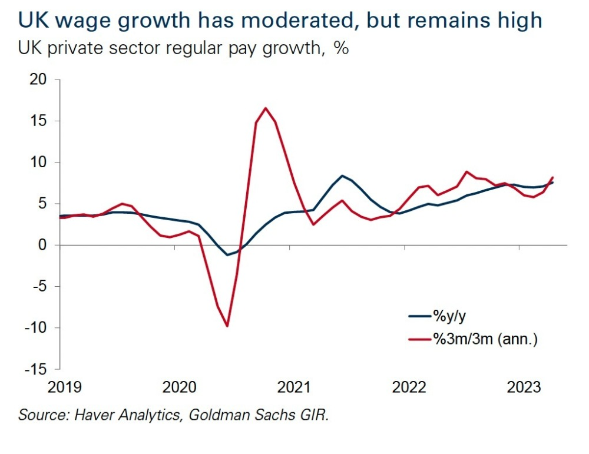

**新兴市场**

高盛最新的专有数据/观点的重大变化

\--我们最近将2023年印度实际国内生产总值增长率预期从6%上调至6.4%，原因是出口净增长。

我们关注的数据点/趋势

\--尽管大多数发达国家央行仍在继续加息，但新兴市场降息周期可能即将到来，拉美国家可能会一马当先。

**二、生成式人工智能：是炒作还是真正的变革？**

继人工智能芯片制造商英伟达在其第一财季财报中大幅上调营收预期后，OpenAI于去年11月发布了ChatGPT——一种利用自然语言提示创建内容的生成式人工智能工具，引发了投资者对生成式人工智能技术的兴趣。事实上，英伟达的股价自上调以来已经上涨了30%以上，而少数几家构建生成式人工智能核心基础大型语言模型（LLMs）的大型科技公司的表现也大幅跑赢大盘。但是，人工智能炒作是否过头了？生成式人工智能技术的颠覆性潜力——以及它是否值得当前投资者的热情
--是市场关注的焦点。

我们首先探讨一下吸引投资者注意力的人工智能生成技术的与众不同之处。高盛美国软件分析师雷根解释说，该技术能够以文本、图像、视频、音频和代码的形式创建新内容，并通过自然语言而非编程语言来实现，这是其关键的变革性特征。

专注于人工智能的风险投资公司Conviction的创始人莎拉·郭进一步解释说，以前的人工智能技术迭代需要人类编写确定性代码来执行特定任务（“软件1.0”），或者费力地收集训练数据来训练神经网络完成特定任务（“软件2.0”），而现在基础模型（通过开源或API）的广泛可用性（这些模型具有自然语言能力、推理能力和对世界的一般知识）减轻了企业收集训练数据的负担，开创了“软件3.0”时代，企业可以更轻松、更低成本地利用这些“开箱即用”的能力来改造或提升其业务。

生成式人工智能的变革潜力已经开始转化为现实。雷根表示，通过采用生成式人工智能工具，开发人员的工作效率在某些情况下提高了15%-20%。随着这些工具的使用越来越普遍，莎拉·郭看到了未来的一系列应用，特别是随着法律、数据分析、插图、语音和视频生成等传统服务市场越来越多地使用人工智能。高盛美国TMT行业专家彼得·卡拉汉（Peter
Callahan）指出，公共投资者认为这项技术具备平台转变的所有条件，有可能改变企业和消费者体验的几乎所有方面。

高盛全球高级经济学家约瑟夫·布里格斯（Joseph
Briggs）认为，这种变革潜力可能会产生深远的宏观影响。他估计，在美国和其他发达国家广泛采用该技术后，10年内可将年劳动生产率增长提高约1.5个百分点，并最终将全球年国内生产总值提高7%。高盛美国股票策略师瑞安·哈蒙德（Ryan
Hammond）和大卫·科斯提（David
Kostin）认为，这种生产率的提升可能会在中长期内将迄今为止人工智能引领的相对狭窄的美国股市涨势转变为更广泛的涨势，从而将标准普尔500指数较当前水平提升9%。

但是，即使人工智能技术最终被证明是变革性的，在这一点上，围绕该技术实际能带来什么--以及市场定价是多少--
的炒作是否已经过头了？在谈到当今人工智能系统的智能时，美国纽约大学心理学和神经科学名誉教授加里·马库斯（Gary
Marcus）认为：“（目前）人工智能系统的智能化程度并不高。”

马库斯指出，目前人工智能工具中经常被吹嘘的神经网络与人类大脑神经网络的功能完全不同；虽然人工智能机器可以进行反射性统计分析，但它们几乎不具备有意推理的能力。虽然这些机器可以学习，但这种学习主要围绕单词的统计和对提示的正确反应；它们并不学习抽象概念。而且与人类不同，它们没有内部模型来理解周围的世界。马库斯说，通用人工智能最终可能会实现，但今天我们离它还很遥远，再多的投资也不可能改变这一现状。

谈到市场，高盛的市场策略师多米尼克·威尔逊（Dominic Wilson）和维姬·常（Vickie
Chang）指出，在过去创新引领的生产力繁荣时期，如电力（1919-1929年）、个人电脑和互联网（1996-2005年）广泛普及之后，股票价格和估值的急剧上升成为泡沫，并最终破灭。

即使在今天，莎拉·郭仍发现私募市场中存在一些定价错误的领域，因为一大批投资者在深入了解该领域的同时，也坚持采用相同的投资启发式。她警告说，错误判断这种转变的时机是投资中的一个常见陷阱。尽管如此，作为一名早期投资者，她并不那么注重估值，而是选择她认为具有重大上升空间的市场、产品和企业家。

高盛美国互联网分析师谢里丹感到欣慰的是，最近在人工智能主题上表现出色的绝大多数公司仍以相对合理的市盈率进行交易。雷根认为，与其他大型技术周期（如从分布式系统到云计算的转变）不同的是，在其他技术周期中，由于老牌企业的反对而导致技术应用放缓，而这次转变是由全球最强大的技术公司推动的，因此人工智能可能并没有进入炒作周期。

那么，当今最引人注目的人工智能投资机会在哪里？雷根和谢里丹认为，开发基础人工智能模型的大型科技公司，以及为该领域提供服务的 “锄头和铲子”企业--
半导体公司、云计算超大规模公司和基础设施公司--
已做好准备，在当前的“建设”阶段获取收益。莎拉·郭对此表示赞同，但她也看到了整个堆栈中的机会，并对应用层感到最兴奋，而目前广大投资者对应用层似乎不太确定。

最后，投资者最应注意哪些风险？谢里丹正在密切关注消费者计算习惯改变的前景，这可能会颠覆现有的商业模式。莎拉·郭警告说，在当前的热情中，辨别人工智能营销和人工智能现实可能会很困难。雷根担心，技术越普及，其价值就可能越低。

**三、采访人工智能风投——莎拉·郭**

**莎拉·郭是人工智能风险投资公司Conviction的创始人。此前，她是风投公司Greylock的普通合伙人。她在访谈中表示，人工智能的进步迎来了技术范式的转变，这带来了丰富的投资机会，特别是随着软件工程向“软件3.0”转型，传统服务领域越来越多地由人工智能提供服务。但她也警告说，投资者有可能误判如此巨大的技术变革的时间表，而且很难区分人工智能营销和人工智能现实。**

**艾莉森·内森（Allison Nathan）：作为人工智能领域的长期投资者，是什么吸引你进入这个领域？**

莎拉·郭：作为一名技术专家，很难不对人工智能感兴趣。但从投资者的角度来看，我在Greylock工作时期就开始关注人工智能。机器学习（ML）推动了许多我们熟知并喜爱的业务
--
谷歌、Meta、Uber、Instagram、LinkedIn、TikTok。这些企业都是算法企业，它们利用机器学习进行推荐、广告和服务定价、检测垃圾邮件和欺诈等许多其他应用。看到上一代机器学习技术对这些企业的重要性，我们自然而然地开始探索如何将这些经典的机器学习方法应用到其他领域。一个显而易见的领域是网络安全领域，如Awake、Abnormal或Obsidian
Security等公司，因为它们的目标通常是从噪声中发现信号。我们还发现了呼叫中心等领域的机会，以及自动驾驶汽车和送货机器人等全新用例。我们预计，除了互联网巨头之外，其他公司也会希望利用这些机器学习功能，因此我们开始在下一代开发工具和基础设施等领域寻找机会。

此外，在过去十年中，学术和工业实验室在人工智能领域取得了令人难以置信的进步，如卷积神经网络（CNN）、生成式对抗网络（GAN）、强化学习（RL）等。尤其是基于Transformer的放大模型，其能力和通用性令人震惊。过去五年的研究加速巩固了我的信念，即人工智能的发展正在迎来范式转变
--这肯定是我投资生涯中看到的最大的技术转变--绝大多数投资机会仍在前方。我们还在初始阶段。

**艾莉森·内森：与以往的人工智能发展相比，如今备受关注的生成式人工智能技术有何不同？**

莎拉·郭：人工智能的最新进展并不仅仅是千篇一律。这些新的更通用、更强大的能力扩大了机器学习的相关范围，实现了截然不同的产品用户体验。在机器学习出现之前，我们有“软件1.0”--由人类逐个功能编写的确定性代码，一次执行一项任务。2017年，时任特斯拉自动驾驶团队的技术专家安德里·卡帕西（Andrej
Karpathy）创造了“软件2.0”（Software
2.0）一词来描述机器学习驱动的软件开发，即主要工作不再是实际编写软件，而是收集训练数据，针对特定任务训练神经网络。然而，传统的机器学习开发周期包括标注数据收集和以可接受的质量水平实现单个任务的工程设计，劳动密集型程度高且成本高昂，这一直阻碍着机器学习的广泛应用。

今天，我们正在进入我所认为的“软件3.0”时代。在这个时代中，许多功能都是“开箱即用”的，其基础模型要么是开源的，要么是通过API提供的。这些“基础模型”具有自然语言能力、推理能力和世界常识。在这种模式下，企业不需要收集大量的训练数据，这使得该技术突然变得更加有用、易用且成本更低。任何选择投资人工智能的公司现在都可以投资调整这些模型，以增强或改造其业务。

**艾利森·内森：即使生成式人工智能前景广阔，目前的炒作是否夸大了该技术的能力？**

莎拉·郭： **误判大型技术转变的时间表是投资中的一个常见陷阱。我完全相信这一转变将推动实质性的价值创造，但这是一个十年以上的转变。**
与此同时，错误定价的领域无疑已经浮出水面。在私人市场上，一大批投资者正试图了解如何接触这项技术，或者至少如何考虑其风险状况。在他们深入了解这一领域的同时，也倾向于采用更明显的启发式投资。例如，许多投资者在评估初创企业时，似乎都会看其领军人物是否曾是OpenAI或DeepMind的研究人员，因为这个问题比特定产品或研究论文是否会成功要容易回答得多。

同样，由于数据库是众所周知的软件类别，矢量数据库也受到了投资者的广泛关注。尽管如此，我已经看到一些投资者变得更加怀疑，因为大多数企业尚未采用生成式人工智能，但这似乎是短视的。请记住，ChatGPT在去年11月才推出；企业规划和执行的平均周期往往超过6个月。因此，投资者需要耐心等待。与互联网、移动和云计算一样，一些赢家立即崛起，但另一些则在十年后才出现。发现使用案例和构建优秀软件需要时间和企业家的智慧。没有人会因为Napster的失败而停止对互联网企业的投资。

**艾利森·内森：目前该领域的高估值是否会让你担忧或感到不安？**

莎拉·郭：投资者不应忽视近期技术市场各个阶段的经验教训。
**所有公司最终都会按照现金流的倍数进行估值。但作为早期投资者，在一定范围内，我们可以不那么关注估值，而更多地关注选择市场和企业家，以发现突围的赢家。**

**艾莉森·内森：那么，目前该领域最引人注目的投资机会在哪里？**

莎拉·郭：我们正在进行全栈投资。首先，我们有镐和铲的投资；基础设施、数据基础设施和工程工作流程正在被重新构想。对英伟达图形芯片容量的需求难以满足，但图形芯片集群的云管理和交付仍不成熟，远远落后于CPU。我们正在投资，使人工智能基础设施对企业更友好，应用开发更容易。还有模型本身。其中一些业务仍将以大型实验室为中心：OpenAI、谷歌、DeepMind、Anthropic等。但大的模型机会依然存在，例如在动作/代理、图像、语音、视频和机器人领域。我们尤其期待通过更好的代码模型实现软件开发的民主化。一般来说，开源语言模型的能力越来越强，而且这种情况可能会继续下去，部分原因是Meta等大公司的贡献。因此，将存在一系列模型提供商。针对公司或消费者特定数据利用这些模型并非易事，因此在智能标注数据、人工智能应用的数据管理以及更好地理解和协调这些模型方面存在大量机会。

实际上，我最感兴趣的机会是应用层。许多投资者对这一层并不确定，他们认为所有的价值都在于模型训练本身，但让非确定性模型在生产用例中发挥作用需要大量的创造力和工作。初创公司和现有应用公司都将在许多领域利用这些能力：从可观察性、安全性到客户关系管理（CRM），以及传统服务市场，包括安全服务、法律、数据分析工作、插图、语音和视频生成，现在可以开始由更多的软件提供服务。我们对人工智能带来的民主化效应感到兴奋，并期待其二阶效应也成为可投资的。

**艾利森·内森：目前的企业在这方面有优势吗？**

莎拉·郭：在广泛的机会集中，现有企业肯定有一些优势--他们的分销和数据--
因此毫无疑问会有巨大的现有企业赢家。但现有的优势并不总是像看起来那么有价值。例如，我们投资了一家隐形的人工智能安全公司，该公司的目标是将劳动密集型环节自动化。

在当今企业的网络安全工作流程中，它们需要一组训练数据来“微调”或定制其模型，最初寻求与拥有这些数据的现有公司合作。但是，没有一家公司能够以训练模型所需的形式收集数据。因此，尽管一些极有价值的数据目前已经存在于现有公司，但有些数据还不存在，如何有效收集这些数据将是一个自由竞争的问题。

总而言之，这些公司在建立软件业务的多个方面展开竞争，我不认为人工智能从根本上有利于现有公司或初创公司。我个人倾向于早期投资是目前接触这项技术的最佳途径，部分原因是这个领域还很年轻，因此纯粹的上市机会还不存在。但是，对于任何能够区分信号和噪音的投资者来说，无论是在公开市场还是私募市场，这种错位都是一个巨大的机会。

**艾利森·内森：当前人工智能领域投资的最大风险是什么？**

莎拉·郭： **对于投资者来说，区分人工智能营销和人工智能现实将是一项艰巨的工作。**
这是一个高度技术化的领域，技术水平每周都在变化。上市公司领导层对人工智能趋势的快速承诺非同一般，但如果不能将其转化为利润率的提高、更好的产品和新的收入，那么在财报电话会议和公司声明中进行人工智能营销也不会有什么好处。对上市公司而言，为人工智能工作提供资源，以及应对创新者的困境（人工智能自动化可能取代大量人力工作或降低产品成本）是一个复杂的领域。

**大公司很难快速做出巨大改变，但这正是这种转变所需要的。企业需要自我颠覆，解决隐私和数据使用问题，快速组建人工智能产品团队，并创造性地考虑新产品的定价和包装。在这种快速变化中，企业不可能一切从零开始，而选择正确的合作伙伴将是一项战略优势。**

**艾利森·内森：投资者应如何规避这种风险？**

莎拉·郭：我给投资者的建议是关注技术合作伙伴的选择、具体计划和成果。当人工智能产品在增量收入中占很大份额时，就很难对这种业绩提出异议。或者，在消费者业务方面，如果投资者通常用来评估公司业绩的指标
--参与度、交易量、广告库存等--在引入新的人工智能产品后得到实质性改善，这就是你希望看到的。

另一个重大风险是公众和监管机构对人工智能技术的弹劾，原因是人们担心这些技术在偏见、虚假信息、网络安全等领域被滥用。就像互联网一样，像生成式人工智能这样的通用工具可能被用于好的方面，也可能被用于坏的方面，因此在投资于创新的同时，必须投资于风险缓解。但是，考虑到这项技术可以在科学、教育和医疗保健等关键领域取得重大进展，如果我们在这项技术真正发挥其巨大潜力之前就停止对其进行监管，那将是非常遗憾的。

**四、采访人工智能专家学者——马库斯**

**马库斯是纽约大学心理学和神经科学荣誉教授。他对人工智能进行了广泛的研究，包括他的最新著作《重启人工智能：打造值得我们信赖的人工智能技术》。在访谈中，他认为人工智能系统的智能被过度夸大了，虽然我们最终可以达到这个目标，但目前我们还远远没有实现通用人工智能（AGI）。**

**珍妮·格林伯格（Jenny Grimberg）：如今，生成式人工智能工具究竟是如何工作的？**

马库斯：当前所有生成式人工智能工具的核心基本上都是一个自动完成功能，该功能已在互联网的很大一部分内容上进行过训练。这些工具并不了解这个世界，因此据了解，它们会产生幻觉或编造虚假陈述。这些工具擅长编写代码等基本可预测的任务，但不擅长提供准确的医疗信息或诊断，而自动完成功能还不够完善。

**珍妮·格林伯格：一些观察家认为，这些技术之所以能够学习/理解，是因为它们采用了与人脑类似的神经网络。你对此有何看法？**

马库斯：人脑的神经网络与人工智能工具使用的神经网络完全不同。而且，与某些人的观点相反，这些工具并不像人类那样进行推理。人工智能机器最多只是进行一些诺贝尔奖得主丹尼尔·卡尼曼（Daniel
Kahneman）称之为系统1思考（system 1 thinking）--反射性统计分析，而很少进行系统2的思考--
刻意推理。人工智能机器正在学习，但它们学习的大部分内容是文字的统计，以及通过强化学习，如何正确回应某些提示。它们学的不是抽象概念。

这就是为什么它们产生的大部分内容都是垃圾和/或虚假内容的原因。人类有一个内部的世界模型，这个模型让人类能够理解彼此和周围的环境。人工智能系统没有这样的模型，也没有对世界的好奇心。人工智能系统可以学习到在特定语境下哪些词会跟随其他词，但人类在与他人和周围世界互动的过程中可以学到更多。

**珍妮·格林伯格：那么，关于生成式人工智能的炒作是否过于夸张？**

马库斯：是，也不是。毫无疑问，人工智能生成工具正在对我们的生活产生实质性影响，既有积极影响，也有消极影响。它们正在产生一些高质量的内容，但也会产生一些错误信息，例如，这可能会对2024年的美国总统大选产生重大不利影响。

但是， **人工智能系统的智能正在被过度夸大。**
几周前，据称OpenAI的GPT-4大型语言模型通过了麻省理工学院的工程和计算机科学本科考试，这激起了人们的极大兴趣。我的长期合作者厄尼·戴维斯（Ernie
Davis）就指出，事实证明该方法存在缺陷，

关于目前的人工智能系统将如何取代大量工人的说法比比皆是，一些人担心机器人将很快接管世界。但目前的人工智能还不够聪明。4年前，我曾开玩笑说，如果有一天你发现自己处于机器人来找你的境地，只要把门关上就可以了。现在，机器人仍然无法打开车门，也无法可靠地驾驶汽车。
**我们离实现通用人工智能（AGI）还很遥远。**

**珍妮·格林伯格：人工智能在概念/技术层面是否出了问题，以至于该技术离通用智能如此之远？**

马库斯：某种程度上。从社会学的角度来看，有些东西出了问题。巨型近似机器，本质上就是大型语言模型，相对容易制造和盈利，所以人们把注意力集中在这些机器上，而不是其他可能更有价值但更难快速实现和盈利的想法上。因此，资本主义的动力肯定帮不上忙，而且很可能减缓了理论上可能实现的技术进步。尽管如此，智能问题是一个极其困难的问题，而在计算背景下研究这个问题的大多数努力都只有不到75年的历史，这对于一门科学的发展来说并不算长。人们常常把智力当作一个神奇的数字来谈论，就像智商分数一样。但智力是由许多因素组成的：能够跟上对话、修理汽车、学习新的舞蹈动作或完成任何有趣的人类活动都需要多种不同的智能。期望机器在短短75年内掌握所有这些技能可能并不现实。

**珍妮·格林伯格：是否有可能发展出真正的智能人工系统？**

马库斯：我相信是这样。 **我认为现阶段的人工智能类似于炼金术时代**
，在那个时代，人们知道他们可以让某些事情发生，但还没有化学理论。今天，人们可以从概念上理解通用人工智能可能是什么样子，但对于如何在机器中构建智能还没有足够成熟的理解。我认为没有理由认为我们最终不会实现这一目标。有些人认为，智能根本无法被植入机器，但我不相信这种观点。

例如，机器永远无法感受到疼痛，但它们或许能够理解人在疼痛时的感受，以及感受到疼痛后可能采取的行动，如吃药或看医生。因此，机器最终可能会对人类有更清晰的了解，并变得更加可靠和真实。问题是什么时候。我经常被认为是悲观主义者，但几个月前我曾与著名软件架构师格雷迪·布赫（Grady
Booch）进行过一场辩论，他持悲观立场，认为生成式人工智能不会在我们有生之年、我们孩子的有生之年、甚至我们孩子的孩子的有生之年出现，而我持乐观立场，认为生成式人工智能将在本世纪某个时候实现。尽管如此，
**考虑到人工智能的现状以及还有很多工作要做，这可能还需要几十年的时间。**

**珍妮·格林伯格：考虑到大公司在人工智能研究、开发方面投入的大量资金，这项技术的拐点是否有可能更早出现？**

马库斯：不一定，投入大量资金并不意味着问题就能得到解决。我曾在2016年警告说，无人驾驶汽车被过度炒作，从这个意义上说，解决无人驾驶汽车问题比许多人想象的要困难得多。关键问题在于异常值。无人驾驶汽车系统基本上是通过记忆来工作的，因此当它们遇到新情况时，往往不知所措。《连线》记者史蒂文·利维（Steven
Levy）提供的一个很好的例子是，2015年谷歌自动驾驶汽车工厂发生的事情--
汽车刚刚学会识别驶过路上的落叶堆是可以接受的，因为这种特殊情况不在它们的训练集中。从那时起，无人驾驶汽车的投资已达千亿美元。然而，2022年4月，一辆特斯拉电动车在飞机贸易展上被“召唤”穿过停车场，直接撞上了一架价值350万美元的喷气式飞机。就这样，它撞上了，却毫不知情。这应该成为一个严酷的警示：钱在那里，并不意味着结果会在那里。

**珍妮·格林伯格：那么，从技术、政策、社会的角度来看，智能人工系统成为现实需要哪些条件？**

马库斯：必须制定适当的激励措施，并在正确的方向上分配资金。态度和心态也必须改变。机器学习社区的人们过于自信。他们坚信自己已经发现了开发智能系统的唯一真正方法，并且不太愿意接受认知科学、心理学或语言学领域从业人员的建议。

历史证明，科学家和工程师可能会固执于那些最终行不通的想法，从而大大延缓了进展。20世纪初，科学家们努力研究基因是由什么构成的。格雷戈尔·孟德尔（Gregor
Mendel）已经证明遗传存在生物学基础，而科学家们确信这一基础就是蛋白质，因此他们花费了数十年时间试图找出哪些蛋白质。这是一个错误的问题；相反，他们应该问，基因是由什么生物东西构成的，结果发现是DNA。奥斯瓦尔德·艾弗里（Oswald
Avery）发现了这一点，该领域的发展非常迅速。人工智能领域也非常类似。
**目前，人们正在教条地追求这样一种想法：大型语言模型是实现生成式人工智能的答案。我认为这是一种令人沮丧的分心--
大型语言模型可能是答案的一部分，但几乎可以肯定它们不是答案的全部。因此，机器学习社区必须在某个时候调整方向。我希望这种重新定位最终会发生，机器学习社区将找到正确的答案，届时生成式人工智能的进展将非常迅速。**

**珍妮·格林伯格：鉴于此，您对人工智能领域感兴趣的投资者有什么主要建议？**

马库斯： **要警惕炒作--人工智能并不像许多人想象的那样神奇。**
我不会说现在投资人工智能还为时过早；对那些拥有聪明的创始团队、对产品市场契合度有很好理解的公司进行投资很可能会取得成功。但也会有很多失败者。因此，投资者需要做足功课，对任何潜在投资进行仔细的尽职调查。一家公司声称自己是一家人工智能公司很容易，但他们周围有护城河吗？他们是否拥有技术或数据优势，使他们有可能取得成功？这些都是投资者要问的重要问题。

**珍妮·格林伯格：当今人工智能最令您担忧的是什么？**

马库斯：我担心的是，我们正在将巨大的权力和权威赋予目前控制人工智能系统的少数公司，而且是以我们可能根本意识不到的微妙方式。
**训练大型语言模型的数据可能会对模型输出产生偏差影响，这令人不安，因为这些系统正开始塑造我们的信念。** 另一个令人担忧的问题是人工智能系统的真实性--
如前所述，众所周知，它们会产生幻觉。 **坏人可能会利用这些系统蓄意滥用，从传播有害的医疗错误信息到破坏选举，这可能会严重威胁社会。**

我已经向世界各地的许多政府官员提出了这些担忧。几乎所有人都认为必须立即采取措施，但没有人完全确定应该采取什么措施。我认为，
**我们需要建立一个全球性的人工智能机构，让各国政府、大型科技公司、非营利组织、学术界和整个社会都参与进来，共同寻找治理解决方案，并在大规模部署新技术之前对其进行审核，就像我们在医学领域所做的那样。**

幸运的是，这似乎是世界发展的方向。一些政府领导人和大型科技公司的负责人最近都提出了这样的观点。目前还很难预测这一切将如何发展，但这是迈向安全、可靠、和平的人工智能技术道路上的一个重要开端。

**五、详解人工智能**

人工智能是一门创造智能机器的科学。人工智能是一个宽泛的概念，包含多个不同的子领域，包括机器学习、自然语言处理、神经网络和深度学习。

人工智能是一个最广泛的术语，用于对模仿人类智能的机器进行分类。 **人工智能主要分为三大类：狭义人工智能、通用人工智能和超级人工智能。狭义人工智能被认为是
"弱人工智能"，它被训练来执行特定任务，如语音或图像识别。通用人工智能和超级人工智能被认为是 "强人工智能"，其认知能力等同于/高于人类。**

生成式人工智能是一种根据自然语言提示生成文本、图像和其他内容的人工智能系统。

**机器学习（Machine Learning）** 是计算机科学的一个子领域。

计算机的性能、经验。大量的数据输入计算机，然后计算机会发现这些数据并利用这些数据进行预测和决策。有三种主要类型的机器学习模型：

（1）无监督机器学习，使用算法分析无标记数据集；

（2）全监督机器学习算法。

（3）半监督机器学习算法，介于前两者之间。

**自然语言处理（NLP，Natural Language Processing）** 是人工智能的一个子领域。

自然语言处理是计算机科学的一个子领域，其研究重点是使计算机具有与人类相似的理解文字和口语的能力。自然语言处理将计算语言学与统计、机器学习和深度学习模型相结合，使计算机能够理解文本和口语。

自然语言处理将计算语言学与统计、机器学习和深度学习模型相结合，使计算机能够理解人类语言。它采用两种技术：(1)句法分析，确定句子的结构和词语之间的关系；(2)语义分析，侧重于词语的主题含义及其在句子中的上下文。谷歌翻译是自然语言处理技术在现实世界中的一个例子：Siri和Alexa等聊天机器人也依赖于自然语言处理。

**神经网络（Neural Networks）**
是机器学习的一个子领域。神经网络的每个神经元或节点接受输入，进行计算并产生输出。如果任何单个节点的输出，如果单个节点的输出高于指定的阈值，则该节点被激活，并将数据发送到下一层。最著名的神经网络之一是谷歌的搜索算法。

**大型语言模型（LLM，Large Language Models）**
是一种机器学习模型，它在大量无标注数据的基础上通过自大型语言模型使用深度神经网络生成输出。ChatGPT是最著名的大型语言模型实例。

**深度学习（Deep Learning）**
是指具有三层或更多层的神经网络。深度学习与“经典”机器学习的不同之处在于其使用的数据类型和学习方法。机器学习算法利用结构化程度较高的标注数据进行预测，而深度学习则不一定需要标注数据集，对人机交互的依赖性也较低。深度学习被广泛应用于语音识别和自动驾驶等领域。

**六、人工智能发展史**

人工智能走过的几十年：

1950年代：人工智能的诞生。艾伦·图灵（Alan Turing）探索了机器智能的可能性，并开发了图灵测试（Turing
Test）来测试机器表现出智能行为的能力。

1960年代：对人工智能的热情不断高涨，资金不断涌入该领域，最终开发出第一款人工智能聊天机器人ELIZA。

1970年代：对人工智能的热情和资金逐渐冷却，人工智能领域进入寒冬期。

1980年代：机器学习的兴起使人工智能重新焕发生机。

1990年代至2000年代：随着互联网大数据的出现和计算能力的提高，人工智能的创新迅速扩大。

2010年代至今：随着大型科技公司开始将人工智能技术整合到其产品中，人工智能成为主流。

**详细图解**

2009年谷歌开始研发无人驾驶汽车

2010年微软发布Xbox360版Kinect，首款利用三维摄像头和红外探测技术追

2011年10月，苹果推出Siri语音助手。

2011年，IBM的自然语言处理计算机沃森参加竞赛并获胜。

2012年6月，谷歌研究人员训练由1.6万个处理器组成的大型神经网络。

2012年7月，谷歌推出虚拟助手GoogleNow，即谷歌助手的前身。

2014年6月，聊天机器人“EugeneGoostman“”被认为通过了图灵测试。

2014年11月，亚马逊推出虚拟助手。

2015年1月，埃隆·马斯克（Elon Musk）、斯蒂芬·霍金和史蒂夫·沃兹尼亚克等人在一封公开信上签名，要求禁止开发自动武器。

2015年12月，非营利性研究公司OpenAI由伊隆·马斯克（Elon Musk）、山姆·奥特曼（Sam Altman）等人创办成立。

2016年3月，谷歌DeepMind的AlphaGo是一款计算机程序，它能在棋盘游戏中战胜围棋冠军李世石。

2016年2月，汉森机器人公司（Hanson
Robotics）首次推出了一款名为索菲亚（Sophia）的仿人机器人，它能通过图像识别“看”东西，做出面部表情，并能使用人工智能进行交流。

2017年6月，谷歌的研究人员发表了一篇名为“Attention is AlI You Need”的论文，即ChatGPT和DALL-
E等生成式人工智能模型背后的突破性技术。

2018年1月，阿里巴巴开发的Almodel在斯坦福大学的阅读和理解测试中表现优于人类。

2018年5月，谷歌推出Google Duplex服务，允许人工智能助手通过电话预约。

2020年2月，微软推出Turind Natural Language
Generatio(T-NLG)，这是一种生成式语言模型，目前是有史以来最大的语言模型。

2020年6月，OpenAl发布了GPT-3语言模型，该模型通过预先训练的算法生成文本，并完成人类几乎无法完成的语言任务。

2021年1月，OpenAl发布DALL--可从文本生成图像的人工智能模型。

2021年5月，谷歌引入了Language Model forDialoque Applications
i(LaMDA)，这是一个大型语言模型，用于在对话中生成类似人类的反应。

2022年8月，Stability AI发布Stable Diffusion，这是一款基于文本描述生成图像的文本到图像工具。

2022年11月，OpenAl公开发布了突破性的人工智能生成工具ChatGPT，它可以基于文本输入生成长式的类似人类的反应。ChatGPT的用户数量在5天内突破100万。

2023年1月，微软宣布对OpenAl进行多年期巨额投资。

2023年2月，Alphabet发布了由LaMDA提供支持的生成工具Bard。

2023年6月，英伟达市值突破1万亿美元。其股票在人工智能驱动的乐观情绪下大幅上涨。

**七、分析师——关于人工智能的讨论**

**卡什·雷根和埃里克·谢里丹是高盛的高级证券研究分析师，分别负责美国软件和互联网行业。下面，他们将讨论最近人工智能的兴起，哪些公司和行业将从中受益，以及这对投资者意味着什么。**

**艾利森·内森：最近出现的生成式人工智能吸引了众多关注。为什么人们对这项技术如此兴奋，尤其是人工智能已经存在了一段时间？**

**雷根：**
生成式人工智能与传统人工智能主要有两点不同。首先，它能够以文本、图像、视频、音频和代码的形式生成新的内容，而传统的人工智能系统则训练计算机对人类行为、商业结果等进行预测。其二，它允许人类用自然语言与计算机交流，这在以前是从未有过的。

人工智能的出现对个人和职业生产力的影响是巨大的--
如果计算机能够生成高质量的内容，人们就可以将节省下来的时间用于更有价值的活动。如果计算机能够生成高质量的内容，人们就可以将节省下来的时间用于更高附加值的活动。

**谢里丹：**
人们现在非常关注人工智能，因为消费者和企业的想象力已经赶上了这项技术。Alphabet在2017年的开发者大会上首次将自己描述为一家人工智能第一的公司，而人工智能嵌入大多数日常产品（如搜索算法和推荐引擎）已有一段时间。但是，生成式人工智能工具ChatGPT已经抓住了人们的想象力，就像iPhone在智能手机已经存在的情况下推出时一样，使其能够非常迅速地扩展。这些都是“解锁”的时刻。iPhone花了几年时间才成为消费者大规模使用的设备，而ChatGPT则是我们追踪过的最快达到2亿月活跃用户的应用。因此，人工智能的解锁时刻已经到来，而且比我们过去所看到的更为激烈。

**艾利森·内森：对生成式人工智能的炒作是有道理的，还是被夸大了？它与之前的技术炒作有什么区别？**

**雷根：人工智能可能没有进入炒作周期。**
首先，本轮技术周期并非由后起之秀主导，这使得它不太可能一蹶不振或需要很长时间才能起步。20世纪90年代初从大型机向分布式系统的转变，以及21世纪初从分布式计算向云计算的转变，都花费了比许多人预期更长的时间，因为大型老牌公司对这些转变持批评态度。IBM支持大型机系统，反对当时相对较小的甲骨文公司的分布式架构。现有的企业内部系统和技术提供商反对从分布式计算转向云计算，警告说云不安全、不经济、不能很好地扩展等。多年后，这些反对意见才被克服，云计算才站稳脚跟。只有当大型、成熟的公司开始运行云计算时，才会有一种和谐的声音告诉买家，这种技术是可以接受的。

与此相反，
**推动人工智能技术周期的是世界上一些最强大的技术公司，它们正在建立作为生成式人工智能核心的基础模型。当技术提供商一致认为技术变革正在发生时，它就是真实的。当客户开始感兴趣时，这就不是炒作。**
客户对此很感兴趣。我们正在与全球企业的首席信息官进行讨论，他们对这项技术在内部部署后可能带来的生产力优势感到惊讶。而所有这一切都发生在市场奖励生产力提高的时候。因此，这并不像一个炒作周期。

**艾利森·内森：所以，这不是泡沫？**

**谢里丹：**
虽然在泡沫破灭之前，你永远不知道自己身处泡沫之中，但在过去几个月里，绝大多数以人工智能为主题的公司的表现都优于大盘，其市盈率仍处在相对合理的倍数。泡沫通常是指企业价值与眼球/点击量、可寻址市场动态或纯粹的兴奋情绪作为估值的驱动因素，而不是市盈率。因此，
**这种感觉与之前的科技泡沫非常不同。**

艾利森·内森：即使没有过度炒作，这项技术真正对公司、工人和消费者产生影响还需要多长时间？

**谢里丹：**
在推出ChatGPT（OpenAI）和Bard（Alphabet）之后，消费互联网公司现在正进入构建阶段，他们正在构建基础模型，其中一些是针对特定业务/行业的。一旦构建完成，其中一些解决方案将需要在现实世界中部署，以了解哪些方案可行、可扩展并获得采用。从台式机到移动计算的转变是一个很好的类比。在iPhone问世四年后，Alphabet和Meta等公司才开始将自己称为移动优先的公司
--这是基础设施建设所需的时间，到那时公司才可以开始谈论应用颠覆。因此，
**在短期内（未来6-12年）许多公司将人工智能技术视为潜在的内部生产力提升，他们正在构建、测试和学习，以了解该技术如何在更多的3年时间内增加其外部业务。**

**雷根：**
目前，生产力的提高主要集中在开发人员层面。根据我们的经验，开发人员的工作效率提高了15-20%。通过自动化编写代码的一些手工和死记硬背的过程，提高开发人员的工作效率，其背后的软件起价约为10美元/开发人员/月。从成本效益的角度来看，这是难以置信的。下一批将测试这种技术的员工将是销售、市场营销和客户支持人员，他们加起来约占发达市场经济体专业员工总数的三分之一。
**软件公司正在准备产品，这些产品将在2024年对这些人群产生积极影响。**

**谢里丹：**
我要补充的是，对消费者的影响可能需要更长的时间才能体现出来，因为通常需要多年的时间才能彻底改变根深蒂固的搜索、购物、消费等行为。尽管ChatGPT的月均活跃用户已经达到2亿，比我们追踪过的任何产品都要快，但传统搜索查询量在谷歌和必应等平台上的传播还未受到影响。因此，
**我们距离人工智能技术在消费者应用方面产生真正的影响还有相当长的一段时间。**

艾利森·内森：构建阶段听起来像是投入很多，产出很少。我们什么时候才能期待公司从人工智能生成技术中获得收益？

**谢里丹：**
构建阶段并不意味着没有人获得收入。英伟达最近发布了2024财年第二财季110亿美元的营收预期，这导致其股价大幅上涨。其他公司何时实现收益货币化的时间表因公司类型而异。对于消费互联网公司而言，货币化通常只发生在拥有一定规模的用户和购买力部署之后。应用商店就是一个很好的类比。苹果的App
Store和谷歌的Play Store是计算机移动操作系统层的二元应用分发机制。

**雷根：对于软件公司来说，货币化可能会更快。**
软件公司的货币化将来自于能够引导客户购买其产品中专门具有人工智能生成功能的优质SKU。在一开始，公司可能会向客户收取较低的月费，让他们玩玩这项技术，从而降低采用门槛。一旦这些产品不断发展并变得更加复杂，企业将拥有更大的定价权。

重要的是要记住， **我们进入生成式人工智能只有五个月左右的时间**
；而云计算的前五个月看起来什么都不是。因此，货币化的能力将会增长。那些不仅拥有庞大的分销网络和客户群，而且拥有大量数据来训练大型语言模型的软件公司，在通过差异化的SKU和提高现有产品的每用户平均营收来实现人工智能收益货币化方面处于特别有利的地位，尤其是因为在分销和产品开发方面已经支付了成本结构。

**超大规模公司（即大规模提供计算和存储服务的大型云计算公司）也可能很快获得收入。**
云计算提供了大规模部署人工智能所需的计算资源和基础设施。因此，人工智能驱动的举措可能会导致企业客户增加云计算支出，而在此之前的一年里，由于对经济的担忧，大多数企业客户都优化了支出，这可能会为2023年和2024年的超大规模企业创造积极的收入轨迹。云计算超大规模企业也处于有利地位，因为它们已经花费了10年时间和数千亿美元来建设云基础设施，使生成式人工智能能够建立在坚实的云收入基础之上。因此，它们并不是从零开始；它们将利用大量已经到位的设施，在技术行业有史以来最大的投资周期之上增强人工智能生成能力。

综上所述， **由于资本支出增长超过收入增长，在可预见的未来，人工智能的毛利率可能为负。**
目前，微软、Alphabet和亚马逊的资本支出超过1000亿美元，其中很大一部分用于云计算和人工智能，而人工智能可能是增长最快的类别。但是，生成性人工智能目前对云计算行业的收入贡献微乎其微，这在大型资本支出周期的前端是很典型的。微软云计算业务的毛利率从负增长到今天的50-60%，需要10年的投资周期。这可能是人工智能的基准线。

**艾利森·内森：什么类型的公司最适合如何从生成式人工智能中获益？**

**谢里丹：为生成式人工智能开发基础模型的少数大型科技公司显然处于有利地位。半导体公司和云计算领域的超大规模公司看起来也处于有利位置，可以在构建阶段获得收益。**

雷根：我们预计，人工智能软件的总可寻址市场将达到1500亿美元。基础设施软件公司也将从中受益。大规模运行生成式人工智能需要大量的计算能力和数据存储。当云计算出现时，一些人认为不再需要数据中心和IT员工，因为云计算可以做任何事情。但是，随着数以千计的云应用的出现，所需的基础设施急剧扩大，更不用说数据中心需要能够与云对话，这进一步增加了过程的复杂性。这就是为什么IT支出占资本支出和总收入的比例持续上升。

生成式人工智能被置于现有的云架构之上，它需要能够与云应用对话，这就成倍增加了交互的复杂性和发生故障的机会。因此，提供诊断、工具、测量、反馈和稳定功能的基础架构软件公司将大有可为。在这一领域“胜出”的公司都是上市公司，其中一些甚至还不存在。

**艾利森·内森：是否会为新公司/小公司留出空间？**

**雷根：**
当ChatGPT出现时，一些风险投资家认为它将颠覆所有公司。现在，他们普遍认为微软、Adobe、Salesforce等公司不会被颠覆，因为它们拥有大规模的工程人才和资金，以及大量的数据，可以主导基础模型层。因此，新进入者不会颠覆基础层似乎已成为共识。这并不奇怪；
**技术变革的历史表明，通常只有少数有规模的赢家才能获得操作系统层的绝大多数利润，人工智能很可能也是如此。** 但
**更广泛的人工智能领域将不仅仅是巨头们的天下。应用层将为创新敞开大门。**
人工智能技术的用例将会被发明出来，而这些用例还没有人想到过。没有人预料到成千上万的软件即服务（SaaS）公司会从云计算中成长起来，也没有人预料到Uber会从移动优先的世界中成长起来。

**谢里丹：**
基于人工智能生成能力、颠覆医疗保健、教育、法律等行业的应用尚未诞生，但作为潜在的可能性正在被广泛讨论。在每一轮计算周期中，有趣的应用开发者都会涌现；我认为没有理由相信这一次会有所不同。如果说之前的风险投资周期给了我们什么启示的话，那就是多家新公司将尝试开发颠覆性应用，其中少数公司很可能会取得成功。

**艾利森·内森：人工智能监管的现状如何？**

**谢里丹：通常情况下，监管曲线至少比创新曲线落后50年。相比之下，人工智能监管曲线几乎与创新曲线平行运行。**
与人工智能技术相关的潜在工作岗位转移的规模之大，以及某些灾难性结果的尾部风险，给政治家和监管者敲响了警钟，在过去十年的大部分时间里，他们在互联网数据收集、隐私和信息传播等方面也处于落后状态。这使得监管力量在此次事件中迅速发挥作用。

我们报道范围内的科技公司和私人领域的公司都希望加强监管，部分原因是如果人工智能技术产生了不好的结果，他们不希望被归咎于自己，因此他们希望与监管机构合作，几乎在技术创新的同时就为这项技术设立防护栏。还有一种颇为愤世嫉俗的观点认为，大型科技公司之所以主张在技术周围设置防护栏，是因为这些公司周围形成的护城河，使小公司/新公司难以颠覆它们并在这一领域获胜。无论原因如何，监管在这一轮技术周期中比以往任何一轮都更早地成为关注焦点。

**艾利森·内森：监管几乎与创新同步进行，这是否会增加投资人工智能领域的风险，因为监管可能会扼杀创新？**

**谢里丹：监管不是风险。**
监管通常会改变资本分配方式和行业的单位经济效益。受监管行业的利润率通常较低，但考虑到遵守监管的成本，进入门槛较高。因此，虽然投资者可能不得不接受较低的利润，但他们也不必太担心所投资的公司会被新进入者颠覆。监管肯定会减缓创新。

但是，为了将不良行为者拒之门外，监管也是必要的。最终，
**一个充斥着不良行为者的领域，尤其是不良行为后果可能很严重的人工智能领域，对任何投资者都没有好处。**

**艾利森·内森：那么，投资者应该注意哪些风险呢？担心什么？**

**谢里丹：潜在的计算习惯改变是一种风险，无论它是否发生。**
我们已经经历了多次人们争论某件事将颠覆搜索引擎的周期。移动被认为会颠覆搜索引擎，社交媒体被认为会颠覆搜索引擎，甚至几年前亚马逊与谷歌之争也曾在投资者之间引发争论，讨论亚马逊的搜索框是否会成为搜索引擎的终结者，然而争论仍在继续。
**如果人工智能最终颠覆了搜索引擎，那将对现有的商业模式产生重大影响。**
如果消费者的行为因为人工智能而远离搜索引擎，或者搜索引擎因为人工智能而需要改变，这可能会导致与投资者所习惯的完全不同的经济结果。因此，这些都是需要关注的重大风险。

**雷根：我最担心的投资者风险是，人工智能生成技术变得如此普遍，以至于成为商品**
。如果它并不特殊，公司如何能收取溢价或实现货币化？今天，这项技术还没有普及，因为训练大型语言模型所需的专业知识非常稀缺。大型语言模型需要一定的监督，但目前很少有计算机科学家专门从事生成式人工智能研究，这限制了大型语言模型的学习速度。大型语言模型确实能够学习，因为它是仿照人脑构建的神经网络。但是，如果大型语言学习的学习速度非常快，这项技术就会得到广泛传播。到那时，这项技术可能就不再有价值了。

**八、人工智能对经济的潜在巨大影响**

**约瑟夫·布里格斯（Joseph Briggs）发现，广泛采用生成式人工智能有可能大幅提高全球生产力和国内生产总值。**

最近出现的生成式人工智能提出了这样一个问题：我们是否正处于任务自动化快速加速的边缘，这将大大节省时间和劳动力成本，导致生产力爆发，并加快经济增长速度。尽管当前生成式人工智能模型的能力和采用时间表仍存在重大不确定性，但我们发现，在美国和其他发达国家广泛采用后，
**生成式人工智能有可能在10年内将年劳动生产率增长提高约1.5个百分点，并最终将全球年GDP提高7%。**

**人工智能对劳动力市场的影响**

生成式人工智能对经济的最大影响可能来自其对劳动力市场的影响。为了评估这种影响的潜在规模，我们使用了美国900多种职业和欧元区2000多种职业在典型工作周内的具体工作任务数据。

这些数据包含了与每个职业相关的各种任务的重要性和难度的测量值，我们结合这些数据来估算人工智能节省劳动力的自动化在总工作中所占的比例。具体来说，我们根据对生成式人工智能的可能用例的审查，选择最有可能被人工智能自动化的工作活动，并假设人工智能最终将能够完成中等难度的任务（在7点任务复杂度量表中难度等级最高为4）。
然后，我们对每个职业的基本工作任务的重要性和复杂性进行加权平均，以估算人工智能可能取代的总工作量份额。

我们的主要发现是，许多工人花费大量时间执行人工智能模型非常适合自动化的任务。特别是，我们估计，大约三分之二的美国职业面临至少某种程度的人工智能自动化，而在这些面临自动化的职业中，大多数职业的工作量（25-50%）都有可能被取代，尽管只是部分。在根据每个职业在美国的就业比例对职业层面的估计值进行加权后，
**我们估计目前四分之一的工作任务可能会被人工智能自动化，其中行政（46%）和法律（44%）职业的风险尤其高，而建筑（6%）和维修（4%）等体力密集型职业的风险较低。**

利用欧洲的数据，我们估计欧元区类似24%的工作任务有可能由人工智能实现自动化。
尽管没有其他国家/地区的详细工作任务数据，但根据各国的行业就业份额对我们的行业级人工智能风险估计值进行重新加权后得出的结果表明，
**生成型人工智能最终可使全球约18%的工作实现自动化，其中发达国家的份额大于新兴市场。**

**生成式人工智能提高生产率**

人工智能产生的大量就业岗位可能会提高劳动生产率，从而显著促进全球经济增长。
**我们认为人工智能驱动的自动化可以通过两个渠道提高全球生产率和国内生产总值。**

首先，大多数工人所从事的职业会部分受到人工智能自动化的影响，在采用人工智能后，他们可能会将至少部分腾出的能力用于生产活动。这种动态在已经采用人工智能的企业中可以观察到，研究表明，
**采用人工智能后，劳动生产率的年增长率在数年内可提高2-3个百分点。**

其次，虽然人工智能技术将不可避免地取代一些工人，但我们预计， **大多数被取代的工人最终将在新的职业中重新就业**
，这些新职业或者直接来自于人工智能的应用，或者来自于非被取代工人的生产力提升所产生的更高水平的总需求和劳动力需求。

因技术变革的直接或间接影响而导致的失业工人再就业，在历史上已有很多先例。例如，信息技术在21世纪初取代了一些工人，但也直接导致了网页设计师、软件开发人员和数字营销专业人员等新职业的产生，并间接增加了医疗保健、教育和食品服务等服务行业的劳动力需求。

在更长的时间跨度内，技术变革对就业的积极影响尤为明显。今天60%的工人所从事的职业在1940年是不存在的，这意味着过去80年中超过85%的就业增长可以用技术驱动的新职位创造来解释。

为了估算这些渠道如何共同提高美国的生产率增长，我们结合了对非流离失所工人的生产率提升、流离失所工人的劳动力成本节约以及流离失所工人在新岗位上再就业的构成效应的估算。特别是，我们假设约有7%的工人是完全失业的。

但大多数人只能在生产率略低的岗位上获得新的就业机会，部分接触人工智能的工人的生产率提升与现有研究的估计一致。为说明起见，我们假定生成式人工智能对生产率的全面提升是在10年时间内实现的（但不一定是未来10年），从很大一部分企业采用生成式人工智能时开始。

根据上述假设，我们估计广泛采用生成式人工智能可使美国的整体劳动生产率年增长率提高约1.5个百分点。这种规模的增长将使美国近期的生产率增长速度翻一番，与之前出现的变革性技术（如电动马达和个人电脑）后的增长规模大致相同。

生成式人工智能还可以提高美国以外的生产率增长。假设劳动力行业构成的差异可以解释人工智能对劳动生产率增长影响的大部分差异，我们估计对其他发达经济体的生产率也有类似程度的促进作用，全球广泛采用人工智能可以使我们覆盖范围内的国家的全球年生产率增长每年提高1个百分点以上（外汇加权平均值），尽管这种影响在新兴市场经济体中可能会延迟。

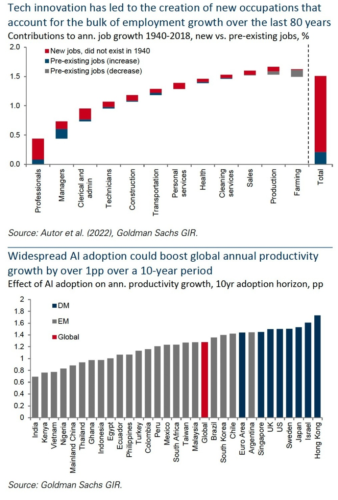

**影响巨大，但也有高度不确定性**

尽管我们估计人工智能的广泛应用对生产率增长的推动作用相当大，但它也具有高度的不确定性，最终将取决于人工智能所能完成的任务的难度水平、自动化工作的数量以及应用的速度。我们对这些因素的不同假设表明，对美国年生产力增长的促进作用可能在0.3-3.0个百分点之间，尽管在大多数情况下，这种促进作用在经济上仍然是显著的。

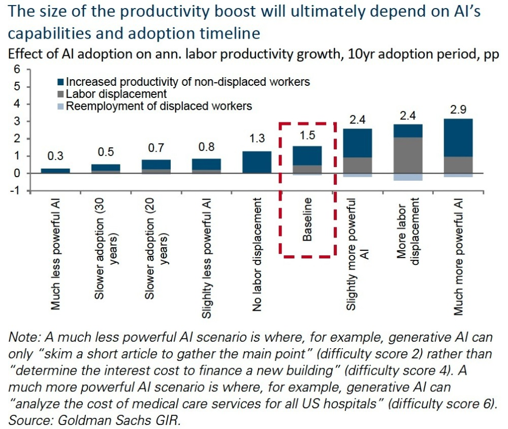

根据过去技术突破的证据，我们还认为， **生成式人工智能对宏观经济产生影响的时机尤其难以预测。**
例如，电动机和个人电脑带来的生产力爆发发生在关键技术突破后20年左右，当时大约一半的美国企业已经采用了该技术。

对生成式人工智能的兴趣激增有可能加速其采用，并导致宏观经济影响更快实现。然而，2019年美国企业的人工智能采用率仅为3.2%，尽管许多大公司目前正在探索如何使用人工智能，但只有约20%的首席执行官预计，生成式人工智能将在未来1-3年内降低劳动力需求。例如，在大多数公司开始将生成式人工智能纳入日常工作流程之前，公司仍需要克服数据隐私等一些采用障碍。因此，
**我们认为，至少在未来几年内，生成式人工智能的效果可能不会在总体生产率数据中显现出来。**

尽管如此，人工智能自动化所涉及的大量工作任务，以及我们对潜在生产率增长的可观估计，都凸显了生成式人工智能在兑现其承诺的情况下所具有的巨大经济潜力。事实上，将估计的生产率提升应用于我们覆盖范围内的国家，
**我们发现人工智能的广泛应用可能最终推动全球国内生产总值在10年内每年增长7%，即近70亿美元，因此我们认为人工智能对我们的中长期全球经济增长预测来说是一个重大的上行风险。**

**九、美国股市：衡量人工智能上行空间**

**高盛股票策略师瑞安·哈蒙德（Ryan Hammond）和大卫·科斯汀（David
Kostin）认为，与人工智能相关的潜在生产力提升可能为美国股市带来更多上涨空间。**

随着对人工智能的关注度急剧上升，美国科技股近期表现优异，其中一些股票创下历史新高。尽管近期涨幅较大，但我们估计，与人工智能相关的潜在生产力提升可能会在中长期内为标准普尔500指数的盈利和股价带来更大的上涨空间，尽管仍存在巨大的不确定性和风险。

**对美国生产力、收益和股票的潜在提振**

我们的经济学家估计，人工智能的广泛应用（我们假设将在10年内实现）可在10年内将美国生产率的年增长率提高1.5个百分点，并在10年内将实际GDP的趋势增长率提高1.1个百分点。根据我们的股息贴现模型（DDM）中的这些假设，我们估计标准普尔500指数未来20年的每股收益年复合增长率将为5.4%，比我们目前假设的4.9%高出50个百分点，在其他条件不变的情况下，标准普尔500指数的公允价值将比目前水平高出9%。

人工智能的广泛应用将使标准普尔500指数20年的每股收益比我们当前的假设高出11%。

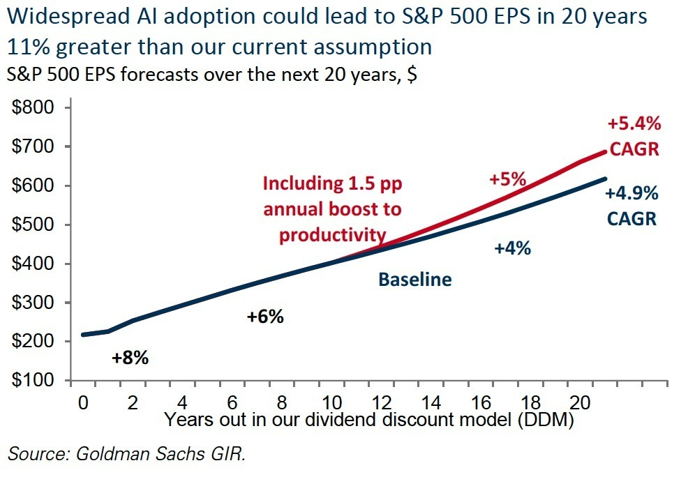

尽管如此， **人工智能对标准普尔500指数的潜在影响范围很广，因此投资者不太可能在短期内对其进行充分定价，主要原因有四点：**

1.我们的经济学家估计，采用人工智能对生产力增长的影响每年从0.3个百分点到3.0个百分点不等，这取决于采用的速度、人工智能的力量以及劳动力转移的广度。基于这一系列的生产率情景，我们估计标准普尔的上行空间为

500指数的公允价值可能小至5%，大至14%。如果国内生产总值和收入增长的提升也伴随着企业利润率的提高，那么潜在的上行空间可能会更大。

2.政策应对措施可能会限制公司保留人工智能带来的额外利润的能力。公司利润占GDP的比重与历史相比处于较高水平，而工资占国内生产总值的比重仍接近历史低点。如果采用人工智能导致企业利润增加而牺牲劳动力、政策制定者可以通过提高企业税率来应对。

实际公司税率需要提高8个百分点才能完全抵消未来标普指数11%的增长。

3.较高的利率环境可能会抵消标准普尔500指数公允价值的大部分潜在增长。虽然生产率提高导致价格下降可能会抑制通胀，并对利率构成下行压力，但我们的经济学家指出，人工智能可能会增加投资需求，进而提高对中性利率的估计，而中性利率是货币政策制定者决策中的一个关键因素。我们估计，在其他条件相同的情况下，利率只需在当前水平上调30个基点，就能完全抵消采用人工智能带来的公允价值上升。

4\.
标准普尔500指数的价格更明显地与近期的周期性动态挂钩，即使人工智能的应用可能在长期内提振标准普尔500指数。如果经济数据疲软，经济衰退的可能性增大（预测者一致认为未来12个月经济衰退的可能性为65%，而我们估计的可能性为25%），无论人工智能的长期影响如何，标普500指数的价格都可能下跌。

**狂热期望的危险**

在指数层面， **当前的股票风险溢价和长期每股收益增长预期与历史平均水平基本一致，表明投资者对采用人工智能的乐观情绪并未达到极端水平。**
然而，从股票层面来看，英伟达等最大的人工智能受益公司目前的估值与2000年代一些最大的网络泡沫繁荣受益公司（微软、英特尔）的估值相似，尽管没有最极端的例子那么高。互联网繁荣时期的历史先例表明了高预期的危险性。尽管大多数TMT公司在2000年至2002年间仍能实现强劲的销售增长，但由于未能达到投资者的高预期，导致市盈率大幅缩水50%以上，股价暴跌。因此，
**过高的增长预期是另一个值得关注的风险。**

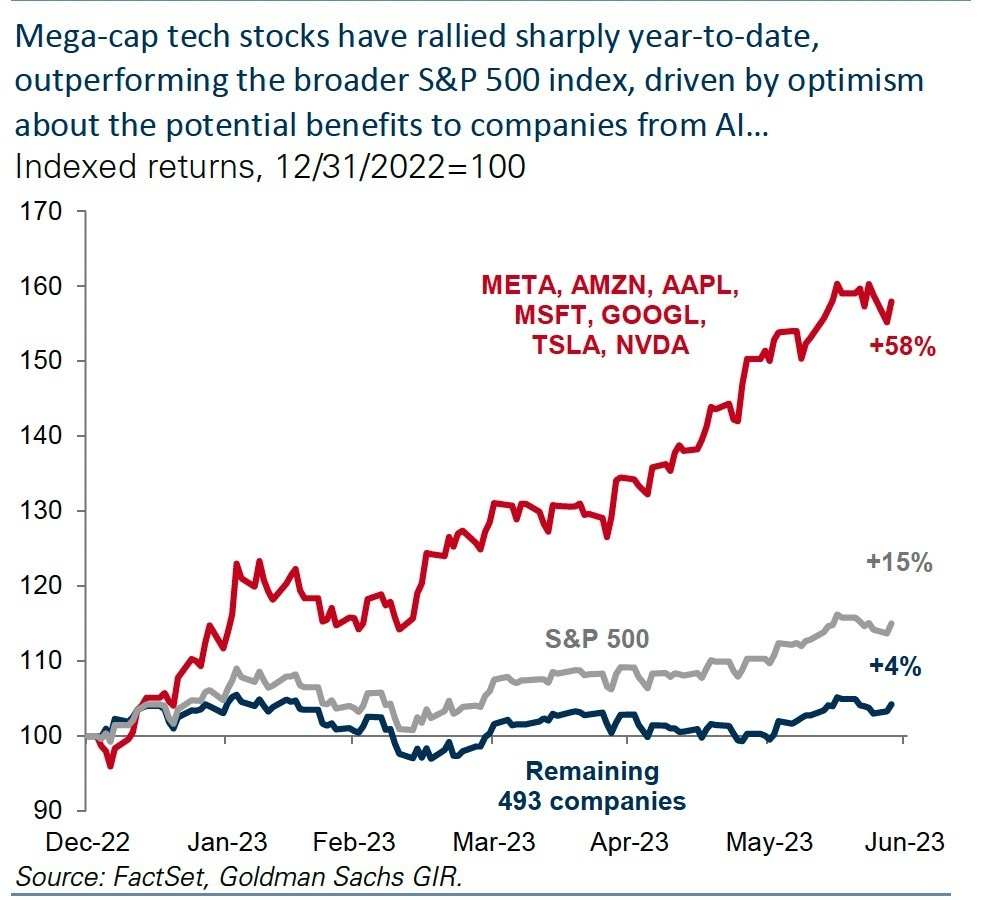

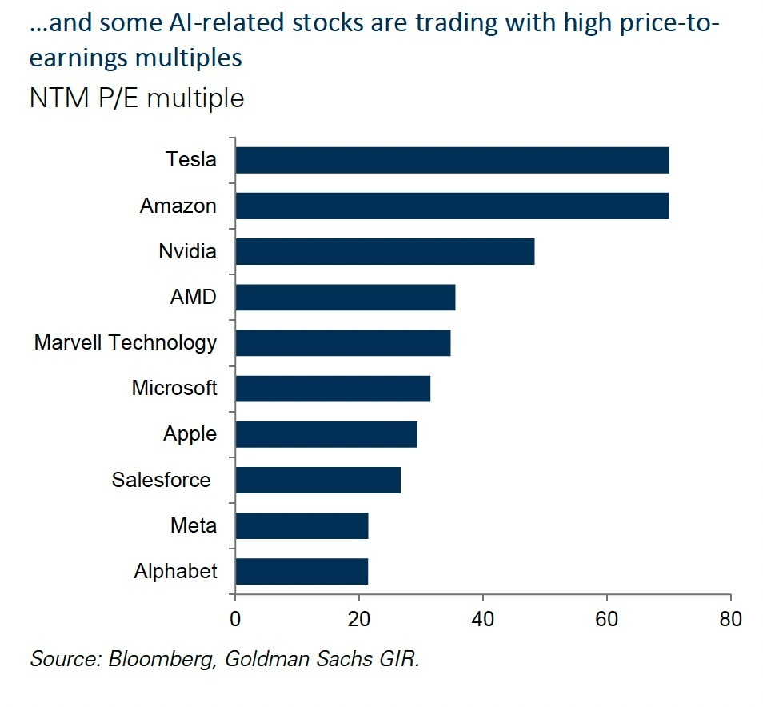

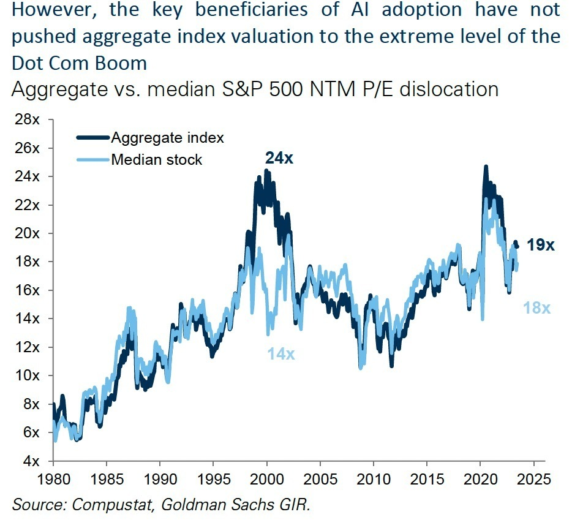

**十、过去生产力繁荣时期的市场**

**多米尼克·威尔森（Dominic Wilson）和维基·常（Vickie
Chang）评估了过去创新驱动的生产力繁荣对市场的影响，以及这对未来潜在的人工智能生产力繁荣可能意味着什么。**

随着人工智能有可能迎来一个生产力持续大幅增长的时期，一个关键问题是这将如何影响主要的宏观市场。我们将以史为鉴，探讨创新驱动的生产力繁荣对宏观市场的影响，重点关注两个重要事件：第一次世界大战后电力的广泛应用（1919-1929年）以及20世纪90年代末和21世纪初个人电脑和互联网的广泛应用（1996-2005年）。

当然，在这些事件中，生产力繁荣以外的因素也推动了市场。1997-1998年的新兴市场危机对全球经济和资产价格产生了重大影响，2003年后，中国加入世贸组织促使制造业发生重大转变。同样，20世纪20年代生产力繁荣的开始与战时经济向和平时期经济的过渡相重叠。由于数据的有限性和金融市场的变化，无法对这两个时期的主要市场进行全面比较。

但是，此前这些生产力繁荣时期的市场也有一些共同点：这两次繁荣都对股票和股票估值产生了最大的影响--
股票和股票估值大幅上升，而且最终都以泡沫和随后的萧条告终。我们发现，未来潜在的人工智能生产力繁荣与之前这些时期的一些关键特征相同，那么这种繁荣/萧条的循环会再次发生吗？

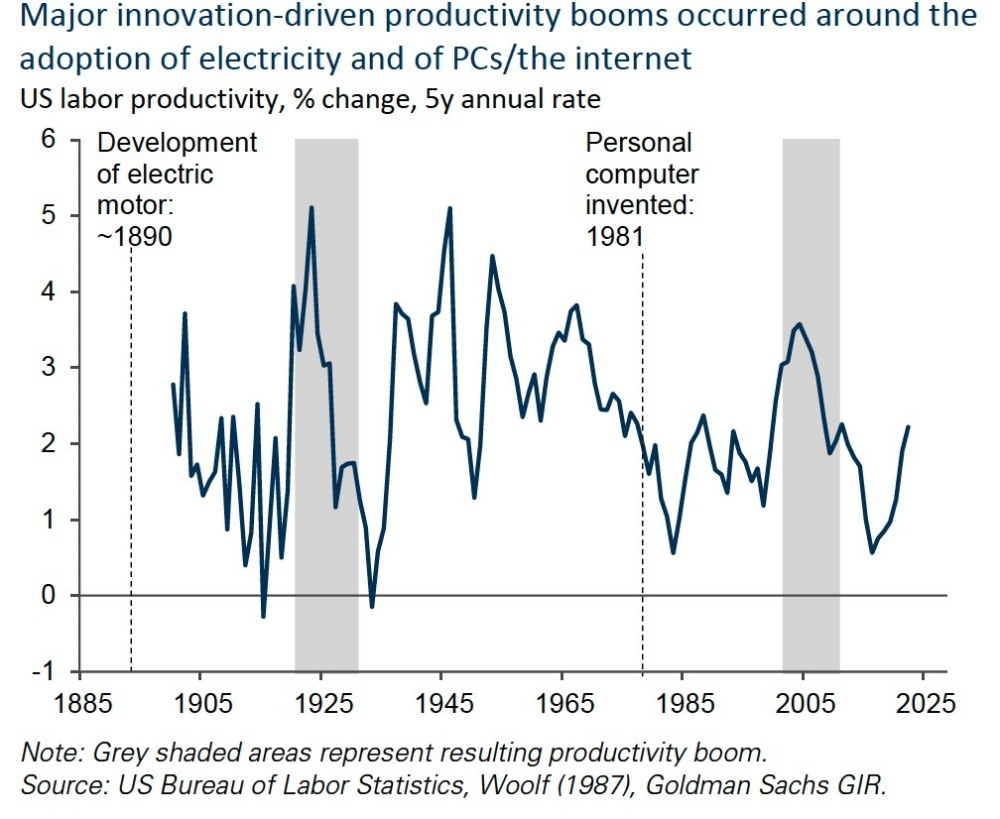

**九十年代的繁荣和崩溃**

在个人电脑/互联网普及期间（1996-2005年），美国股市取得了健康的收益，尽管并不引人注目。利润和盈利在一定程度上超过了国内生产总值，但标准普尔500指数的涨幅与名义国内生产总值涨幅基本一致。美元升值相对温和，除新兴市场经济体外，外汇净值变化不大。同样，在此期间，美联储基金利率和10年期收益率均有所下降，而与国内需求周期同步。石油价格在1997-1998年新兴市场危机期间急剧下降，但到2005年有所回升。

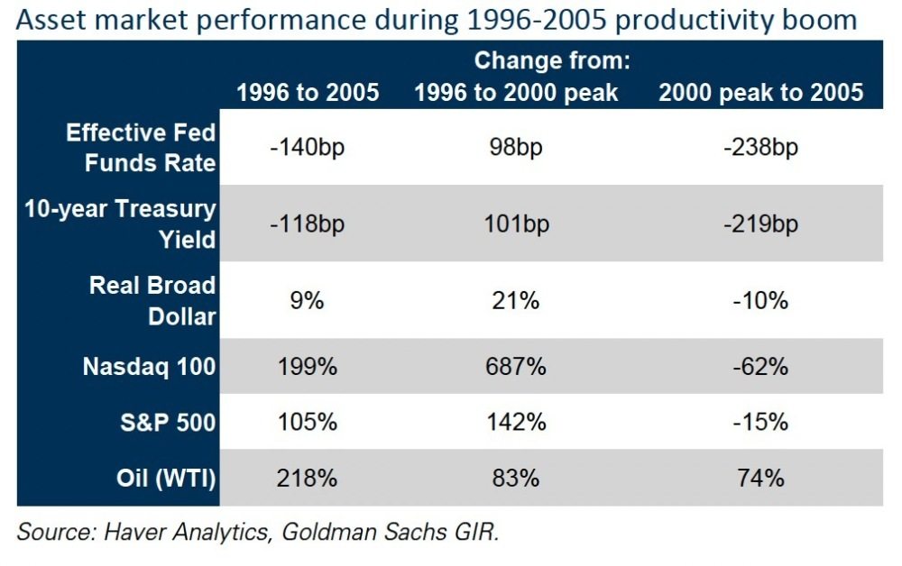

但是，这一时期内这些相对温和的变化掩盖了这一时期内更大的经济和市场繁荣与萧条。在最初的生产力繁荣时期，市场变动的模式（尽管不是幅度）符合（过度）预期的生产力繁荣
--股票大幅上涨，估值攀升至极端水平。

伴随着这些举措，国内经济大幅繁荣。投资占GDP的比重攀升，储蓄率下降，经常账户恶化。1997-1998年间，随着亚洲金融危机和俄罗斯违约事件的爆发，美联储基金利率和长期债券收益率均有所下降，但随着国内需求的蓬勃发展，基金利率在2000年升至新一轮周期的峰值。长期收益率也有所上升，但仍低于1996年的水平，因为低且稳定的通胀抑制了期限溢价。美元在20世纪90年代末大幅升值（2002年初达到顶峰），这主要归因于1997年和1998年新兴市场的贬值，但美元作为资本流动的首选接受者，对其他发达经济体的汇率也有所上升。然而，随着繁荣转为萧条，股票大幅下跌，利率下降，美元的大部分强势逆转。

1996-2005年期间，利润和收益超过了GDP，但标准普尔500指数的涨幅与名义GDP涨幅基本一致。

**疯狂的二十年代**

20世纪20年代，随着电力应用的普及，生产力得到提高，这方面的证据较为稀少，但也提供了一些相似的教训。同样，在生产力繁荣的同时，股票也出现了持续上涨和估值急剧攀升，但1929年的股灾最终还是接踵而至。利率和外汇的故事是由于货币政策和汇率管理方面的差异，很难与当前情况相匹配。在此期间，通货膨胀率极低。但美联储的贴现率再次跟随经济和股票周期，在1924年随着经济疲软而下降，之后稳步上升，并随着股票泡沫加速破灭而达到新高。

总体而言，这两次经验表明，对资产市场影响最大的是股票和股票估值，这两次都以泡沫告终。利率和外汇的行为似乎更多地受到国内需求的驱动，而非生产率增长趋势变化带来的持续结构性转变，尽管20世纪90年代为生产率大幅提高的经济体可能面临外汇升值压力的观点提供了一些支持。

**泡沫问题**

根据历史经验，近期美国股市已经成为人工智能相关生产力增长预期的焦点。我们的股票策略师已经为人工智能引发的生产力繁荣可能从根本上证明的股票指数上涨制定了基准（见第16页）。那么，市场是否会像历史经验所表明的那样，超过这些估值，从而产生泡沫，最终以破灭告终呢？

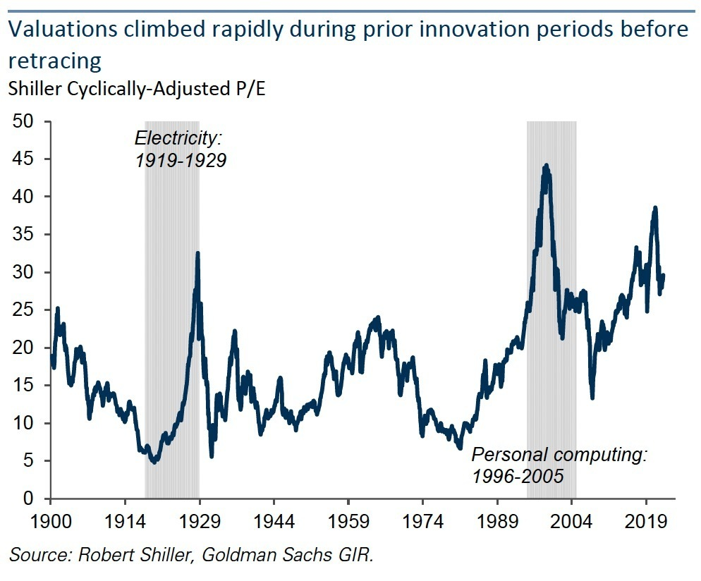

泡沫是一种复杂的现象，通常由动力和自我实现的价格动态驱动。但有几个原因可以解释为什么生产力繁荣会导致市场价格过高。

首先，投资者可能会陷入外推法的谬误。有了真正的创新，生产率的提高将是实实在在的。在短期内，生产率的加速增长甚至可以提高整个经济的利润份额。但是，平均而言，竞争或投资在随后的几年里在很大程度上侵蚀了最初的收益。这意味着，在创新期开始时，利润增长较快的阶段往往会随着时间的推移而被
"偿还"。如果市场将最初的利润增长视为持续性增长，那么盈利轨迹的长期潜在变化可能会被高估。

其次，投资者可能会陷入汇总谬误。在创新时期，一些单个公司可能会在一个新的投资机会的推动下实现惊人的盈利增长。但是，如果认为单个公司的情况与总体情况相同，那就大错特错了。即使在单个公司层面，竞争和市场进入最终也会限制持续高利润的潜力。由于潜在的“赢家”有时比“输家”更明显，投资者可能会在广泛的潜在赢家中为增加盈利的机会定价。其结果可能意味着整个经济的利润增长率不太可行。

第三，泡沫本身所推动的活动似乎为乐观情绪提供了理由。随着资产价格上涨，可能会鼓励投资和消费支出的繁荣。这本身可能会提高为这些领域供货的公司的盈利能力。但是，如果增加的收入和利润最终是建立在不可持续的需求之上，从而导致经济失衡，那么这些收益最终也将被收回。换句话说，资产价格被高估所造成的国内经济繁荣可能会助长人们的看法，即更高的利润增长是可以维持的。例如，在20世纪90年代末，国内经济繁荣造成了储蓄与投资的严重失衡，这种失衡最终在经济萧条时得到缓解，但却在一段时间内造成了更快的需求增长。

第四，如果生产率增长加速导致货币政策比 "应该
"更宽松，则可能助长资产价格高估。出现这种情况可能有几个原因：生产率增长加速可能导致通胀下行；中央银行可能迟迟没有意识到中性利率已经上升；或者不可持续的经常账户恶化可能推迟繁荣带来的通胀后果。当经济繁荣与其他抑制通胀的力量重叠时，这种风险尤为突出，美国在20世纪90年代末就是如此。

**保持真实的挑战**

综上所述，泡沫可以在没有这些条件的情况下形成，而且并非所有的高生产率时期都会导致泡沫。但生产率持续提高时期所面临的挑战是，潜在的经济变化既强大又真实。它们为资产价格上涨提供了基本面支持，并为一些公司创造了巨大收益的基础
--
即使这种基本面改善随后被过于广泛或过于显著地定价。即将到来的潜在人工智能生产力繁荣与过去导致这些问题的一些关键特征相同：突破性创新可能导致生产力和盈利能力大幅提高，从而为大量新投资奠定基础，并激发对更广泛创新周期的信心。

如果市场确实为人工智能生产力的繁荣付出了过高的代价，这有可能影响一系列广泛的资产价格变动。20世纪90年代的历史表明，这种动态不仅可能与一段不可持续的高股价时期相关联，而且还可能与更大的需求繁荣、更大的外汇升值以及领先国家的更高利率相关联。（无忌）

