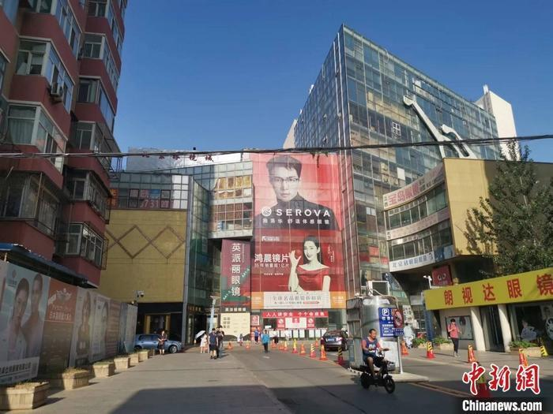
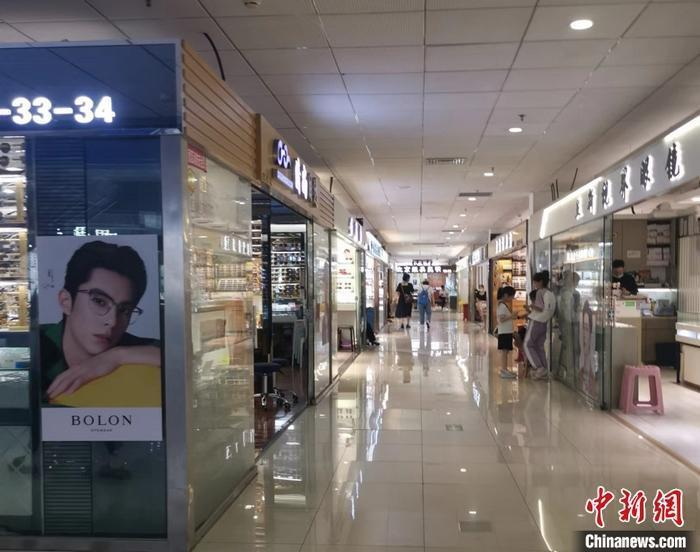

# 一副眼镜动辄上千，谁在“收割”近视眼

【 **民生调查局** 】

编者按：

这里是民生调查局，见人所未见，调查民生之变。关注你想关注的、你没关注的，调查你想看的、未看到的。

中新网7月17日电(中新财经记者
谢艺观)暑假来临，又到了学生配镜的高峰期。不过近年来，动辄数千元的配镜花销让家长们把近视和牙齿正畸、打生长激素一同列入了养娃“败家三件套”。

在眼镜界曾流传着这样一句话：“20元的镜架，200元卖给你是讲人情，300元卖给你是讲交情，400元卖给你是讲行情。”虽是吐槽之语，但也在一定程度上揭示了眼镜市场的“水有多深”。一副动辄上千的眼镜，成本究竟是多少？谁在赚取“暴利”？

几百元的镜框，批发价只需50元？

“镜架当时选的是店里最贵的纯钛镜架，标价六百多元，镜片选的是1.74折射率的，标价两千多元，最后店家打了个六五折，总共花费两千元。”

在北京市西城区工作的小倪一直被高额的配镜费用困扰，由于近视度数较高，她每次都选择1.74折射率的镜片，一次配镜费至少在一两千元，按照三年换一副算，是一笔不小的开支，而动辄四位数的花销也让她觉得自己可能是被“坑”了。

“下次要去潘家园配眼镜了，起码比路边的眼镜店要便宜。”小倪表示。她口中的“潘家园”，是指潘家园地铁站附近的北京眼镜城，聚集了一大批眼镜卖家。资料显示，这里曾是中国最早的眼镜专业批发市场。

_图为北京眼镜城。
中新网记者 谢艺观 摄_

在北京眼镜城的外面，记者遇到了正发放小卡片的吕强(化名)，他向记者热情地介绍起了配眼镜的价格。

当记者提到“在其他眼镜店，一个钛合金的镜架要价三四百元”时，他连说，买贵了，“我们是做批发的，在我们店里，钛合金的眼镜架只需要50元，纯钛的眼镜架，贵的才128元。”

在北京眼镜城走访多家店铺后，记者发现，如果不追求品牌，一百多元可以买到纯钛眼镜架，但若涉及品牌，价格会“水涨船高”。

王兰(化名)就在北京眼镜城经营一家店铺。她告诉记者，“店里150元的纯钛镜架，配镜片的话能便宜到120元，但如果是品牌，比如川久保玲，需要280元。”

她还补充道，“大品牌会存在品牌溢价，进货价本就偏贵。如果追求性价比，普通的纯钛镜架就可以。”

百元镜片和千元镜片无差别？

普通眼镜门店内动辄几百元的镜架，在北京眼镜城能便宜上百元，这也让不少人感叹，“千万不要随便进一家眼镜店，要不配完就后悔。”

让人们感受到高溢价的，还有五花八门的镜片。一位消费者告诉记者，“相比用材质区分的镜架，镜片的‘水更深’。”

一般来说，眼镜店会用1.56、1.60、1.67、1.74等不同的折射率来划分价位。度数越高，适合的折射率越高，价格亦会攀升。另外，不同品牌、同一品牌的不同系列，售价也会有所不同。其中，进口镜片中比较知名的有蔡司、依视路等，国产镜片的代表则为明月、万新等。

_图为琳琅满目的眼镜。
中新网记者 谢艺观 摄_

在吕强工作的眼镜店，一叠叠手册里标记着品牌各个系列的价格。他拿起蔡司的价格手册，向记者介绍起了智锐系列。记者注意到，1.6的智锐青春亚洲版数码型镜片(DP)，建议零售价为2980元。“在我们这，可以打三折。”吕强讲道，算下来价格不到1千元。

为抑制孩子近视的发展，在西城区工作的张成曾听从医生的建议，为孩子配了依视路的星趣控镜片。“
**当时医院报价近4千元，后来去了磁器口的一家眼镜店铺，最终花了1600元** 。”

谈及星趣控，吕强的老板打开了话匣子，“整个眼镜城没有低于1550元的，我们这可以给到1460元。”

整体来看，相较其他区域的眼镜门店，北京眼镜城的价格明显偏低。同样的配置，价格甚至能减少一半以上。而在北京眼镜城内，由于各家给的折扣不同，价格也能相差几十元乃至上百元。

另外，从消费者反馈看，不只是北京，各地的眼镜店价格普遍相差较大。为了避免被坑，很多人甚至会在网上先问价，先听取经验人士的意见。

“暴利”被谁赚取了？

面对随意谈定的价格，很多人疑惑，手里这副花了上千元的眼镜，成本到底有多少？有多少钱是被商家赚去了？

当记者询问眼镜的进货价时，吕强称，“50元的钛合金镜架，进货价是40元。”但对于镜片的进货价格，他只表示，进货价越高，卖得越贵。

_图为北京眼镜城内部。
中新网记者 谢艺观 摄_

明月眼镜作为“中国镜片第一股”，曾在招股书中披露，2020年，每片镜片的成本为6.77元，每副成镜的成本为60.33元。小小的镜片也带来了高额利润，2022年，明月眼镜镜片业务的毛利率达60.04%。

博士眼镜是国内专业从事眼镜零售的连锁龙头企业，同样有着令人艳羡的毛利率。其曾披露过2016年的价格数据，当时镜架的采购单价为89.06元，而同期的销售价格达506.88元；每片镜片的采购单价仅28.82元，同期售价则是281.75元，售价是成本的近10倍。

看到这组数据，你脑海中可能会浮现出“暴利”的字眼。但如果再看博士眼镜的净利润，就会发现，相比上游供应商，眼镜零售商的日子并不是那么好过。

财报显示，博士眼镜的销售费用居高不下。其中，工资、社保和房租、物业、水电费占据大头。

这也是很多眼镜店面临的压力。每个店面都需要配备销售人员和验光师，为了提高购买频率，还需要选址在相对繁华地段，房租自然较高。

吕强的同事也告诉记者，“我们卖得便宜，是因为走批发渠道。普通眼镜门店一天可能就只配三五副眼镜，如果不卖得贵些，就无法支撑下去。”

一系列成本下，也导致眼镜门店为维持运营、保证利润，在镜架和镜片上定价较高，最后的结果就是由消费者买单。

如何撕掉眼镜行业“暴利”标签？

面对眼镜门店肆意定价，在盘古智库高级研究员江瀚看来，消费者想要避免被“坑”，首先要选择正规的眼镜店进行配镜，并且要查看该店的资质证书和信誉度等相关信息。

“其次，在选择镜片时，可以根据自己的需要选择合适的品牌和质量等级，不要盲目追求高价或进口产品。”江瀚提到，“最后，在购买之前，可以事先了解一下市场价格和相关配镜知识，以便更好地判断商家的价格是否合理。”

但仅靠消费者自己注意识别、防范明显不够。如何使眼镜价格相对规范化和透明化，撕掉外人眼中的“暴利”标签，在江瀚看来，还可以通过加强监管、规范市场秩序等措施来解决。

此前，针对眼镜行业的“暴利”，曾有业内人士直言，一方面是因为行业巨头拥有很高定价权，另一方面则是产业链过长带来的低效。

而面对各个环节层层加价、销售成本居高不下，在业内人士看来，打破巨头对供应链的把持、缩短交易环节、为消费者提供性价比高的产品或才是国内眼镜行业发展的未来。

