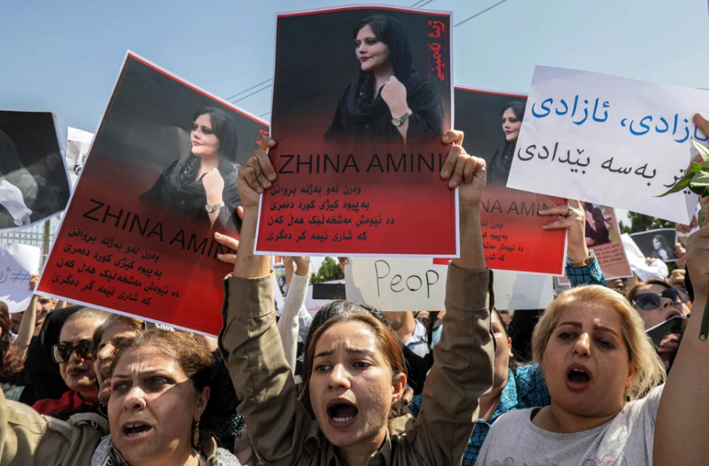

# 伊朗道德警察恢复巡逻，执行头巾法

【文/观察者网 李泽西】

据《法尔斯通讯社》等伊朗媒体16日报道，伊朗警方表示，将在全国范围内部署警力，执行当地的头巾法等“社会道德准则”。此时恰逢反对头巾法和道德警察执法的“阿米尼示威”爆发以来的第10个月。

_《法尔斯通讯社》报道截图_

伊朗警方发言人赛义德·蒙塔泽罗马赫迪（Saeed
Montazerolmahdi）表示，因“社会各界的呼吁”，并为了“保障社会精神安宁”、“夯实家庭”，将立即“在全国各地建立巡逻队，执行大量警察任务”，对衣着不遵守社会规范的女性进行提示警告乃至司法行动。他专门呼吁伊朗女性“维护头巾的神圣性”。

_蒙塔泽罗马赫迪资料图_

蒙塔泽罗马赫迪没有明确指出执法单位是否就是道德警察。不过，多家西方媒体报道称，德黑兰多地街道出现了恢复执法的道德警察，而道德警察本身也是负责头巾法等“公共道德”执法工作的单位。

据此前报道，2022年12月3日，伊朗总检察长穆罕默德·贾法尔·蒙塔泽里表示，道德警察“与司法部门没有关系，已被其创办机构废除”，但讲话未说明废除是无限期的还是暂时的，后来也并没有采取解散道德警察的行动。

西方媒体报道称，道德警察在过去的几个月内“基本上从街头消失了”，不少女性也公开无视头巾法。不过，伊朗在此期间更多倚重其他执法措施，比如安装摄像头识别违反相关法律的人。

自1981年——伊朗伊斯兰共和国建立后两年——所有女性都被规定必须在公共场合遮住头发，穿宽松的长衣以掩饰身材，违者可能被监禁10至60天并鞭打74下。伊朗认为，要求所有女性佩戴头巾可避免“引诱男性”、“败坏社会道德”等现象，称头巾是“伊朗民族的文明基础之一”和“伊斯兰共和国的实际原则之一”，并表示在这个问题上不会“退缩或容忍”。

改革派则呼吁废除该法令，称是否戴头巾应为个人选择。

2022年9月16日，22岁的伊朗女子玛莎·阿米尼（Mahsa Amini
）因涉嫌违反头巾法被道德警察拘留后陷入昏迷死亡，随后在阿米尼的故乡库尔德斯坦地区以及伊朗首都德黑兰等地引发了大规模抗议，人们走上街头焚烧头巾。据包括伊朗政府在内的各方统计，“阿米尼示威”期间至少有200名示威者死亡，数千人受伤。

_2022年9月24日的阿米尼示威（图源：AFP）_

随后，以美国为首的西方国家发表声明支持伊朗的抗议者，伊朗则谴责部分国家试图以人权问题作为政治筹码，干涉伊朗国内事务。

蒙塔泽里在2022年12月3日的演讲中曾表示，伊朗议会和司法部门正在重新审查头巾法。不过，伊朗后来没有改动相关法律，随着“阿米尼示威”逐渐降温，伊朗政府多次呼吁女性遵守头巾法。

**本文系观察者网独家稿件，未经授权，不得转载。**

