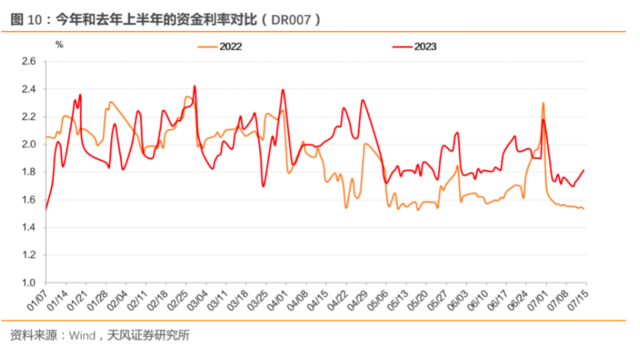
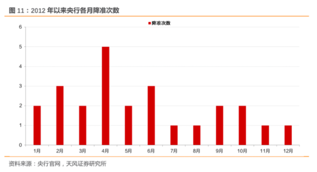
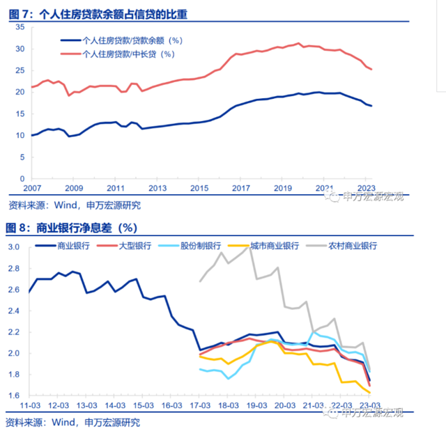
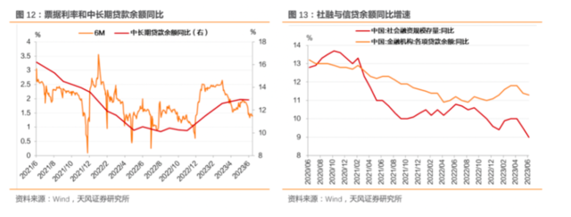
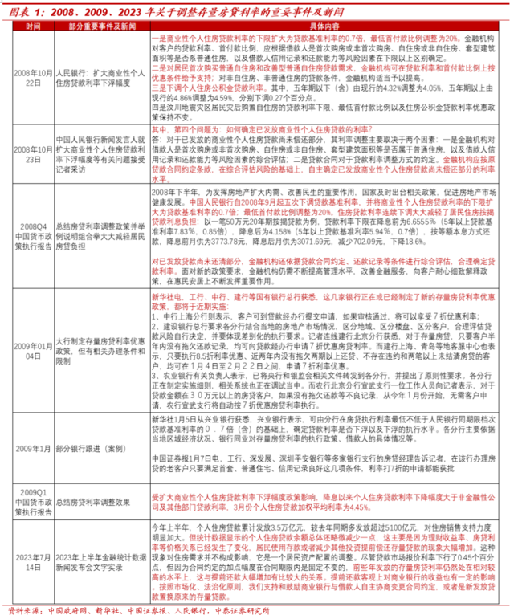

# 周末，“降准降息”讨论刷屏，可能性多大？最早什么时间？

央行上周在上半年金融情况发布会上有关房贷利率和存量房贷置换的表述引发热议。相关政策靴子落地前，围绕“降准降息”的讨论冲上热搜。

根据当前公布的研报，各机构对于近期降准降息存在一定分歧。天风证券认为近期降准降息的可能性不大，降准最早可能发生在9月或10月，而降息窗口可能在四季度。申万宏源表示存量房贷与存款利率下调可期，7-8月或降准25BP，华创也表示降准概率较月初提升。

**降准在7月还是9月？**

7月14日，央行召开2023年上半年金融统计数据新闻发布会。会议召开后，市场降准预期再起。

不过，天风证券孙彬彬团队认为，当前总体流动性有所好转，降准的可能性不大。

虽然税期前夕，资金利率有所走高，CD利率上行，目前总体流动性状态与今年一、二季度相比，降准的必要性并不算高。

如果真要说降准，逻辑上要考虑逆周期政策进一步发力，出于支持结构性工具运用和稳定银行息差的目的。结合历史，三四季度之间，增量政策进一步运用的背景下，即9月或者10月有可能再度降准。

申万宏源屠强团队认为，近期市场可能看到中性降准。

本次发布会央行对降低存量房贷利率、或新发贷款置换存量贷持开放态度。但掣肘存量房贷利率下调的因素在于银行净息差较低、而居民贷款又是主要利润来源。

居民存量房贷的利率下调将开始启动，而考虑银行和居民之间的博弈，调整的时间会拉长，而非“一蹴而就”。

但随存量房贷利率调整，商业银行的净息差修复仍需有赖于负债端成本的下降，降准仍是较优选择，本次会议央行也传达出这一信号。

因此，申万宏源维持7-8月降准25BP的判断不变。

华创宏观张瑜团队认为，降准概率较月初边际提升，一方面邹澜司长明确表示综合运用存款准备金率等工具，另一方面判断降准的信号指标（央行对其他存款公司债权/央行总资产）六月大幅上行。

华创宏观认为，
由于当下房贷利率仍高于居民购房收益，股票收益和理财收益，因此资产配置视角来看，由于缺乏高收益资产，相较于贷款置换，提前还款或仍是更适宜的选择。

**降息如何演绎？**

而对于降息，天风证券表示，央行不太可能在三季度降息，最早可能在四季度。

本轮宽松周期的三次降息分别发生在2022年1月、2022年8月和2023年6月。从这一角度观察，我们认为央行两个季度内连续降息的可能性不大。

其次，本轮宽松周期的三次降息均发生于信用投放状态不稳定的背景下。6月社融超预期，结构亦有显著改善，7月以来票据利率亦有企稳迹象。因此，当前降息的金融前提略显不足。

再次，三次降息都面临显著提振经济主体信心和市场预期以应对预期转弱的现实压力。6月降息落地仅一个月，增量政策仍然在研究推出的过程中，所以近期再次降息的可能性似乎也不高。

最后，考虑在当前海外尚未停止加息，央行操作仍可能需要关切内外均衡。特别是当前人民币汇率贬值压力依然存在，央行大概率会避免使用信号意义过强的工具。

申万宏源屠强团队持不同观点，认为市场可以期待存量房贷与存款利率近期下调。

近期存款利率下调或更直接。考虑到今年6月个人住房贷款利率仅有4.11%，较2021年底下行152BP，仅通过降准难以完全缓和净息差压力，则存款利率再度调降也成为可能。具体节奏上，可能和存量房贷的重定价进度有关。

中泰银行戴志锋则表示，存量房贷全面下调的可能性较低。

复盘2008-2009年存量利率调整情况，与今年情况相似，均是银行与个人自主协商变更合同约定，或是新发放贷款置换原来的存量贷款。

在市场化协商和博弈的过程，考虑个人的资金还款能力，预计存量房贷下调比例不会很大。我们测算08、09年享受存量房贷利率置换的比例小于6%。

本文不构成个人投资建议，不代表平台观点，市场有风险，投资需谨慎，请独立判断和决策。

