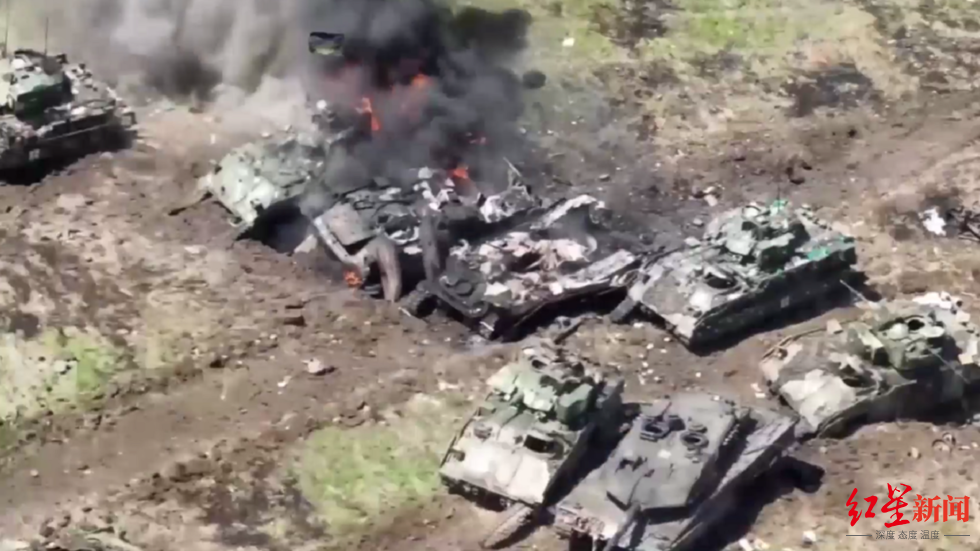
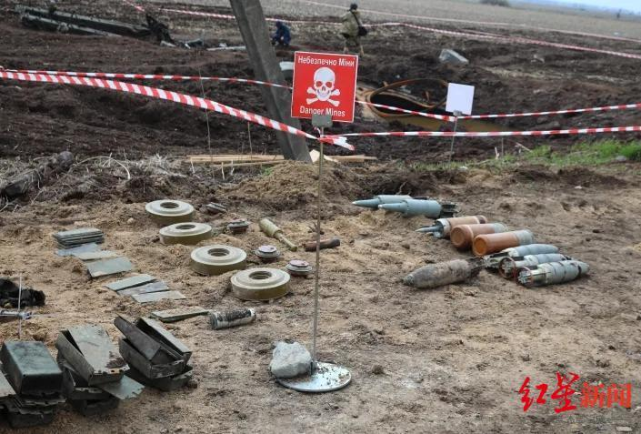
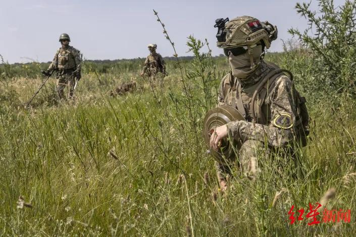
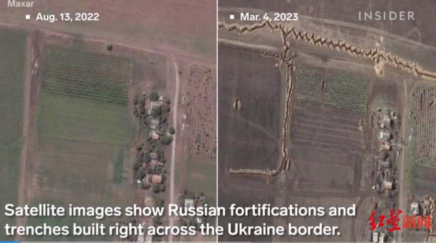

# 密集雷区宛如“20公里地狱”！乌反攻遇最棘手难题：丢下西方精锐坦克，徒步推进

_▲被摧毁的西方坦克和装甲车_

7月13日，美国国防情报局局长约翰·科奇霍夫在一次会议上称，乌克兰的战斗已经陷入了“一点僵局”。

自6月初开始，乌克兰军队沿着赫尔松到顿涅茨克的前线对俄军发动了一系列反攻。但在反攻打响五周后，乌军尚未突破俄军的主要防线，且损失惨重。根据前线指挥官和士兵的说法，令乌军反攻陷入僵局的“最棘手问题”是无法突破俄军布设的巨大雷区。

据7月16日的最新报道，大量的地雷不仅让乌军在反攻前两周就损失了20%的坦克装甲，还令乌军指挥官暂停反攻，改变了战略。据悉，乌军部队如今已被迫放弃使用西方提供的坦克和装甲车，改为一边人工清理地雷，一边缓慢步行向俄军据点前进。

_▲乌方在清理地雷时发现了未爆弹药和其他爆炸装置_

**“20公里的地狱”：西方精锐装备不敌古老的地雷阵**

6月初，乌军从乌克兰南部地区至少三个地点向俄军发动了进攻行动。然而他们发现，土地里埋设的大量地雷、绊网、诡雷及简易爆炸装置，令他们在距离出发地点仅几英里的地方就陷入了困境，大量装备遭到破坏。

有媒体在最新报道中援引美国及欧洲官员的话称，在进攻的最初两周，乌军的损失就达到了最高水平——多达20%的坦克和装甲车被摧毁。其中，由北约训练的乌克兰第47机械化旅在两周内损失了30%的布拉德利战车，而第33机械化旅在一周内损失了近10辆德制豹式坦克。

据开源情报组织Oryx的数据，美国援乌的布拉德利战车至少已有三分之一（34辆）“被肉眼证实被遗弃、损坏或摧毁”。今年1月，五角大楼曾将布拉德利称为“坦克杀手”，称它们将“在乌克兰战场上带来优势”。还有分析人士称，这是“改变游戏规则”的装备。

_▲6月24日，乌军第102国土防卫旅的地雷引爆部队的士兵正在进行训练_

分析指出，尽管俄乌冲突展示了一些全球最新的战时技术，从空中、海上无人机到先进的电子战系统，但根据乌克兰前线指挥官和士兵的报告，大量地雷、绊网、诡雷等“老牌武器”正在战场上造成更多的破坏。

由于乌克兰反攻的“长时间集结”令俄方有“很多时间”加强防御，他们在关键据点前5公里至16公里的地方密集布设了地雷和绊网。截至6月，乌克兰至少有20万平方公里的土地被俄军埋设了地雷。想要抵达俄军防线，乌克兰军队必须穿越布满了几十种地雷的土地，这些地雷由塑料和金属制成，形状像嚼烟罐或汽水罐，有“女巫”和“叶子”等五花八门的名字。

美国退役将军马克·金米特指出，试图突破俄罗斯的防御，包括成排的战壕、反坦克陷阱、雷区和铁丝网，就像试图穿过“20公里的地狱”。进入过雷区的乌军士兵也表示，乌克兰南部的雷区巨大而且复杂，超出了之前的认知。

乌克兰军方称，这些防御措施成功地减缓了乌克兰军队的前进速度。与此同时，这些雷区也暴露了西方提供的装甲部队的局限性。

乌军总司令扎卢日内在7月15日的最新采访中表示，新运抵乌克兰的西方坦克存在弱点，因为它们无法单独突破由反坦克和杀伤人员地雷支撑的俄罗斯防御体系。“仅仅靠一辆装甲坦克是做不到任何事情的，因为雷区太深了，迟早它会停下来，然后被集中火力摧毁。”他说道。

_▲乌军总司令扎卢日内_

**乌军一度暂停反攻，现已抛弃西方坦克装甲“徒步推进”**

俄罗斯国防部的最新数据显示，乌克兰军队在没有空中支援的情况下穿过雷区，损失了2.6万人和3000多件军事装备。据俄罗斯总统普京7月13日称，自上个月初以来，俄军共摧毁了311辆乌克兰坦克，“其中至少有三分之一是西方制造的坦克，包括豹式坦克。”

“它们全被烧毁了。”一名乌克兰士兵说道，他目睹了至少6辆西方装甲车在俄罗斯的一次炮击中被摧毁。另一名乌军士兵则表示，他所在部队的布拉德利坦克每天都会碾过俄军埋下的反坦克地雷。虽然里面的士兵通常能幸存，但战车抵达俄军防线前就已无法动弹。

由于损失惨重，在开启反攻两周后，乌军指挥官改变了战术，随后损失率降至10%。“但这一好消息掩盖了一些严峻现实”，损失减少的另一个原因是反攻已经放缓，在一些地方甚至已经停止。报道称，美国官员承认行动一度暂停，并表示乌军已经重新开始行动，但更加谨慎，在穿越雷区方面处理得更好。

_▲上周在乌克兰地区的一次训练演习中，士兵们准备用绳子拆除一枚反坦克地雷的雷管_

近日，乌总统泽连斯基也承认，反攻行动曾短暂暂停，并指责西方国家未能向乌克兰提供足够的武器和设备，以成功开展行动。目前，乌克兰方面正在呼吁西方盟友紧急提供远程排雷设备和F-16等现代战斗机来提高其地面能力。

一位不愿透露姓名的乌克兰高级官员说，乌克兰从西方获得的排雷和工程设备不到其要求的15%。据悉，乌克兰正在使用美国提供的M58排雷（MICLIC）系统，但由于不断受到俄军导弹或火炮袭击，扫雷设备的损耗率也十分高。

对此，扎卢日内解释道，“是的，它们也在被（俄乌）摧毁。这没什么不对的。这需要很多（扫雷）设备。”一位美国官员称，美国正在寻求提供更多的扫雷系统及其使用的费用。

乌军内部人士称，密集的雷区迫使乌克兰军队改变了其反攻战略。如今，乌军部队已经放弃了西方盟国援助的主战坦克和步兵战车，改为在前线缓慢步行前进。与此同时，由于扫雷设备成为俄军袭击的“头号目标”，乌军不得不派遣工兵部队人工进行繁琐且危及生命的排雷工作。

_▲卫星图像显示，俄军在与乌克兰接壤边境修建的防御工事和战壕。报道截图_

负责排雷的士兵用长探针和金属探测器，在布满诡雷的地区一点点艰难识别、挖掘地雷，为步兵清理出一条约2英尺宽的狭窄道路。然后，排雷人员会沿着小路往回走，把路再扩宽一英尺或更多，以便两名士兵能同时肩并肩抬着担架行走。一位乌方军医表示，在他近期治疗的士兵中，地雷已经超过火炮，成为造成乌军士兵受伤的主要原因。

然而，这项工作绝非易事。“要清除地雷，你需要有很大的动力和冷静的头脑。”
乌军排雷专家普雷西亚日纽克说，“这是一项非常精细的工作，就像外科医生一样，但与此同时，你周围在不断爆炸。”此外，俄军仍不断通过无人机向乌军已经清理的地区空投更多地雷，令乌克兰的清除工作进一步复杂化。

红星新闻记者 徐缓

编辑 潘莉 责任编辑 魏孔明

