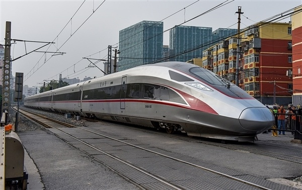

# 我国建设全球最长、最大高速飞车试验线：时速可达1000公里

我国高铁速度已经超过了350公里/小时，新一代450公里时速的列车也在研发中，未来还有600公里时速的磁悬浮列车，更高级的则是试验中的高速飞车技术，速度可达1000公里/小时。

高速飞车山西省实验室主任、中国航天科工集团有限公司磁悬浮与电磁推进技术总体部主任、高速飞车项目总设计师毛凯日前在采访中表示，山西大同建设的试验线是目前全球在建距离最长、规模最大的全尺寸超高速低真空管道磁浮交通系统（简称“高速飞车”）试验线。

**高速飞车未来可用于超大城市群之间的交通运输，设计时速达1000公里。**

今年1月份，超高速低真空管道磁浮交通系统全尺寸试验线(一期)首次超导航行试验在这条试验线上取得成功。

本次试验采用超导航行器，在完成超导磁体制冷、励磁之后，按照试验程序先后完成了3次航行试验，在210米线路上航行速度超过50公里/小时，各系统工作正常，
**实测航迹与理论曲线一致性好，完成了试验大纲规定的试验内容，试验取得成功** 。

本次试验是国内首次全尺寸超导航行试验，验证了高动态超导磁体、大功率多重变流器、耐高压集成模组、高激振悬浮构架、高精度定位测速、密闭空间管道无线通信、全过程安全控制、高精度轨道智能巡检等关键技术，初步验证了高速飞车系统总体方案的正确性和工作的协调匹配性。

超高速低真空管道磁浮交通系统全尺寸试验线(一期)项目，是中国航天科工集团与山西省人民政府“央地合作”示范项目。

项目于2021年9月获批立项，2022年4月正式开工建设。截至目前，项目已完成试验基地和首期试验线基础建设、首段设备集成调试及永磁、超导航行试验。

