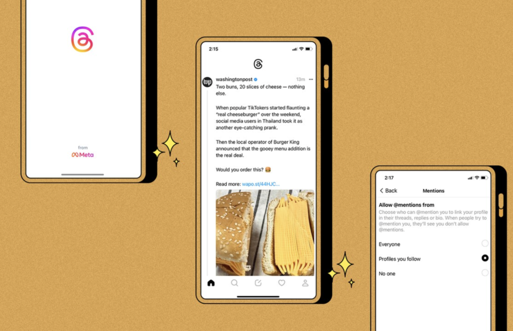
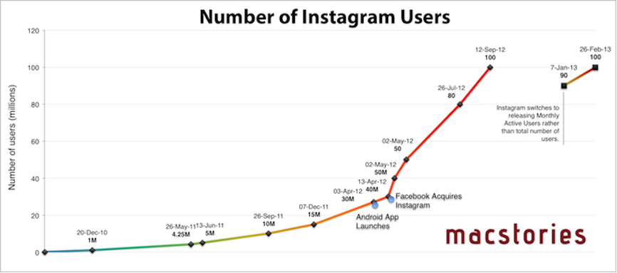
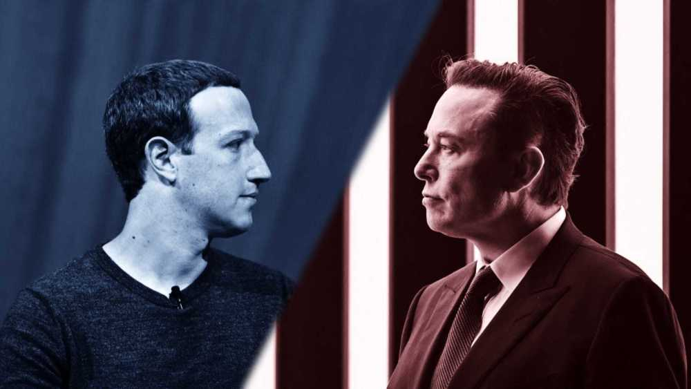

# 扎克伯格力推的Threads用户过亿，但马斯克不一定会输

划重点

  * _1_ Threads 的初步成功很大程度上依靠拥有 20 多亿用户的 Instagram 的助推以及其竞对推特尚处于混乱局面，而“网络效应”能否长期发挥作用犹未可知。
  * _2_ 尽管推特被外界看来危机重重。但相关数据显示，其 DAU 在过去四年整体一直上涨，即使在马斯克接管后也一样。
  * _3_ 推特的特殊之处是可以将新闻人物、新闻爆料者和新闻迷聚集在一起，在文化和话语权方面愈发重要，以至不少政界人物都有意依赖它来运作，这也是 Threads 的阻碍点。

_本期为硅谷封面第15期，解读Threads和推特之争。由硅谷封面和RockFlowUniverse联合发布。未经允许，请勿转载。_

近日，Meta 的 Threads 火了。背靠 Instagram 的它在上线一周后便收获超 1
亿注册用户，引起了众多广告商的注意。多家数字营销机构和行业专家表示，Threads
或将成为众多广告商期待已久的推特替代品。甚至有行业人士认为：随着推特在马斯克领导下和用户的矛盾日益尖锐，Threads
可能会代替推特。然而事实真的是这样吗？ 本文将对 Threads 在当下节点的推出做一个深入但简要的分析，并尝试回答全网最关注的三个问题：

① Threads 的阶段性成功为何是一种必然？我们应对其保持乐观还是悲观？

② Threads的出现对推特、Instagram、TikTok 的格局是否会有影响？

③ 马斯克和他的推特真的输了吗？推特究竟还有没有未来？

**01 Threads 的阶段性成功是必然，但需保持谨慎和悲观**

Threads，这款基于文本的“推特克隆版产品”仍在引发热议。它在 24 小时内吸引 3000 万用户，随后一周注册用户破亿。这个数字显然不会是
Threads 的上限。对 Meta 来说，3000 万仅占其数十亿用户群的 1-2%，毕竟它还没有动用旗下用户体量最大的产品——Facebook。

Threads 的上线首当其冲会给推特带来不小的危机和冲击。十多年前，推特偶然发现了一些具有极强的 PMF（Product-market
fit，产品市场契合）和网络效应的功能，随后将之打造成差强人意的产品。它保持服务器正常运行，并开发出能够勉强盈利的广告业务，但一直没能做到更多。直到去年，它仍有超过
2.5 亿用户，而与之同时代的 WhatsApp、Facebook 和 Instagram （下文简称为 Ins）各自早已超过 20
亿。作为政治、媒体、科技等行业内的重要发声地，推特自有其不可替代的地位。但我们知道，作为一个社交网络或上市公司，它远远不够完美。今天，Meta
试图给海外用户一个新的选择。

Threads 用户破亿，其实是这场筹备下的必然，尤其是当下社交环境市场，用户也亟需找到一个释放的入口。 **Threads
的初步成功一定程度上得益于推特的混乱，另外 Threads 自身也有一些优势：Threads 要求用户拥有 Ins
账户，这种关联让用户注册基本实现无缝衔接（Ins 有 20 多亿用户）** 。

在过去两周，Meta 通过多个渠道发布了数百篇“Threads
即将到来”的文章。每个阅读新闻（推特的主要用例之一）的人都知道这个消息。用户可以预安装，因此它一上线他们就会收到推送。Threads
甚至还比计划提前一天推出，引发了疯狂的试用热潮。

再看推特，虽然马斯克一直在敦促离开推特的名人重新回归，但问题是，他们中的多数也在 Ins 拥有大量追随者。过去，因为推特和 Ins
本质上还是完全不同的内容形式和游戏，因此名人的回归尚有可能（毕竟 Ins 主要承载图片）。但现在如果他们想尝试以文本为主要的形式，Threads
成为了最好的冷启动平台。

**借助已有兴趣和社交图谱构筑一张新的网络，这是 Meta 做的相当明智的事情之一。** 对 Ins 优质创作者来说，Threads
比推特更方便从头开始；对普通用户而言，熟悉的名人也让他们更有动力上手使用。

**此外，Threads 还借鉴了TikTok的推荐算法** 。Musical.ly 创始人 Alex Zhu
曾将启动一个新的平台比喻成打造一个新的国家——如果你需要建立新的经济体系、增加人口以及吸引强国人才。新机遇才能培养新赢家，如何有效提供这样的机遇？如何通过快速引导和流量分配将社交资本传递给最有才华的创作者？参考
TikTok 的推荐算法就是答案。对于任何一个时代，大部分收益都会流向平台最早的用户。随着平台逐步老化，上升通道几乎锁死，挖掘价值开始变得困难。TikTok
曾经赢得了非常庞大的海外新一批想要在社交媒体中赢得话语权的人，Threads 希望复刻这样的成功。

**除了己方努力，来自推特的“助攻”也是用户转移至 Threads 的动力之一。**
目前，推特的反对者正越来越多，不少人对马斯克抱有蔑视和反感，尤其是记者和左派。一些人在反抗，另一些则有寻找新家的愿望。而需要注意的是，新家的建设者——扎克伯格——在过去五年也遭受了很多批评。这就有点像：“敌人的敌人是朋友”。

另一个值得玩味的重要因素是 Threads 的发布时间。夏季是社交媒体发布的旺季，因为青少年放假，有更多时间使用手机。2021
年讨论热度较高的三款拍照产品：Poparazzi、BeReal 和
Dispo，也正是在当年夏天彻底出圈。虽然也需要承认，当前的成功可能是几个月后的隐患。随着暑假结束，大量年轻用户有不小的流失风险。

在 Ins 负责人 Adam Mosseri 眼中，Threads 的目标是为社区创建一个公共广场，并促进更友善的环境。那么，它有多大把握真正做成这件事？

上一款一天之内争相涌入数千万人的社交平台的问世距今已经很遥远（上一个的爆款应用是 2012 年爆火的 Ins）。即使是 2021 年用户数突破 10 亿的
TikTok，在美国一开始也是一款有点小众的应用，其文化是由众多引发潮流的 Z
世代用户定义，直到后来被更广泛的圈层了解、使用后才开始形成更丰富的文化特征。从这个角度来看， **Threads
算得上是多年来千禧一代集体加入的第一个体量庞大的新兴社交平台。**

但从使用体验来说，至少当下，我们没能看到一个对推特有足够威胁的模仿者。许多急于下载 Threads 的人似乎是为了尽早抢占潜在的新粉丝，以至于现在的
Threads 充斥着很多“噪音”。最近数年，太多人在抱怨社交平台强制铺开的算法尝试和不够友好的信息流排序，当有机会终于在 Threads
上做些不同的事情时，不少人又回到了追求吸睛、点击量和参与度的陈词滥调中。

要知道，Ins、TikTok和推特之所以走到今天，是因为每个平台都赋予了用户独特个性。每个产品都对应了一个你自己，每当你试图偏离时，会迅速意识到你需要将自己的“品牌”重新保持一致。

但中肯地说，Threads 目前还看不到取得类似成功的可能性，而且它似乎难逃推特等其他平台遇到的挑战。加州大学洛杉矶分校教授社交媒体营销的 Lia
Haberman 说：“随着越来越多的人进入这个平台，他们不得不执行审核政策、开始推出品牌内容合作和广告，Threads 会遇到越来越多我们已知的情况。”

此外，在上周，Threads 日活和用户时长均下降。根据营销数据公司 Sensor Tower 表示，周二和周三的日活跃用户数较前一周周六下降了约
20%。Threads 需要面对的挑战还有很多。

**02 Meta 早该做的反击，或可扭转被压制的局面**

简要回顾近二十年美国社交产品的发展脉络可以发现：社交网站 Myspace 于 2003 年推出，一年后，专门针对拥有大学电子邮件地址用户的 Facebook
上线。它不仅精准抓住了桌面端转向移动端的流量浪潮，还依赖 2006 年推出的 News Feed 俘获了海量用户。Myspace 的使用量在 2008
年达到顶峰，Facebook 在 2009 年正式完成超越。2011 年，按时间顺序排列的 News Feed 被逐渐淘汰。算法时代正式开始。

而 **推特来自一个完全不同的进化分支。它于 2006 年问世，最早来此的是博主和记者，** 在成立之初的大部分时间里，他们用它来报道新闻、抒发观点。随后从
2009 年开始，许多亚文化在这里陆续涌现。

其实，在过去十年里，Facebook 是个相对安全的算法围墙花园，而 **推特更像一个文化广场——公民们在这里参与一场社会、政治、经济实验。**
随着时间推移，推特在文化和话语权方面愈发重要，以至于总统都有意依赖它来运作；Facebook
则继续一路狂奔，依靠附属应用和多种用例持续增长，俨然塑造起一个宏伟的“社交帝国”。

马斯克收购推特之前，杰克·多西的管理策略似乎是 2015-2021
年推特稳住局面的秘密武器。他能够用足够灵巧的规则和容忍度平衡足够多的人群，使得不同群体找到自己舒服的使用方式。比如你可以讨论时政，讨论艺术，讨论科技，少数群体甚至可以自由表达对西方社会权力结构的不满。最重要的是，它创造了很多非常好的、有持久生命力的
Meme（模因）。与之相比，Facebook 显得暮气沉沉。

现在有了 Threads。Meta 显然试图复刻自己 2016 年上线 Story 功能狙击 Snapchat 的策略，通过精准模仿竞争对手的
UI、交互和用例，将其移植到自己的网络上从而干掉对手。有一个比喻很精准——“Threads 就像是你喜爱的当地餐厅在机场开了个分店。”

Meta 对此早已十分熟稔。早在 2012 年收购 Ins 时，它就能有效借助 Facebook feed 帮助 Ins
快速获取并转化新用户。如下图所示，有研究显示，在完成收购后的几年里，Ins 下载量有 50-75% 最终来自 Facebook。因此，对 Threads
而言，这次大规模的获客试验不过是十多年前 Ins 有效增长的又一次例证。既然 Meta 曾经能为新用户创造崛起的机会，这一次也并不困难。

_（Instagram
用户增长曲线）_

更不必说，当年 Ins 抄来 Story 不只对 Snapchat 起到了防御作用，也极大加快了 Ins 自己的发展步伐。在遏制 Snap
的用户增长之后，Meta 还通过旗下广告团队遏制住了 Snapchat 大幅盈利的可能性。这一切，似乎都像是今天 Threads 之于推特的翻版。

再进一步来看，如果这个基于文本的社交产品有了一定规模，Meta 旗下 Ins 也将获得更大的发展空间以制衡
TikTok——包括在图片、视频方向引入更激进的试验等， **扭转过去几年在用户增量上被 TikTok 持续压制的局面。**

最不济的，即便 Threads 最终发展不够理想，按照知名投行 Evercore ISI 的分析师测算，到 2025 年，它依然有望创造 80
亿美元营收。相比之下，很少的运营成本（主要是云计算费用）和不高的维护难度显得不值一提。如果恰好还能让马斯克不爽，这个决策简直太过划算。

**03 不要小觑推特的稳定性，马斯克还远远没输**

对于 Threads，大家的褒贬声音不一。在 Instagram 上拥有超过 46 万粉丝的时尚内容创作者 Ellen V Lora 表示，Threads
像一个大型群聊平台。她说，快速将粉丝转移到 Threads 的能力让她觉得该平台是一种“自然而然的补充”，相比之下，她在 推特的受欢迎程度从未增加。行业人士
Brian 也表示：“对我来说，Meta
基于兴趣的算法是一个主要问题。这让我的话题里充斥着一堆我不关注的账户的帖子，主要是有影响力的人和品牌为他们的产品做广告。我很少看到真正朋友的帖子。”

而马斯克则讽刺说：“在推特上被陌生人攻击，可比沉浸在 Instagram 上掩饰痛苦的虚假快乐中要好得多。”

**推特的特殊之处是可以将新闻人物、新闻爆料者和新闻迷聚集在一起。** Threads
的障碍也在于此：推特作为一个有影响力的平台，各界公众人物、名流、政客都参与其中。这种氛围让人感觉值得关注的对话正在实时发生，用户们不想错过这些内容，有时也可以说他们不想错过一场公共危机。

需要指出，与很多人宣称“逃离推特”的言论相反，其实人们仍在使用推特。尽管推特一直被外界看来危机重重，和用户的矛盾冲突日益加剧。但相关数据显示，推特 DAU
其实在过去四年一直在上涨，在马斯克收购后也一样。而且马斯克在改造公司文化方面取得了快速进展，看上去，推特正在从一家大型上市公司重新转变为“创业公司”。

_（2019-2023 年推特日活曲线）_

在《国家的兴衰》一书中，曼瑟·奥尔森讨论了群体如何以及为何形成。他的关键见解之一在于群体惯性理论，奥尔森观察到，惯性在组织形成之前和之后都会发挥作用。一个群体一旦形成，即使不再需要它聚集在一起提供的集体利益，也往往会持续存在。

社交网络也是如此。快速创建并不容易，在成功打造一个社区之前，群体惯性是你的敌人。但在社区形成之后，惯性成了人们长期留存的原因。没有哪个社交网络比推特更能体现这一点。社交网络是路径依赖的，组成社区的人们在决定其基调和价值观方面走了很长的路，因此群体中存在强烈的共鸣。尽管推特多年来推出新功能的速度非常缓慢，商业发展也不理想，但它毕竟为用户提供了独特价值，让他们能够投入到喧闹的公开讨论中，这是别的地方所不能给予的。

这就是为什么有人认为，Ins 和推特事实上从来都不是竞品，前者的主流用户彰显美丽、酷；后者的拥趸相对非常不酷，可能是极客，可能是
nerd，可能很有才，也可能不合群。也有人相信，推特曾经改变了很多用户的生活，其中大多数都是非常积极的。他们在这里结交到真正的朋友，发现了很棒的书籍/播客/电视节目/电影，学到了技能。

互联网的发展史还不算长，看到一个具有一定规模和寿命的社交网络是否会在数年间突然失去活力是一场不多见的实验。从历史上看，社交网络往往会被外来事物（通常是另一个更新的社交网络）杀死。但推特比较特别，不少人认为它正在自杀。

中肯地说，马斯克能否成功挽救推特，对此可能不应该太过乐观。马斯克早期关于推特问题发表了诸多推文，其中多数将推特的表现不佳归咎于工程和技术问题，比如响应时间太长，bug
频发。但推特的吸引力从来都不是技术能带来的，它真正让用户留下来的原因是这里有他们感兴趣的人。

推特不像马斯克熟悉的
SpaceX，管理它和管理一个火箭公司的方法论可能大相径庭。如果针对运载火箭进行多次测试，不论成败，工程师都将获得对后续试飞有益的数据，也不会造成任何伤害；但在社交媒体服务上运行测试，有点像把用户装在火箭上，如果坠毁，他们不会参加下一次试飞。

可以想象，可能性最大的结局是，Threads 最终无法有效威胁推特。试图打造新的推特只会导致供不同群体使用的同款产品出现一堆越来越小的分叉。

回顾互联网的每一个时代，在其末期都会看到一大堆被遗忘的应用，它们试图突然恢复以取代那些正在消亡的东西：Myspace 试图通过重新设计来恢复活力；Vine
试图作为 Byte 复活；BeReal 试图重新帮助用户获得曾经 Snapchat 带给他们的简单乐趣。

但随后它们会发现，用户的口味变了。用户在继续前进，这些产品却还停在原地。

如果推特的旅程注定会完结，我们可以从中学会这样一个感性的真理：真正的财富是我们一路上结识的朋友，当我们在黑暗的时间线上找不到这些朋友时，它就在逐渐走向消亡。而社交媒体新的希望，很可能不是
Threads，而是构建它的开放标准 ActivityPub，以及 Mastodon 和
Bluesky。如果它们能获得足够关注，也许推特会被迫加入该标准，这样我们就可以选择自己最喜欢的前端、UI、审核规则和推荐算法。

随着 Threads 的推出，这场比赛才刚刚开始。它究竟能做到什么程度？Meta 是否能再一次证明自己？推特又能否抗住来自巨头的反击？一切都还未可知。

*《硅谷封面》系列聚焦硅谷科技大公司动态、科技大咖访谈、重磅研究报告等，旨在为科技资讯爱好者提供全球最前沿的深度好文。

Ref： Threads, The Fastest Growing Product Since ChatGPT

