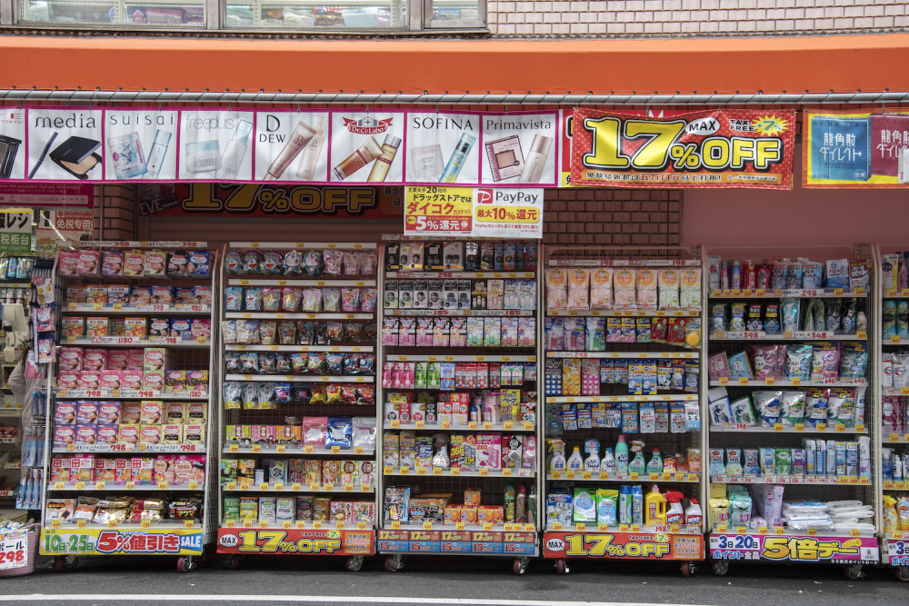
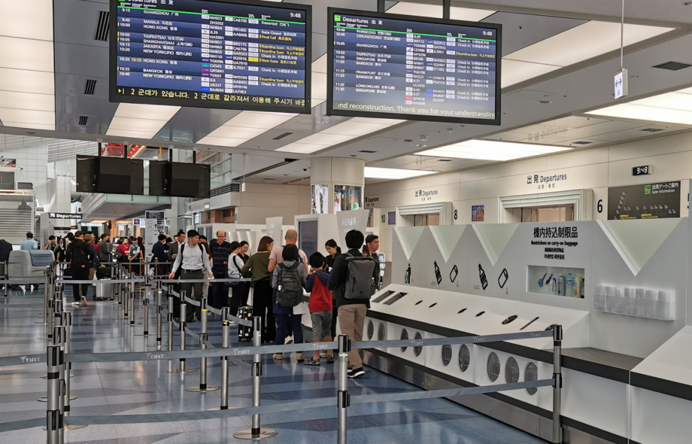

# 找日货代购变难了？日本调整免税政策，百货协会引入防倒卖系统

界面新闻记者 | 陈奇锐

界面新闻编辑 | 楼婍沁

根据日经中文网，日本百货协会旗下多家涉及免税业务的百货店从4月起引入了防止外国游客倒卖免税产品的系统。该系统会根据购买数量、次数和金额来判定消费者是否存在倒卖嫌疑，在购买时发出警告。

在小红书等社交媒体上，已有网友表示自己前往日本旅游购物时，因被系统认为存在倒卖嫌疑而无法以免税价格完成交易。他们通常都在数天内多次购买过同一款产品、多次进行退税，或在退税被拒前进行过大额免税消费。

日本国家旅游局数据显示，2023年5月访日游客数量已经恢复至疫情前七成水平，其中韩国游客数量最多，为51.5万人。来自中国内地的游客却只有13.4万人，和疫情前相比下跌将近82%。这导致日本免税规则变化没有在国内得到传播，许多游客称不熟悉新的免税政策。

过去一年里，日本政府频繁调整免税政策，日本百货协会旗下会员门店引入防倒卖系统是其中部分。

日本免税政策宽松，包括留学生在内的外国人只要居留时长仍在六个月内，就能够以免税价格购买商品。和许多欧洲国家不同，只要出示合规证件，日本允许商家在交易时直接用免税价格向游客销售产品，而非先以正价销售，离境时再到机场集中退税。

这样设置的前提是免税产品以归国自用为目的，在日本转卖是违法行为。但因为规则宽松且监督机制不完善，大量不法商家租用游客护照或雇佣初到日本的留学生，批量以免税价格购买商品后，再以稍低于常规的价格转卖给日本当地人。

不过，如今事情已经没有这么简单。

日本政府调整免税政策首先是从商家入手，向那些对明显倒卖行为视而不见的公司进行处罚。2022年苹果日本公司就被处以140亿日元罚款（约合人民币7.2亿元），缘由是此前存在1人购买数百台iPhone的现象。这对整个市场是极大的警示。

随后是触犯法律的人。同样在2022年，大阪政府发现7名海外游客以短期旅游签证入境后，购买了包括奢侈箱包和化妆品在内共77亿日元（约合人民币3亿元）的商品，但没有任何证据表明他们将这些产品带回国自用。最终需要补交税款超过7亿日元。（约合人民币3000万元）。

伴随着法规的调整，国际留学生将会被取消退税资格，对短期游客购买免税产品也会有更多限制。日本从2020年起开始对税务系统进行电子化升级，所有外国人购买免税产品的记录都将会被统一上传后台。

这便于日本警方在离境处抽查核对游客是否完整将所购买产品带出国境。这意味着在离境之前，商品必须要保持完整，否则将会被要求补交税款。对于代购而言，一系列新规无疑提高了把货物运出国的风险。

代购赚的是一份差价。界面时尚曾报道，会有代购和游客进行合作，使用游客的身份来购买奢侈品，以此来获得短期停留后离境退税的资格。和日本商家熟络叠加大批量购买已经能带来一定折扣，若能免税，能获得的利润便更多。

但在新政策之后，代购可能会在大量扫货的时候被拒绝退税，而游客在帮带商品回国的时候则可能会因为与数据不符而被罚款。即使是走贸易公司的模式，新政也要求必须邮寄单和进货单上的金额一致才能退税。

不过，由于新政推出时间不长，目前在实施过程中仍存在不完善之处。据日本财务省统计，虽然日本政府在2022年要求366名海外游客补缴约22亿日元的税款，但很多游客以没有现金或登机时间仓促等理由规避，最终导致90%以上的税款无法追缴。

