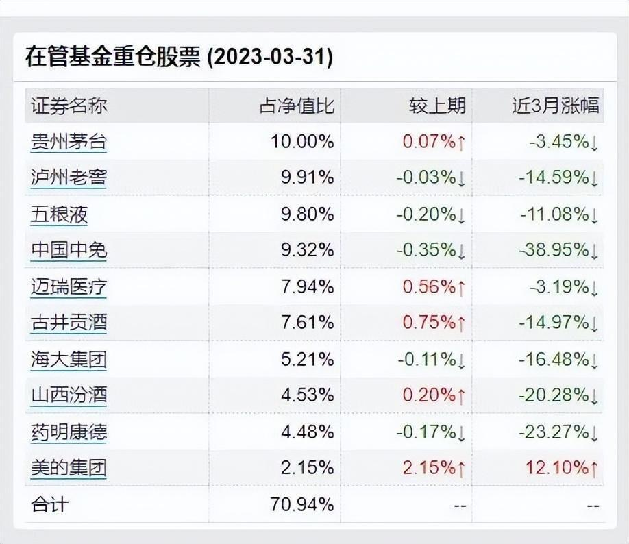
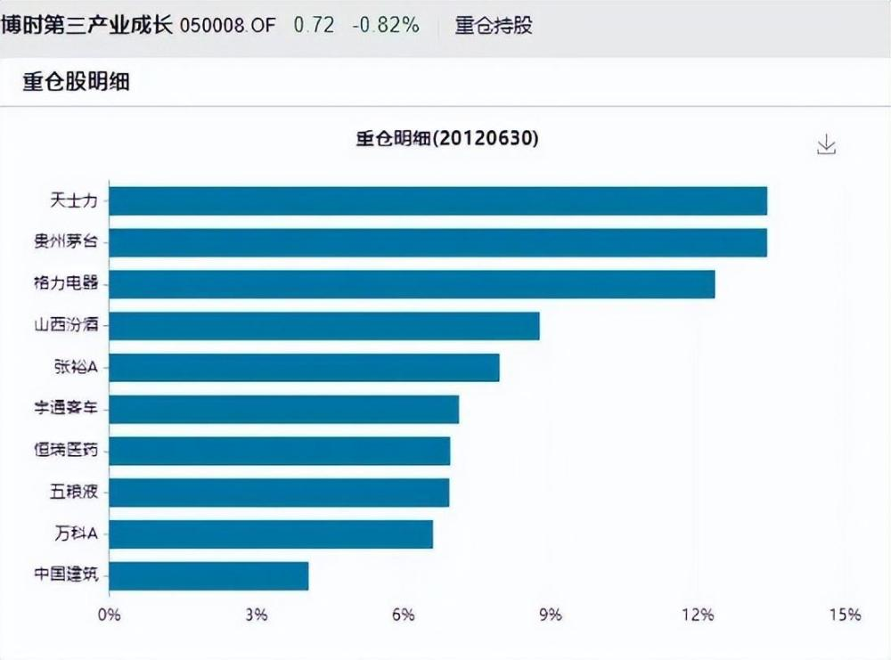

# 明星基金经理2年亏了292亿，基民急了：你凭什么偷懒躺平？

在基民眼里，刘彦春在白酒、医药抱团行情结束后，依然坚守“喝酒吃药”风格，是一种偷懒的“躺平”行为，刘彦春则呼吁基民保持耐心，并称“一切会好起来”。

站在不同的立场，得出的结论往往不同，甚至截然相反。比如有的基金经理坚持成长价值投资理念“淡定”长线持股，但在亏损的基民看来这完全就是躺平。

6月26日，在某财富管理平台上，景顺长城明星基金经理刘彦春，就因发文与基民交流，并让基民“保持耐心”，而遭到了基民留言愤怒指责。

在刘彦春看来，现在A股绩优公司估值整体较低，一旦市场对经济的担忧缓和，这些公司具备很强的估值上修弹性，因此呼吁基民保持耐心，并称“一切会好起来”。

“这种交流和言论最好不要再进行了，只会让基金投资人成了笑话”，一位被点赞最多的留言言辞颇为激烈。

显然，一些被刘彦春所管基金套住了的基民已丧失了耐心，因为仅仅在2021年、2022年这两年，刘彦春管理的数只基金合计亏了292亿，相当于一天亏4000万。

另有一位基民，称要转投ETF类基金产品，“基民把钱托付给你，是因为相信你们专业，掌握信息资源优势，有更敏锐的前瞻和趋势应变能力。你们倒好，躺平。当然了，市场遇到不可抗力因素，这个确实怪不得你们。但是三年、四年了，还在躺，就不得不怀疑你们的能力和人品了。我不如定投场内ETF，要你们干什么？”

一方如热锅上的蚂蚁，一方称要保持耐心慢慢来，在牛市中潜藏的投资理念分歧，在市场的调整中激化了。

01、两年亏了292亿，基民急了

在遭到基民疯狂吐槽之前，刘彦春是一位妥妥的千亿顶流。

在2019年至2021年的基金牛市中，基民们沉醉其中，刘彦春作为与易方达张坤齐名的“消费男神”，受到了基民的狂热追捧，“全世界最好的春春，不是李宇春，不是陈小春，而是刘彦春”。

刘彦春的代表基金景顺长城新兴成长A，持有人户数从2019年初的不足53万户，飙升到了2021年年中的超610万户。同一时期，刘彦春另一只代表基金景顺长城鼎益A，持有人户数也迎来爆发式增长，从23万户增长到了194万户。

刘彦春在管基金的持有人户数，在2021年年中一度超过900万，在管规模高达1163亿元，而这也成了乐观的顶点。

当大家都想通过一个方法赚钱的时候，往往也就到了该亏钱的时候。

随着抱团取暖行情的瓦解，沉醉的基民付出了惨痛的代价。2021年，刘彦春管理的基金一共亏了152亿元，2022年继续亏了140亿，两年亏了292亿。如果按照一年365天来计算，刘彦春在过去两年，每天就会亏4000万。

如今（截至2023年一季度末），刘彦春的管理规模已自1163亿元缩水35%，至751亿元。截至今年7月11日，刘彦春所管理的6只基金近两年的跌幅，全部在30%以上，其中景顺长城集英成长、绩优成长A跌幅更是逼近40%。在同类排名方面，以上6只基金均比较靠后。

_▲（近两年，刘彦春在管基金业绩情况，数据来源：Wind，时间：截至2023年7月11日）_

其中，管理规模最大的景顺长城新兴成长A（超384亿）在近两年均落后于其比较基准，尤其是近6个月落后超10%。

_▲（景顺长城新兴成长A业绩比较情况）_

刘彦春近两年业绩之所以出现较大的回撤，其中一个很重要的原因就是高仓位下的集中持股。

以景顺长城新兴成长A为例，其2021年一季度末的持股集中度（基金持仓的前十大重仓股的市值占全部股票市值的比例）高达72%，而同期同类基金的持股集中度只有48%。尽管自2021年，以白酒、医药等为代表的抱团股行情结束，但景顺长城新兴成长A的持股集中度却是在不断走高，到今年一季度末已上升到了76%，而同类基金逐步降低到了44%。

那刘彦春在这两年多以来，不断加码的重仓股票都有哪些呢？

景顺长城新兴成长A
2021年一季报显示，前十大重仓股中有4只是白酒股（分别是泸州老窖、五粮液、贵州茅台和古井贡酒），占基金净值比例高达32.74%，也就是说一只基金中有超30%的钱投在了买白酒股上。仅次于白酒股的，是占该基金净值15.5%的医疗保健行业的迈瑞医疗和药明康德。另外，中国中免此时占基金净值比为9.67%。

到了2023年一季度末，景顺长城新兴成长的前十大持仓中，白酒股已达5只，它们的基金净值占比更是高达41.67%，高于两年多前将近10个百分点。而药明康德和迈瑞医疗的基金净值占比小幅滑落至了14.3%。中国中免，净值占比也小幅下降至9.34%，但持股数量却增加了将近400万股。

总体而言，在景顺长城新兴成长A这只基金上，刘彦春的白酒股占的分量越来越重。

从刘彦春所管理的6只基金的整体情况来看，白酒股依然是他的真爱。

_▲（刘彦春旗下6只基金重仓股情况，数据来源：Wind）_

其在管基金的前十大重仓股中（截至2023年一季度末），有5只白酒股，净值占比高达41.85%。也就是说在刘彦春管理的752亿当中，买了314亿元的白酒，其中仅贵州茅台就买了75亿元。而迈瑞医疗和药明康德依然位列前十大持股行列。用“喝酒吃药”来形容其持仓，并不为过。

目前，刘彦春对于白酒的偏好仍极其坚定。

在6月13日景顺长城的策略会上，对于“白酒调整三年了，还值得坚守吗？”这一问题，刘彦春再次强调了白酒的好处，称白酒存货可以持续增值，“依然值得重点投资”。

但是，自从2021年年初抱团行情结束后，白酒行业经历了深度调整，贵州茅台自高点回落30%，万得白酒指数更是回调了超35%，至今仍深陷低位徘徊不前。

对刘彦春的淡定，一位熬不住的基民，化身“愤怒的小鸟”发文：熟悉他的人已经非常明白，他这些相同的话连续说了三年了，解读他的意思就是继续躺平，等风口吹猪起来，不过如果风能吹起猪，还需要你这个基金经理干啥呢？

02、理性还是躺平？

在基民眼里，刘彦春在白酒、医药抱团行情结束后，依然坚守“喝酒吃药”风格，是一种偷懒的“躺平”行为，但刘彦春持股之所以如此淡定，一方面与管理规模巨大，船大难掉头有关，另一方面，或许与他过往21年职业生涯里的历练有关。

与众多基金经理一样，刘彦春也是妥妥的学霸。出生于1976年的刘彦春，曾在清华大学获得工学学士学位，后在北京大学获得了管理学硕士学位。

虽然学霸出身，但从刘彦春初入职场工作变动的频次来看，或许当时的工作并不太顺利。刘彦春初入职场，从研究员干起，2002年7月至2004年6月在汉唐证券担任研究员，2004年6月至2006年1月跳槽到了香港中信投资研究有限公司，同样担任研究员。

两份工作，一份两年，一份一年半，时间都不长。在需要长期投研积累的投资行业，频繁的工作变动并不是个好事情。

2006年1月，刘彦春加入博时基金，同样从研究员干起。这一次，两年半之后，刘彦春在2008年7月2日，获得了与当时的博时基金经理李培刚共同管理博时新兴成长基金的机会。

那时的A股，正在经历前所未有的“股灾”，上证指数刚刚从6124点暴跌至2700点上下。

作为一位“新手”基金经理，刘彦春便经历了投资生涯中的第一次“毒打”。

自其走马上任后的短短四个多月，博时新兴成长基金的单位净值就从0.714元，暴跌到了0.505元，缩水将近30%。

刘彦春在博时基金初期的另一只基金也遭遇了市场的“毒打”。2010年8月3日，刘彦春开始执掌博时第三产业成长基金。

但这个时间点，也正是股市经历了2008年暴跌后，一波反弹的终点。刘彦春此时接手，时机的把握只可以用“倒霉”来形容。此后的股市经历了长时间的阴跌，而刘彦春在这只基金上，无奈离场，在将近4年的任职过程中最终亏损了5%。

自2008年7月年开始担任基金经理，到2014年6月，结束在博时基金的基金经理生涯，7年的投资，并没有给刘彦春带去多少的成绩。

然而，刘彦春投资时运的转折，也正是在这七年中悄然萌芽。

从博时第三产业的年报中，「市界」发现，像贵州茅台、五粮液、山西汾酒、恒瑞医药这类“喝酒吃药”的股票已经时常出现在他的重仓股中。

_▲（博时第三产业成长重仓股情况，时间：2012年6月30日，数据来源：Wind）_

刘彦春在博时第三产业成长2012年半年报中，表示“盈利稳定增长的食品饮料、医药行业取得明显的超额收益”，在2013年的年报中，称“老龄化背景下，医药行业处于持续上升期，尽管期间会有政策扰动，但向上方向相对明确。”

这样的投资理念也一定程度上，在刘彦春景顺长城期间得到了延续。

2015年刘彦春加入景顺长城，并由此开启了奔向“千亿顶流”的7年之路。

2017年随着白酒行业股价起飞，刘彦春重仓的贵州茅台、泸州老窖、五粮液等为其带来了耀眼的业绩，其管理的景顺长城新兴成长A在2017年获得了一年期开放式混合型金牛基金、一年期偏股混合型金基金奖双料奖项。

而此时，距离刘彦春首次担任基金经理已经将近10年。终于熬出头的刘彦春，其在管规模也自此实现了爆发式增长。以景顺长城新兴成长A为例，2017年规模仅不足20亿元，到了2021年已经飙升到了517亿元，5年增长了24倍。

而成名之后的刘彦春，终于在2021年成了千亿顶流，可以与易方达明星基金经理张坤一较高下。

然而，周期总有起落，“喝酒吃药”行情结束之后，刘彦春如今又成了基民吐槽的对象。

其实早在2019年，刘彦春在接受媒体采访时就表示，希望持有人淡化短期基金的表现，“我希望基金持有人买我的基金使用的是闲置不用的钱，不要短期内就有可能使用这笔钱，因为市场总是会波动很大，特别是短期我们很难判断它的涨跌。而权益资产虽然波动大，但长期来看它的回报是很好的。我们希望持有人能够淡化短期基金的表现，能够更多关注基金经理的投资风格，而不是短期的业绩的涨和跌，长期持有应该会更好一点。”

因此，刘彦春始终认为“承受波动才能享受权益资产的高回报”。

然而，今时不同往日，手握千亿带来的影响和之前300亿的规模早已不可同日而语。

这就带来了一个问题，在“千亿顶流”处于行业周期底部而选择坚守的时候，基民们是否需要选择与基金经理一起坚守呢？

03、ETF能替代明星基金经理吗？

景顺长城新兴成长A的持有人户数自2021年年中高位的610万户，目前已下降到了381万户。

也就是说，并不是所有的基民选择与刘彦春一起坚守。比如文章开头提到的那位冲冠一怒的基民，扬言要转投ETF（Exchange Traded
Fund，交易型开放式指数基金）。

从这位基民的逻辑来看，既然手握40%仓位白酒的主动权益类基金经理选择“卧倒不动”，那基民还不如干脆去选择被动投资，比如定投压某一赛道的主题类ETF。

这里先普及什么是ETF。目前国内推出的ETF通常为指数基金，ETF指数基金代表一篮子股票的所有权，可以像买卖股票一样交易，交易价格与所跟踪的指数基本一致。简单来说，买卖一只ETF，就等同于买卖了它所跟踪的指数，可取得与该指数基本一致的收益。

ETF又大概分为宽基ETF和行业主题类ETF，像科创50、创业板50ETF就属于宽基ETF，像中证动漫游戏ETF、中证传媒ETF就属于行业主题类ETF。

上面那位基民为何会有转投ETF的想法呢？这要从ETF相对于主动权益类基金的一些比较优势来看。

首先ETF基金的成本较低。ETF的整个管理费用大概是每年0.5%，最低的可以达到0.15%，而主动权益类基金的管理费大多为1.5%，经过近日降费后，一部分仍高达1.2%。第二，ETF可以像股票一样买卖，交易更便捷。另外，ETF跟踪指数，运作更透明。

因此，在主动权益类基金重仓某一个行业，而且持股变动较小的情况下，其运作在某种程度上比较类似一种行业主题ETF。

当出现这种情况，一些基民发现花了更高的管理费，反而得到的是一种类似被动的投资风格，就会觉得不划算，况且还是处在亏损状态。

在这样的背景下，基民出现选择ETF的倾向也就不难理解了。

从数据上看，在不少明星基金经理业绩不见起色的上半年，确实有不少资金选择了ETF，A股ETF资金净流入额达1478亿元，其中易方达创业板ETF净流入190亿元，华夏上证科创板50ETF净流入132亿元。

那么，从大的趋势来看，ETF能替代主题类的明星基金经理吗？

Bloomberg
Intelligence的一项分析显示，平均而言，美国公开上市股票中至少19%的股份由被动型共同基金或被动型ETF持有，这一数据超过了主动型基金。

国内行业主题类ETF也在迅速发展。华夏基金数量投资部高级副总裁鲁亚运表示，近几年随着中国经济结构转型升级，催生出了一系列产业投资机会，比如5G、芯片、新能源车、光伏等，产业的发展不仅反映在经济增长上，也反映在行业主题指数的股价表现上，对应到指数投资，像芯片ETF、新能源车ETF、5GETF不乏阶段性结构性机会，赚钱效应的驱动下，高弹性的行业主题ETF受到市场更多关注，吸引了个人投资者的参与。

_▲（图源/视觉中国）_

神农投资创始人陈宇则从全球的视野来解读国内ETF的发展，他认为公募基金在全球范围内最终很可能会走向指数化、工具化，这是资本市场效率提高的必然趋势。所以国内目前一些指数类的基金收益很高，卖的还不错。

对于指数基金，之前有人称大部分散户的最终归宿就是ETF。巴菲特也曾说：“通过长期定投指数基金，一个什么都不懂的业余投资者往往能够战胜大多数专业投资者”。

随着中国证券市场越来越规范，以及机构投资者占比迅速上升，过去30年里A股中因价值错估、信息不对称等产生的“捡漏”机会越来越少，这就压缩了基金经理们的发挥空间，逼着他们的业绩向均值回归。

主动权益类的明星基金经理仍会存在，但其获取超额收益会越来越难。基金投资者和刘彦春产生的尖锐分歧，正是这个大调整中的一朵浪花。

**（作者 | 韩忠强）**

