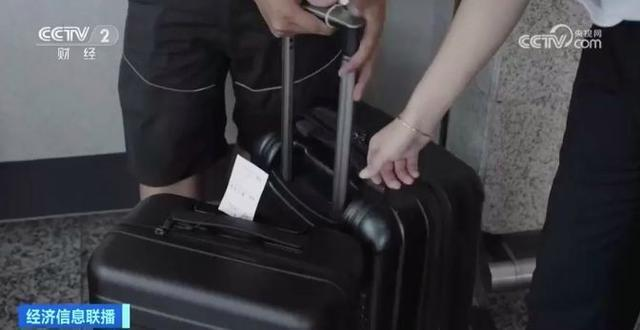

# 每天接收超千件失物，上海虹桥火车站：遗失物品保管半年，可快递邮寄

近期，随着暑期出行进入高峰，上海虹桥火车站的失物招领处，也被粗心的旅客挤爆了。据上海虹桥火车站的工作人员介绍，进入暑期以来，虹桥火车站每天接收遗失物数量已超千件。

旅客们遗落的物品五花八门，除了重要证件，还有雨伞、轮椅、婴儿车、土特产，连钥匙、门禁卡也都被收了起来。

铁路上海站心尚服务工作室 周绚：充电宝的话我们还会登记颜色、品牌，是否有带这种数据线，数据线是什么颜色，越详细越好。

张同学和宋同学来自哈尔滨，正在毕业旅行。他们坐高铁从南京到苏州，下车后张同学发现手机不见了。慌乱中他们拨打了12306，得知有乘务员捡到手机，已经交给终点站——上海虹桥站。

张同学：车站说可以邮到苏州，但是我们着急要，所以我俩坐高铁又过来一趟拿的，酒店信息都在手机里。

对于那些并不着急，或者暂时不方便回来的乘客，可选择任何一家快递领取。遗失的物品，车站会保管半年。目前，三个仓库都已爆满。

（来源：央视财经）

