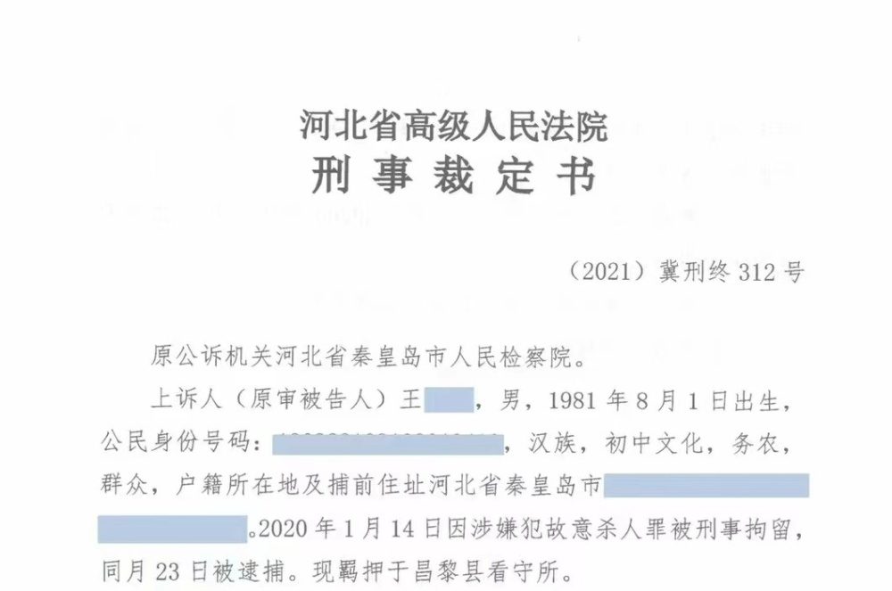

# 河北昌黎“杀妻案”二审裁定重审，河北高院：原判决事实不清证据不足

近期，河北昌黎“杀妻案”有了最新进展。二审法院发布刑事裁定书，认为原判决事实不清，证据不足，撤销此前判决，发回重审。

此前，2020年1月12日，在河北昌黎，被告人王某的妻子在家中被锐器刺切颈部致死。一审法院判决王某犯故意杀人罪，判处死刑，缓期两年执行。

据一审判决书内容显示，被告人王某与被害人系夫妻，双方因家庭财务问题产生矛盾。2020年1月12日，王某于6时50分在其家门口将车停好，后被害人冯某进入家中。

6时57分，被告人王某将车灯熄灭进入家中。7时50分左右，被告人王某从家跑出叫证人吴某。现场录像显示，被害人进入其家院内7分钟后被告人进入，直到证人吴某进入被害人家院内，录像显示无他人进入。

经鉴定，死者被锐器刺切颈部，致失血性休克死亡。其右侧颞部头皮下挫伤、颞肌间出血、舌骨大角骨折、甲状软骨骨折、肝脏被膜下挫伤。鉴定报道认为死者自己难以形成这些损伤；死者左手第二指中位节尺侧创口为锐器作用所致，分析系生前抵抗所致。

综上，一审法院判决被告人犯故意杀人罪，判处死刑，缓期两年执行，剥夺政治权利终身。

对此，被告人律师范辰表示，被告人曾与死者育有二子，没有明确作案动机。其未认罪，现场没有目击者，且案发现场被双方家属打扫，不复存在，故请求二审。

2月23日，河北昌黎“杀妻案”二审，律师带被告人家属去开庭，法院拒绝家属旁听，合议庭取消庭审，择日开庭。

被告人的姐姐王女士表示，她和父亲带着被告人的两个孩子赶来，法院却拒绝家属旁听。“只想让孩子在法庭上看一眼爸爸。”她说。

6月8日，河北省高级人民法院发布刑事裁定书。

刑事裁定书显示，宣判后，原审被告人王某不服，以其没有杀人，应宣告无罪为由，提出上诉。王某的二审辩护人辩称本案事实不清，不能排除他人作案的可能，请求发还重审。现已审理终结。

该院认为，原判决事实不清，证据不足。现决定撤销秦皇岛市中级人民法院的刑事附带民事判决，发回秦皇岛市中级人民法院重新审判。

**九派新闻记者辜子旋**

**编辑刘萌**

【来源：九派新闻】

版权归原作者所有，向原创致敬

