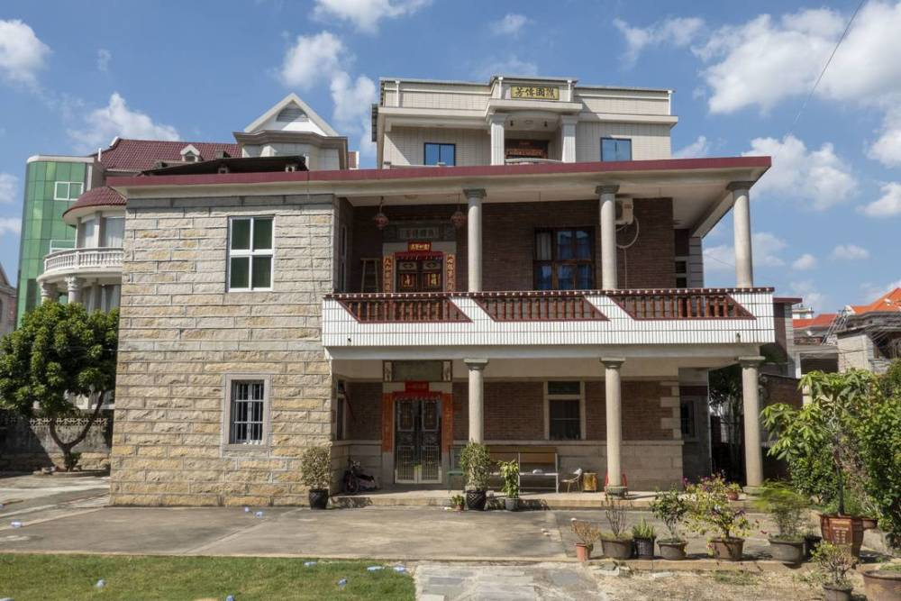
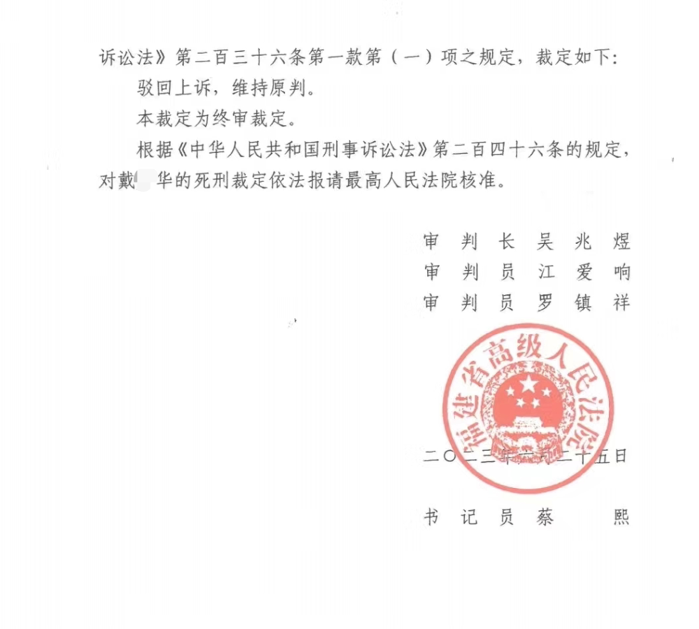

# 福建“公公杀害儿媳案”二审维持死刑，被告曾将受害人勒死后焚烧抛尸

7月16日，封面新闻记者从福建南安公公杀儿媳案被害人小雯（化名）的亲属处获悉，6月25日，福建省高级人民法院对该案作出终审裁定，驳回案犯戴某华上诉，维持原审死刑判决。

_2021年8月28日。案发现场。摄影/杨峰_

法院审理查明，2021年8月20日7时许，被告人戴某华因琐事与其儿媳被害人小雯发生口角，遂在其家中的杂物间内，用手臂扼住小雯脖子，直至小雯倒地无法动弹。因担心罪行败露，戴某华在作案当日7时20分许，驾驶面包车将被害人载至一垃圾场，往被害人身上泼汽油后焚烧，随后又驾驶该面包车将被害人残余尸骨载至一处山沟抛尸。期间，戴某华还藏匿小雯的电动车、丢弃其手机和自己的作案衣物，并在儿子戴某河寻找被害人的时候误导。
经法医鉴定，被害人的尸体焚烧后高度碳化，残存尸骨及软组织未检见开放性锐器损伤，无法确定其死因。

据封面新闻此前报道，2022年3月15日，泉州市中级人民法院对该案作出一审判决。泉州市中级人民法院认为本案虽系家庭纠纷引起的一时冲动的激情犯罪，但被告人戴某华在实施故意杀人犯罪后，又毁尸灭迹，企图掩盖罪行，其犯罪手段残忍，后果严重，应予以严惩。一审判决后，戴某华当庭上诉。

戴某华上诉认为：原审定性错误，其没有杀害被害人的动机，勒其脖子是想教训、教育受害人，但因一时冲动不慎致死被害人，应认定过失致人死亡；原审未认定其具有投案自首情节不当；本案系家庭纠纷引起的一时冲动的激情犯罪，到案后如实供述犯罪事实，愿意赔偿，原判量刑过重，请求从轻处罚。

_该案终审裁定书。受访者提供_

福建高院审理认为，上诉人戴某华故意非法剥夺他人生命，致一人死亡，其行为已构成故意杀人罪，并有丢弃藏匿罪证、误导寻人等行为，企图掩盖罪行、逃避侦查，且未取得被害人家属谅解，其犯罪手段残忍，后果严重，情节特别恶劣，罪行极其严重，应予严惩。
戴某华及其辩护人请求从轻处罚的上诉理由和辩护意见均不能成立，不予采纳。福建省人民检察院出庭检察员建议驳回上诉，维持原判的意见予以维持。综上，原判认定事实清楚，证据确实、充分，定罪准确，量刑适当。审判程序合法。
经院审判委员会讨论决定，驳回上诉，维持原判。并对戴某华的死刑裁定依法报请最高人民法院核准。

来源：封面新闻

编辑：孙菲菲

