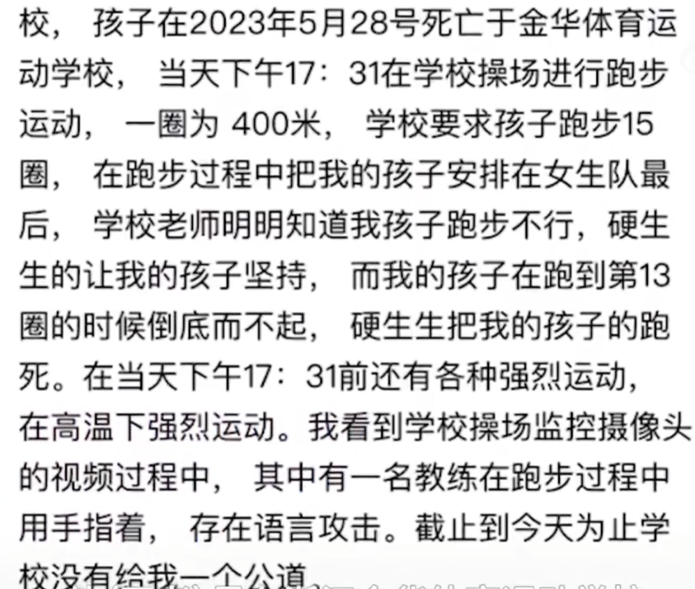

# 14岁体校生跑13圈后突发猝死，亲属质疑训练过量所致，校方回应

据澎湃新闻报道，近日，山东菏泽的程小姐求助称，她14岁的弟弟在浙江金华体校身亡，质疑是训练过量所致。

其称，事发于6月28日下午，当天气温高，弟弟刚选拔入校不久，此前教练已知道他训练成绩落后，但依旧布置正常训练量。“需要围着操场跑15圈，可能一上来就是那么大的运动量，他身体素质达不到那个要求，但是教练还是让他完成。”

程小姐表示，弟弟当时一直在室外训练，“他没跑完，他跑到第13圈，我们看监控是跑到第13圈的时候他有一个捂肚子的动作，同时教练用手指着，那个表情非常凶，应该是骂人。”

金华城东派出所人员表示，排除他杀，初步判断为民事纠纷。7月份，家属和校方就赔偿问题进行了多次协商。

对此，金华体校相关负责人否认训练过量致程小姐的弟弟身亡，称其系心脏猝死，并表示已赔偿完毕。

“我们学校很积极主动地想为他多赔偿一点钱，我们这边像这类事情，最多65万，另外20多万都是募捐出来给他们的。”该负责人说。

7月17日，死者家属社交账号已清空所有求助视频。

**【来源：九派新闻综合澎湃新闻】**

