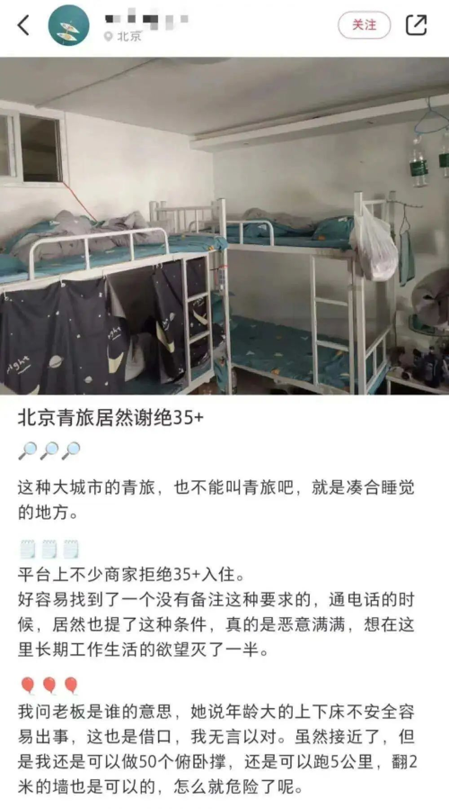
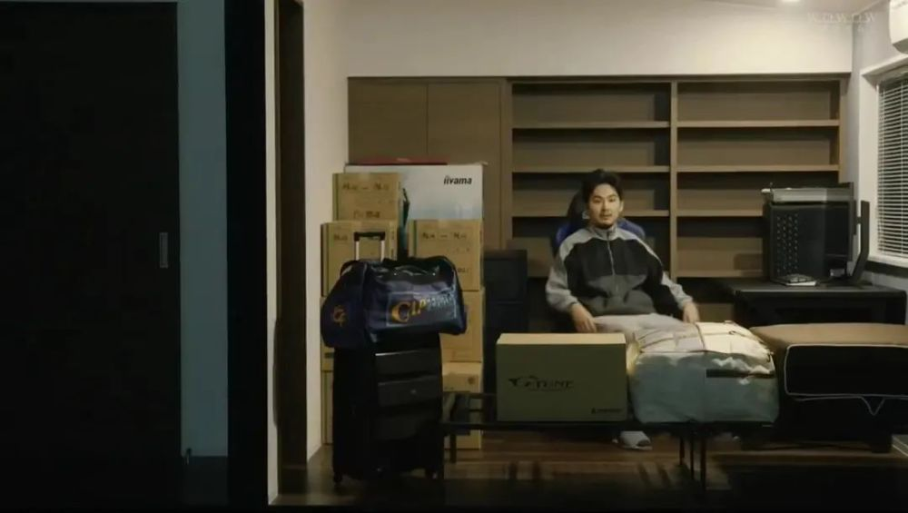
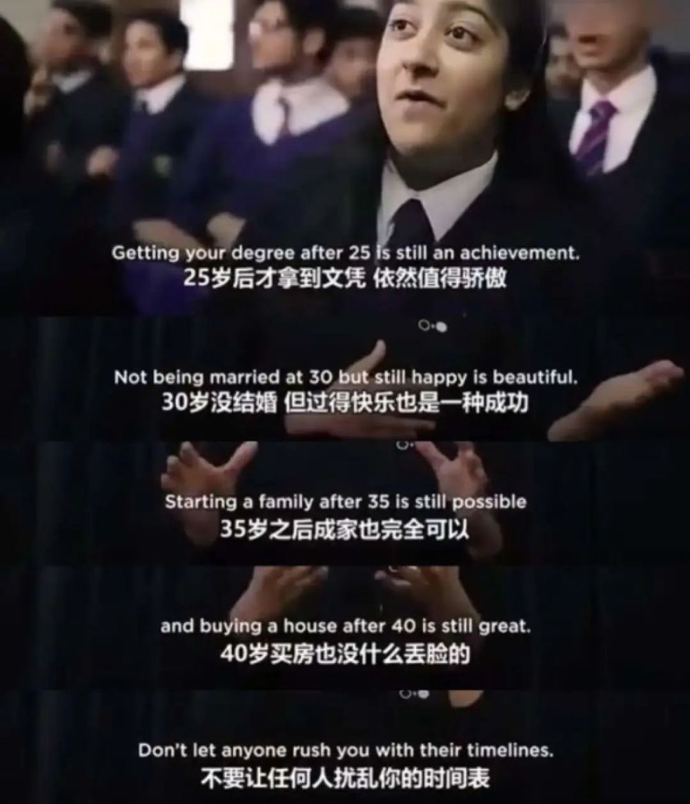

# 35岁谢绝入住，中年人被嫌弃的下半生

文/章鱼

编辑/米利暗

“多家青旅拒绝接待35岁以上的顾客。”

一觉醒来，原本只担心35岁失业的中年人，突然发现自己被外界嫌弃的事情又多了一项：

**出门旅游，要被青旅“拉黑”了。**

35岁谢绝入住的消息一出，就登上了热搜。短短几天，微博话题阅读次数就超1.4亿。

接受媒体采访时，青旅商家们也很“无奈”：

“不接待35岁以上顾客的原因很多，主要是生活习惯不一样，不方便管理。”

**“年龄大的上下床不安全，容易出事。** ”

本是壮年的35岁，从生活方式到身体素质，却都被贴上了“初老”的隐形标签。谢绝35岁的条款，落在网友眼里，歪歪斜斜满页都写着“嫌弃”二字。

这让35岁的中年人寒心之余，也叫30岁左右的青年人人自危。

青旅：35岁谢绝入住

当一个喜欢住青旅的人步入中年，那他很快就会彻底失去青旅这种生活方式。

哪怕他可以做50个俯卧撑，跑5公里，翻2米的墙，客服也会以“年纪大了上下床不安全，容易出事”为由，拒绝办理入住。

这不，想住青旅的李先生好不容易找到一家没有备注年龄限制的青旅，却还是在通电话的时候收到了“谢绝35岁顾客”的温馨提示。

在接受媒体采访时，部分商家给出的理由非常贴心：

“住上铺存在 **安全隐患** ，尤其部分人士还可能 **患有高血压之类的疾病** ，夜里上洗手间尤其不安全。”

更多商家则倾诉着自己的苦恼：

“自家青旅住客多为求职人员， **年龄较大的群体容易出现打呼噜的问题** ，影响他人睡眠。”

明明都是35岁，梅西还能捧起大力神杯。

但在商家眼里，35岁以上的顾客连上下床都不能自理。

网友们并不买账，讨论的焦点始终都集中在35岁：

在青旅业内设置年龄门槛是一项约定俗成的规则。

根据媒体报道：“杭州多家青旅对入住者有年龄限制，入住门槛设置在40岁或50岁左右”

“武林商圈的某家青年旅舍规定的年龄限制掐头去尾，‘仅限18-55岁的客人办理入住’”

“龙翔桥附近一家青年旅舍，仅限18-50岁客人入住”

“长河地铁站附近的青旅，仅限18-40岁入住。”

年龄越收越紧，似乎成了大势所趋。

**而在合租市场，年龄门槛的设定就更为严格了。**

自如友家的合同明文规定：“居住人员年龄须为18周岁以上（含18周岁）、40周岁以内（含40周岁）。”

而且租户在40周岁生日当天及之后都不可签约自如友家。

**你很难说清楚39岁最后一天的自己，和40第一天的自己有什么区别，但租房合同显然比你更了解中年。**

合租设置年龄门槛上热搜后，青旅和自如纷纷出面解释。

两者给出的原因非常一致—— **拒绝合住并非拒绝入住，中年人完全可以选择整租。**

**可整租，意味着花更多钱。**

以北京双井某青年旅舍为例，租住一张6人间的床位只需要55元，而一间大床房的价格则为324元。

整租的成本是合租的5.8倍还多。

打开自如友家，在北京市朝阳区永安里某小区租一间卧室最低每月2860元，同小区的整租一居室的价格为6190元，二者的差价足足有3330元，完全可以再租一间卧室。

**在合住市场，35岁以上的人正被“踢出群聊”。**

和韩国咖啡馆不欢迎孩子一样，我们的合住市场也在对中年人说不。

35岁，中国式中年危机

35岁青旅谢绝入住的消息一出，就上了热搜。

网友辣评：这很职场。

**不知道从什么时候开始，35岁变成了一个槛。**

连考15年的“高考钉子户”唐尚珺，最近在直播中公布了自己的高考志愿，其中三个是师范类院校。

而网友最关心的还是他的年龄。

苦读15年，大学毕业后却已经年过35岁，无法考编。

按照大众的经验，倘若不进体制，35岁在求职市场的位置着实让人担忧。

**38岁的985哲学硕士失业半年，只能送外卖。**

哪怕他曾在《中国新闻周刊》《南方周末》任职记者，也只能因“35岁之后，（求职）真的是无人问津”上次热搜。

关于35岁的大数据，更加“扎心”。

调查数据表明，大型互联网企业员工平均年龄不超过35岁。

其中，以美团、滴滴、字节跳动为代表的新生代互联网公司平均年龄在30岁以下的公司几乎占一半，字节跳动员工平均年龄仅27岁。

《2022春季职场跳槽观察》显示，七成“35岁+”受访者表示最近一次职业晋升是在35岁之前。

根据全国总工会2022年一项全国性调查，35岁-39岁年龄组职工中有54.1%担心失业，70.7%担心技能过时，94.8%感觉有压力。

**人到中年，职场消失。**

这是一把悬在中年人头上的达摩克利斯之剑，却不是唯一一把。

小时候父辈总说“不买房，等你老了没地方住”“年纪大了，没人会租房给你”，那时的我们也许不以为然。

但事实上，还没到35岁，这枚名为忠告的子弹就已经穿越时空，正中我们的眉心。

**35+的中年人连青旅都住不了，在租房市场也不受欢迎。**

似乎只有买房，才能让中年人拥有一个稳定的栖身之所，且不为社会所嫌弃。

有房，社会对35+中年人的基本要求。

但事实却并非如此。

在社会普遍期待35+的中年人有车有房、成为管理层之时，大多数35岁的普通人，正在为失业和租房发愁。

据央广网消息，2021年北上广深的平均购房年龄为36-38岁，相比3年前（2018年）推迟了2-3年。

北上广深的打工人想在36岁之前买房，就要在研究生毕业第十年、本科毕业第十三年里至少攒够一套房的首付。

7月3日—7月9日，北京市商品房成交均价为47230元/㎡。

即便按照均价，想要买一套60㎡的房子还是需要283.3万。当前首付的最低比例是35%，也就是说需要一次性拿出99.155万。

平摊到毕业的十年里，想在35岁前买房，每年最少要攒10万元， **每个月少说也要储蓄8334元。**

根据《中国企业招聘薪酬报告》，2023年北京第二季度的薪酬的中位数是11000元。想达成储蓄目标，每月留给生活的钱就不足3000元。

而3000元，在北京只够合租一间卧室。

残酷的是，年满40以后，合租将不再欢迎中年人。

**留给无房中年人的时间不多了。**

35岁的焦虑，一种幻觉

自从#青旅回应不接待35岁以上人群#登上热搜，相关讨论就从没断过。

只要随手一翻，就能看到类似的言论：

“都35了，为什么还住青旅？”

“都35了，为什么还要去合租？”

言外之意只有一个：

**没人排斥中年，大家只是在拒绝不成功的中年人。**

“24岁毕业、25岁结婚、26岁生娃、30岁之前买房、35岁之前晋升......”，按照“什么年龄做什么事”的逻辑，每个年龄段都有自己必须完成的任务。

一旦无法跟上，就面临“落后”“被淘汰”的风险。这就是社会时钟的威力：

**人生被切割成打怪升级的关卡。**

**连赢，都要卡对时间。**

可是按照时下流行的趋势，25岁研究生毕业，35岁不过才毕业区区十年而已。

好在，社会时钟它并不权威，也不科学。有太多案例，可以打破它营造出的焦虑幻象：

35岁的马云，两次创业，两次失败。在1999年，逢人就说互联网和电子商务的他，不止一次被当成骗子。也正是在那一年，他创立了阿里巴巴。

35岁的任正非，是部队的技术员，有点名气但不多，直到43岁，他才因工作不顺，创立华为。

摩根·弗里曼52岁那年，才迎来他演艺事业的大爆发。

特朗普70岁才开始当总统。

褚时健74岁创办褚橙。周家礽83岁创办云南白药......

**哪怕是公认的成功人士，他们的事业成就和财富积累也多是在35岁之后完成的。**

**35岁+的身体，也远没有青旅老板说的那般不堪一击。**

根据英国剑桥大学神经科学家彼得·琼斯的研究，人类大脑差不多要到30多岁左右才能完全成熟。

近年热销的社会学著作《百岁人生：长寿时代的生活和工作》提到：21世纪初出生的人有50%的概率活到100岁。

在长寿人群比例日益增长的今天，我们将拥有更多时间，也将面临一个过往社会时钟完全无法想象的世界：

“前人对婚姻、家庭、房屋和汽车购买的传统承诺都被进一步推迟了”；

“工作到80岁是常态，而年轻时掌握的知识不足以应对60年的职业生涯”；

“健康和环保将成为巨型产业，跨年龄阶层的人际交往增加”......

百岁的人生长河里，35岁是如此年轻。

**它正是一个人的黄金年代。**

比起急着把35岁圈定到初老的范畴，我们真正需要的是不断破除经验和偏见带来的桎梏。

拒绝35岁的中年人，事实上也是在束缚自己。

还是那句老话，没有人会永远年轻。

至于那些对35岁说不的人，别着急：

**穿越时空的子弹，早晚也会正中他们的眉心。**

参考资料：

《超过35岁不让入住？多家青旅回应》辽沈晚报

《别让任何人打扰你的生活节奏》TED演讲

《35岁，一道坎？》中国新闻周刊

