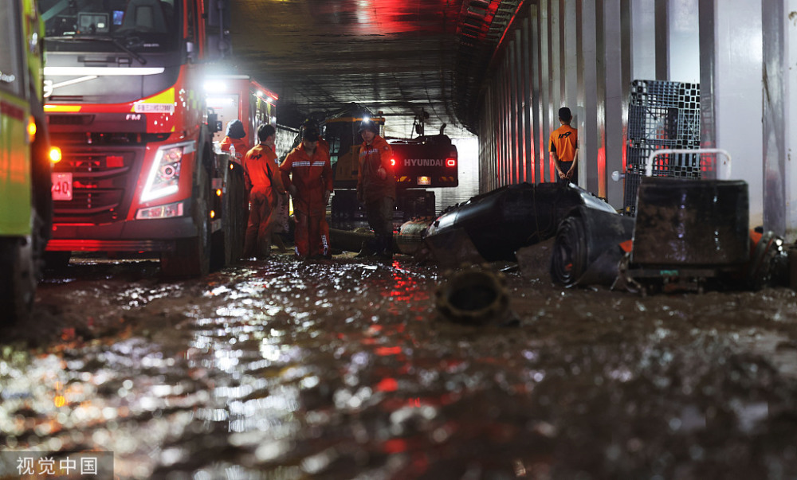

# 三次警告被忽视！韩地下车道5分钟灭顶14人殒命，韩媒批“人祸”

【环球时报驻韩国特约记者 林森环球时报特约记者
韩雯】韩国中央灾难安全对策本部17日通报称，截至当晚20时，自9日开始的强降雨已在该国造成41人死亡、9人失踪。此外，韩国各地出现了大量因水灾而流离失所的灾民，有1.6万居民被紧急疏散，其中超过5500人目前居住在临时避难所。此前正在访欧的韩国总统尹锡悦也匆匆结束行程，于当天赶回国内主持抢险救灾工作。

然而，对于这场“天灾”，多家韩国媒体表示韩政府虽然决心“采取先发制人的措施”，却没能阻止大规模的人员伤亡和财产损失。特别是15日上午发生在忠清北道清州市的五松地下车道浸水惨案，不少韩媒发出这是“人祸”的感叹，称悲剧本来可以避免。

_当地时间2023年7月17日，韩国忠清北道清州市，五松地区附近的地下车道被水淹没，排水工作仍在继续。（视觉中国）_

**突如其来江水酿悲剧**

据韩联社报道，15日上午，在强降雨的影响下，美湖江水位上升，堤坝倒塌，距离江边仅三四百米的五松邑宫坪第二地下车道很快被涌入的江水淹没。

韩国《东亚日报》称，事发地下车道全长430米，通常可在30秒内通过，江水泛滥之际，车道被淹到顶部仅用了不到5分钟的时间。

警方表示，监控录像的分析结果显示，至少有15辆车被困，包括1辆公交车、2辆卡车和12辆私家车。事发之后，有关部门迅速响应，投入军人、警察、消防员和公务员等399人及65台装备开展排水和搜救作业。

尽管搜救工作在第一时间开展，但事发之后，仅有9人获救，还有1人因抢救无效死亡。截至17日20时左右，遇难人数已增至14人，死者中包括开车送妻子弟弟的新郎以及一名70多岁的老奶奶。救援人员表示，随着排水和搜救工作推进，伤亡人数可能进一步上升。

**“政府应对系统的死角”**

据韩国《朝鲜日报》17日报道，此次事故虽然由“天灾”引起，但却是完全可以提前预防的“人祸”。因为在事故发生前，至少有3次来自洪水控制所和居民发出的警告，但相关部门并没有对地下车道采取交通管制措施。

事故发生4小时前，洪水控制所发布了洪水预警，并在2小时前通过电话发出避难通知，但五松地下车道所在的地方政府没有采取任何措施。在浸水的40分钟前，附近一家建筑公司的负责人还向警方报案，称地下车道可能会被水淹没，要求限制车辆进入。

对于为何未提前进行交通管制的疑问，忠清北道方面给出的解释是：“在（地下车道）最低洼处被淹水深达到50厘米时会在警方的配合下进行交通管制，但事故发生时只2至3分钟就灌满车道，因此管制时间不足。”

《朝鲜日报》称，该地下车道被淹时，韩国总理和行政安全部次官正在召开中央灾难安全对策本部会议，检查全国情况。当时忠清北道知事正在槐山水库溢流现场，清州市市长也在视察被淹住宅。对此，有韩国专家感叹：“五松地下车道事故可以说是政府应对系统的死角地带。”

**悲剧再次上演**

除了多次警告发出后相关机构仍未采取措施，韩媒还指出堤坝存在的问题。《东亚日报》17日报道称，虽然此次惨案的直接原因是临时堤坝倒塌，但居民们证实，堤坝是“马马虎虎地用沙子堆成，然后用防水布盖住”，没有雨水阻断设施，排水泵也没有启动。

对此，韩国警方表示，他们计划成立专案组，与韩国国立科学搜查研究院联合开展现场勘查，追究道路、堤防管理等相关部门责任。

据《朝鲜日报》报道，去年袭击韩国首尔的集中暴雨就曾造成居住在地下室的一家三口死亡，超强台风“轩岚诺”也使被困浦项市某公寓地下停车场的7人遇难。上述事故发生后，政府虽下决心做好应对措施，防止重蹈覆辙，但令人遗憾的是，五松地下车道和山体滑坡事件又令悲剧重演。

对此，《朝鲜日报》评论称，如果遵守行政基本原则，损失本可以大幅减少。尤其是今年连日暴雨，已经有了充分的灾难预警，政府仍不能切实做好应对工作，实在难以把责任都推给“天灾”。报道最后，该媒体敦促韩国行政安全部和地方政府再次检查是否存在因反复发生而疏于应对，或者灾难管理手册有漏洞的情况。

