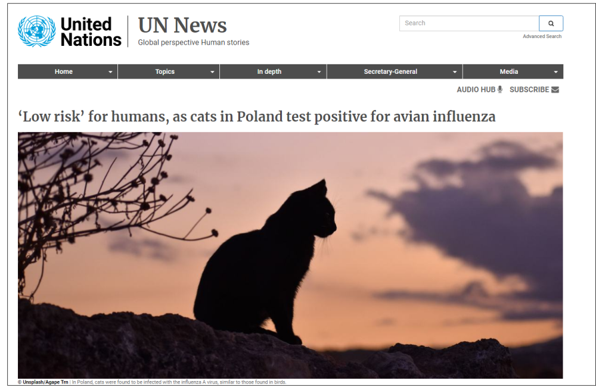

# 世卫：波兰猫类中发现禽流感疫情，受感染的猫数量多、波及范围广

（观察者网讯）联合国新闻网7月17日报道，随着甲型H5N1禽流感病毒在哺乳动物中的蔓延，近期这种病毒在波兰的猫类中引发了疫情和死亡。世卫组织17日对此表示关注，并呼吁全球加强监测、合作与应对，以共同保护人类和动物的健康。

据报道，2023年6月27日，波兰《国际卫生条例》国家协调中心向世界卫生组织通报了全国猫类异常死亡的情况。

截至7月11日，在对包括一只人工饲养的狞猫在内的47个样本的检测中，共发现29个甲型H5N1禽流感阳性病例，占样本总数的62%。

受感染的猫表现出了严重症状，包括呼吸问题、血性腹泻、神经系统症状以及肺炎等并发症，导致病情迅速恶化，部分病例死亡。据报道，14只猫已被安乐死，另有11只死亡，最近一次死亡病例发生于6月30日。

此前曾有猫类零星感染甲型H5N1禽流感病毒的报告，但波兰此次疫情是 **迄今为止在一国之内受感染的猫数量最多、波及范围最广的一次**
。目前受感染的猫接触的病毒来源尚不明确，流行病学调查仍在进行之中。

对此次疫情中的19种病毒进行的基因组分析表明，这些病毒均属于H5流感2.3.4.4b支系病毒，且彼此高度相关。此外，这些病毒与甲型H5N1流感2.3.4.4b支系病毒类似，一直在野生鸟类中流行，最近在波兰的家禽中引发了疫情。

猫类受到病毒感染的确切途径尚待确定，原因可能包括与受感染的禽类或其环境直接或间接接触、食用受感染的禽类或摄入被病毒污染的食物。在有资料可查的25只猫中，2只为室外猫，18只为可进入阳台、露台或后院的室内猫，5只为无法进入室外环境的室内猫。据报道，7只猫有机会接触野生鸟类。

**人类感染风险较低**

根据世卫组织的风险评估，迄今为止，尚无记录显示人类因接触受感染的猫而感染甲型H5N1禽流感病毒。截至7月12日，与确诊猫接触过的70人已完成自我监测，无人报告感染症状。

波兰具备检测人与受感染的猫接触后感染病毒的能力。因此，普通人群因接触受感染的猫而被传染的风险为较低水平，猫主人和兽医等职业性接触相关动物的人员在没有适当防护情况下的感染风险为低到中等水平。

在区域层面上，人类感染风险为低水平，这是由于欧洲自2022年9月以来加强了对禽流感的动物监测活动，并且目前尚未报告任何人类感染来自猫科动物的甲型H5N1病毒的情况，尽管在波兰已确认家猫感染甲型H5N1病毒。然而，由于事件存在不确定性，包括感染源，风险评估可能会发生变化。

自2021年底以来，全球报告的家禽和野鸟中暴发H5N1疫情的数量空前。截至2023年6月，H5N1流感2.3.4.4b支系病毒已在亚洲、欧洲、美洲和非洲占据主导地位。

感染病例在非鸟类物种中也不断增加，包括陆生野生（通常为食腐动物）和海洋哺乳动物，在养殖或圈养的哺乳动物物种中也偶发感染病例，原因可能是接触了受感染的禽类和受污染的环境。

自2020年以来，世卫组织共收到12例人感染甲型H5N1禽流感2.3.4.4b支系病毒的报告，其中4例为重症病例，8例为轻症或无症状病例。目前尚不清楚在轻度或无症状病例中检测到的病毒是由于感染还是鼻腔暂时受到污染。人类感染该病毒可导致死亡率较高的严重疾病。迄今发现的人类病例大多与密切接触受感染的禽类和受污染的环境有关。

波兰已采取一系列公共卫生应对措施应对此次疫情，包括向猫主人提供健康自我评估问卷并要求其进行自我健康监测，定期提供最新情况和信息共享，进行流行病学调查以确定病毒来源，发布预防措施以保护猫主人和接触疑似感染动物的人群。

**世卫组织呼吁全球继续加强流感监测**

世卫组织正在密切监测局势，并与动物和公共卫生部门、区域机构、粮农组织、世界动物卫生组织以及波兰和全球的其他伙伴机构密切合作。同时，通过全球流感监测和应对系统（GISRS）评估现有的甲型H5N1候选疫苗病毒（CVV），以确保开发出能够有效预防疫情的疫苗。

根据此次疫情的现有信息，世卫组织目前不建议限制与波兰的旅行或贸易。世卫组织呼吁全球继续加强流感监测和信息共享，以发现和评估对人类健康造成威胁的新型流感病毒，并遏制其蔓延趋势。

对于接触过受感染的动物或已确诊感染的患者，应在当地卫生部门登记并接受密切监测，以便提早发现病毒并进行适时的临床管理。公共卫生和动物卫生部门应在信息共享、联合风险评估和应对人兽共患病流感疫情等方面密切合作，坚持“同一健康”方针。

世卫组织、粮农组织和世界动物卫生组织就动物中正在暴发的禽流感疫情及其对人类健康构成的风险向各国发布了联合形势分析和建议。同时，世卫组织和相关机构将继续监测情况，提供防控建议，并促进全球合作，以保护动物、人类和经济。

