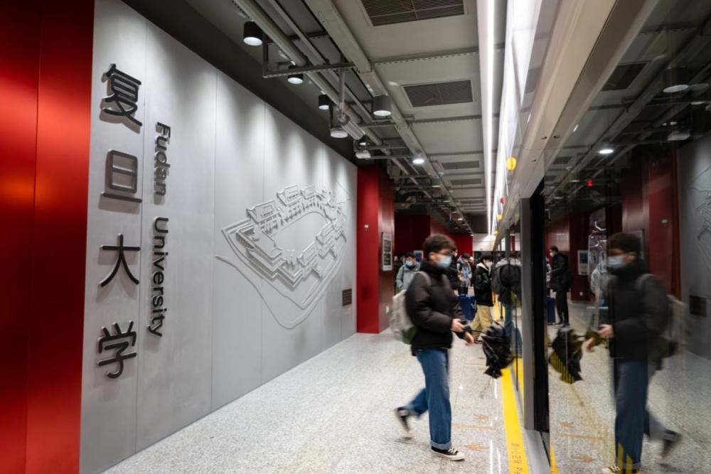

# 争议插班生：在上海试点23年仍未铺开的“二次高考”

_上海地铁18号线复旦大学站，装饰设计文艺而有书卷气。2000年，上海市教委决定正式试行插班生制度，本科一年级学生可以通过考试，转入复旦大学等高校。（人民视觉/图）_

“如果你真觉得高考很遗憾，还是选上海吧。”在母亲的鼓励下，周可欣把志愿中的外省985高校换成了上海一所双非院校。这是一个经过深思熟虑后作出的决定：通过上海独有的插班生制度，可以获得“二次选择大学”的机会。

2000年，上海市教委决定正式试行插班生制度，上海普通高校本科一年级学生可以通过考试，转入复旦大学、上海交通大学、同济大学等高校，考核方式由各试点高校自主确定。

23年来，近十万名考生参与了插班生考试，数千学生的命运由此被改写。周可欣是其中之一，她于2020年通过插班生考试，从华东政法大学转入上海交通大学。

但获得“二次选择”的机会正变得越来越难。

2023年5月，上海市教委发布通知，同意复旦大学等14所高校继续开展招收插班生的试点工作。相较于往年“大一修读课程均须及格”的报考条件，今年多所高校招生门槛变高，部分高校要求成绩达到绩点满分的80%至90%，且高考成绩需达到一本线。

近年来，这场小众的考试正被越来越多人熟知。有学生把“大一”变成“高四”，将全部精力投入插班生备考中，耽误了原本的学业。有考生舍弃更好的选择，报考上海高校，甚至扬言“如果考不上插班生，就回去复读”。

这也带来有关教育公平的讨论。有观点认为，报考门槛变高对部分学生并不公平，特别是让高考失利者失去了“二次选择”的机会。人们呼吁一种真正的“自由转学制度”。

“第二次高考”

2022年，东北考生李雪莹放弃省内985、211高校，选择报考“双非”院校上海政法学院。她想通过插班生考试转入华东政法大学。

2023年5月初，上海市教委发布插班生招生相关通知，符合条件的上海普通本科高校大一学生，可以报考复旦大学、上海交通大学、同济大学等14所高校。每位考生只能报考一所。

看到招生通知后，李雪莹立即登录上海市高校插班生统一报名平台，按要求填写报名信息，并上传大一的成绩单和绩点满分证明，“今年挺多高校有了绩点要求，不同学校计算绩点的方式不一样，需要所在院校出具一个绩点满分是多少的证明。”

南方周末记者注意到，往年插班生的报考条件通常为：参加过前一年高考、大一修读课程成绩均须及格，以及取得学籍所在高校同意，部分高校还要求是“优秀学生”。

2023年，大部分插班生试点高校在招生简章中增加绩点要求。例如，以绩点满分是4.0为标准，复旦大学要求大一绩点不低于3.3，上海大学要求不低于3.3，华东政法大学要求不低于3.0。此外，上海交通大学、同济大学、华东政法大学还要求“高考成绩不低于当地同科类一本线”。

“既要准备插班生考试，又要兼顾原本的学业，其实并不轻松。”李雪莹介绍，今年新增的绩点要求将一部分学生拦在门外，他们不得不考虑更换报考学校或者放弃。

插班生的考试并不容易。考试内容通常包括高数和英语等基础笔试，部分高校还有专业笔试或面试。

三年前，来自江苏的周可欣也抓住了“二次选择”的机会。进入华东政法大学之初，她觉得自己是“高分低报”，心理压力很大。“想过退学去复读，但又不喜欢高压的‘衡水模式’”，周可欣决定在插班生考试上奋力一搏。

“感觉这个考试没有范围，只能一直学一直学。”同样是考法学专业，周可欣认为，自己报考的上海交大，其考试难度接近考研。整个大一，她每天早上6点起床，晚上12点睡。

2023年5月27日，又是新一年的插班生考试。考试时间为一天。报考法学专业的李雪莹回忆，“英语占100分，大概是大学英语六级的难度；语文占100分，考了很多参考书目之外的内容；法律基础占50分，主要考察专业能力。”

一周后，李雪莹在华东政法大学招生网站发布的预录取名单上，看到自己的名字。等到9月开学，原学校会将学籍档案等材料转入新学校，她只需带上身份证、大一成绩单去办理转学手续，即可开启全新的大二生活。

录取对高考失利的学生而言还有着特别的意义。三年前，周可欣登录插班生成绩查询系统，一眼看到了象征“通过”的绿色，她紧紧地抱住一旁的母亲，“我妈如释重负，当年鼓励我改志愿，她也很有压力。”

跨越20年的调研

通过插班生考试后，有人觉得人生都被“重启”了。

2020年，进入上海交大的周可欣，对学校的氛围“特别满意”。她笑称第一个直观的感受是更“卷”，周围的同学都很自律，自己也被这种学习氛围感染。与以法学见长的华东政法大学不同，上海交大的课程更多元，“感觉视野一下子被打开了”。

当时，插班生制度已实施20周年，周可欣想借暑期调研去了解制度背后的故事。“因为我自己是插班生，对这个群体充满研究热情，也希望通过调研让这个制度变得更好。”

这并非学界第一次关注插班生制度的实施效果。2013年，华东理工大学招生办公室及社会与公共管理学院曾发起一项调查，调查对象为上海三所高校的240名插班生。研究发现，插班生招生在科学性、公平性、经济性上达到了较高的要求，这表明这项制度是可行的。

有调研想法后，周可欣先找了四五个同校的插班生，讨论调研计划。

核心成员之一的郑子睿也是2020年的插班生，他从上海一所高校跨专业考入上海交大。

一开始，这群大学生只对一个问题好奇，20年来，插班生制度的实施效果是怎样的？

他们先是设计了摸底问卷，了解插班生的备考信息、考试结果、社会支持、教育公平等问题。除了团队转发问卷外，还让插班生聚集的辅导机构的老师帮忙发放，共收回134份有效问卷。这项调研覆盖了上海市32所高校，考生来自十余个省份，考试时间横跨12年。

他们发现，大家对插班生制度的评价都较为正面。插班生制度较好地实现了选拔人才培养、构建“教育立交桥”、推进教育公平的目标。另外，该制度也有利于学生提高自我认知、养成良好学习习惯、培养抗压和受挫能力等。

故事并未因暑假调研而结束。2022年，周可欣团队希望能进一步完善调研，给有关部门提供参考。

偶然间，调研团队得知，上海交大副教授沈洋也曾是插班生。

2004年，沈洋从一所211院校插班进入复旦大学，人生轨迹由此改变。

沈洋读研时也想过研究插班生，但因数据太少未能实现。周可欣回忆道，“我们经常讨论到停不下来，这场跨越近20年的插班生对话，本身就很有意义。”

沈洋常常想起当年的自己。那时候，复旦大学规定插班生要试读一学期，其间若有课程不及格，则取消资格并予以退学。刚转入复旦时，她觉得压力很大，靠着“争口气”的劲头，努力把成绩保持在中上水平，也逐渐发现做学术的乐趣。

调研发现，插班生在转入新学校后也常名列前茅。根据调研数据，57.46%的同学在新学校仍然保持着前10%的成绩排名。

这进一步证实了华东理工大学十年前的研究结果：从人才培养来看，插班生的适应性良好、学业成绩较好、进一步学习意愿较强，这表明插班生制度使一部分优秀的学生享受到了更优质的教育资源，从而实现了教育资源的优化配置，提高了教育资源的使用效率。

上海大学原副校长叶志明也有类似观察。在他主持招生工作的十几年里，积极推动插班生招生，并关注这些学生的后续发展。他发现，插班生可能来自比上海大学差一些的高校，但毕业时往往成绩优异，甚至比上大原有的学生更优秀。

未被推广的制度

调研完成后，沈洋有了支持插班生制度的底气。但让她困惑的是，“在上海试行了二十多年，为什么这项制度没有推广？”

调研小组也尝试探讨插班制度推广的可能。他们向学生、家长、大学教授等发放了111份问卷，支持推广比例高达91.8%，支持理由包括：提供“二次选择”机会，减少因不适应大学而退学的情况，帮助学生养成良好习惯等等。

但23年过去了，插班生制度仍处于“试点”状态，且只在上海试行。

“插班生转学要调动档案和学籍，需要强有力的政府主导。”郑子睿认为，其他省份的高校可能由教育部、省、市进行管理，地方政府不一定能对高校有强有力的影响。而上海的高校均由市教委管辖，四所985高校也由市政府和教育部共建，具有共享资源的便利性。

“上海本身就是一座创新包容的城市，教育理念比较开放。”同济大学教育评估研究中心主任樊秀娣认为，插班生制度的试行需要制度、人力和物力的保障，对当地教育条件和理念也有一定要求，而高校云集的上海具备这样的土壤。

但上海推行插班生制度的过程并非一帆风顺。

2000年，上海市正式试行插班生制度，首批试点高校包括复旦大学、上海交大、同济大学等7所高校，“改革本着先试点后完善的原则进行。”

插班生制度曾陷入困境。2009年，仅有4所高校继续招生，是史上试点高校最少的一次。2010年，复旦大学宣布退出下一年的插班生试点。

试点高校不积极或与经费有关。叶志明介绍，生均经费并没有随插班生转移，特别是由市属高校转入部属的，后者几乎拿不到补贴。“这相当于招的学生越多，高校亏的钱越多。”

在试行初期，上海大学的老师们担心，插班生制度会造成本校尖子生的流失。叶志明不认同这种短视的观念，他回应道，“一流高校，不是通过扣住好学生来成为一流的。”

2011年，上海市教委开始按照生均经费补贴6000元的标准，根据招生计划数拨款给复旦大学等6所试点院校，另拨了20万工作经费给各校招生部门，用于组织插班生招生考试、招录等工作。

此后，插班生试点高校数量增加，一直保持在十所以上。

高校对招不到理想生源也颇有怨言。2010年，复旦大学教务处老师曾表示，插班生考试偏离了高校招生的初衷，复旦招生专业主要是基础性学科，但大多数报考学生是冲着名校报考，而非真正对这些专业感兴趣。

复旦大学在2011年恢复插班生试点，但招生计划由26人降到20人，专业由9个变成2个。各个试点高校的招生人数和专业也在每年变动。

通过2023年考试的李雪莹，没有被华东政法大学的法学专业录取，而插班生是无法转专业的。她决定放弃插班机会。

周可欣等人的调研报告也指出：部分院校不招生，放出的专业比较冷门。有受访者提到：“感觉有几个学校招插班生，只是在完成一个任务”。

南方周末记者观察到，根据相关文件，插班生名额控制在本科高校一年级在校人数的2%以内，由上海市教委根据试点高校上报的计划进行统筹。南方周末记者观察发现，近年来上海招收的插班生数量为200至400人，远未达到2%的比例。

“高校资源是有限的，在高考招生时已经进行了分配。如果突然插进很多学生，可能连宿舍都住不下。”叶志明认为，高考失利的学生毕竟是少数，如果插班生招生规模太大，可能会影响原有的教育资源分配和教学秩序。

在樊秀娣看来，插班生只是为少数学生提供“二次选择”的机会，没必要大面积铺开。“如果插班生大规模招生，可能就会撼动高考的公平性。”

“设想高考之外的路”

如果能重来，李雪莹可能不会再考插班生。

她发现这个小众的考试正变得越来越“卷”。有人把“大一”变成“高四”，将全部精力投入插班生备考中，耽误了原本的学业。也有人冲着插班生选上海高校，甚至扬言“如果考不上插班生，就回去复读”。

市场上随之涌现出一批辅导机构。多位插班生向南方周末记者表示，这些机构能针对某所高校插班生考试进行培训，费用在几千到几万不等，但质量参差不齐。部分机构存在虚假宣传、冒用往届插班生信息、骗取考生钱财等问题。

“插班生考试是为了让优秀学生进入更好的平台，而不是挑选应试能手或孤注一掷的赌博者。”周可欣觉得这些人违背了插班生考试的初衷，调研团队建议提高报考门槛，增加对学生原先学校专业综合排名的要求。

但沈洋并不赞同提高报考门槛，她觉得插班生制度是为了“构建教育立交桥”，为高考失利者提供二次选择的机会。如果考生高考达到一本线，绩点也名列前茅，可以通过考研或保研进入更好的学校。“这样好像起不到给高考失利的人，再一次选择机会的作用。”

即便只是试点，但很多人已在质疑，插班生考试会不会撼动高考的公平性。。

郑子睿刚转入上海交大时发现，别人自我介绍可以脱稿讲几分钟，他则磕磕巴巴。他会自卑，觉得那些优秀的同学是通过高考“明媒正娶”进来的，自己则是由额外的途径转入，“这会不会不公平？”

但郑子睿又觉得自己付出了一年努力，所以还是“相对公平”的。他说，“没必要把高考‘神圣化’，以为这是唯一的途径，却忽略了其他的可能性。”

“虽然插班生制度有点像高考，也有点像考研，但本质上是一个认识自己的过程。”高中时，郑子睿把许多精力花在学生工作上，而在备考插班生时，他更多时间是在静心读书。这让他体会到了不一样的快乐，转入上海交大后，他不再去做学生工作，而是想走学术道路。

在21世纪教育研究院院长熊丙奇看来，并非只有通过高考录取才公平。

“相比于插班生制度，我们更希望能推动建立大学的自由转学制度。”熊丙奇指出，在探索校际转学制度时，应该赋予学生和高校更多自主选择权，建立多元的评价体系，提高学生与学校、专业的匹配度。

国外的转学制度也值得参考。山东交通学院威海校区教师高源研究发现，美国高校转学制度的基础，是各高校学分制教学管理制度的成熟、高校之间学分互认制度的完善。“大部分美国高校实行的是学分制，学生可以根据自己的兴趣进行选课，只要完成相应的学分即可。”

以通识教育核心课程为例，课程的学分通常可以从一所大学转至另一所大学。

“国内如果要建立更灵活的转学机制，还需要相关保障机制、社会环境和公众认知达到一定的程度。”济南大学高等教育研究院教授宋旭红认为，严格的转学制度是为了保证高等教育的公平。目前，国内高校未实施真正的“学分制”，高校间的转学制度仍处在探索阶段。

但沈洋觉得不能“因噎废食”，因此否定插班生制度。

即便过了二十年，沈洋仍记得高考失利后的挫败感。她感谢插班生制度给予的二次选择机会，“如果我没转入复旦，那可能硕士进不了交大，博士去不了伦敦政经，也无法回到交大做老师。我觉得这还体现了一种累积优势，就像一个梯子，一步一步往上爬。”

（应采访对象要求，周可欣、李雪莹、郑子睿为化名）

南方周末特约撰稿 梁夏 南方周末记者 苏有鹏

