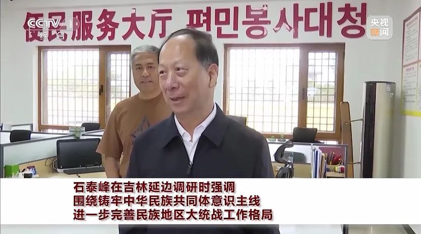
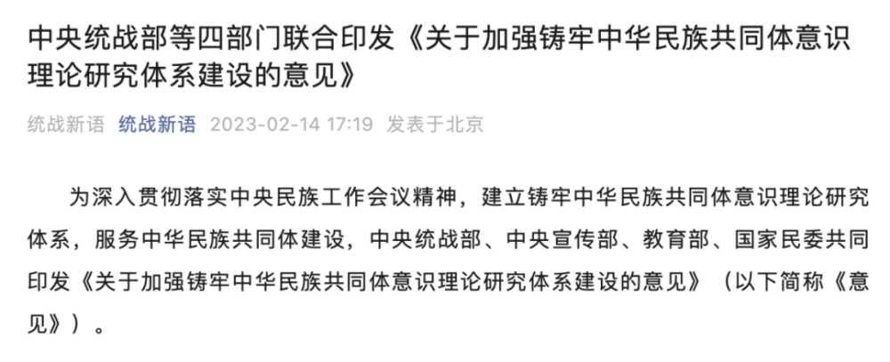

# 事关中央关注的大事！中央统战部部长石泰峰赴边境调研3天，有新部署

**撰文 | 余晖**

7月14日至16日，中共中央政治局委员、中央统战部部长石泰峰在吉林延边调研。

在吉林省调研期间，石泰峰主持召开完善大统战工作格局、落实统战工作责任制座谈会，听取基层和相关方面意见建议。

**考察民企和边境口岸等**

此次石泰峰到吉林省调研，先后去了延边朝鲜族自治州延吉市、珲春市， **走进村寨、社区和少数民族家庭，考察民营企业和边境口岸，走访学校和宗教活动场所。**

调研期间，石泰峰主持召开了完善大统战工作格局、落实统战工作责任制座谈会，听取基层和相关方面意见建议。

石泰峰是在2022年10月任中央统战部部长的。

中共中央统战部，是中共中央主管统一战线工作的职能部门，是中共中央在统一战线工作方面的参谋机构、组织协调机构、具体执行机构、督促检查机构，承担
**了解情况、掌握政策、协调关系、安排人事、增进共识、加强团结** 等职责。

担任中央统战部部长之后，石泰峰曾在今年4月、5月先后到贵州、浙江等地调研。

党的二十大报告提到，“完善大统战工作格局，坚持大团结大联合，动员全体中华儿女围绕实现中华民族伟大复兴中国梦一起来想、一起来干”。

在贵州、浙江和吉林调研时，石泰峰都提到，要“不断完善大统战工作格局、落实统战工作责任制”。在浙江和吉林调研时，他还分别专门就此召开了座谈会。

不过，石泰峰上述几次调研侧重点也各有不同。

在贵州时，石泰峰查看帮扶项目，提到“助力全面推进乡村振兴”；在浙江，他调研了新的社会阶层人士统战工作、网络统战工作和民营经济发展情况。

这次在吉林延边，他 **调研了“铸牢中华民族共同体意识”贯彻落实情况，了解民族团结进步创建和安边兴边固边工作。**

**中央关注**

“铸牢中华民族共同体意识”，也是中央关注的大事。

2014年5月，第二次中央新疆工作座谈会在北京召开。在这次会议上，习近平总书记鲜明 **提出“中华民族共同体意识”重大论断。**

此后，习近平又在多个场合深入阐释铸牢中华民族共同体意识的深刻内涵和重大意义。

今年6月，习近平在内蒙古考察时进一步指出，“ **铸牢中华民族共同体意识是新时代党的民族工作的主线，也是民族地区各项工作的主线** ”。

习近平指出：

民族地区的经济建设、政治建设、文化建设、社会建设、生态文明建设和党的建设等，都要紧紧围绕、毫不偏离这条主线。

无论是出台法律法规还是政策措施，都要着眼于强化中华民族的共同性、增强中华民族共同体意识。

要坚定不移全面推行使用国家统编教材，确保各民族青少年掌握和使用好国家通用语言文字。

如何理解铸牢中华民族共同体意识的意义？

去年8月，中国社会科学院大学教授王延中曾在《光明日报》刊发《铸牢中华民族共同体意识的战略意义》一文。

文中提到，“铸牢中华民族共同体意识，能够真正做到思想与行动的统一，构建起维护国家统一和民族团结的坚固思想长城，坚决实现好、维护好、发展好各民族的根本利益，增进各民族对中华民族的自觉认同，
**从而作为一个整体有效抵御各种极端、分裂思想的渗透破坏** 。”

“ **面对复杂的国内外形势，各民族更需要团结一致、凝聚力量** ，维护好国家主权、安全和发展利益，推动中国发展巨轮胜利前进。”

另外，清华大学历史系、中文系博士研究生导师汪晖谈到，铸牢中华民族共同体意识，在基础理论研究上，应该认真回应两重挑战，其一是
**要扭转西方对“中国”的窄化理解** ；其二是要不断加深对中国丰富多元的历史经验及文化传统的深刻理解。

**将探索完善相关制度机制**

根据《中国共产党统一战线工作条例》安排，民族工作纳入“大统战工作格局”，统战部职责之一就是“统筹协调民族工作，领导民族工作部门依法管理民族事务”。

今年2月，中央统战部、中央宣传部、教育部、国家民委联合印发《关于加强铸牢中华民族共同体意识理论研究体系建设的意见》。

意见提到，加强中华民族共同体建设重大现实问题研究。

“围绕
**建设中华民族共有精神家园、推动各民族共同走向社会主义现代化、促进各民族交往交流交融、提升民族事务治理体系和治理能力现代化水平、防范民族领域重大风险隐患**
深入开展研究。”

据央视披露，此次石泰峰赴吉林调研，去了延边朝鲜族自治州的延吉市、珲春市。

延边朝鲜族自治州位于吉林省东部，总人口207.2万人，其中朝鲜族人口74.2万人，占全州总人口的35.8%，是我国唯一的朝鲜族自治州和最大的朝鲜族聚居地区。

延边地处中俄朝三国交界，东与俄罗斯滨海边疆区接壤，南隔图们江与朝鲜咸镜北道、两江道相望，边境线总长768.5公里。

**延吉市是自治州首府，朝鲜族人口30.68万人，占总人口的54.5%；珲春市聚居着汉、朝、满、回、蒙等多个民族。**

在调研期间，石泰峰提到，党的十八大以来，习近平总书记多次强调铸牢中华民族共同体意识是新时代党的民族工作的主线，
**最近又进一步指出铸牢中华民族共同体意识是民族地区各项工作的主线。**

石泰峰说，这“对做好新时代党的民族工作和民族地区工作具有 **定向引航的重要指导意义** ”。

他提到，把铸牢中华民族共同体意识“作为衡量新时代党的民族工作和民族地区工作的重要标准”。

石泰峰表示，要进一步压实各级党委主体责任，发挥好统战工作领导小组作用， **探索完善相关制度机制** ，确保各项工作紧紧围绕、毫不偏离工作主线。

他还特别提到了基层统战工作。

“要加强基层统战工作力量建设，着眼夯实基层基础， **明确基层党组织在铸牢中华民族共同体意识工作中的目标、任务、重点** ，
**把铸牢中华民族共同体意识融入基层党的建设，纳入基层社会治理** ，使其在各族干部群众中更加入脑入心、落地生根。”

**资料 ｜ 新华社 央视 人民网 光明日报 统战新语等**

**【版权声明】本文著作权归政知新媒体独家所有，未经授权，不得转载。**

