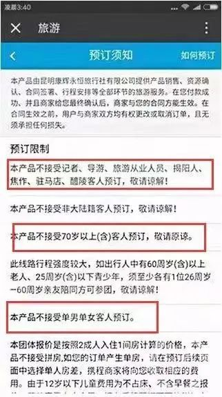

# 云南部分旅行社拒接记者律师？有旅行社回复称“惹不起我躲得起”

据上游新闻报道，近日，一位新闻从业者在朋友圈爆料称，自己在网上团购预订一家云南旅行社时，因为持有记者证被客服建议不要跟团。

7月18日，潇湘晨报记者以预定跟团游为由咨询了云南多家旅行社，并注意到旅行社接待记者与否和跟团游类型及价格有一定关系。

有旅行社客服表示，现在的旅游公司基本都不接待记者，称会怕遇到断章取义的报道给自己招黑，“不怕一万就怕万一，所以我们直接从根源杜绝，惹不起我躲得起嘛。”

也有旅行社表示记者身份没关系，“人家怕也是怕你们拍呀各种，我们是纯玩团，不是购物团，倒也无所谓。”

_一名新闻工作者最近在网络上吐槽。来源：上游新闻_

有旅行社称担心记者报道招黑，“惹不起我躲得起，直接不接待”

7月18日下午，潇湘晨报记者通过相关平台向云南一家旅行社咨询跟团游情况。该跟团游显示为1399元7天6晚，不包机票。客服称因为是暑期，价格可能会有所浮动，为1699元左右。

客服称，一般情况下没办法接待记者，担心遇到有些记者胡乱报道，给旅行社招黑，会造成很大影响，“一旦胡乱报道整个店都毁了，现在的旅游公司基本都是不接待记者的。”

该客服还称，云南导游负面较多，有些是和客人贪便宜报购物团、低价团等有关，“比如1699元的团不含机票，加上机票是不是得4000元左右了，不算行程当中的个人消费。但有些想贪便宜报个1500元含机票的。这两者的差别自己心里应该有数吧？但报道起来就一杆子打死，都是云南旅游情况整体怎么样，也不写清楚具体情况是啥，只报道强制购物啥的，但是没报道团费多少之类。”

客服称因此“直接从根源杜绝，惹不起我躲得起，直接不接待”，并表示就和大家因为断章取义的报道对云南购物留下的印象一样，旅行社也会因此对记者留下这样的印象。

记者随后也咨询了另一家旅行社，其一跟团游产品价格在暑期为4800元左右、5天4晚。该旅行社客服称，记者身份没关系，“人家怕也是怕你们拍呀各种，我们是纯玩团，不是购物团，倒也无所谓。”

另据上游新闻引用央广网报道，2017年春节假期前，某平台上有一些“特价旅游团”设置了许多门槛，对消费者的地域、年龄、团体性别组成都有规定。一些项目甚至禁止记者、律师、旅游业从业人员参团。

_2017年，某平台上部分云南游产品，对游客的职业及地域进行了限制。来源：上游新闻_

一则网传图片显示，2017年，一家旅行社在预定限制中规定，“本产品不接受记者、导游、旅游从业人员、揭阳人、焦作、驻马店、醴陵客人预定，敬请谅解！”

7月18日，记者也就该项规定咨询了该旅行社，客服称他们没有这些规定，并称：“那些说不接待的都是因为他要给你安排购物团。然后可能是来自某些地方的游客，他这个购物数据很不好，一般都不买东西，所以就把这部分客人排除在外。不接受记者，有可能是一些低价的购物团担心记者给他曝光掉，这个行业本来就很敏感。”

_图源网络 图文无关_

当地文旅局：建议不报低价团；律师：拒接待某些职业涉嫌消费歧视

据上游新闻报道，7月17日，记者致电云南省文化和旅游厅宣传推广处，一位工作人员表示，没有听说类似限制记者参团的现象，“您以游客的身份肯定是没有问题的，可能说是记者，对方会觉得是要去采访或者其他。”这位工作人员也建议记者，不要报低价团，报正常价格的团应该就不会遇到这类问题。

湖南省律师协会宣联文委副主任刘研律师表示，

第一，作为一个行业协会也好，作为某一家企业也好，不能歧视消费者，任何消费者都是平等的，任何的商家都不能设定不公平、不合理的交易条件，对消费者进行歧视。作为旅行社也是一样的道理。《旅游法》也有类似规定。除非身体原因，比如说他有特殊体质，或者你去登珠峰，但年龄及身体素质等方面不适合。这种客观原因导致的限制，是我们法律所允许的。但如果是因为职业、性别等这些进行限制，那么显然就在剥夺消费者的选择权。

根据《中华人民共和国消费者权益保护法》第十六条第三款：“经营者向消费者提供商品或者服务，应当恪守社会公德，诚信经营，保障消费者的合法权益;不得设定不公平、不合理的交易条件，不得强制交易。”该法第九条进一步规定，消费者享有自主选择商品或者服务的权利。消费者有权自主选择提供商品或者服务的经营者，自主选择商品品种或者服务方式，自主决定购买或者不购买任何一种商品、接受或者不接受任何一项服务。消费者在自主选择商品或者服务时，有权进行比较、鉴别和挑选。

第二，作为消费者，我们享有知情权。这个知情权是指，消费项目为什么有相关限制你要告诉我，要对我进行解释说明。对此《中华人民共和国消费者权益保护法》第八条明确规定，消费者享有知悉其购买、使用的商品或者接受的服务的真实情况的权利。消费者有权根据商品或者服务的不同情况，要求经营者提供商品的价格、产地、生产者、用途、性能、规格、等级、主要成份、生产日期、有效期限、检验合格证明、使用方法说明书、售后服务，或者服务的内容、规格、费用等有关情况。

第三，从职业来讲，记者本身就有法定新闻舆论监督的权利，不是因为你拒绝我消费，或者知道我是记者后拒绝，你就可以不接受我的新闻监督，这是两个不同的概念。然后作为律师，只要在法律允许的范围内，不管是律师还是普通的消费者，他都有权对你的违法行为发声。因为我们国家是言论自由的。只要不涉及人身诽谤、诬陷、侮辱等违法行为，我们言论自由都受到法律的保护。

第四，这里面还涉及强制交易的问题。强制不允许记者、律师等某些职业的人来进行消费，这本身也是一种设置不合理的、不公平的交易条件来进行所谓的强制交易。

第五，还有一点是涉及到垄断。根据《中华人民共和国反垄断法》第三条规定的垄断行为包括：（一）经营者达成垄断协议（二）经营者滥用市场支配地位；第十七条进一步明确，禁止具有竞争关系的经营者达成下列垄断协议：（五）联合抵制交易。如果在云南旅行社行业内，真实存在这么一个行业行规，让他们旅行社都一起共同遵守的话，那么从某种利益意义上讲，它就是一个典型的垄断协议行为。那么这些参与的企业都要受到处罚。

潇湘晨报记者 吴陈幸子 实习生 张瑞之

